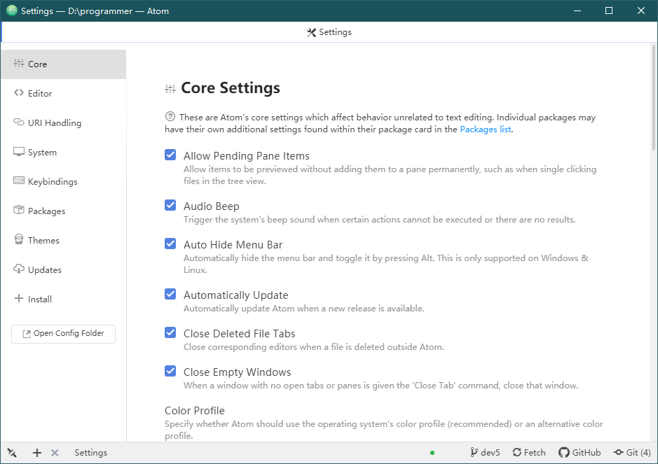

# <center>atom 基本设置</center>

> 这小节主要讲解 Atom 的基本设置以及文件的作用

## 常用文件说明

> 安装完 Atom 后会在当前用户的目录下面创建一个 `.atom` 目录，所有的配置都在这里进行

## 目录结构

> Atom 配置目录的结构如下：

```shell
├─ .atom                                    Atom配置根目录
|   ├─.apm                                  忽略的目录
|   |
|   ├─.node-gyp                             安装插件基础
|   |
|   ├─blob-store                            忽略的目录
|   |
|   ├─compile-cache                         忽略的目录
|   |
|   ├─other                                 自定义目录
|   |   ├─php-cs-fixer.phar                 php代码格式化基础包
|   |   ├─file-header                       头文件插件
|   |   |   ├─lang-mapping.json             自定义配置文件
|   |   |   ├─templates                     自定义模板目录
|   |   |   └─...
|   |
|   ├─packages                              插件存放目录
|   |
|   ├─recovery                              忽略的目录
|   |
|   ├─storage                               忽略的目录
|   |
|   ├─.apmrc                                代理配置文件
|   |
|   ├─.gitignore                            git忽略文件
|   |
|   ├─config.cson                           配置信息文件
|   |
|   ├─github.cson                           忽略的文件
|   |
|   ├─init.coffee                           忽略的文件
|   |
|   ├─keymap.cson                           自定义快捷键文件
|   |
|   ├─projects.cson                         Project Manager插件的配置文件
|   |
|   ├─snippets.cson                         自定义代码片段
|   |
|   └─styles.less                           自定义界面样式文件
|
├─github                                    忽略的目录
|
└─emmet                                     忽略的目录
```

## 基本设置

> 通过快捷键 `Ctrl-,` 可以打开基本设置界面，界面如下：



> 具体如何设置看个人喜好，大家也可以参考我的配置文件：

| 配置文件                                  | 文件说明           |
| ----------------------------------------- | ------------------ |
| [`.apmrc`](./source/.apmrc)               | 配置代理文件       |
| [`config.cson`](./source/config.cson)     | 界面与插件配置信息 |
| [`keymap.cson`](./source/keymap.cson)     | 自定义快捷键信息   |
| [`styles.less`](./source/styles.less)     | 自定义样式信息     |
| [`projects.cson`](./source/projects.cson) | 保存的项目信息     |

### 开启 `Settings`

| 序号                      | 打开 settings 方式    |
| ------------------------- | --------------------- |
| 快捷键开启方式            | `ctrl-,`              |
| `ctrl-shift-p` 开启方式： | `settings view: open` |

### 字体推荐

> 建议字体大小为 `14px` ，字体如下：

```text
hack, '思源宋体 CN'
```

### Atom 代理设置

> 通过 `~\.atom\.apmrc` 文件，可以让 `atom` 支持代理网络

1. 本地代理

   ```shell
   strict-ssl = false
   http-proxy = http://127.0.0.1:1080
   https-proxy = http://127.0.0.1:1080
   ```

2. 淘宝镜像代理

   ```shell
   ;strict-ssl = false
   ;http-proxy = http://registry.npm.taobao.org/
   ;https-proxy = https://registry.npm.taobao.org/
   ```

---

## 快捷键说明

> 下面快捷键是比较实用，但容易被我们忽略的：

| 全局快捷键 | 功能                                 |
| ---------- | ------------------------------------ |
| `C-k C-b`  | 显示或隐藏目录树                     |
| `C-斜杠`   | 显示或隐藏目录树                     |
| `M-斜杠`   | 显示目录树，光标在页面和目录树将切换 |
| `C-S-斜杠` | 显示目录树，并定位到当前页面所在位置 |

| 目录树的快捷键 | 功能                                               |
| -------------- | -------------------------------------------------- |
| `a`            | 新建文件                                           |
| `S-a`          | 新建目录                                           |
| `d`            | 拷贝文件或目录到指定位置                           |
| `i`            | 显示或隐藏版本控制控制忽略的文件（如：.gitignore） |
| `h j k l`      | 目录树支持 vim 按键方式                            |

| 大小写快捷键 | 功能           |
| ------------ | -------------- |
| `C-k C-u`    | 使当前字符大写 |
| `C-k C-l`    | 使当前字符小写 |

| 文本编辑快捷键 | 功能                                       |
| -------------- | ------------------------------------------ |
| `C-j`          | 将下一行与当前行合并                       |
| `C-up`         | 当前行向上                                 |
| `C-down`       | 当前行向下移动                             |
| `C-S-d`        | 复制当前行到下一行                         |
| `C-d`          | 选取当前单词或文档中和当前单词相同的下一处 |
| `C-S-u`        | 调出切换编码选项                           |
| `C-f`          | 在文件中查找                               |
| `C-l`          | 选取当前行                                 |
| `C-S-k`        | 删除当前行                                 |
| `C-x`          | 剪切当前行，或剪切选中内容                 |
| `C-S-f`        | 在整个项目中查找                           |
| `C-S-l`        | 选择文本类型（高亮和补全）                 |
| `ctrl-shift-M` | Markdown 预览                              |
| `C-Backspace`  | 删除光标所在单词左边字符                   |
| `C-Delete`     | 删除光标所在单词右边字符                   |
| `C-left`       | 移动光标到所在单词的最左端                 |
| `C-right`      | 移动光标到所在单词的最右端                 |
| `C-鼠标左键`   | 增加光标，容易被插件快捷键覆盖             |
| `C-S-鼠标左键` | 增加光标                                   |

| git 快捷键 | 功能            |
| ---------- | --------------- |
| `C-S-9`    | git 操作界面    |
| `C-S-8`    | github 操作界面 |

| 书签快捷键 | 功能                               |
| ---------- | ---------------------------------- |
| `C-M-f2`   | 添加或移除书签（当前行）           |
| `C-S-f2`   | 移除所有书签（当前页面）           |
| `f2`       | 下一个书签（当前页面）             |
| `S-f2`     | 上一个书签（当前页面）             |
| `C-f2`     | 调出书签列表（所有打开文件的书签） |

| 插件快捷键 | 功能                   |
| ---------- | ---------------------- |
| `C-M-k`    | 选取颜色（自己设置的） |
| `C-M-b`    | 格式化                 |
| `M-t`      | 展示版本库提交时间     |
| `C-M-t`    | 文件对比               |
| `C-~`      | 打开 atom 终端         |

### 自定义快捷键

> 比如，我们可以让 Atom 使用新按键来进行上下移动：

```cson
'atom-text-editor':
  # markdown 预览快捷键
  'ctrl-shift-M': 'markdown-preview-enhanced:toggle'
  # 自动补全展示快捷键
  'ctrl-shift-space': 'autocomplete-plus:activate'

# 选择列表使用 ctrl-p ctrl-n 来上下移动
'.select-list atom-text-editor':
  'ctrl-p': 'core:move-up'
  'ctrl-n': 'core:move-down'

# 自动补全模式下使用 ctrl-p ctrl-n 来上下移动
'body atom-text-editor.autocomplete-active':
  'ctrl-p': 'core:move-up'
  'ctrl-n': 'core:move-down'
  'home': 'core:move-to-top'
  'end': 'core:move-to-bottom'
```
