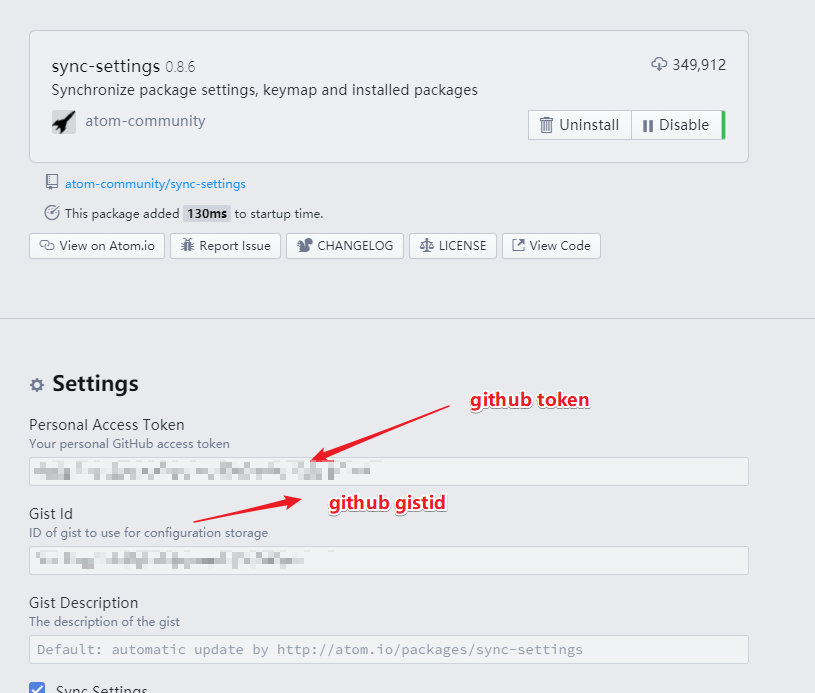
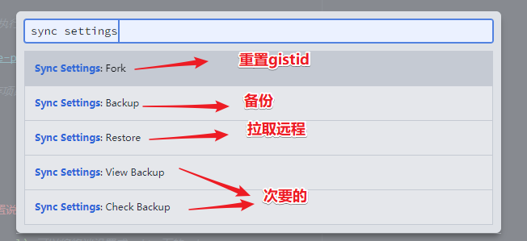

<!--
+===============================================================================
| @Author: madnesslin(地上马)
+===============================================================================
| @Phone: +86 13695746767
+===============================================================================
| @Date: 2019-03-11 21:56:33
+===============================================================================
| @Email: linjialiang@163.com
+===============================================================================
| @Last modified time: 2019-03-11 22:35:54
+===============================================================================
-->

# <center>《PHP 开发者眼中的 ATOM》</center>

## atom 推荐字体

> - `hack, '思源宋体 CN'` (size=>14)

## atom 基本配置

| 序号                      | 打开 settings 方式    |
| ------------------------- | --------------------- |
| 快捷键开启方式            | `ctrl-,`              |
| `ctrl-shift-p` 开启方式： | `settings view: open` |

| 文件                | 作用描述                         |
| ------------------- | -------------------------------- |
| `.atom\config.cson` | 用户及插件配置信息都会在这里记录 |
| `.atom\keymap.cson` | 所有自定义快捷键都会在这里记录   |
| `.atom\styles.less` | 所有自定义样式都会在这里记录     |

> config.cson 文件

```cson
"*":
  "atom-beautify":
    css:
      default_beautifier: "Prettier"
    executables:
      "php-cs-fixer":
        path: "C:\\Users\\linji\\.atom\\other\\php-cs-fixer-v2.phar"
    general:
      _analyticsUserId: ""
    html:
      preserve_newlines: false
    js:
      default_beautifier: "Prettier"
      object_curly_spacing: true
      preserve_newlines: false
      space_before_conditional: false
    markdown:
      default_beautifier: "Prettier"
    php:
      allow_risky: "yes"
  autoprefixer:
    runOnSave: true
  autosave:
    enabled: true
  "color-picker":
    abbreviateValues: true
    alphaChannelAlways: true
    automaticReplace: true
    triggerKey: "K"
  core:
    autoHideMenuBar: true
    closeDeletedFileTabs: true
    disabledPackages: [
      "markdown-preview"
    ]
    packagesWithKeymapsDisabled: [
      "markdown-preview-enhanced"
    ]
    telemetryConsent: "limited"
    themes: [
      "one-light-ui"
      "notepad-plus-plus-syntax"
    ]
  docblockr:
    auto_add_method_tag: true
    c_style_block_comments: true
    deep_indent: true
    development_mode: true
    extra_tags_go_after: true
    lower_case_primitives: true
    newline_after_block: true
    override_js_var: true
    per_section_indent: true
    short_primitives: true
    simple_mode: true
  editor:
    fontFamily: "hack, '思源宋体 CN'"
    showIndentGuide: true
    showInvisibles: true
    softWrap: true
    softWrapAtPreferredLineLength: true
    tabLength: 4
    tabType: "soft"
  "exception-reporting":
    userId: ""
  "file-header":
    autoAddingHeaderOnNewFile: false
    autoAddingHeaderOnSaving: false
    configDirPath: "C:\\Users\\linji\\.atom\\other\\file-header"
    dateTimeFormat: "YYYY-MM-DD HH:mm:ss"
    email: "linjialiang@163.com"
    ignoreListForAutoUpdateAndAddingHeader: [
      ""
    ]
    numOfEmptyLinesAfterNewHeader: 0
    realname: "madnesslin(地上马)"
  "line-ending-selector":
    defaultLineEnding: "LF"
  "linter-jshint": {}
  "linter-ui-default": {}
  "markdown-preview-enhanced":
    codeBlockTheme: "coy.css"
    openPreviewPaneAutomatically: false
    previewTheme: "solarized-light.css"
    revealjsTheme: "solarized.css"
  "merge-conflicts": {}
  minimap:
    plugins:
      bookmarks: true
      bookmarksDecorationsZIndex: 0
      cursorline: true
      cursorlineDecorationsZIndex: 0
      "find-and-replace": true
      "find-and-replaceDecorationsZIndex": 0
      "git-diff": true
      "git-diffDecorationsZIndex": 0
      "highlight-selected": true
      "highlight-selectedDecorationsZIndex": 0
      selection: true
      selectionDecorationsZIndex: 0
      "split-diff": true
      "split-diffDecorationsZIndex": 0
  "one-dark-ui":
    tabCloseButton: "Left"
    tabSizing: "Maximum"
  "one-light-ui":
    tabCloseButton: "Left"
    tabSizing: "Maximum"
  "platformio-ide-terminal":
    core:
      shell: "C:\\cmder\\Cmder.exe"
      workingDirectory: "Active File"
    style:
      theme: "solarized-dark"
    toggles:
      autoClose: true
  "project-manager":
    alwaysOpenInSameWindow: true
    includeGitRepositories: true
    showPath: false
    sortBy: "group"
  "spell-check":
    useLocales: false
  "sync-settings":
    _lastBackupHash: ""
    extraFiles: [
      ".apmrc"
      "config.cson"
      "github.cson"
      "projects.cson"
    ]
    gistId: ""
    personalAccessToken: ""
    quietUpdateCheck: true
    removeObsoletePackages: true
  "tree-view-git-status":
    gitFlow:
      display_type: 2
  welcome:
    showOnStartup: false
```

## atom 扩展主题

| atom 扩展主题(2)           | 主题描述              |
| -------------------------- | --------------------- |
| `notepad-plus-plus-syntax` | `notepad++` 默认主题  |
| `atom-material-syntax`     | atom 下载量最高的主题 |

## atom 扩展插件

| 实用插件(11)                | 插件描述                  |
| --------------------------- | ------------------------- |
| `atom-beautify`             | 格式化源代码              |
| `docblockr`                 | 用于注释                  |
| `sync-settings`             | atom 配置同步插件         |
| `highlight-selected`        | 选择高亮                  |
| `split-diff`                | 文件对比插件              |
| `project-manager`           | 项目管理                  |
| `platformio-ide-terminal`   | atom 下出色的终端         |
| `markdown-preview-enhanced` | markdown 预览             |
| `file-header`               | 文件头信息                |
| `regex-railroad-diagram`    | 正则表达式,以图形直观展示 |
| `file-icons`                | 文件图标                  |

| git 相关插件(3)        | 插件描述                                   |
| ---------------------- | ------------------------------------------ |
| `git-time-machine`     | 近期提交的时间列表，并支持与当前内容做对比 |
| `merge-conflicts`      | 解决 Atom 中的 Git 合并冲突                |
| `tree-view-git-status` | 目录树里显示 Git 状态                      |

| minimap 相关插件(8)          | 插件描述                |
| ---------------------------- | ----------------------- |
| `minimap`                    | 代码小窗口              |
| `minimap-bookmarks`          | 代码小窗口-书签高亮     |
| `minimap-cursorline`         | 代码小窗口-当前行高亮   |
| `minimap-find-and-replace`   | 代码小窗口-搜索高亮     |
| `minimap-git-diff`           | 代码小窗口-git 对比高亮 |
| `minimap-highlight-selected` | 代码小窗口-选择高亮     |
| `minimap-selection`          | 代码小窗口-选择块高亮   |
| `minimap-split-diff`         | 代码小窗口-对比高亮     |

| 语法相关插件(2)  | 插件描述               |
| ---------------- | ---------------------- |
| `language-nginx` | nginx 配置文件语法高亮 |
| `language-ini`   | ini 扩展文件语法高亮   |

| Linter(6)           | Linter 插件       |
| ------------------- | ----------------- |
| `linter`            | Linter 基础包     |
| `intentions`        | Linter 显示基础包 |
| `linter-ui-default` | Linter 界面       |
| `busy-signal`       | Linter 信号       |
| `linter-php`        | php 包            |
| `linter-jshint`     | js 包             |

| html 相关插件(5)  | 插件描述                  |
| ----------------- | ------------------------- |
| `autoprefixer`    | css3 后缀自动完成         |
| `open-in-browser` | html 页面从默认浏览器打开 |
| `color-picker`    | 颜色选择                  |
| `pigments`        | css 下显示真实颜色        |
| `emmet`           | 前端神器                  |

| vim 相关插件(3)    | 插件描述                   |
| ------------------ | -------------------------- |
| `vim-mode-plus`    | vim 插件基础包             |
| `relative-numbers` | vim 普通模式下显示先对行号 |
| `ex-mode`          | atom 下的 ex 单行编辑器    |

## 终端下对 `atom` 插件管理

| 说明     | 指令                                             |
| -------- | ------------------------------------------------ |
| 安装插件 | `apm install package1 [package2 package3 ...]`   |
| 卸载插件 | `apm uninstall package1 [package2 package3 ...]` |
| 移除插件 | `apm remove package1 [package2 package3 ...]`    |
| 禁用插件 | `apm disable package1 [package2 package3 ...]`   |
| 启用插件 | `apm enable package1 [package2 package3 ...]`    |

## 扩展插件配置说明

> 一些插件需要我们进一步说明

### `sync-settings` 同步插件

> 这是 atom 配置同步插件配置也很简单，填入正确的 token 跟 gistid 即可

| 命令                         | 说明                                                                       |
| ---------------------------- | -------------------------------------------------------------------------- |
| `sync-settings:backup`       | 这条命令是备份当前的配置                                                   |
| `sync-settings:restore`      | 这条命令是回复配置,是直接覆盖的;                                           |
| `sync-settings:view-backup`  | 这条是当你执行备份后到线上查询你的备份的,也就是到你的 `gist code` 里的内容 |
| `sync-settings:check-backup` | 这条是查询最后一次是否正常                                                 |

1.  配置

    

2.  快捷键

    

3.  新增同步文件

    

### `project-manager` 配置

> `project-manager` 可以很好的管理我们的项目,更重要的是它可以让每个项目开启不同的插件组合
>
> - 提示：事实上 project-manager 控制插件是不明智，因为 atom 首先会全部加载所有插件，然后再由 project-manager 开启 `devMode` 模式来禁用一些插件！

| 属性设置   | 属性值类型 | 描述                                                                        | 默认值                 |
| ---------- | ---------- | --------------------------------------------------------------------------- | ---------------------- |
| `title`    | 字符串     | 项目标题。在项目列表中展示                                                  | `''`                   |
| `paths`    | 数组       | 树视图中的所有文件夹。首个路径作为项目的主要路径。                          | `[]`                   |
| `settings` | 对象       | 特定于项目的设置。支持 `config.cson` 内容                                   | `{}`                   |
| `icon`     | 字符串     | 显示在项目列表中的图标                                                      | `'icon-chevron-right'` |
| `devMode`  | 布尔值     | `true` 为开发模式                                                           | `false`                |
| `group`    | 字符串     | 将一个组添加到可用于对项目进行分组和筛选的项目列表中                        | `null`                 |
| `template` | 字符串     | 模板是 `projects.cson` 文件中没有配置路径的项目，所有项目共享这个模板的配置 | `null`                 |

> 常规案例：

```cson
[
    {
      title: 'Project Manager1'
      group: 'Atom'
      paths: [
        '/path/to/project-manager-1'
      ]
      icon: 'atom-icon'
      color: '#8892BF'
      devMode: ture
    }
    {
      title: 'Project Manager2'
      group: 'github'
      paths: [
        '/path/to/project-manager-2'
      ]
      icon: 'github-icon'
      color: 'green'
    }
]
```

> `icon` 的属性值，可以直接使用 `file-icons` 插件（700 多个图标）设置，如：

| 案例                  | 描述        |
| --------------------- | ----------- |
| `icon: 'atom-icon'`   | atom 图标   |
| `icon: 'git-icon'`    | git 图标    |
| `icon: 'github-icon'` | github 图标 |
| `icon: 'code-icon'`   | 代码图标    |
| `icon: 'psd-icon'`    | psd 图标    |
| `icon: 'php-icon'`    | php 图标    |

> 头信息模板写法案例：（见源文件）

## 快捷键说明

> 下面快捷键是比较实用，但容易被我们忽略的：

| 全局快捷键 | 功能                                 |
| ---------- | ------------------------------------ |
| `C-k C-b`  | 显示或隐藏目录树                     |
| `C-斜杠`   | 显示或隐藏目录树                     |
| `M-斜杠`   | 显示目录树，光标在页面和目录树将切换 |
| `C-S-斜杠` | 显示目录树，并定位到当前页面所在位置 |

| 目录树的快捷键 | 功能                                               |
| -------------- | -------------------------------------------------- |
| `a`            | 新建文件                                           |
| `S-a`          | 新建目录                                           |
| `d`            | 拷贝文件或目录到指定位置                           |
| `i`            | 显示或隐藏版本控制控制忽略的文件（如：.gitignore） |
| `h j k l`      | 目录树支持 vim 按键方式                            |

| 大小写快捷键 | 功能           |
| ------------ | -------------- |
| `C-k C-u`    | 使当前字符大写 |
| `C-k C-l`    | 使当前字符小写 |

| 文本编辑快捷键 | 功能                                       |
| -------------- | ------------------------------------------ |
| `C-j`          | 将下一行与当前行合并                       |
| `C-up`         | 当前行向上                                 |
| `C-down`       | 当前行向下移动                             |
| `C-S-d`        | 复制当前行到下一行                         |
| `C-d`          | 选取当前单词或文档中和当前单词相同的下一处 |
| `C-S-u`        | 调出切换编码选项                           |
| `C-f`          | 在文件中查找                               |
| `C-l`          | 选取当前行                                 |
| `C-S-k`        | 删除当前行                                 |
| `C-x`          | 剪切当前行，或剪切选中内容                 |
| `C-S-f`        | 在整个项目中查找                           |
| `C-S-l`        | 选择文本类型（高亮和补全）                 |
| `ctrl-shift-M` | Markdown 预览                              |
| `C-Backspace`  | 删除光标所在单词左边字符                   |
| `C-Delete`     | 删除光标所在单词右边字符                   |
| `C-left`       | 移动光标到所在单词的最左端                 |
| `C-right`      | 移动光标到所在单词的最右端                 |
| `C-鼠标左键`   | 增加光标，容易被插件快捷键覆盖             |
| `C-S-鼠标左键` | 增加光标                                   |

| git 快捷键 | 功能            |
| ---------- | --------------- |
| `C-S-9`    | git 操作界面    |
| `C-S-8`    | github 操作界面 |

| 书签快捷键 | 功能                               |
| ---------- | ---------------------------------- |
| `C-M-f2`   | 添加或移除书签（当前行）           |
| `C-S-f2`   | 移除所有书签（当前页面）           |
| `f2`       | 下一个书签（当前页面）             |
| `S-f2`     | 上一个书签（当前页面）             |
| `C-f2`     | 调出书签列表（所有打开文件的书签） |

| 插件快捷键   | 功能                                               |
| ------------ | -------------------------------------------------- |
| `C-M-k`      | 选取颜色（自己设置的）                             |
| `C-M-b`      | 格式化                                             |
| `M-t`        | 展示版本库提交的时间列表，支持跟指定的版本库做对比 |
| `C-M-t`      | 文件对比，支持与最近提交的版本库做对比             |
| `M-鼠标左键` | 选取多行的中间部分内容                             |

### 新增的几个快捷键

> 增加了 `ctrl-k` `ctrl-j` ，在 `代码片段提示` 和 `命令窗口` 上下移动

```shell
# When autocomplete plus pop-up active in insert-mode
'atom-text-editor.vim-mode-plus.insert-mode.autocomplete-active':
  'ctrl-k': 'core:move-up'
  'ctrl-j': 'core:move-down'

# In select-list such like fuzzy-finder
'.select-list atom-text-editor':
  'ctrl-k': 'core:move-up'
  'ctrl-j': 'core:move-down'
```

### `.apmrc` 配置

> `.apmrc` 文件用来让 `atom` 支持终端代理

`.apmrc` 文件路径： `.atom\.apmrc`

```shell
strict-ssl = false
http-proxy = http://127.0.0.1:1080
https-proxy = http://127.0.0.1:1080
```

---
