<!-- TOC START min:1 max:3 link:true asterisk:false update:true -->
- [
《安装 vbox 虚拟机软件》
](#安装-vbox-虚拟机软件)
    - [安装 vbox 前](#安装-vbox-前)
    - [安装 vbox](#安装-vbox)
    - [全局设置](#全局设置)
    - [管理主机网络](#管理主机网络)
    - [创建虚拟电脑](#创建虚拟电脑)
    - [导入和导出虚拟电脑](#导入和导出虚拟电脑)
    - [删除虚拟电脑](#删除虚拟电脑)
    - [虚拟电脑配置](#虚拟电脑配置)
    - [为虚拟电脑增加虚拟磁盘](#为虚拟电脑增加虚拟磁盘)
    - [vbox 快照](#vbox-快照)
<!-- TOC END -->

# 
《安装 vbox 虚拟机软件》

> vbox 是 `Oracle VM VirtualBox` 的简写，支持跨平台，号称最强的免费虚拟机软件!

## 安装 vbox 前

> 安装 vbox 前，我们需要做一些准备工作

| 序号 | 准备内容                                                                 |
| ---- | ------------------------------------------------------------------------ |
| 1    | [vbox 官网](https://www.virtualbox.org/)                                 |
| 2    | 下载[指定平台的最新版本 vbox](https://www.virtualbox.org/wiki/Downloads) |
| 3    | 下载[最新版扩展包](https://www.virtualbox.org/wiki/Downloads)            |

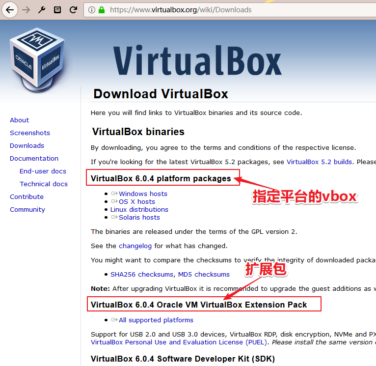

## 安装 vbox

> 我这里使用的 win10 系统所以选择 windows 版本，而 vbox 的扩展包都是一样的

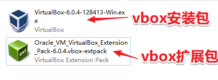

> 安装 vbox 安装包
>
> - vbox 安装包，windows 下安装很简单，双击 `VirtualBox-6.0.4-128413-Win.exe` 后一路下一步即可！

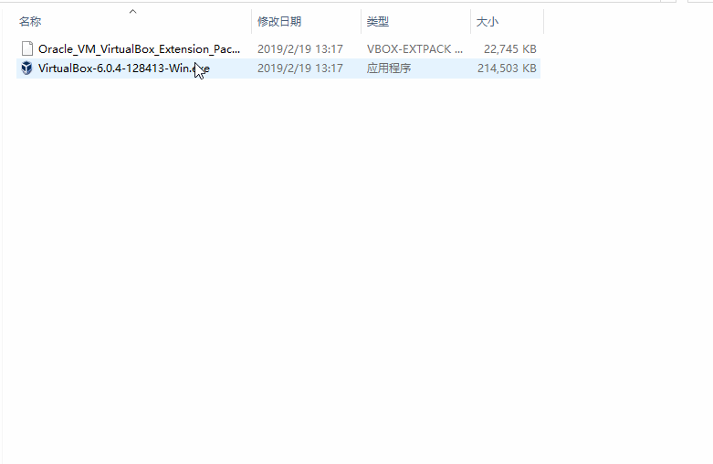

> 提示:如果你是第一次安装，会提示是否安装 `VirtualBox Host-Only Network` 选择安装即可

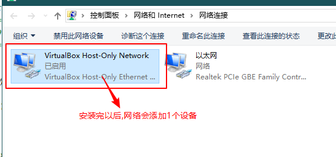

> 给 vbox 添加扩展包
>
> - vbox 官方自带了扩展包 `Oracle_VM_VirtualBox_Extension_Pack-6.0.4.vbox-extpack` ，下面我们来安装这个扩展包：

## 全局设置

> vbox 有两种设置： `全局设置、虚拟电脑设置`，这里我们讲解下全局设置

> 修改默认虚拟电脑位置
>
> - `虚拟电脑位置` 指的是存放虚拟电脑的根目录

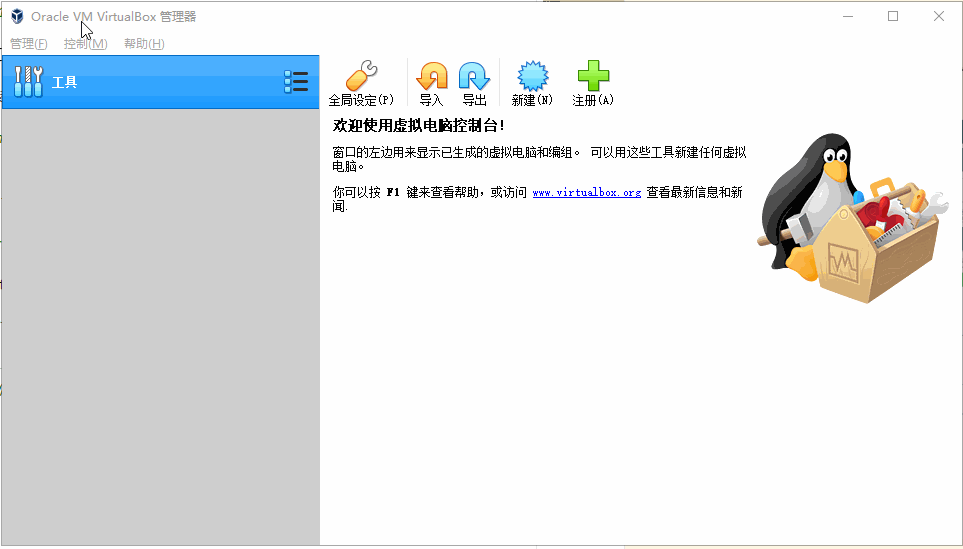

## 管理主机网络

> 在全局设置中的 `主机网络管理器` 可以 `创建、删除、配置` 主机网络

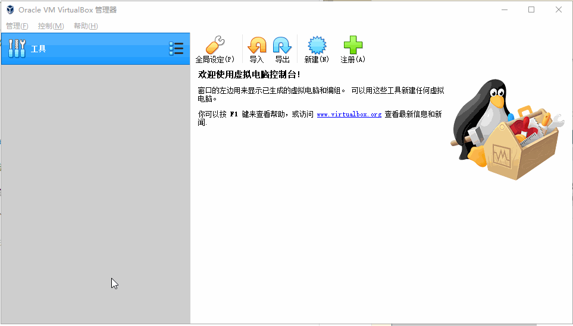
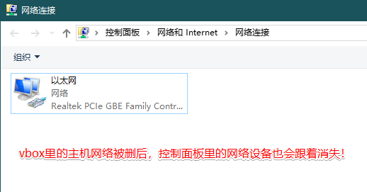

## 创建虚拟电脑

> 如果电脑上存在虚拟电脑，可以直接选择 `注册`

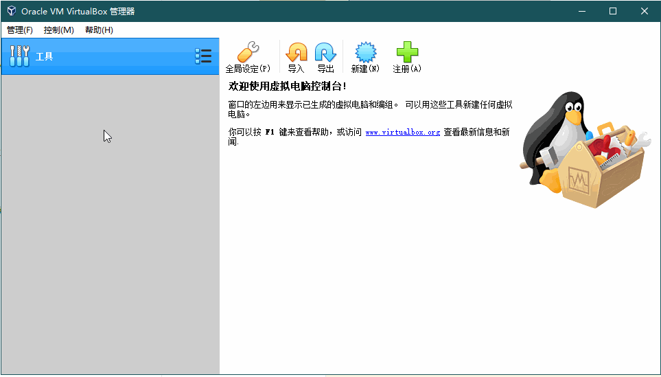

> 如果想要创建一个新的，操作如下：

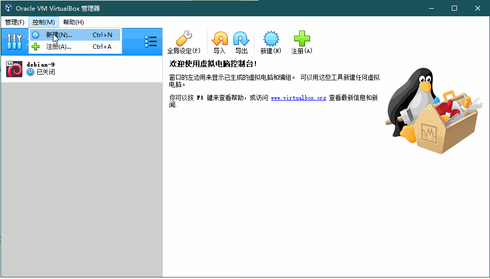
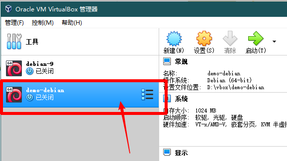

## 导入和导出虚拟电脑

> 如果我们要将 A 机器上的虚拟电脑转移到 B 机器上，我们就需要用到导入和导出功能

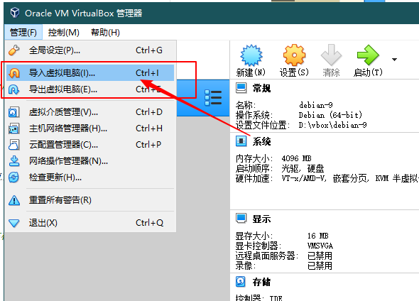

> 导出虚拟电脑

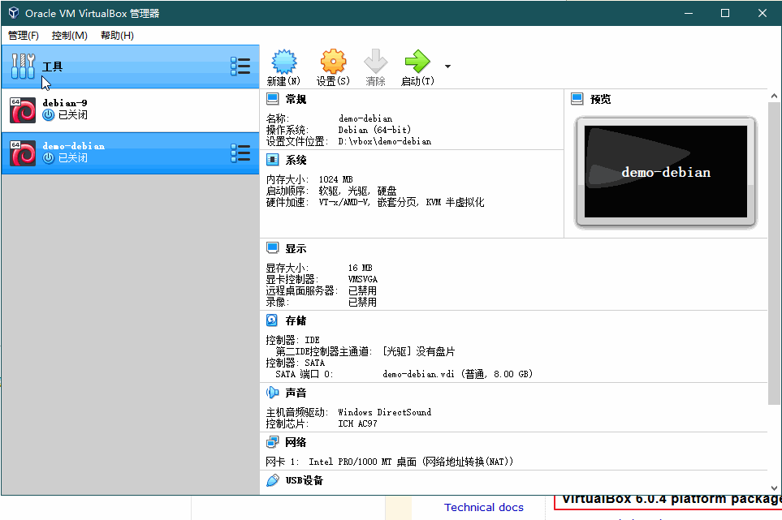
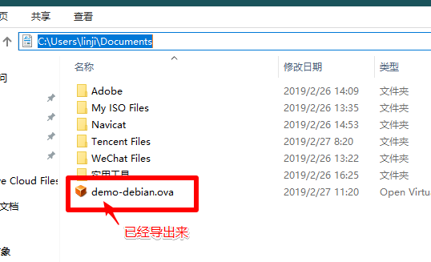

> 导入虚拟电脑

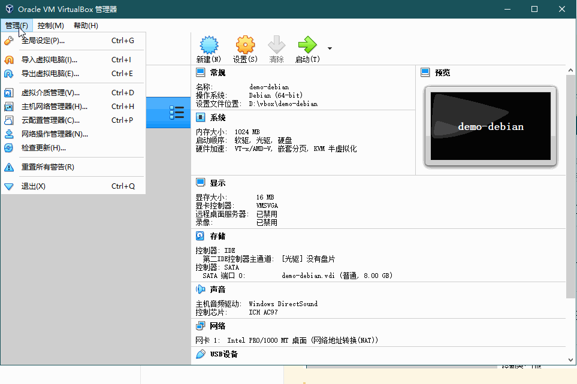

## 删除虚拟电脑

> 虚拟电脑删除操作分为 `删除、仅移除`两种当时

| 概念         | 描述                                   |
| ------------ | -------------------------------------- |
| 删除虚拟电脑 | 会将硬盘下的数据清除                   |
| 移除虚拟电脑 | 仅 vbox 列表里移除，硬盘下的数据被保留 |

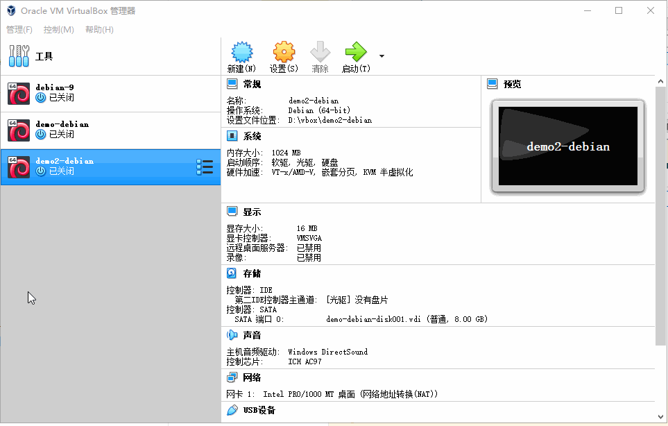
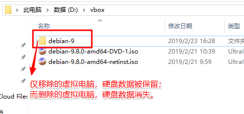

## 虚拟电脑配置

> 在虚拟电脑设置里，我们可以修改内存、处理器、显存以及禁用一些不必要的功能

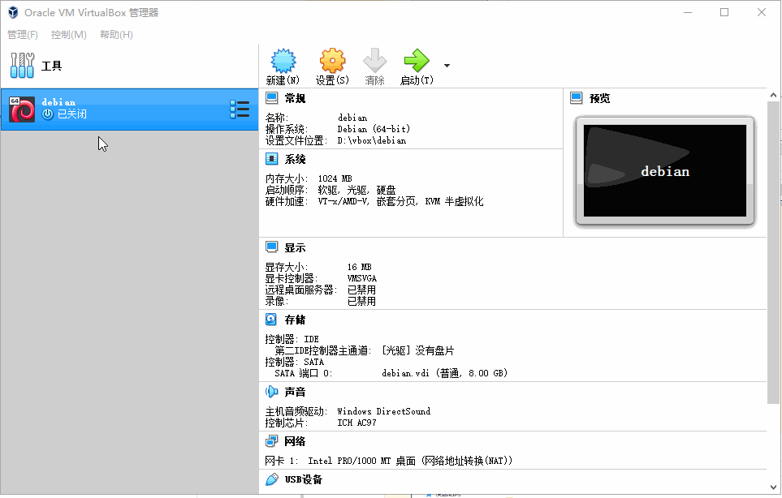

> 虚拟电脑的显存
>
> - 显存主要是为了渲染图形界面的
> - 如果我们安装的是 Debian 终端，安装的时候可以保持默认（12M），配置好以后可以将其降低到最小。

## 为虚拟电脑增加虚拟磁盘

> 在虚拟电脑配置里可以增加虚拟磁盘

## vbox 快照

> vbox 支持为虚拟电脑创建快照，当虚拟电脑遇到不可恢复的错误或者想要回到某一状态是，可以使用快照一键切换

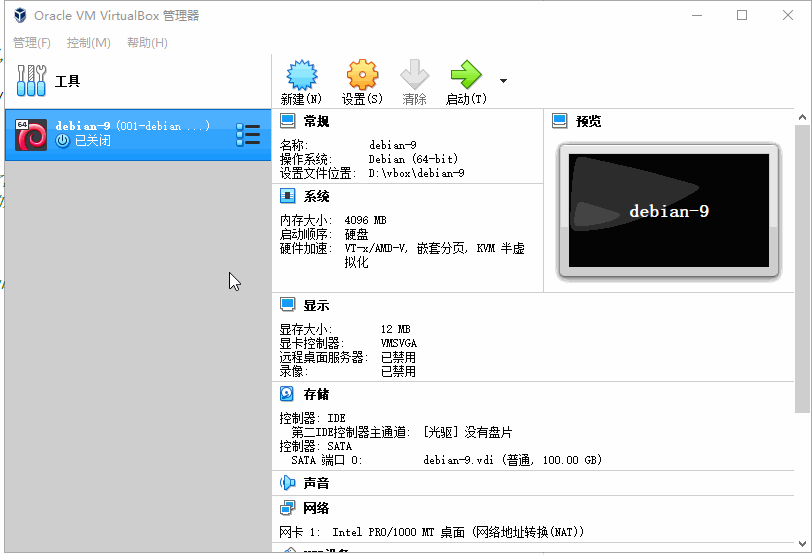

> vbox 操作快照

| 前后排序的快照允许随意切换                    | 可随意删除快照                                |
| --------------------------------------------- | --------------------------------------------- |
| 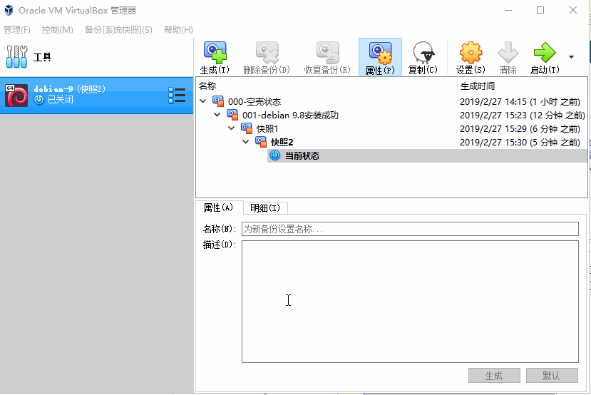 | 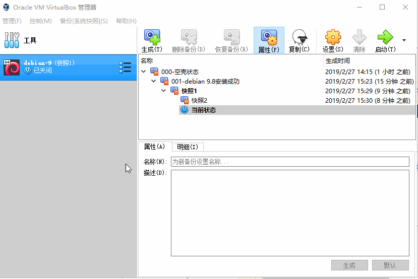 |

> vbox 快照原理
> - vbox快照原理基本与其他快照软件的原理差不多！
