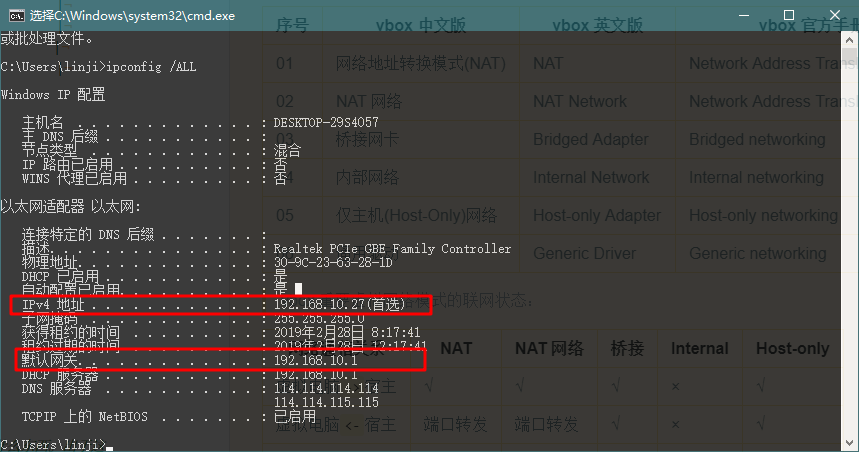
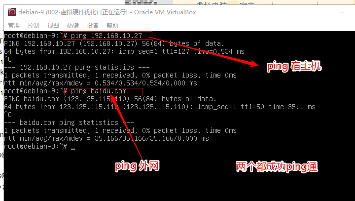
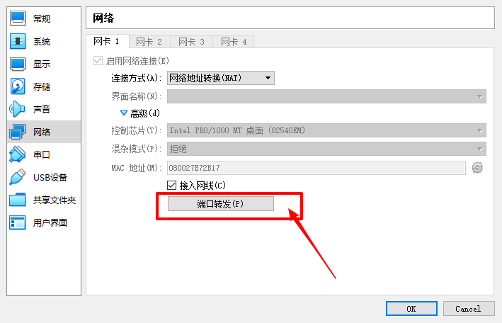
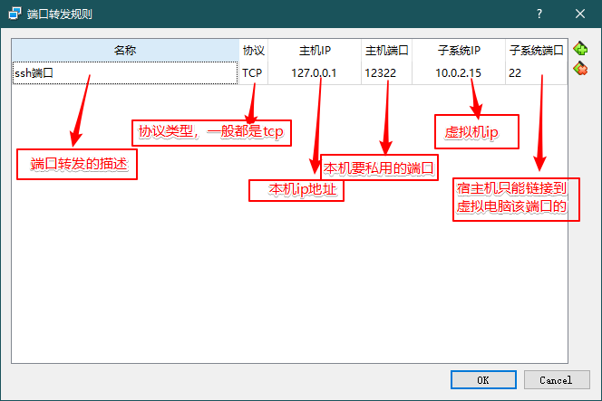
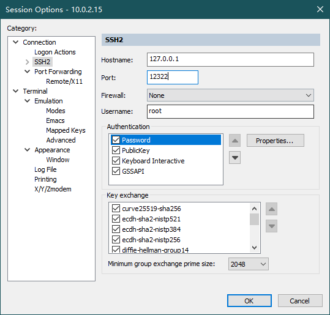
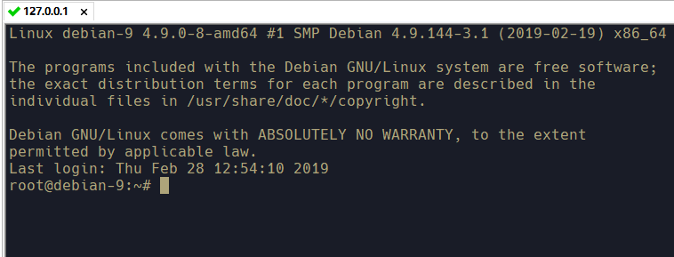
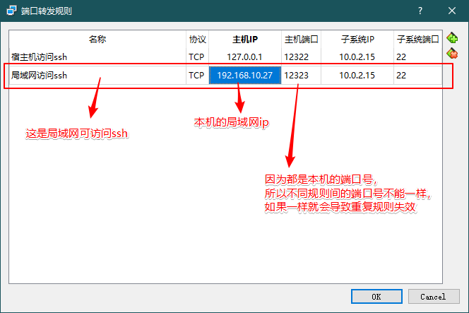
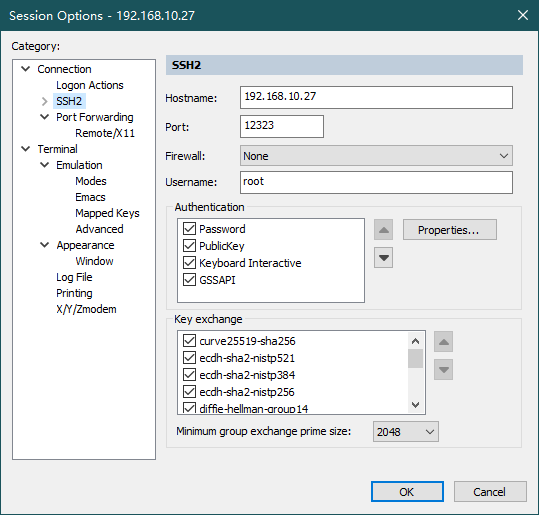
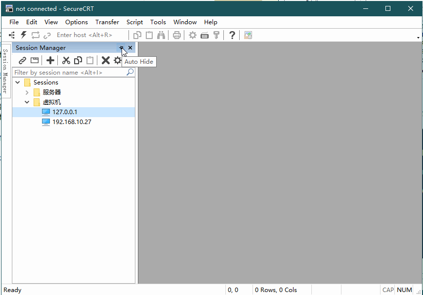

# 
vbox 的虚拟网络

> vbox 的虚拟网络有 6 种模式，并且功能也不尽相同：

| 序号 | vbox 中文版           | vbox 英文版       | vbox 官方手册版                     |
| ---- | --------------------- | ----------------- | ----------------------------------- |
| 01   | 网络地址转换模式(NAT) | NAT               | Network Address Translation (NAT)   |
| 02   | NAT 网络              | NAT Network       | Network Address Translation Service |
| 03   | 桥接网卡              | Bridged Adapter   | Bridged networking                  |
| 04   | 内部网络              | Internal Network  | Internal networking                 |
| 05   | 仅主机(Host-Only)网络 | Host-only Adapter | Host-only networking                |
| 06   | 通用驱动              | Generic Driver    | Generic networking                  |

> vbox 重要虚拟网络模式的联网状态：

| 网络通信关系     | NAT      | NAT 网络 | 桥接    | Internal | Host-only |
| ---------------- | -------- | -------- | ------- | -------- | --------- |
| 虚拟电脑`->`宿主 | &#8730;  | &#8730;  | &#8730; | &#215;   | &#8730;   |
| 虚拟电脑`<-`宿主 | 端口转发 | 端口转发 | &#8730; | &#215;   | &#8730;   |
| 虚拟电脑之间     | &#215;   | &#8730;  | &#8730; | &#8730;  | &#8730;   |
| 虚拟电脑`->`外网 | &#8730;  | &#8730;  | &#8730; | &#215;   | &#215;    |
| 虚拟电脑`<-`外网 | 端口转发 | 端口转发 | &#8730; | &#215;   | &#215;    |

## 网络模式详解

> `通用驱动模式` 我们基本上用不到，这里我也不会去讲解，有想法的可以去官网查看！

## 一、NAT 模式

> 网络地址转换模式(NAT)，是从虚拟机访问外部网络的最简单方法。通常它不需要主机网络和虚拟机上配置什么东西。出于这个原因，它是 vbox 中默认的虚拟网络模式。

> 检测 NAT 虚拟网络模式下 虚拟电脑能否链接宿主机和外网（测试成功）

### NAT 模式之端口转发

> `网络地址转换模式(NAT)` 通常只允许前面 2 种通信关系，通过 `端口转发` 还能支持另外 2 种通信关系！

> 仅让宿主机访问“虚拟电脑特定端口”的转发规则

> 允许所有局域网（外网）访问“虚拟电脑特定端口”的转发规则

> 提示：如上图所示，设置了 `局域网访问ssh` 规则后，`宿主机访问ssh` 规则其实可以不设置！
