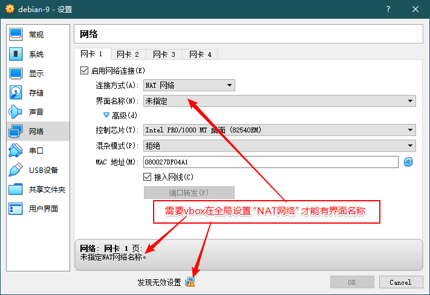
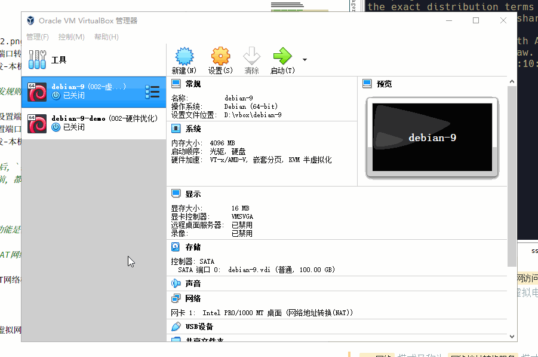
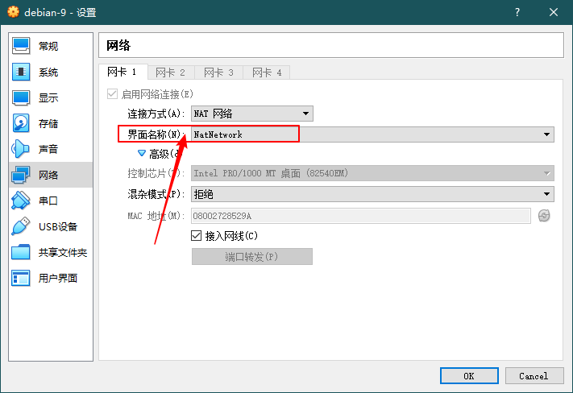
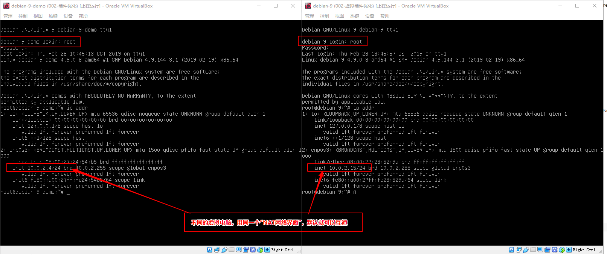
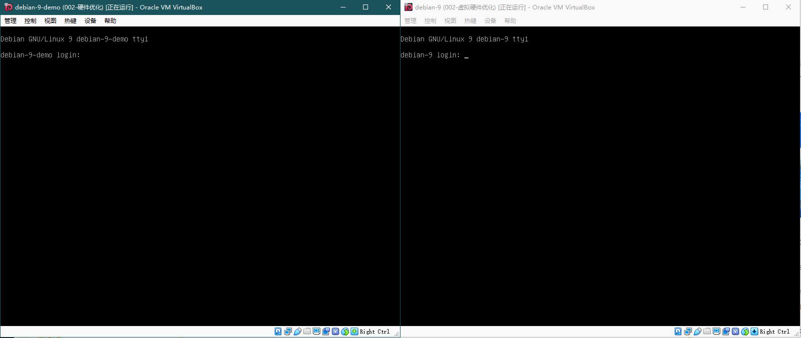
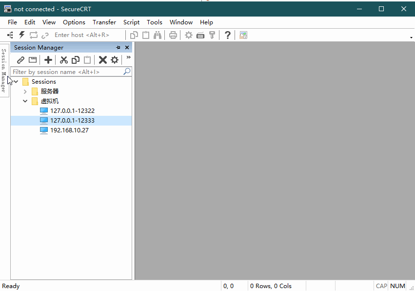
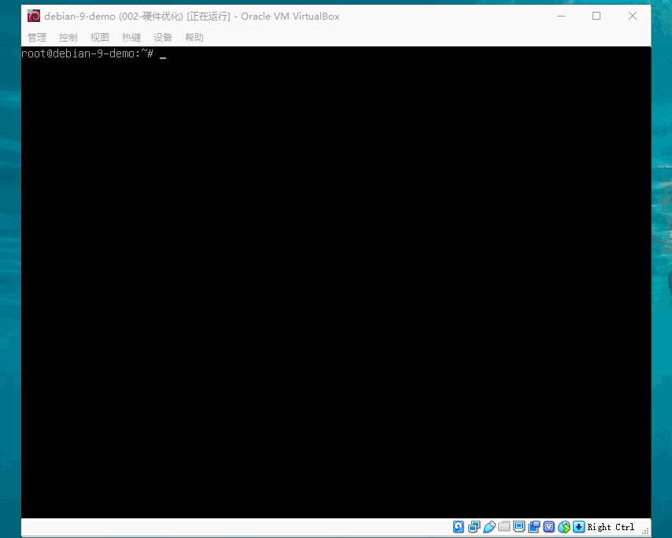
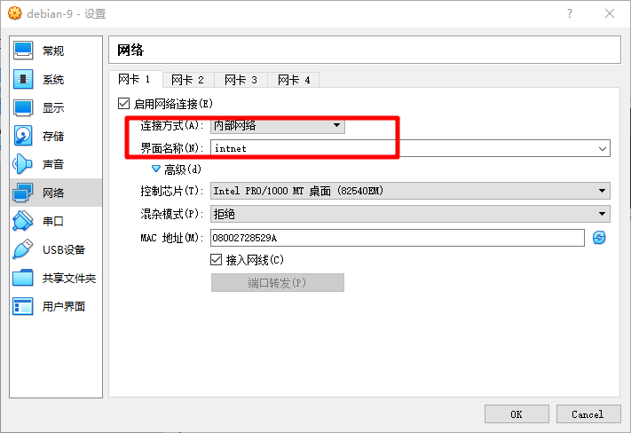
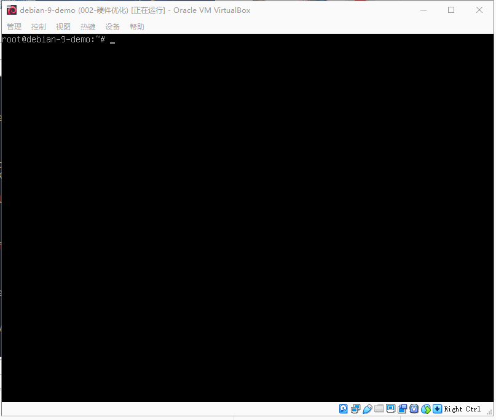

# 
vbox 的虚拟网络

> vbox 的虚拟网络有 6 种模式，并且功能也不尽相同：

| 序号 | vbox 中文版           | vbox 英文版       | vbox 官方手册版                     |
| ---- | --------------------- | ----------------- | ----------------------------------- |
| 01   | 网络地址转换模式(NAT) | NAT               | Network Address Translation (NAT)   |
| 02   | NAT 网络              | NAT Network       | Network Address Translation Service |
| 03   | 桥接网卡              | Bridged Adapter   | Bridged networking                  |
| 04   | 内部网络              | Internal Network  | Internal networking                 |
| 05   | 仅主机(Host-Only)网络 | Host-only Adapter | Host-only networking                |
| 06   | 通用驱动              | Generic Driver    | Generic networking                  |

> vbox 重要虚拟网络模式的联网状态：

| 网络通信关系     | NAT      | NAT 网络 | 桥接    | Internal | Host-only |
| ---------------- | -------- | -------- | ------- | -------- | --------- |
| 虚拟电脑`->`宿主 | &#8730;  | &#8730;  | &#8730; | &#215;   | &#8730;   |
| 虚拟电脑`<-`宿主 | 端口转发 | 端口转发 | &#8730; | &#215;   | &#8730;   |
| 虚拟电脑之间     | &#215;   | &#8730;  | &#8730; | &#8730;  | &#8730;   |
| 虚拟电脑`->`外网 | &#8730;  | &#8730;  | &#8730; | &#215;   | &#215;    |
| 虚拟电脑`<-`外网 | 端口转发 | 端口转发 | &#8730; | &#215;   | &#215;    |

> 下面我们就要开始网络模式详解了！

## 一、NAT 模式

> `网络地址转换模式(NAT)` 是从虚拟机访问外部网络的最简单方法。通常它不需要主机网络和虚拟机上配置什么东西。出于这个原因，它是 vbox 中默认的虚拟网络模式。

> 检测 NAT 虚拟网络模式下 虚拟电脑能否链接宿主机和外网（测试成功）

### NAT 模式之端口转发

> `网络地址转换模式(NAT)` 通常只允许前面 2 种通信关系，通过 `端口转发` 还能支持另外 2 种通信关系！

> 仅让宿主机访问“虚拟电脑特定端口”的转发规则

> 允许所有局域网（外网）访问“虚拟电脑特定端口”的转发规则

> - 提示：如上图所示，设置了 `局域网访问ssh` 规则后，`宿主机访问ssh` 规则其实可以不设置！
> - 注意：不管是局域网、宿主机、虚拟电脑在链接上之前，都有一个前提，就是防火墙要开发端口！

## 二、NAT 网络模式

> `NAT网络` 模式又称为 `网络地址转换服务` 模式，功能是多一个虚拟电脑之间的互通
>
> - 相对应的也增加了一些要求：需要 vbox 虚拟的 `NAT网络`支持

> 配置 vbox 虚拟网卡的方法

> 在 vbox 全局配置了 `NAT网络` 以后这个网络就能正常了

> 当我们为两个虚拟电脑设置同一个 `NAT网络界面` 时，它们会是同一网段，不同 ip

> 两个虚拟电脑通过 ssh 客户端，相互远程链接：

> `NAT网络模式` 除了多了虚拟电脑间的互通外，其他与 `NAT模式` 基本一致！但是转发规则需要在全局设置的 `网络` 界面设置。

### NAT 网络模式之端口转发

> `NAT网络模式` 的端口转发原理我们用下面的表来描述：

| 虚拟电脑         | vm-001                   | vm-002                   | vm-003                   |
| ---------------- | ------------------------ | ------------------------ | ------------------------ |
| NAT 网络界面名称 | group                    | group                    | other                    |
| 虚拟电脑网络互通 | 与 vm-002 互通           | 与 vm-001 互通           | 没有互通的虚拟电脑       |
| 宿主->虚拟电脑   | group 网络下设置转发规则 | group 网络下设置转发规则 | other 网络下设置转发规则 |
| 局域网->虚拟电脑 | group 网络下设置转发规则 | group 网络下设置转发规则 | other 网络下设置转发规则 |

> 1 个 `NAT网络` 配置多个虚拟主机的转发规则

> 本机连接 `NAT网络模式` 下的多台虚拟机（局域网连接见`NAT模式`）

> 除了这些以外，`NAT网络模式` 与 `NAT模式` 基本一致，这里就不讲解了！

## 三、桥接模式

> 桥接全程靠宿主机是否联网，宿主机有网络全部互通，宿主机没有网络全部拒绝

## Internal 模式

> `Internal模式` 中文也叫 `内网模式` ，实现方式与桥接相似，但是功能相差很大
>
> - 仅能虚拟电脑间互通
> - 安全性比桥接高

