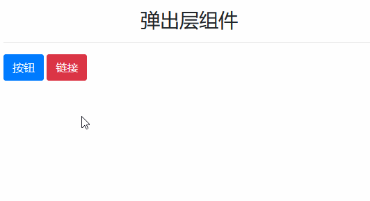

# Popovers - 弹出层组件

> 弹出层组件向站点上的任何元素添加弹出窗口形式的引导说明(如 iOS 中的弹出窗口)

## 适用对象

> 弹出层组件适用于任何元素，我们经常应用于 `<button> & <a>` 这两个元素

## 弹出层组件，必须的 js 代码

> `Popovers 组件` 必须要有这样一段 js 代码：

```js
$(function() {
  $().popover({
    // 这里输入弹出层公用代码
  });
});
```

## 弹出层组件属性说明

> 弹出层组件属性支持两种写法：

| 属性写法 | 作用域                                     |
| -------- | ------------------------------------------ |
| `data-*` | 直接写入元素中(`title`属性不需要加`data-`) |
| `*`      | 在 js 中定义，一般都是定义公共信息         |

```html
<!-- 直接写入元素 -->
<button type="button" class="btn btn-primary" title="这是标题" data-content="这是内容">一个弹出层</button>
<button type="button" class="btn btn-primary" title="这是标题">一个弹出层</button>
```

```js
$(function() {
  $().popover({
    // 这里输入弹出层公用代码
    content: "这是默认内容",
    delay: { show: 500, hide: 300 }
  });
});
```

> 为了更好的表示哪些元素需要实现弹出层功能,我们可以在元素上加入 `data-toggle="popover"` 属性,然后这样调用:

```js
$(function() {
  $('[data-toggle="popover"]').popover({
    // 这里输入弹出层公用代码
    content: "这是默认内容",
    delay: { show: 500, hide: 300 }
  });
});
```

> 也可以为个别元素，添加弹出层 js

```js
$(function() {
  $(".popover-001").popover({
    // 这里输入弹出层公用代码
    content: "这是默认内容",
    delay: { show: 500, hide: 300 }
  });
});
```

> 常用属性表：

| 属性        | 属性值选项                        | 默认值     | 描述                                                       |
| ----------- | --------------------------------- | ---------- | ---------------------------------------------------------- |
| `animation` | 布尔值                            | true       | 淡入淡出弹出层                                             |
| `container` | `string|元素|false`               | false      | 将弹出窗口附加到特定元素（当父元素样式干扰弹出时，使用它） |
| `delay`     | `数值|对象`                       | 0          | 延迟弹出层的显示和隐藏时间                                 |
| `placement` | `auto|top|bottom|left|right|函数` | `'right'`  | 定义弹出层方向                                             |
| `title`     | 字符串                            | `''`       | 弹出层标题                                                 |
| `content`   | 字符串                            | `''`       | 弹出层内容                                                 |
| `trigger`   | `click|hover|focus|manual`        | `'click'`  | 弹出层的触发事件                                           |
| `template`  | 预先定义好的 div 块               | 预先定义的 | 弹出层组件的模板                                           |

### `container` 解决样式冲突

> 当父元素样式干扰了弹出层组件弹出时，可以添加到特定元素（一般选择最近元素中正常的）

```js
$(function() {
  $('[data-toggle="popover"]').popover({
    container: "body"
  });
});
```

```html
<button type="button" class="btn btn-primary" title="这是标题" data-content="这是内容" data-container="body">一个弹出层</button>
```

### 事件延迟触发

> `delay` 属性用于设置 `显示事件` 和 `隐藏事件` 的延迟时间

| `delay` 取值 | 例子                                       | 描述                                        |
| ------------ | ------------------------------------------ | ------------------------------------------- |
| 数值         | `delay: "300"`                             | 隐藏事件和显示事件都是延迟 300 毫秒         |
| 数值         | `data-delay="300"`                         | 隐藏事件和显示事件都是延迟 300 毫秒         |
| 对象         | `delay: {"show": 500, "hide": 300}`        | 显示事件延迟 500 毫秒,隐藏事件延迟 300 毫秒 |
| 对象         | `data-delay='{"show": 1000, "hide": 300}'` | 显示事件延迟 500 毫秒,隐藏事件延迟 300 毫秒 |

### 弹出层样式模板

> 弹出层的样式是预先定义好的（可以通过 `template & data-template` 属性自定义）

```html
<div class="popover" role="tooltip">
    <div class="arrow"></div>
    <h3 class="popover-header"></h3>
    <div class="popover-body"></div>
</div>
```

> 模板元素概要：

| 模板元素          | 作用域 | 描述                                           |
| ----------------- | ------ | ---------------------------------------------- |
| `.popover`        | 父级   | 组件基类                                       |
| `.arrow`          | 子级   | 组件箭头样式                                   |
| `.popover-header` | 子级   | 组件的标题，对应 `title` 属性                  |
| `.popover-body`   | 子级   | 组件的内容，对应 `content & data-content` 属性 |

## 案例



```html
<div class="container">
    <h3 class="text-center mt-5">弹出层组件</h3>
    <hr>
    <button type="button" class="btn btn-primary" data-toggle="popover" data-content="按钮，如果是submit类型，不想提交信息，也可以用 preventDefault() 来阻止" title="这是一个按钮">按钮</button>
    <a href="http://www.baidu.com" class="btn btn-danger" data-toggle="popover" data-content="链接，需要防止链接打开URL,使用 preventDefault() 可以阻止" title="这是一个链接">链接</a>
</div>
<script src="/static/base/js/jquery.min.js"></script>
<script src="/static/base/js/bootstrap.bundle.min.js"></script>
<script type="text/javascript">
    $(function() {
        // 如果是 <a> 标签，我们就应该防止链接打开 URL
        // 使用 preventDefault() 可以阻止元素发生默认行为
        $('a[data-toggle="popover"]').on('click', function(e) {
            e.preventDefault();
        });
        $('[data-toggle="popover"]').popover({
            // 这里输入弹出层公用代码
            container: 'body',
            delay: {
                "show": 100,
                "hide": 300
            },
        });
    });
</script>
```
