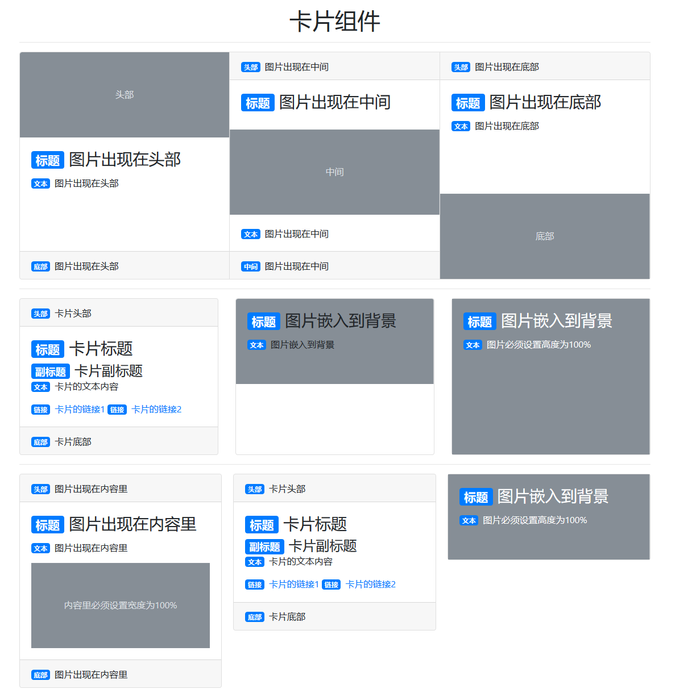

<!--
+===============================================================================
| @Author: madnesslin(地上马)
+===============================================================================
| @Phone: +86 13695746767
+===============================================================================
| @Date: 2018-12-31 14:21:02
+===============================================================================
| @Email: linjialiang@163.com
+===============================================================================
| @Last modified time: 2018-12-31 16:39:26
+===============================================================================
-->

# Cards 组件

> 卡片组件是一个灵活的、可扩展的内容容器。它包括页眉和页脚选项、各种各样的内容、上下文背景颜色和强大的显示选项。

| 样式类               | 描述                                                    |
| -------------------- | ------------------------------------------------------- |
| `.card`              | 父级，卡片基础样式类                                    |
| `.card-header`       | 子级，卡片标题（页眉）                                  |
| `.card-body`         | 子级，卡片内容                                          |
| `.card-footer`       | 子级，卡片底部（页脚）                                  |
| `.card-title`        | 处理`h1~h6`（主标题）                                   |
| `.card-subtitle`     | 处理`h1~h6`（字幕，副标题）                             |
| `.card-text`         | 子级下级，卡片文本内容                                  |
| `.card-link`         | 子级下级，卡片链接                                      |
| `.card-group`        | 祖级，卡片布局（无间距）                                |
| `.card-deck`         | 祖级，卡片布局（大屏幕带间距）                          |
| `.card-columns`      | 祖级，卡片按顺序排列                                    |
| `.card-img-top`      | 子级&子级下级，将图像放在卡片顶部（顶角 border-radius） |
| `.card-img-bottom`   | 子级&子级下级，将图像放在卡片底部（底角 border-radius） |
| `.card-img`          | 子级&子级下级（四周 border-radius）                     |
| `.card-img-overlay`  | 子级，将卡片的图片嵌入背景                                    |
| `.card-header-tabs`  | 子级，为 `navs组件` 到卡片组件准备的                    |
| `.card-header-pills` | 子级，为 `navs组件` 到卡片组件准备的                    |



```html
<div class="container">
    <h1 class="mt-3 text-center">卡片组件</h1>
    <hr>
    <div class="card-group">
        <div class="card">
            <svg style="text-anchor:middle" class="card-img-top" role="img">
                <rect fill="#868e96" width="100%" height="100%"></rect>
                <text fill="#dee2e6" dy=".3em" x="50%" y="50%">头部</text>
            </svg>
            <div class="card-body">
                <h3 class="card-title"><span class="badge badge-primary mr-2">标题</span>图片出现在头部</h3>
                <p class="card-text"><span class="badge badge-primary mr-2">文本</span>图片出现在头部</p>
            </div>
            <div class="card-footer"><span class="badge badge-primary mr-2">底部</span>图片出现在头部 </div>
        </div>
        <div class="card">
            <div class="card-header">
                <span class="badge badge-primary mr-2">头部</span>图片出现在中间 </div>
            <div class="card-body">
                <h3 class="card-title"><span class="badge badge-primary mr-2">标题</span>图片出现在中间</h3>
            </div>
            <svg style="text-anchor:middle" role="img">
                <rect fill="#868e96" width="100%" height="100%"></rect>
                <text fill="#dee2e6" dy=".3em" x="50%" y="50%">中间</text>
            </svg>
            <div class="card-body">
                <p class="card-text"><span class="badge badge-primary mr-2">文本</span>图片出现在中间</p>
            </div>
            <div class="card-footer"><span class="badge badge-primary mr-2">中间</span>图片出现在中间 </div>
        </div>
        <div class="card">
            <div class="card-header">
                <span class="badge badge-primary mr-2">头部</span>图片出现在底部 </div>
            <div class="card-body">
                <h3 class="card-title"><span class="badge badge-primary mr-2">标题</span>图片出现在底部</h3>
                <p class="card-text"><span class="badge badge-primary mr-2">文本</span>图片出现在底部</p>
            </div>
            <svg style="text-anchor:middle" role="img">
                <rect fill="#868e96" width="100%" height="100%"></rect>
                <text fill="#dee2e6" dy=".3em" x="50%" y="50%">底部</text>
            </svg>
        </div>
    </div>
    <hr>
    <div class="card-deck mt-3 mb-3">
        <div class="card ">
            <div class="card-header"><span class="badge badge-primary mr-2">头部</span>卡片头部</div>
            <div class="card-body">
                <h3 class="card-title"><span class="badge badge-primary mr-2">标题</span>卡片标题</h3>
                <h4 class="card-subtitle"><span class="badge badge-primary mr-2">副标题</span>卡片副标题</h4>
                <p class="card-text"><span class="badge badge-primary mr-2">文本</span>卡片的文本内容</p>
                <a href="card-link"><span class="badge badge-primary mr-2">链接</span>卡片的链接1</a>
                <a href="card-link"><span class="badge badge-primary mr-2">链接</span>卡片的链接2</a>
            </div>
            <div class="card-footer"><span class="badge badge-primary mr-2">底部</span>卡片底部 </div>
        </div>
        <div class="card">
            <div class="card-img-overlay">
                <h3 class="card-title"><span class="badge badge-primary mr-2">标题</span>图片嵌入到背景</h3>
                <p class="card-text"><span class="badge badge-primary mr-2">文本</span>图片嵌入到背景</p>
            </div>
            <svg style="text-anchor:middle" class="card-img-top" role="img">
                <rect fill="#868e96" width="100%" height="100%"></rect>
            </svg>
        </div>
        <div class="card">
            <div class="card-img-overlay text-white">
                <h3 class="card-title"><span class="badge badge-primary mr-2">标题</span>图片嵌入到背景</h3>
                <p class="card-text"><span class="badge badge-primary mr-2">文本</span>图片必须设置高度为100%</p>
            </div>
            <svg style="text-anchor:middle" height="100%" role="img">
                <rect fill="#868e96" width="100%" height="100%"></rect>
            </svg>
        </div>
    </div>
    <hr>
    <div class="card-columns">
        <div class="card">
            <div class="card-header">
                <span class="badge badge-primary mr-2">头部</span>图片出现在内容里 </div>
            <div class="card-body">
                <h3 class="card-title"><span class="badge badge-primary mr-2">标题</span>图片出现在内容里</h3>
                <p class="card-text"><span class="badge badge-primary mr-2">文本</span>图片出现在内容里</p>
                <svg style="text-anchor:middle" role="img" width="100%">
                    <rect fill="#868e96" width="100%" height="100%"></rect>
                    <text fill="#dee2e6" dy=".3em" x="50%" y="50%">内容里必须设置宽度为100%</text>
                </svg>
            </div>
            <div class="card-footer"><span class="badge badge-primary mr-2">底部</span>图片出现在内容里</div>
        </div>
        <div class="card ">
            <div class="card-header"><span class="badge badge-primary mr-2">头部</span>卡片头部</div>
            <div class="card-body">
                <h3 class="card-title"><span class="badge badge-primary mr-2">标题</span>卡片标题</h3>
                <h4 class="card-subtitle"><span class="badge badge-primary mr-2">副标题</span>卡片副标题</h4>
                <p class="card-text"><span class="badge badge-primary mr-2">文本</span>卡片的文本内容</p>
                <a href="card-link"><span class="badge badge-primary mr-2">链接</span>卡片的链接1</a>
                <a href="card-link"><span class="badge badge-primary mr-2">链接</span>卡片的链接2</a>
            </div>
            <div class="card-footer"><span class="badge badge-primary mr-2">底部</span>卡片底部 </div>
        </div>
        <div class="card">
            <div class="card-img-overlay text-white">
                <h3 class="card-title"><span class="badge badge-primary mr-2">标题</span>图片嵌入到背景</h3>
                <p class="card-text"><span class="badge badge-primary mr-2">文本</span>图片必须设置高度为100%</p>
            </div>
            <svg style="text-anchor:middle" height="100%" width="100%" role="img">
                <rect fill="#868e96" width="100%" height="100%"></rect>
            </svg>
        </div>
    </div>
</div>
```

> PS：卡片组件可以嵌入很多组件和样式，这些内容，可以自己尝试去应用，或者查看官方手册
