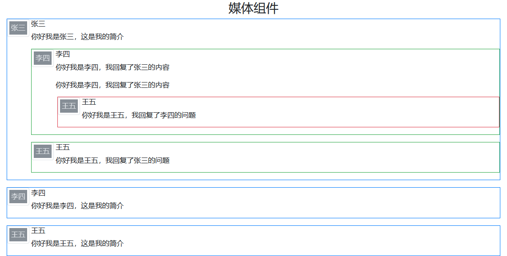

# `Media object` 组件

> 媒体组件，用于构建高度重复的组件，如博客评论等。

## 样式类表

| 样式类        | 描述             |
| ------------- | ---------------- |
| `.media`      | 媒体组件基类     |
| `.media-body` | 媒体组件文本区域 |

> 媒体组件所针对的场景一般是这样的：

| 序号 | 场景                                                              |
| ---- | ----------------------------------------------------------------- |
| 1    | 大 div 块（`.media` 所在位置），一般都存在多个大 div 块           |
| 2    | 大 div 块内包含`1个小头像` 和 `文本内容（`.media-body`所在位置）` |
| 3    | 在文本内容里支持嵌套进多个 `.media` 块                            |


## 案例



```html
<div class="container mt-3">
    <h3 class="text-center">媒体组件</h3>
    <div class="media mb-3 border border-primary">
        <svg style="text-anchor:middle" class="img-thumbnail rounded" width="50" height="50">
            <rect fill="#868e96" width="100%" height="100%"></rect>
            <text fill="#dee2e6" class="" dy=".3em" x="50%" y="50%">张三</text>
        </svg>
        <div class="media-body ml-1">
            <h6>张三</h6>
            <p>你好我是张三，这是我的简介</p>
            <div class="media mb-3 border border-success">
                <svg style="text-anchor:middle" class="img-thumbnail rounded" width="50" height="50">
                    <rect fill="#868e96" width="100%" height="100%"></rect>
                    <text fill="#dee2e6" class="" dy=".3em" x="50%" y="50%">李四</text>
                </svg>
                <div class="media-body ml-1">
                    <h6>李四</h6>
                    <p>你好我是李四，我回复了张三的内容</p>
                    <p>你好我是李四，我回复了张三的内容</p>
                    <div class="media ml-1 mb-3 border border-danger">
                        <svg style="text-anchor:middle" class="img-thumbnail rounded" width="50" height="50">
                            <rect fill="#868e96" width="100%" height="100%"></rect>
                            <text fill="#dee2e6" class="" dy=".3em" x="50%" y="50%">王五</text>
                        </svg>
                        <div class="media-body ml-1">
                            <h6>王五</h6>
                            <p>你好我是王五，我回复了李四的问题</p>
                        </div>
                    </div>
                </div>
            </div>
            <div class="media mb-3 border border-success">
                <svg style="text-anchor:middle" class="img-thumbnail rounded" width="50" height="50">
                    <rect fill="#868e96" width="100%" height="100%"></rect>
                    <text fill="#dee2e6" class="" dy=".3em" x="50%" y="50%">王五</text>
                </svg>
                <div class="media-body ml-1">
                    <h6>王五</h6>
                    <p>你好我是王五，我回复了张三的问题</p>
                </div>
            </div>
        </div>
    </div>
    <div class="media mb-3 border border-primary">
        <svg style="text-anchor:middle" class="img-thumbnail rounded" width="50" height="50">
            <rect fill="#868e96" width="100%" height="100%"></rect>
            <text fill="#dee2e6" class="" dy=".3em" x="50%" y="50%">李四</text>
        </svg>
        <div class="media-body ml-1">
            <h6>李四</h6>
            <p>你好我是李四，这是我的简介</p>
        </div>
    </div>
    <div class="media mb-3 border border-primary">
        <svg style="text-anchor:middle" class="img-thumbnail rounded" width="50" height="50">
            <rect fill="#868e96" width="100%" height="100%"></rect>
            <text fill="#dee2e6" class="" dy=".3em" x="50%" y="50%">王五</text>
        </svg>
        <div class="media-body ml-1">
            <h6>王五</h6>
            <p>你好我是王五，这是我的简介</p>
        </div>
    </div>
</div>
```
