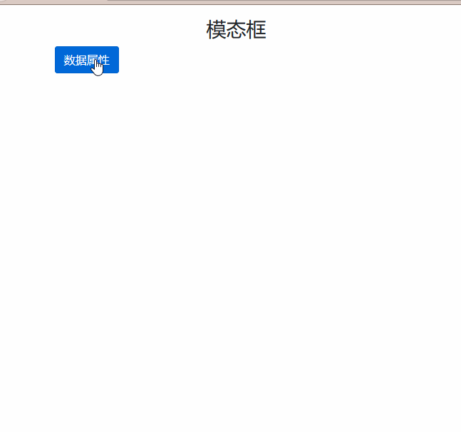
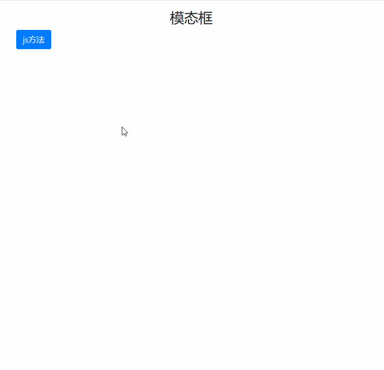

# Modal 组件

> `模态框组件`，是覆盖在父窗体上的子窗体。通常是显示用户通知的对话窗口，可以在不离开父窗体的情况下有一些互动。子窗体可提供信息交互等。

## 模态框是如何工作的呢？

| 序号 | 描述                                                                                    |
| ---- | --------------------------------------------------------------------------------------- |
| 1    | 模态框是用 HTML、CSS 和 JavaScript 构建的。                                             |
| 2    | 模态框的`z轴`，位于文档所有其他内容之上                                                 |
| 3    | 模态框删除了`<body>`的滚动条，所有模态框的长文本内容可以滚动。                          |
| 4    | 点击模态框的“背景”，将自动关闭模态框                                                    |
| 5    | `bootstrap`一次只支持一个模态框。模态框不支持嵌套，因为我们认为这是非常糟糕的用户体验。 |
| 6    | 模态框使用 `position: fixed` ，所以父级不能带 `position: fixed` 样式                    |
| 7    | 模态框的 html 不支持语义，需要通过 js 来指定对应的语义                                  |

## 样式表

> 模态框组件比较特别，自身需要 3 个 div 层

| 样式类                   | 描述                                                              |
| ------------------------ | ----------------------------------------------------------------- |
| `.modal`                 | 模态框 1 级标签，模态框组件基类（没有同级的模态框样式类）         |
| `.fade`                  | 模态框 1 级标签，让模态框具有淡入淡出特效                         |
| `.modal-dialog`          | 模态框 2 级标签，对话窗口基类（模态框形态与位置都在该层标签定义） |
| `.modal-dialog-centered` | 模态框 2 级标签，改变位置，对话窗口居中显示                       |
| `.modal-sm`              | 模态框 2 级标签，改变大小，小号模态框                             |
| `.modal-lg`              | 模态框 2 级标签，改变大小，大号模态框                             |
| `.modal-xl`              | 模态框 2 级标签，改变大小，特大号模态框                           |
| `.modal-content`         | 模态框 3 级标签，模态框内容标签类（可以嵌入 html 标签及其它组件） |

> 模态框一般有 `头部 & 内容 & 底部` 三大区块

| 样式类          | 描述                                              |
| --------------- | ------------------------------------------------- |
| `.modal-header` | 头部，一般是标题和关闭按钮                        |
| `.modal-body`   | 内容，我们想要给用户看的                          |
| `.modal-footer` | 底部，通常包含 `取消 & 通过` 两个按钮             |
| `.modal-title`  | 模态框标题标签类，一般应用于头部下的 `h1~h6` 标签 |

> 几个会自动创建的样式类

| 样式类                     | 描述                                                                                |
| -------------------------- | ----------------------------------------------------------------------------------- |
| `.modal-open`              | 展示模态框时，会在 `<body>`标签里增加该类                                           |
| `.modal-backdrop`          | 模态框背景标签类，打开模态框时，会在`</body>`内自动创建一个标签                     |
| `.modal-scrollbar-measure` |
| `.show`                    | 让 `背景(.modal-backdrop) & 对话窗口(.model-dialog)` 标签显示，打开模态框时自动创建 |

## 模态框如何显示和隐藏

> 模态框显示和隐藏可以 `通过js方法` 或者 `通过数据属性` 来实现

### 数据属性

> 模态框可以通过 `数据属性` 来实现模态框显示和隐藏

| 数据属性                  | 描述                                                                           |
| ------------------------- | ------------------------------------------------------------------------------ |
| `data-toggle="modal"`     | 显示模态框，如：页面 `<button> & <a>` 等点击事件                               |
| `data-dismiss="modal"`    | 隐藏模态框，模态框内的所有关闭事件的 `按钮 & a标签` 等                         |
| `data-target="#selector"` | 数据属性出现在页面上的 `<button> & <a>` 等，控制指定`id & class`的模态框的标签 |

> PS： 由于 1 次只能操作 1 个模态框，所以我们推荐使用唯一值的 `id`



```html
<div class="container mt-3">
    <h3 class="text-center">模态框</h3>
    <button type="button" class="btn btn-primary" data-toggle="modal" data-target="#modal001"> 数据属性 </button>
    <div class="modal fade" id="modal001">
        <div class="modal-dialog">
            <div class="modal-content">
                <div class="modal-header">
                    <h5 class="modal-title">数据属性</h5>
                    <button type="button" class="close" data-dismiss="modal">
                        <span>&times;</span>
                    </button>
                </div>
                <div class="modal-body">
                    <p>该模态框使用 <span class="badge badge-danger">数据属性</span> 来展示和隐藏，不需要额外的js方法!</p>
                    <dl class="">
                        <dt><code>data-toggle="modal"</code> 用于展示模态框</dt>
                        <dd>一般用于 <span class="badge badge-primary">页面本身存在的 &lt;button&gt; &lt;a&gt;</span> 里，通过点击事件来触发模态框显示</dd>
                        <hr>
                        <dt><code>data-dismiss="modal"</code> 用于隐藏模态框</dt>
                        <dd><span class="badge badge-primary">模态框内所有用于关闭模态框的 &lt;button&gt; &lt;a&gt;</span> ，通过点击事件来触发模态框隐藏</dd>
                        <hr>
                        <dt><code>data-target="#selector"</code> 将 <span class="badge badge-primary">&lt;button&gt; &lt;a&gt;</span> 映射到指定id的模态框</dt>
                        <dd>用于 <span class="badge badge-primary">页面本身存在的 &lt;button&gt; &lt;a&gt;</span> 里，用于映射到指定id的模态框</dd>
                    </dl>
                </div>
                <div class="modal-footer">
                    <button type="button" class="btn btn-secondary" data-dismiss="modal">关闭</button>
                    <button type="button" class="btn btn-primary">保存</button>
                </div>
            </div>
        </div>
    </div>
</div>
<script src="/static/base/js/jquery.min.js"></script>
<script src="/static/base/js/bootstrap.bundle.min.js"></script>
```

## js 方法

> 用 js 方法来展示模态框，一般都是用于多个模态框的应用

| 数据属性               | 描述           |
| ---------------------- | -------------- |
| `data-dismiss="modal"` | 关闭的数据属性 |

> PS：模态框内关闭事件的数据属性是必带的，因为这个写成 js 会十分麻烦

| js 方法                     | 描述                                                               |
| --------------------------- | ------------------------------------------------------------------ |
| `$().modal('toggle')`       | 显示或隐藏                                                         |
| `$().modal('show')`         | 仅显示                                                             |
| `$().modal('hide')`         | 仅隐藏                                                             |
| `$().modal('handleUpdate')` | 如果模态打开时高度发生变化(例如出现滚动条)，则手动调整模态的位置。 |
| `$().modal('dispose')`      | 销毁元素的模态。                                                   |

## js 选项

> js 选项有 4 个，默认全部为 `true`

| 选项名     | 取值              | 描述                        |
| ---------- | ----------------- | --------------------------- |
| `backdrop` | 布尔值或 `static` | 模态框背景                  |
| `keyboard` | 布尔值            | 按下 `esc` 按键时关闭模态框 |
| `focus`    | 布尔值            | 在初始化时将焦点放在模态上  |
| `show`     | 布尔值            | 显示初始化时的模态框        |

> `backdrop` 为 `static` 时，有背景色，但点击背景无法关闭模态框

1. js 选项定义
   > js4 个选项组成了一个数组，使用 `$().modal({})` 来定义

```js
$("#selector").modal({
  keyboard: false, // 取消键盘绑定
  backdrop: static // 取消点击背景色事件
});
```

> 案例



```html
<div class="container mt-3">
    <h3 class="text-center">模态框</h3>
    <button type="button" class="btn btn-primary" id="js-modal"> js方法 </button>
    <div class="modal fade" id="modal002">
        <div class="modal-dialog">
            <div class="modal-content">
                <div class="modal-header">
                    <h5 class="modal-title">js方法</h5>
                    <button type="button" class="close modal-close">
                        <span>&times;</span>
                    </button>
                </div>
                <div class="modal-body">
                    <p>该模态框使用 <span class="badge badge-danger">js方法</span> 来展示和隐藏，需要我们添加js方法!</p>
                    <dl class="">
                        <dt><code>$().modal('show');</code> 用于展示模态框</dt>
                        <dd>一般用于 <span class="badge badge-primary">页面本身存在的 &lt;button&gt; &lt;a&gt;</span> 里，通过点击事件来触发模态框显示</dd>
                        <hr>
                        <dt><code>$().modal('hide');</code> 用于隐藏模态框</dt>
                        <dd><span class="badge badge-primary">模态框内所有用于关闭模态框的 &lt;button&gt; &lt;a&gt;</span> ，通过点击事件来触发模态框隐藏</dd>
                        <hr>
                        <dt><code>$().modal('toggle');</code> 用于展示、隐藏模态框</dt>
                        <dd>可替带，以下两个中的任意一个：
    <pre>
    $().modal('show');
    $().modal('hide');
    </pre>
                        </dd>
                        <hr>
                        <dt><code>data-target="#selector"</code> 将 <span class="badge badge-primary">&lt;button&gt; &lt;a&gt;</span> 映射到指定id的模态框</dt>
                        <dd>用于 <span class="badge badge-primary">页面本身存在的 &lt;button&gt; &lt;a&gt;</span> 里，用于映射到指定id的模态框</dd>
                    </dl>
                </div>
                <div class="modal-footer">
                    <button type="button" class="btn btn-secondary modal-close">关闭</button>
                    <button type="button" class="btn btn-primary">保存</button>
                </div>
            </div>
        </div>
    </div>
</div>
<script src="/static/base/js/jquery.min.js"></script>
<script src="/static/base/js/bootstrap.bundle.js"></script>
<script type="text/javascript">
    $('#js-modal').on('click', function() {
        $('#modal002').modal('show');
    });
    $('#modal002 .modal-close').on('click', function() {
        $('#modal002').modal('hide');
    });
</script>
```

> 如无必要，请不要使用 js 方法了，因为用 html 更加简单更加直观

## js 事件

> 模态框组件支持 4 个 js 事件，所有事件都是在 modal 本身发生的（就是在`<div class="modal">`这个 div 上发生）

| 事件              | 描述                                                                                                                       |
| ----------------- | -------------------------------------------------------------------------------------------------------------------------- |
| `show.bs.modal`   | 当调用 show 实例方法时，此事件立即触发。如果是由单击引起的，则单击的元素作为事件的`relatedTarget`属性可用。                |
| `shown.bs.modal`  | 当模式对用户可见时，将触发此事件(将等待 CSS 转换完成)。如果是由单击引起的，则单击的元素作为事件的`relatedTarget`属性可用。 |
| `hide.bs.modal`   | 当调用 hide 实例方法时，将立即触发此事件。                                                                                 |
| `hidden.bs.modal` | 当模态对用户隐藏完成时(将等待 CSS 转换完成)触发此事件。                                                                    |

> 在这里不详细讲解 js 事件，有需要可自行研究
