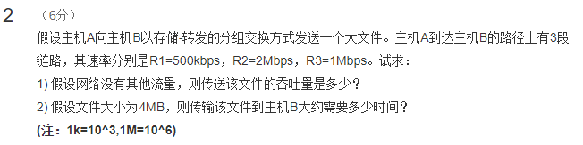

### 问题 1：假设网络没有其他流量，则传送该文件的吞吐量是多少？

> 答案： `传送该文件的吞吐量为 500kbps`

```
解析：
    吞吐量是传输过程中速率最小的链路；
    即：吞吐量与R1相同为500kbps
```

### 问题2：假设文件大小为4M，则传输该文件到主机B大约需要多少时间？

> 答案：`大约需要 64s`

~~~
解析：
    文件大小4M是指4M字节，因此换算成bits后是：
        4M = 4*(10^6)Bety = 32*(10^6)bits
    吞吐量为500kbps换算成bps后是：
        500kbps = 5*(10^5)bps = 5*(10^5)bits/s
    在本道题目中，我们不需要考虑延迟，因此：
        传输时间 = 文件大小/吞吐量
            = 32*(10^6)/(5*(10^5)) = 64s
~~~
