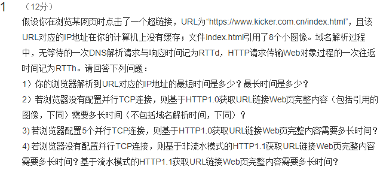

> 已知条件：

| 属性                   | 属性值              |
| ---------------------- | ------------------- |
| 文件数量               | 9 个（页面+8 图片） |
| 一次 dns 时间          | RTTd                |
| 一次 http 对象传输时间 | RTTh                |

##### 问题一：你的浏览器解析到 URL 对应的 IP 地址的最短时间是多少？最长时间是多少？

> 答案： `最长时间 5RTTd，最短时间 1RTTd`

```
解析：
    如果本地DNS有缓存，则直接返回给主机，耗时最短 1RTTd；
    如果DNS都没有缓存，则迭代查询花费时间比递归查询更加耗费时间：
        1. 主机向本地DNS发送请求，发现没有这个数据，耗时 1RTTd
        2. 本地DNS向Root DNS服务器发送请求，告知需要去下个dns，耗时 1RTTd
        3. 本地DNS向顶级DNS服务器发送请求，告知需要去下个dns，耗时 1RTTd
        4. 本地DNS向权威DNS服务器发送请求，此时收到正确的ip地址响应，耗时 1RTTd
        5. 本地DNS向主机发送响应，耗时 1RTTd；
        因此，耗时为 5RTTd
```

##### 问题二：若浏览器没有配置并行 TCP 连接，则基于 HTTP1.0 获取 URL 链接 Web 页完整内容（包括引用的图像，下同）需要多长时间（不包括域名解析时间，下同）？

> 答案： `18RTTh`

```shell
解析：
    HTTP1.0采用非持久性连接方式；
    每个TCP连接最多允许传输一个对象；
    一共有9个文件，需要传输9次；
    一次对象传输需要时间2RTTh；

    答案是： 2*9 = 18RTTh
```

##### 问题三：若浏览器配置 5 个并行 TCP 连接，则基于 HTTP1.0 获取 URL 链接 Web 页完整内容需要多长时间？

> 答案： `6RTTh`

```shell
解析：
    1）本题考的是我们对HTTP1.0链接的理解；
    2）HTTP1.0是非持久性连接，每个TCP连接最多允许传输一个对象；
    3）只要带宽和硬件允许，多个TCP并行就相当于同一时间传输多个文件；
    4）浏览器先要处理index.html这个页面，等处理完了才发现还有8张图片需要处理；
    5）由于开了5个并行的TCP，所以8张图片分2次（1次5张，1次3张）传输；

    答案：2RTTh + 2*2RTTh = 6RTTh

```

##### 问题四：若浏览器没有配置并行 TCP 连接，则基于非流水模式的 HTTP1.1 获取 URL 链接 Web 页完整内容需要多长时间？基于流水模式的 HTTP1.1 获取 URL 链接 Web 页完整内容需要多长时间？

> 答案：

| 模式     | 答案     |
| -------- | -------- |
| `非流水` | `10RTTh` |
| `流水`   | `3RTTh`  |

```shell
解析：
    1）无流水情况下：
        客户端只有收到前一个响应后才发送新的请求，每个被引用的对象耗时一个RTT；
        也就是说index.html需要消耗2个RTTh；
        后面被引用的图片只需要消耗1个RTTh；
        并且后面引用的对象要一个个传输

        答案 2RTTh + 8RTTh = 10RTTh

    2）流水情况下：
        客户端只要遇到一个引用就尽快发出请求;
        也就是说index.html需要消耗2个RTTh；
        后面被引用的图片只需要消耗1个RTTh；
        并且后面引用的请求都是差不多同时进行传输的。

        答案 2RTTh + RTTh = 3RTTh
```
