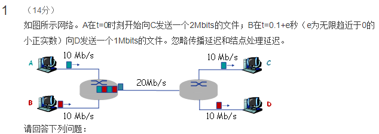

> 开始接提前需要处理的问题：

1. 为了让我们操作方便，题目中链路传输速度和文件大小单位都采用 Mb（都是兆比特）为单位，因此我们不必做单位换算。

## 问题一

> 如果图中网络采用存储-转发方式的报文交换，则 A 将 2Mbits 的文件交付给 C 需要多长时间？B 将 1Mbits 的文件交付给 D 需要多长时间？

### 问题一解析：

> 报文交换，是发送信息的整体，并且传输过程中会占用全部带宽，因此 A 与 B 发送的两个信息在同一条链路的时候就需要排队等待。时间表如下所示：

| 步骤 | 发送        | 接收   | 发送时间(s) | 花费时间(s) | 接收时间(s) |
| ---- | ----------- | ------ | ----------- | ----------- | ----------- |
| 01   | A 主机      | 节点 1 | 0           | 0.2         | 0.2         |
| 02   | B 主机      | 节点 1 | 0.1+e       | 0.1         | 0.2+e       |
| 03   | 节点 1（A） | 节点 2 | 0.2         | 0.1         | 0.3         |
| 04   | 节点 1（B） | 节点 2 | 0.3         | 0.05        | 0.35        |
| 05   | 节点 2（A） | C 主机 | 0.3         | 0.2         | 0.5         |
| 06   | 节点 2（B） | D 主机 | 0.35        | 0.1         | 0.45        |

> - 注释 1：`04` 与 `03`处于同一个节点，并且仅有一条链路，因此需等待 `03` 发送成功，才能发送 `04`；
> - 注释 2： 其它步骤的都有独立链路，所以不需要考虑排队等待问题。

### 问题一答案：

> 最终接受时间 - 最开始发送时间 = 报文发送时间

- A 将 2Mbits 的文件交付给 C 需要花费时间为： `0.5 - 0` = `0.5` 秒
- B 将 1Mbits 的文件交付给 D 需要花费时间为： `0.45 - (0.1+e)` = `0.35-e` 秒

---

## 问题二

> 如果图中网络采用存储-转发方式的分组交换，分组长度为等长的 1kbits，且忽略分组头开销以及报文的拆装开销，则 A 将 2Mbits 的文件交付给 C 需要大约多长时间？B 将 1Mbits 的文件交付给 D 需要大约多长时间？

1. 1Mbits=1024kbits
2. 2Mbits = 2048kbits

### 问题一解析：

> 分组交换，是一次仅发送一个分组长度的信息，并且传输过程中会占用全部带宽，因此 A 与 B 发送的两个信息分组在同一条链路的时候也需要排队等待。时间表如下所示：

| 步骤 | 发送        | 接收   | 发送时间(s) | 花费时间(s) | 接收时间(s) |
| ---- | ----------- | ------ | ----------- | ----------- | ----------- |
| 01   | A 主机      | 节点 1 | 0           | 0.2         | 0.2         |
| 02   | B 主机      | 节点 1 | 0.1+e       | 0.1         | 0.2+e       |
| 03   | 节点 1（A） | 节点 2 | 0.2         | 0.1         | 0.3         |
| 04   | 节点 1（B） | 节点 2 | 0.3         | 0.05        | 0.35        |
| 05   | 节点 2（A） | C 主机 | 0.3         | 0.2         | 0.5         |
| 06   | 节点 2（B） | D 主机 | 0.35        | 0.1         | 0.45        |
