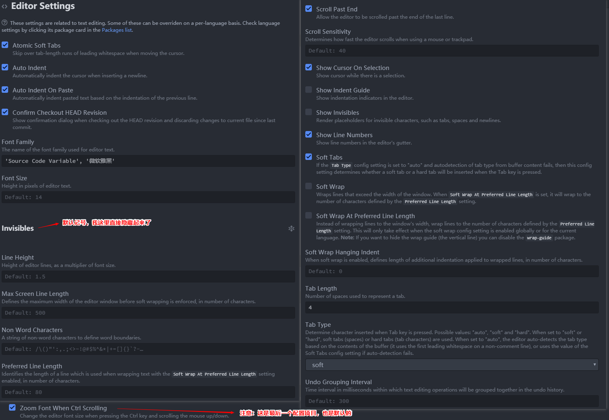

<!--
+===============================================================================
| @Author: madnesslin(地上马)
+===============================================================================
| @Phone: +86 13695746767
+===============================================================================
| @Date: 2018-12-29 09:52:35
+===============================================================================
| @Email: linjialiang@163.com
+===============================================================================
| @Last modified time: 2018-12-29 15:51:56
+===============================================================================
-->

# <center>《PHP 开发者眼中的 ATOM》</center>

> `Atom` 是一款现代化的编辑器，写这篇文章只是我个人喜欢用而已，它还有很多问题需要解决：
> 1\. 用户群体如今已经被 `vscode` 完全超越，
> 2\. 普通人群会选择 `vscode` 因为它功能很足，并且流畅，但个人认为： `vscode` 细节方面做的并不出色
> 3\. `atom` 虽然有很多弊端，但是当你熟悉了这款编辑器以后，就会发现它很强大，并且能为我们节省很多时间，最重要的是：它很优雅！

## atom 推荐字体

> - 中英文对齐： `Ubuntu Mono, 微软雅黑` (size=>14)
> - 美观度最佳： `hack, 微软雅黑` (size=>14)

## atom 基本配置

> atom 核心和内置插件需要进行一些简单配置，这样会更加优秀：

| 序号                      | 打开 settings 方式    |
| ------------------------- | --------------------- |
| 快捷键开启方式            | `ctrl-,`              |
| `ctrl-shift-p` 开启方式： | `settings view: open` |

| 文件                | 作用描述                         |
| ------------------- | -------------------------------- |
| `.atom\config.cson` | 用户及插件配置信息都会在这里记录 |
| `.atom\keymap.cson` | 所有自定义快捷键都会在这里记录   |
| `.atom\styles.less` | 所有自定义样式都会在这里记录     |

1.  核心配置

    > `ctrl-shift-p` 开启方式：`settings view: core`

    

2.  编辑器配置

    > `ctrl-shift-p` 开启方式：`settings view: editor`

    

3.  URI handling 配置

    

4.  系统配置

    > `ctrl-shift-p` 开启方式：`settings view: system`

    

5.  内置插件配置

    > 1.  `line-ending-selector` 插件将默认换行符修改成 `LF`
    > 2.  `autosave` 插件开启自动保存
    > 3.  `markdown-preview` 插件禁用掉

    

6.  内置主题 UI `One Dark` `One Light`

    

## atom 扩展主题

| atom 扩展主题(6)           | 主题说明             |
| -------------------------- | -------------------- |
| `atom-eclipse-syntax`      | 亮系主题             |
| `monokai`                  | 支持各大编辑器的主题 |
| `nord-atom-syntax`         | 暗系主题             |
| ~~`atom-material-syntax`~~ | ~~最高下载量主题~~   |
| ~~`city-lights-syntax`~~   | ~~代码样式 5~~       |
| ~~`dracula-syntax`~~       | ~~代码样式 6~~       |

## atom 扩展插件

| 实用插件(15)                     | 插件说明                 |
| -------------------------------- | ------------------------ |
| `atom-beautify`                  | 格式化源代码             |
| `docblockr`                      | 用于注释                 |
| `Sublime-Style-Column-Selection` | 复制任意区域             |
| `sync-settings`                  | atom 配置同步插件        |
| `highlight-selected`             | 选择高亮                 |
| `split-diff`                     | 文件对比插件             |
| `regex-railroad-diagram`         | 正则表达式图形界面       |
| `project-manager`                | 项目管理                 |
| ~~`intentions`~~                 | ~~用于显示意图的基础包~~ |
| `platformio-ide-terminal`        | atom 下出色的终端        |
| `markdown-preview-enhanced`      | markdown 预览            |
| `autocomplete-paths`             | 路径自动补全             |
| `remote-ftp`                     | atom 下好用的 ftp 插件   |
| `file-header`                    | 文件头信息               |
| `advanced-open-file`             | 快速打开文件             |

| git 相关插件(4)        | 插件说明                                   |
| ---------------------- | ------------------------------------------ |
| `git-plus`             | 增强 git 功能                              |
| `git-time-machine`     | 近期提交的时间列表，并支持与当前内容做对比 |
| `merge-conflicts`      | 优秀的 git 合并视图                        |
| `tree-view-git-status` | git 相关                                   |

| minimap 相关插件(8)          | 插件说明                |
| ---------------------------- | ----------------------- |
| `minimap`                    | 代码小窗口              |
| `minimap-bookmarks`          | 代码小窗口-书签高亮     |
| `minimap-cursorline`         | 代码小窗口-当前行高亮   |
| `minimap-find-and-replace`   | 代码小窗口-搜索高亮     |
| `minimap-git-diff`           | 代码小窗口-git 对比高亮 |
| `minimap-highlight-selected` | 代码小窗口-选择高亮     |
| `minimap-selection`          | 代码小窗口-选择块高亮   |
| `minimap-split-diff`         | 代码小窗口-对比高亮     |

| ide 相关插件(3)        | 插件说明                     |
| ---------------------- | ---------------------------- |
| `atom-ide-ui`          | atom 的 ide 基础包           |
| ~~`php-ide-serenata`~~ | ~~优秀的 php 的 ide 插件包~~ |
| `ide-typescript`       | js 和 tyjs 的 ide 插件包     |
| `ide-php`              | php 的 ide 插件包            |

| 符号对齐相关插件(4)  | 插件说明       |
| -------------------- | -------------- |
| `aligner`            | 符号对齐基础包 |
| `aligner-css`        | css 对齐       |
| `aligner-javascript` | js 对齐        |
| `aligner-php`        | php 对齐       |

| 语法相关插件(2)   | 插件说明                |
| ----------------- | ----------------------- |
| `language-apache` | apache 配置文件语法高亮 |
| `language-ini`    | ini 扩展文件语法高亮    |

| 界面优化插件(2) | 插件说明 |
| --------------- | -------- |
| `atom-clock`    | 时钟     |
| `file-icons`    | 文件图标 |

| html 相关插件(10)              | 插件说明                        |
| ------------------------------ | ------------------------------- |
| `atom-html-preview`            | atom 内嵌浏览器                 |
| `autoprefixer`                 | css3 后缀自动完成               |
| `open-in-browser`              | html 页面从默认浏览器打开       |
| `color-picker`                 | 颜色选择                        |
| ~~`autoclose-html`~~           | ~~html 结束自动关闭~~           |
| `double-tag`                   | html 开始和结束标签同步修改     |
| `tag`                          | `</ & cmd-alt-.` 自动闭合标签   |
| ~~`emmet`~~                    | ~~前端神器~~                    |
| `svg-preview`                  | svg 预览                        |
| `pigments`                     | css 下显示真实颜色              |
| ~~`atom-autocomplete-caomei`~~ | ~~🍓 字体库代码片段和图标预览~~ |

| vim 相关插件(3)    | 插件说明                   |
| ------------------ | -------------------------- |
| `vim-mode-plus`    | vim 插件基础包             |
| `relative-numbers` | vim 普通模式下显示先对行号 |
| `ex-mode`          | atom 下的 ex 单行编辑器    |

## 终端下对 `atom` 插件管理

| 说明     | 指令                                             |
| -------- | ------------------------------------------------ |
| 安装插件 | `apm install package1 [package2 package3 ...]`   |
| 卸载插件 | `apm uninstall package1 [package2 package3 ...]` |
| 移除插件 | `apm remove package1 [package2 package3 ...]`    |
| 禁用插件 | `apm disable package1 [package2 package3 ...]`   |
| 启用插件 | `apm enable package1 [package2 package3 ...]`    |

## 扩展插件配置说明

> 一些插件需要我们进一步说明

### `sync-settings` 同步插件

> 这是 atom 配置同步插件配置也很简单，填入正确的 token 跟 gistid 即可

| 命令                         | 说明                                                                       |
| ---------------------------- | -------------------------------------------------------------------------- |
| `sync-settings:backup`       | 这条命令是备份当前的配置                                                   |
| `sync-settings:restore`      | 这条命令是回复配置,是直接覆盖的;                                           |
| `sync-settings:view-backup`  | 这条是当你执行备份后到线上查询你的备份的,也就是到你的 `gist code` 里的内容 |
| `sync-settings:check-backup` | 这条是查询最后一次是否正常                                                 |

1.  配置

    

2.  快捷键

    

3.  新增同步文件

    

### `atom-beautify` 配置说明

> `atom-beautify` 有些语言的格式化需要依赖与其它工具，遇到问题可以查看插件说明

1.  增加 php 格式化支持文件 `php-cs-fixer-v2.phar`


### `atom-ide-ui` 关闭几个没必要的功能

> `atom-ide-ui` 几个并不好用的功能建议关闭：

| 功能     | 缺陷描述                          |
| -------- | --------------------------------- |
| 断点调式 | php 暂时没有好用断电调式插件      |
| 格式化   | `atom-beautify` 格式化神器在手    |
| 终端     | 被 `platformio-ide-terminal` 完虐 |

> 关闭方式


### `markdown-preview-enhanced` 更改样式

> 直接贴图：


### ~~`php-ide-serenata` 配置说明（我最终选择了 `ide-php`）~~

> `php-ide-serenata` 插件比官方推荐的 `php-ide` 更加优秀，当然配置也相对复杂一些

| 排序 | 依赖插件（3）     |
| ---- | ----------------- |
| 1    | `atom-ide-ui`     |
| 2    | `intentions`      |
| 3    | `project-manager` |

| 对 php 的要求             | 说明                                   |
| ------------------------- | -------------------------------------- |
| `php版本`                 | 7.1 及以上                             |
| `php.ini`(必须开启)       | `mbstring` `openssl` `pdo_sqlite` 扩展 |
| `php.ini`(下载服务时开启) | `curl` `xml` 扩展                      |

> 刚刚下载好插件会有一个提示，如果 server 没有创建成功也会有这个提示：


> 点击 `open package settings` 按钮进入配置界面（如果没有特别要求就不需要配置）


> 接着点击 `Ready, install the server` 下载服务（下载成功和失败都会有提示）


> 下载服务报错信息


> 开启索引方法一：可以通过菜单栏项目进行相关索引


> 开启索引方法二：`ctrl-shift-p` 下执行 `php ide serenata: set up current project` 命令


> 最后注意用 `project-manager` 保存项目！

```Shell
ctrl-shift-p
project manager: save project
```

### `platformio-ide-terminal` 配置说明

> windows 下 `platformio-ide-terminal` 可以将终端设置成 git 下的 sh.exe
>
> - 建议：可以考虑使用 `Cmder` 来替代，虽然会开独立的终端窗口，但是非常好用

1.  在 Settings 中找到 Platformio-ide-terminal 插件，进入设置选项
2.  找到 Shell Override 设置选项，将其设置为 `C:\Program Files\Git\Bin\sh.exe` （实际根据 Git 的安装位置可能有所不同，以上为 Git 安装的默认路径）
3.  找到 Shell Arguments ，将其设置为 --login

### `atom-beautify` 之 php 格式化配置

> php 格式化需要 `php-cs-fixer-v2.phar` 支持，我们为它制定正确路径即可


### `file-header` 自定义头信息模板

> `file-header` 文件可以自定义头信息模板，操作如下：


> 在 `settings` 界面指定自定义模板所在位置：

| 信息                     | 说明                                 |
| ------------------------ | ------------------------------------ |
| `templates` 目录         | 目录下面存放头信息模板               |
| `lang-mapping.json` 文件 | 将不同的文件类型指向特定的头信息模板 |
| `头信息文件格式`         | `.tmpl`                              |

> `lang-mapping.json` 文件写法案例（注意：最后一组语句后面是不能带上逗号的）：

```json
{
  "source.css": "emad_css.tmpl",
  "source.js": "emad_lang.tmpl",
  "source.sql": "emad_sql.tmpl",
  "source.gfm": "emad_html.tmpl",
  "text.html.basic": "emad_html.tmpl",
  "text.html.php": "emad_lang.tmpl",
  "text.plain": "emad_default.tmpl",
  "text.plain.null-grammar": "emad_default.tmpl"
}
```

> 头信息模板写法案例：（见源文件）

## 快捷键说明

> 下面快捷键是比较实用，但容易被我们忽略的：

| 全局快捷键 | 功能                                 |
| ---------- | ------------------------------------ |
| `C-k C-b`  | 显示或隐藏目录树                     |
| `C-斜杠`   | 显示或隐藏目录树                     |
| `M-斜杠`   | 显示目录树，光标在页面和目录树将切换 |
| `C-S-斜杠` | 显示目录树，并定位到当前页面所在位置 |

| 目录树的快捷键 | 功能                                               |
| -------------- | -------------------------------------------------- |
| `a`            | 新建文件                                           |
| `S-a`          | 新建目录                                           |
| `d`            | 拷贝文件或目录到指定位置                           |
| `i`            | 显示或隐藏版本控制控制忽略的文件（如：.gitignore） |
| `h j k l`      | 目录树支持 vim 按键方式                            |

| 大小写快捷键 | 功能           |
| ------------ | -------------- |
| `C-k C-u`    | 使当前字符大写 |
| `C-k C-l`    | 使当前字符小写 |

| 文本编辑快捷键 | 功能                                       |
| -------------- | ------------------------------------------ |
| `C-j`          | 将下一行与当前行合并                       |
| `C-up`         | 当前行向上                                 |
| `C-down`       | 当前行向下移动                             |
| `C-S-d`        | 复制当前行到下一行                         |
| `C-d`          | 选取当前单词或文档中和当前单词相同的下一处 |
| `C-S-u`        | 调出切换编码选项                           |
| `C-f`          | 在文件中查找                               |
| `C-l`          | 选取当前行                                 |
| `C-S-k`        | 删除当前行                                 |
| `C-x`          | 剪切当前行，或剪切选中内容                 |
| `C-S-f`        | 在整个项目中查找                           |
| `C-S-l`        | 选择文本类型（高亮和补全）                 |
| `ctrl-shift-M` | Markdown 预览                              |
| `C-Backspace`  | 删除光标所在单词左边字符                   |
| `C-Delete`     | 删除光标所在单词右边字符                   |
| `C-left`       | 移动光标到所在单词的最左端                 |
| `C-right`      | 移动光标到所在单词的最右端                 |
| `C-鼠标左键`   | 增加光标，容易被插件快捷键覆盖             |
| `C-S-鼠标左键` | 增加光标                                   |

| git 快捷键 | 功能            |
| ---------- | --------------- |
| `C-S-9`    | git 操作界面    |
| `C-S-8`    | github 操作界面 |

| 书签快捷键 | 功能                               |
| ---------- | ---------------------------------- |
| `C-M-f2`   | 添加或移除书签（当前行）           |
| `C-S-f2`   | 移除所有书签（当前页面）           |
| `f2`       | 下一个书签（当前页面）             |
| `S-f2`     | 上一个书签（当前页面）             |
| `C-f2`     | 调出书签列表（所有打开文件的书签） |

| 插件快捷键   | 功能                                               |
| ------------ | -------------------------------------------------- |
| `C-M-k`      | 选取颜色（自己设置的）                             |
| `C-M-b`      | 格式化                                             |
| `M-t`        | 展示版本库提交的时间列表，支持跟指定的版本库做对比 |
| `C-M-t`      | 文件对比，支持与最近提交的版本库做对比             |
| `M-鼠标左键` | 选取多行的中间部分内容                             |

### 新增的几个快捷键

> 增加了 `ctrl-k` `ctrl-j` ，在 `代码片段提示` 和 `命令窗口` 上下移动

```shell
# When autocomplete plus pop-up active in insert-mode
'atom-text-editor.vim-mode-plus.insert-mode.autocomplete-active':
  'ctrl-k': 'core:move-up'
  'ctrl-j': 'core:move-down'

# In select-list such like fuzzy-finder
'.select-list atom-text-editor':
  'ctrl-k': 'core:move-up'
  'ctrl-j': 'core:move-down'
```

> `Ctrl-Shift-p` 下面有大量的指令，这些指令将会大大提升我们的工作效力！

## `.apmrc` 配置

> `.apmrc` 文件用来让 `atom` 支持终端代理
>
> - `.apmrc` 文件路径： `.atom\.apmrc`

```shell
strict-ssl = false
http-proxy = http://127.0.0.1:1080
https-proxy = http://127.0.0.1:1080
```

---

## 开始创建 atom 包

> 写 atom 包是比较容易的:
> \- 最低要求：熟悉 css 和 javascript
> \- 建议满足：熟悉 less 和 coffeescript

1.  使用 `Package Generator` 包来创建新包

> 创建一个 package 最简单的方式就是使用 atom 里自带的生成器，使用命令面板 `ctrl-shift-p` :

| 面板命令                                       | 描述           |
| ---------------------------------------------- | -------------- |
| `Package Generator: Generate Package`          | 创建一个新包   |
| `Package Generator: Generate Syntax Theme`     | 创建一个新主题 |
| `Package Generator: Generate Language Package` | 创建一个语言包 |

> 选择以后，atom 会让你输入这个新包名和指定的路径，
>
> - 并且这个路径会被 atom 映射到包目录中，这样我们修改了插件内容，本机上的 atom 就会立马生效！

---

## 如何发布 atom 包

> atom 包发布也是比较容易的，不过有几点需要注意的：

1.  API 授权问题

> 终端下输入 `apm login` 用于 API 授权，也可以更换授权码

```shell
apm login
```


2.  `apm publish <version-type>` 发布插件指令

> atom 包可以使用 apm 发布，通过提升版本并发布插件！

| version-type | 版本类型描述 | 发布案例 | git 标签案例 |
| ------------ | ------------ | -------- | ------------ |
| major        | 主版本提升 1 | 1.0.0    | v1.0.0       |
| minor        | 此版本提升 1 | 0.1.0    | v0.1.0       |
| patch        | 小版本提升 1 | 0.0.1    | v0.0.1       |

> 更多内容可以通过 `apm help <command>` 指令查看所有帮助说明

3.  版本发布的一些建议：

| 版本类型 | 兼容性         | 例子                     |
| -------- | -------------- | ------------------------ |
| major    | 不兼容之前版本 | 更改默认值或删除功能     |
| minor    | 兼容之前版本   | 添加新功能或添加选项     |
| patch    | 兼容之前版本   | 包配置不变，仅仅做了优化 |
