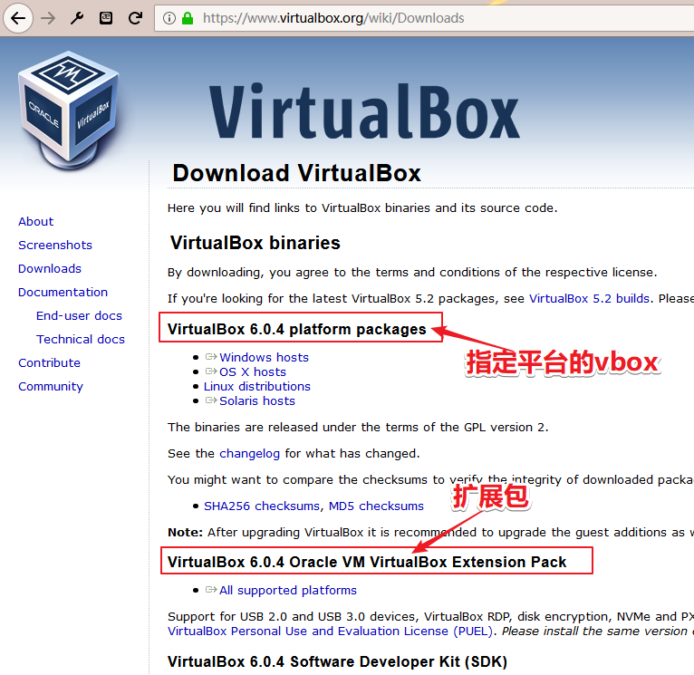
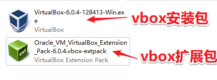

<!--
+===============================================================================
| @Author: madnesslin(地上马)
+===============================================================================
| @Phone: +86 13695746767
+===============================================================================
| @Date: 2019-02-23 16:50:45
+===============================================================================
| @Email: linjialiang@163.com
+===============================================================================
| @Last modified time: 2019-02-25 16:31:49
+===============================================================================
-->

# 
《安装 vbox 虚拟机软件》

> vbox 是 `Oracle VM VirtualBox` 的简写，支持跨平台，号称最强的免费虚拟机软件!

## 安装vbox前

> 安装 vbox 前，我们需要做一些准备工作

| 序号 | 准备内容                                                                 |
| ---- | ------------------------------------------------------------------------ |
| 1    | [vbox 官网](https://www.virtualbox.org/)                                 |
| 2    | 下载[指定平台的最新版本 vbox](https://www.virtualbox.org/wiki/Downloads) |
| 3    | 下载[最新版扩展包](https://www.virtualbox.org/wiki/Downloads)            |

## 安装vbox

> 我这里使用的win10系统所以选择windows版本，扩展包的各版本公用的

### 安装vbox安装包

> vbox安装包，windows下安装很简单，双击 `VirtualBox-6.0.4-128413-Win.exe` 后一路下一步即可！
