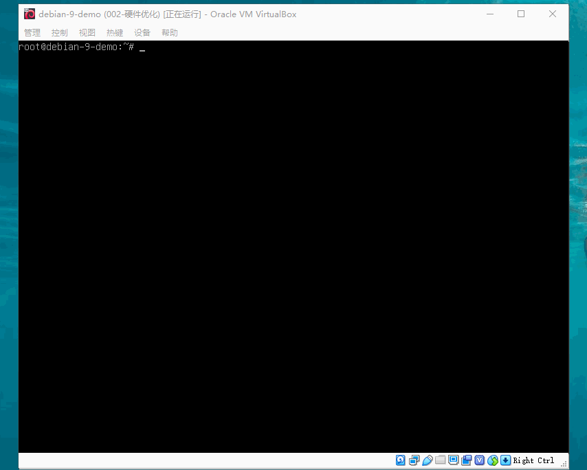

# 虚拟机

> 现在还未涉及到容器，我们就先拿对初学者更易操作虚拟机来充当服务器。

## 下载 VirtualBox

> 我们简称它为 vbox，安装 vbox 需要下载安装包和扩展包，地址如下：

| 必备下载                                                                                                               |
| ---------------------------------------------------------------------------------------------------------------------- |
| [vbox 安装包](https://download.virtualbox.org/virtualbox/6.0.8/VirtualBox-6.0.8-130520-Win.exe)                        |
| [vbox 扩展包](https://download.virtualbox.org/virtualbox/6.0.8/Oracle_VM_VirtualBox_Extension_Pack-6.0.8.vbox-extpack) |

> 下载最新版本地址：https://download.virtualbox.org/

1. 安装 vbox 安装包

   > Windows 下安装 vbox 非常简单，双击安装包，然后一直 `下一步` 即可！

2. 安装 vbox 扩展包

   > Windows 下安装扩展包也非常简单：

   ```text
   - 运行 vbox 程序；
   - 点击菜单：管理 > 全局设定 > 扩展
   - 扩展界面：点击右侧的+符号 > 选中安装包 > 安装 > 我同意
   - 如此即可安装成功
   ```

## 虚拟网络

> vbox 这个虚拟机软件支持 6 种虚拟网络：

| 序号 | vbox 中文界面         | vbox 英文界面     | vbox 官方手册                       |
| ---- | --------------------- | ----------------- | ----------------------------------- |
| 01   | 网络地址转换模式(NAT) | NAT               | Network Address Translation (NAT)   |
| 02   | NAT 网络              | NAT Network       | Network Address Translation Service |
| 03   | 桥接网卡              | Bridged Adapter   | Bridged networking                  |
| 04   | 内部网络              | Internal Network  | Internal networking                 |
| 05   | 仅主机(Host-Only)网络 | Host-only Adapter | Host-only networking                |
| 06   | 通用驱动              | Generic Driver    | Generic networking                  |

> vbox 重要虚拟网络模式的联网状态：

| 网络通信方向     | NAT      | NAT 网络 | 桥接 | Internal | Host-only |
| ---------------- | -------- | -------- | ---- | -------- | --------- |
| 虚拟电脑 → 宿主  | 成功     | 成功     | 成功 | 失败     | 成功      |
| 虚拟电脑 ← 宿主  | 端口转发 | 端口转发 | 成功 | 失败     | 成功      |
| 虚拟电脑相互之间 | 失败     | 成功     | 成功 | 成功     | 成功      |
| 虚拟电脑 → 外网  | 成功     | 成功     | 成功 | 失败     | 网络共享  |
| 虚拟电脑 ← 外网  | 端口转发 | 端口转发 | 成功 | 失败     | 失败      |

> 提示：vbox 主要用于开发测试，在有网络的情况下，我们就直接使用桥接模式即可，不必考虑安全性问题！

## 一、NAT 模式

> `网络地址转换模式(NAT)` 是从虚拟机访问外部网络的最简单方法。通常它不需要主机网络和虚拟机上配置什么东西。出于这个原因，它是 vbox 中默认的虚拟网络模式。


> 检测 NAT 虚拟网络模式下 虚拟电脑能否链接宿主机和外网（测试成功）


### NAT 模式之端口转发

> `网络地址转换模式(NAT)` 通常只允许前面 2 种通信关系，通过 `端口转发` 还能支持另外 2 种通信关系！


> 仅让宿主机访问“虚拟电脑特定端口”的转发规则


> 允许所有局域网（外网）访问“虚拟电脑特定端口”的转发规则


> - 提示：如上图所示，设置了 `局域网访问ssh` 规则后，`宿主机访问ssh` 规则其实可以不设置！
> - 注意：不管是局域网、宿主机、虚拟电脑在链接上之前，都有一个前提，就是防火墙要开发端口！

## 二、NAT 网络模式

> `NAT网络` 模式又称为 `网络地址转换服务` 模式，功能是多一个虚拟电脑之间的互通
>
> - 相对应的也增加了一些要求：需要 vbox 虚拟的 `NAT网络`支持


> 配置 vbox 虚拟网卡的方法


> 在 vbox 全局配置了 `NAT网络` 以后这个网络就能正常了


> 当我们为两个虚拟电脑设置同一个 `NAT网络界面` 时，它们会是同一网段，不同 ip


> 两个虚拟电脑通过 ssh 客户端，相互远程链接：


> `NAT网络模式` 除了多了虚拟电脑间的互通外，其他与 `NAT模式` 基本一致！但是转发规则需要在全局设置的 `网络` 界面设置。

### NAT 网络模式之端口转发

> `NAT网络模式` 的端口转发原理我们用下面的表来描述：

| 虚拟电脑         | vm-001                   | vm-002                   | vm-003                   |
| ---------------- | ------------------------ | ------------------------ | ------------------------ |
| NAT 网络界面名称 | group                    | group                    | other                    |
| 虚拟电脑网络互通 | 与 vm-002 互通           | 与 vm-001 互通           | 没有互通的虚拟电脑       |
| 宿主->虚拟电脑   | group 网络下设置转发规则 | group 网络下设置转发规则 | other 网络下设置转发规则 |
| 局域网->虚拟电脑 | group 网络下设置转发规则 | group 网络下设置转发规则 | other 网络下设置转发规则 |

> 1 个 `NAT网络` 配置多个虚拟主机的转发规则


> 本机连接 `NAT网络模式` 下的多台虚拟机（局域网连接见`NAT模式`）


> 除了这些以外，`NAT网络模式` 与 `NAT模式` 基本一致，这里就不讲解了！

## 三、桥接模式

> 桥接全程靠宿主机是否联网，宿主机有网络全部互通，宿主机没有网络全部拒绝



## 四、Internal 模式

> `Internal模式` 中文也叫 `内网模式` ，实现方式与桥接相似，但是功能相差很大
>
> - 仅能虚拟电脑间互通
> - 安全性比桥接高


## 五、Host-only 模式

> `Host-only网络模式` 中文又叫做 `仅主机网络模式` ，事实上 Host-only 与官方说明略有不同：

| 主机模式通讯方向 | 通讯状态-官方 | 通讯状态-现实 |
| ---------------- | ------------- | ------------- |
| 虚拟电脑`->`宿主 | &#8730;       | &#8730;       |
| 虚拟电脑`<-`宿主 | &#8730;       | &#8730;       |
| 虚拟电脑之间     | &#8730;       | &#8730;       |
| 虚拟电脑`->`外网 | &#215;        | 通过网络共享  |
| 虚拟电脑`<-`外网 | &#215;        | &#215;        |

> Host-only 需要专们的 `虚拟网络适配器` 下面我们来操作一下：


> 虚拟电脑的必要的配置


> 虚拟电脑配置静态 ip 后就可以做到下表的通讯关系：

| 通讯方向         | 通讯状态 |
| ---------------- | -------- |
| 虚拟电脑`->`宿主 | &#215;   |
| 虚拟电脑`<-`宿主 | &#8730;  |
| 虚拟电脑之间     | &#8730;  |
| 虚拟电脑`->`外网 | &#215;   |
| 虚拟电脑`<-`外网 | &#215;   |

> 这个 gif 动画有点长，耐心看完吧!


> 虚拟电脑使用动态 ip 也能实现上面的通讯状态，配置如下(动画很长)：


### Host-only 模式共享网络

> 通过共享网络我们可以实现更多的通讯关系，具体如下表：

| 通讯方向         | 通讯状态 |
| ---------------- | -------- |
| 虚拟电脑`->`宿主 | &#8730;  |
| 虚拟电脑`<-`宿主 | &#8730;  |
| 虚拟电脑之间     | &#8730;  |
| 虚拟电脑`->`外网 | &#8730;  |
| 虚拟电脑`<-`外网 | &#215;   |

> 共享网络状态下，建议将虚拟电脑设置成静态 ip


## 六、通用驱动模式

> 这个模式有些高级了，像 vbox 这种主要应用于测试的虚拟电脑模式是用不到。

## 网络模式选择

> 通常我们用 vbox 是做一些模式的，更多的是学习与开发环境使用，因此：
>
> - 两个 `NAT` 都需要通过一对一的端口转发，除非我们研究方向与端口相关，一般不会使用；
> - `Internal` 模式，仅仅只有虚拟电脑之间互通，没有什么特殊必要这个可以直接排除使用；
> - `桥接` 模式，这个模式基本上不需要怎么设置就能全通，但要保证宿主机可以上网，新手可以用用；
> - `仅主机模式`，这个模式基本满足我们的要求，唯一不能满足的就是局域网到虚拟电脑间的通信有问题；

| 网络模式 | NAT    | NAT 网络 | 桥接    | Internal | Host-only |
| -------- | ------ | -------- | ------- | -------- | --------- |
| 是否选择 | &#215; | &#215;   | &#8730; | &#215;   | &#8730;   |

> 到此 vbox 的网络模式讲解完毕，具体该选择哪种模式还是要看项目本身需求而定的，接下来就看大家实践了
