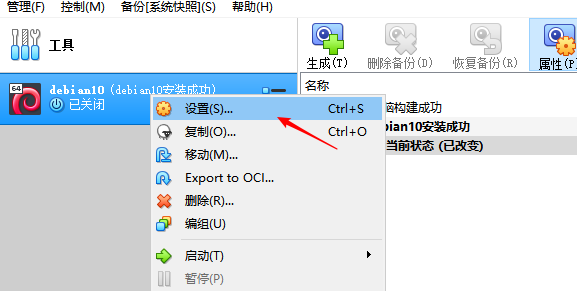
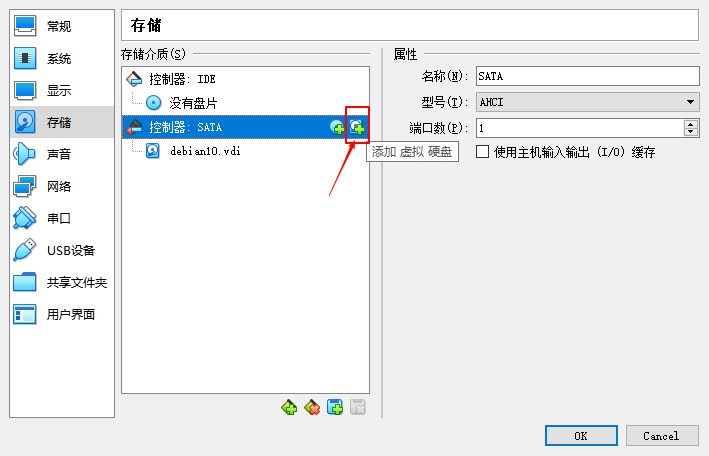
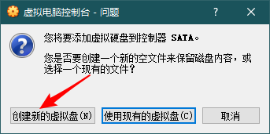
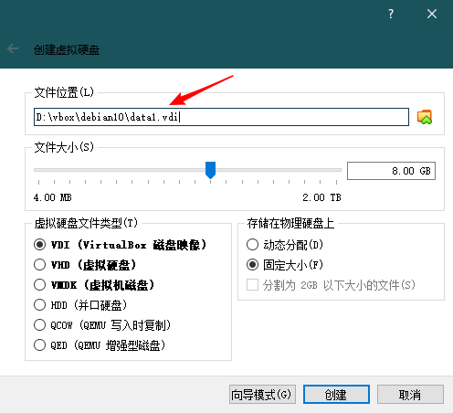
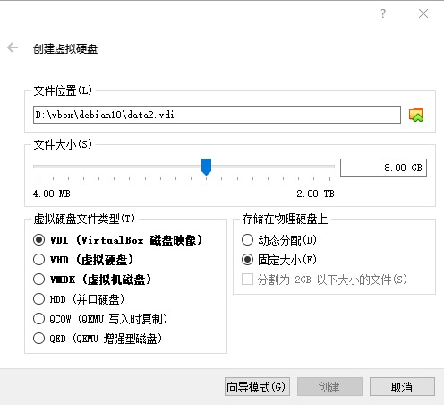

# 磁盘挂载

> 运维人员为服务器增加磁盘是经常遇到的，我们这里称这种行为叫做挂载！

## 安装磁盘

> 挂载磁盘前，我们必须要为服务器增加物理磁盘，vbox 也需要增加虚拟磁盘。

| 确保服务器已经关闭                                        | 进入虚拟电脑设置界面                                          |
| --------------------------------------------------------- | ------------------------------------------------------------- |
|  |  |

| 选中设置界面的存储选项                                    | 创建新的虚拟盘                                    |
| --------------------------------------------------------- | ------------------------------------------------- |
|  |  |

| 虚拟盘 1                            | 虚拟盘 2                            |
| ----------------------------------- | ----------------------------------- |
|  |  |

## 磁盘挂载必备知识

> 挂载磁盘前，下表的概念需要先记住：

| 命令          | 格式                                                 | 作用                    |
| ------------- | ---------------------------------------------------- | ----------------------- |
| fdisk         | fdisk /dev/sdb                                       | 物理硬盘--分出逻辑硬盘  |
| pvcreate      | pvcrate /dev/sdb1                                    | 对物理卷进行初始化      |
| vgcreate      | vgcreate lsvg /dev/sdb1                              | 物理卷--并成卷组        |
| lvcreate      | lvcreate -L 10G -n lslvm lsvg                        | 卷组--分出逻辑卷        |
| mkfs.ext4     | mkfs.ext4 /dev/mapper/lsvg-lslvm                     | 格式化逻辑卷            |
| mount         | mount /dev/mapper/lsvg-lslvm /your/point             | 挂载逻缉卷              |
| vi /etc/fstab | /dev/mapper/lsvg-lslvm /your/point ext4 defaults 0 0 | 写入开机挂载文件        |
| umount        | umount /your/point                                   | 卸载新挂载磁盘          |
| mount         | mount -a                                             | 测试 fstab 书写是否有误 |

### 逻辑卷管理

> Debian10 使用 LVM2 工具执行卷的构建和管理、建立备份快照等各种功能

1. 安装 lvm2 及其依赖

   > Debian10 默认并没有安装 lvm2，需要我们自行安装

   ```shell
   $ apt install lvm2
   ```

2. LVM 的结构

   > LVM 被组织为三种元素：

   | 卷（Volume）         | 区段（Extent）     | 设备映射器（Device mapper） |
   | -------------------- | ------------------ | --------------------------- |
   | 物理卷、逻辑卷和卷组 | 物理区段和逻辑区段 | Linux 内核模块              |

3. 卷

   > Linux LVM 由物理卷（PV）、卷组（VG）和逻辑卷（LV）组成。

   ```text
   - 物理卷:是物理磁盘或物理磁盘分区（比如，/dev/sdb 或 /dev/sdb1）；
   - 卷组：是物理卷的集合；
   - 逻辑卷:卷组可以在逻辑上划分成多个逻辑卷。
   ```

4. 区段

   > 区段是卷管理中最小单元，类似于磁盘分区中的扇区大小，不可再分。

   ```text
   - 为了实现物理卷到逻辑卷的映射，PV 和 VG 的基本块必须具有相同的大小；
        - 即：物理区段（PE）= 逻辑区段（LE）
   - 这些基本块称为物理区段（PE）和逻辑区段（LE）；
   - 尽管 n 个物理卷映射到 m 个逻辑卷，但是 物理区段（PE） 和 逻辑区段（LE） 总是一对一映射的。
   ```

   > 关于区段大小的说明

   ```text
   - 在使用 LVM2 时，对于每个 PV/LV 的最大区段数量并没有限制。
   - 默认的区段大小是 4MB，对于大多数配置不需要修改这个设置，因为区段的大小并不影响 I/O 性能。
   - 但是，区段数量太多会降低 LVM 工具的效率，所以可以使用比较大的区段，从而降低区段数量。
   - 注意：在一个 VG 中不能混用不同的区段大小，而且用 LVM 修改区段大小是一种不安全的操作，会破坏数据。
   - 建议：在初始设置时选择一个区段大小，以后不再修改。
   ```

   > 不同的区段大小意味着不同的 VG 粒度。例如，如果选择的区段大小是 4GB，那么只能以 4GB 的整数倍缩小或扩展 LV。

5. 设备映射器

   > 设备映射器（也称为 dm_mod）是一个 Linux 内核模块，它的作用是对设备进行映射 —— LVM2 必须使用这个模块。

   - 在 Debian10 中设备映射器会被默认安装；

   - 如果没有启用这个模块，那么对 dm_mod 执行 modprobe 命令：

     ```shell
     $ modprobe dm_mod
     ```

   - 检测是否装载了这个模块

     ```shell
     $ lsmod | grep dm_mod
     ```

6. 启动 LVM2 的基本命令

   > 如果 LVM2 不能自动启动，挂载也差不多废了

   ```shell
   # 加载设备映射器模块
   modprobe dm_mod

   # 找到物理磁盘中的所有pv
   pvscan

   # 激活所有卷组
   vgchange -ay
   ```

## 操作要求

> 这里描述了本次具体实现的操作

```text
接下来我们需要操作：
    - 将 data1 和 data2 两个虚拟盘合并到一个逻辑卷中；
    - 将这个逻辑卷挂载到 /data 目录。
```

### 创建逻辑卷

> 将 /dev/sdb1 和 /dev/sdc1 转化成 `LVM 物理卷`

```shell
$ pvcreate /dev/sd{b,c}1
$ pvs
$ pvscan
$ pvdisplay
```

> 将 `物理卷 /dev/sd{b,c}1` 加入 `LVM卷组 vg_data`

```shell
$ vgcreate vg_data /dev/sd{b,c}1
$ vgs
$ vgscan
$ vgdisplay
$ pvdisplay
```

> 将 `物理卷（2个数据盘）` 的容量都给 `LVM逻辑卷 lv_data`

```shell
$ lvcreate -l 100%VG -n lv_data vg_data
$ lvs
$ lvscan
$ lvdisplay
```

### 格式化逻辑卷

> 速度慢，带 -c 会检测是否坏轨

```shell
$ mkfs -V -t ext4 -c /dev/vg_data/lv_data
```

> 速度快

```shell
$ mkfs -V -t ext4 /dev/vg_data/lv_data
```

### 挂载分区

> 创建 `/data` 这个挂载目录

```shell
$ mkdir /data
```

> 挂载 lvm 逻辑分区到指定目录

```shell
$ lvdisplay
$ mount /dev/vg_data/lv_data /data
$ df -Th
```

> 开机自动挂载

```shell
$ lvdisplay # 获取lv_data 的 LV Path
$ cp /etc/fstab{,.bak}
$ vi /etc/fstab
```

> 在 /etc/fstab 文件底部增加如下两行：

```conf
# /data was on /dev/vg_data/lv_data during installation
/dev/mapper/vg_data-lv_data /data       ext4    defaults        0       0
```

> 或者

```conf
# /data was on /dev/vg_data/lv_data during installation
/dev/vg_data/lv_data /data       ext4    defaults        0       0
```

### 卸载分区

```shell
$ umount /data
```

## 挂载普通分区

> 挂载普通分区非常简单，这里给大家一个思路

| 步骤         | 描述                          |
| ------------ | ----------------------------- |
| 磁盘分区     | 使用 fdisk 分区               |
| 格式化分区   | 将分区格式化成 ext4 格式      |
| 挂载         | 使用 mount 指令挂载到指定目录 |
| 卸载         | 使用 umount 指令将分区卸载    |
| 开启自动挂载 | 修改 `/etc/fstab` 文件        |

```shell
$ vi /etc/fstab
```

> 在 /etc/fstab 文件底部增加如下两行：

```conf
# /data was on /dev/sdb1 during installation
/dev/sdb1 /data       ext4    defaults        0       0
```

## LVM 逻辑卷管理命令

> LVM 逻辑卷管理一般涉及到 `fdisk` 、 `mkfs` 以及 `lvm2自带的指令`

### fdisk 指令

> fdisk 指令用于磁盘的分区操作，fdisk 没有什么好说的，就是分区操作，按照说明来就可以了！

### mkfs 指令

> mkfs 指令用于格式化分区

```text
【语法】
    mkfs [选项] [参数]
【选项】
    fs：指定建立文件系统时的参数；
    -t<文件系统类型>：指定要建立何种文件系统；
    -v：显示版本信息与详细的使用方法；
    -V：显示简要的使用方法；
    -c：在制做档案系统前，检查该partition是否有坏轨。
【参数】
    文件系统：指定要创建的文件系统对应的设备文件名；
    块数：指定文件系统的磁盘块数。
```

```shell
$ mkfs -V -t ext3 /dev/sdb1
$ mkfs -V -t ext4 /dev/vg_data/lv_data
```

### PV 指令

> PV 是处理物理卷的相关指令

1. 物理硬盘格式化为物理卷(PV):

```shell
$ pvcreate /dev/sd{b,c}1
```

2. 显示物理卷(PV)信息:

```shell
$ pvs
$ pvscan
$ pvdisplay
```

3. 删除物理卷(PV):

```shell
$ pvremove /dev/sd{b,c}1
```

### VG 指令

> VG 是处理 lvm 卷组的相关指令

1. 创建卷组(VG),并将物理卷(PV)加入到卷组中:

```shell
$ vgcreate vg_data /dev/sd{b,c}1
```

2. 将物理卷(PV)从指定卷组(VG)中移除(使用中的 PV 不能移除)：

```shell
$ vgreduce vg_data /dev/sdb1
```

3. 从卷组(VG)中移除缺失物理硬盘：

```shell
$ vgreduce --removemissing vg_data
```

4. 显示卷组(VG)信息：

```shell
$ vgs
$ vgscan
$ vgdisplay
```

5. 增加卷组(VG)空间：

```shell
$ vgextend vg_data /dev/sdd1
```

6. 删除卷组(VG):

```shell
$ vgremove vg_data
```

### LV 指令

> LV 是处理 lvm 逻辑卷的相关指令

1. 基于卷组(VG)创建逻辑卷(LV)

```text
【语法】
    lvcreate [选项] [参数]
【功能介绍】
    用于创建LVM的逻辑卷。
【主要参数】
    -L 指定逻辑卷大小，单位为“bBsSkKmMgGtTpPeE”字节
    -l 指定逻辑扩展数，单位“VG|FREE|ORIGIN”
    -n 后面跟逻辑卷名
    -s 创建快照
```

```shell
$ lvcreate -L 10G -n lv_001 vg_data
$ lvcreate -l 20%VG -n lv_002 vg_data
$ lvcreate -l 100%FREE -n lv_003 vg_data
```

2. 显示逻辑卷(LV)信息:

```shell
$ lvs
$ lvscan
$ lvdisplay
```

3. 删除逻辑卷(LV):

```shell
$ lvremove /dev/vg_data/lv_data
```

4. 激活修复后的逻辑卷(LV):

```shell
$ lvchange -ay /dev/vg_data/lv_data
```

5. 增加逻辑卷(LV)空间:

```shell
$ lvextend -L +3G /dev/vg_data/lv_data
```

### lvm 其它指令

1. 更新逻辑卷(LV):

```shell
$ resize2fs /dev/vg_data/lv_data
```

2. 检查逻辑卷(LV)文件系统:

```shell
$ e2fsck -f /dev/vg_data/lv_data
```

3. 减少逻辑卷(LV)空间:

```shell
$ resize2fs /dev/vg_data/lv_data 4G
$ lvreduce -L -1G /dev/vg_data/lv_data
```
