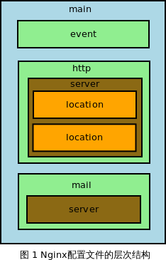

# Nginx 配置文件

> 下面以案例的形式来展示配置文件的具体配置方法

## 配置文件的结构

> nginx 由模块组成，这些模块由配置文件中指定的指令控制。



```text
- 指令分为简单指令和块指令。
- 一个简单的指令由名称和参数组成，用空格分隔，以分号（;）结尾。
- 块指令与简单指令具有相同的结构，但它不是以分号结尾，而是以大括号（{和}）包围的一组附加指令结束。
- 如果块指令在大括号内可以有其他指令，则称为上下文（示例： events， http， server和 location）。
```

> 提示：上下文，可以简单的理解成是普通指令的块指令，也就是当前指令所对应的模块（块指令就是来表示模块的）

1. 全局块(main)：配置影响 nginx 全局的指令。

   > 一般有运行 nginx 服务器的用户组，nginx 进程 pid 存放路径，日志存放路径，配置文件引入，允许生成 worker process 数等。

2. events 块：配置影响 nginx 服务器或与用户的网络连接。

   > 有每个进程的最大连接数，选取哪种事件驱动模型处理连接请求，是否允许同时接受多个网路连接，开启多个网络连接序列化等。

3. http 块：可以嵌套多个 server，配置代理，缓存，日志定义等绝大多数功能和第三方模块的配置。

   > 如文件引入，mime-type 定义，日志自定义，是否使用 sendfile 传输文件，连接超时时间，单连接请求数等。

4. server 块：配置虚拟主机的相关参数，一个 http 中可以有多个 server。

5. location 块：配置请求的路由，以及各种页面的处理情况。
