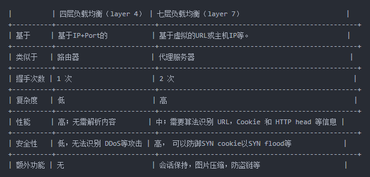

# Nginx 负载均衡

> 在常规运维工作中，经常会运用到负载均衡服务。负载均衡主要分为四层负载和七层负载，那么这两者之间有什么不同？

## 什么是负载均衡

> 负载均衡（Load Balance）建立在现有网络结构之上，它提供了一种廉价有效透明的方法扩展网络设备和服务器的带宽、增加吞吐量、加强网络数据处理能力、提高网络的灵活性和可用性。

```text
负载均衡有两方面的含义：
    - 首先，大量的并发访问或数据流量分担到多台节点设备上分别处理，减少用户等待响应的时间；
    - 其次，单个重负载的运算分担到多台节点设备上做并行处理，每个节点设备处理结束后，将结果汇总，返回给用户，系统处理能力得到大幅度提高。
```

> 简单来说就是：

```text
- 其一是将大量的并发处理转发给后端多个节点处理，减少工作响应时间；
- 其二是将单个繁重的工作转发给后端多个节点处理，处理完再返回给负载均衡中心，再返回给用户。
- 目前负载均衡技术大多数是用于提高诸如在 Web 服务器、FTP 服务器和其它关键任务服务器上的 Internet 服务器程序的可用性和可伸缩性。
```

## 负载均衡分类

- 二层负载均衡（mac）

  > 根据 OSI 模型分的二层负载，一般是用虚拟 mac 地址方式，外部对虚拟 MAC 地址请求，负载均衡接收后分配后端实际的 MAC 地址响应.

- 三层负载均衡（ip）

  > 一般采用虚拟 IP 地址方式，外部对虚拟的 ip 地址请求，负载均衡接收后分配后端实际的 IP 地址响应. (即一个 ip 对一个 ip 的转发, 端口全放开)

- 四层负载均衡（tcp）

  > 在三次负载均衡的基础上，即从第四层"传输层"开始, 使用"ip+port"接收请求，再转发到对应的机器。

- 七层负载均衡（http）
  > 从第七层"应用层"开始, 根据虚拟的 url 或 IP，主机名接收请求，再转向相应的处理服务器。

> 我们运维中最常见的四层和七层负载均衡，这里重点说下这两种负载均衡。

### 四层的负载均衡

> 四层的负载均衡就是基于 IP+端口的负载均衡：

```text
- 在三层负载均衡的基础上，通过发布三层的IP地址（VIP），然后加四层的端口号，来决定哪些流量需要做负载均衡;
- 对需要处理的流量进行NAT处理，转发至后台服务器，并记录下这个TCP或者UDP的流量是由哪台服务器处理的，后续这个连接的所有流量都同样转发到同一台服务器处理。
- 对应的负载均衡器称为四层交换机（L4 switch），主要分析IP层及TCP/UDP层，实现四层负载均衡。此种负载均衡器不理解应用协议（如HTTP/FTP/MySQL等等）。
```

> 实现四层负载均衡的软件有：

- F5：硬件负载均衡器，功能很好，但是成本很高。
- lvs：重量级的四层负载软件
- nginx：轻量级的四层负载软件，带缓存功能，正则表达式较灵活
- haproxy：模拟四层转发，较灵活

### 七层的负载均衡

> 七层的负载均衡就是基于虚拟的 URL 或主机 IP 的负载均衡：

```text
- 在四层负载均衡的基础上（没有四层是绝对不可能有七层的），再考虑应用层的特征：
    - 比如，同一个Web服务器的负载均衡，除了根据IP+80端口辨别是否需要处理的流量，还可根据七层的URL、浏览器类别、语言来决定是否要进行负载均衡。
    - 举个例子，如果你的Web服务器分成两组，一组是中文语言的，一组是英文语言的，那么七层负载均衡就可以当用户来访问你的域名时，自动辨别用户语言，然后选择对应的语言服务器组进行负载均衡处理。
- 对应的负载均衡器称为七层交换机（L7 switch），除了支持四层负载均衡以外，还有分析应用层的信息，如HTTP协议URI或Cookie信息，实现七层负载均衡。此种负载均衡器能理解应用协议。
```

> 实现七层负载均衡的软件有:

- haproxy：天生负载均衡技能，全面支持七层代理，会话保持，标记，路径转移；
- nginx：只在 http 协议和 mail 协议上功能比较好，性能与 haproxy 差不多；
- apache：功能较差
- Mysql proxy：功能尚可。

> 总的来说，一般是 lvs 做 4 层负载；nginx 做 7 层负载(也能通过 stream 模块做 4 层负载)；haproxy 比较灵活，4 层和 7 层负载均衡都能做

## 四层和七层负载均衡之间的区别

> 4 层和 7 层负载均衡的区别可以从`技术原理上` 和 `应用场景的需求上` 分析：

### 一、从技术原理上分析

```text
- 所谓四层负载均衡，也就是主要通过报文中的目标地址和端口，再加上负载均衡设备设置的服务器选择方式，决定最终选择的内部服务器。
- 所谓七层负载均衡，也称为“内容交换”，也就是主要通过报文中的真正有意义的应用层内容，再加上负载均衡设备设置的服务器选择方式，决定最终选择的内部服务器。
```

> 以常见的 TCP 为例:

```text
- 4层负载均衡：
    - 4层负载均衡设备在接收到第一个来自客户端的SYN 请求时，即通过上述方式选择一个最佳的服务器，并对报文中目标IP地址进行修改(改为后端服务器IP），直接转发给该服务器。
    - TCP的连接建立，即三次握手是客户端和服务器直接建立的，负载均衡设备只是起到一个类似路由器的转发动作。
    - 在某些部署情况下，为保证服务器回包可以正确返回给负载均衡设备，在转发报文的同时可能还会对报文原来的源地址进行修改。
- 7层负载均衡：
    - 7层负载均衡设备如果要根据真正的应用层内容再选择服务器，
        - 只能先代理最终的服务器和客户端建立连接(三次握手)后；
        - 才可能接受到客户端发送的真正应用层内容的报文；
        - 然后再根据该报文中的特定字段，再加上负载均衡设备设置的服务器选择方式，决定最终选择的内部服务器。
    - 负载均衡设备在这种情况下，更类似于一个代理服务器。
        - 负载均衡和前端的客户端以及后端的服务器会分别建立TCP连接。
        - 所以从这个技术原理上来看，七层负载均衡明显的对负载均衡设备的要求更高，处理七层的能力也必然会低于四层模式的部署方式。
- 总结：
四层负载均衡在中间传输层执行，它处理消息的传递，但不考虑消息的内容。
    - 例如TCP是网络上Hypertext Transfer Protocol（HTTP）流量的第四层协议。
    - 在这一过程中，4层负载均衡会将网络数据包转发到上游服务器，但不会检查数据包的内容，只能通过检查TCP流中的前几个包来做出有限的路由决策。
七层负载均衡不同于四层负载均衡，它在高级应用层上执行，会处理每个消息的实际内容。
    - HTTP是网络上网站流量的主要7层协议。
    - 七层负载均衡以比四层负载均衡更复杂的方式路由网络流量，尤其适用于基于TCP的流量（如HTTP）。
    - 七层负载均衡会终止网络流量并读取器中消息，它可以根据消息内容（如URL或cookie）做出负载均衡决策。
    - 随后，七层负载均衡与选定上有服务器建立新的TCP连接并将请求写入服务器。
```

> **简单来说，二者之间的区别：**

```text
-  七层负载均衡基本都是基于http协议的，适用于web服务器的负载均衡。（nginx）
-  四层负载均衡主要是基于tcp协议报文，可以做任何基于tcp/ip协议的软件的负载均衡。(haproxy、LVS)
-  两者主要区别在于利用的报文所在的层面是不同的，各有各的好处。
-  七层应用负载的好处，是使得整个网络更”智能化“。
    - 例如：访问一个网站的用户流量，可以通过七层的方式，
    - 将对图片类的请求转发到特定的图片服务器并可以使用缓存技术；
    - 将对文字类的请求可以转发到特定的文字服务器并可以使用压缩技术。
    - 当然这只是七层应用的一个小案例，从技术原理上，这种方式可以对客户端的请求和服务器的响应进行任意意义上的修改，极大的提升了应用系统在网络层的灵活性。
    - 很多在后台，例如Nginx或者Apache上部署的功能可以前移到负载均衡设备上，例如客户请求中的Header重写，服务器响应中的关键字过滤或者内容插入等功能。
- 四层负载均衡主要是较为灵活，可以作为多种软件的负载均衡器。
- 举个例子形象的说明：
    - 四层负载均衡就像银行的自助排号机，每一个达到银行的客户根据排号机的顺序，选择对应的窗口接受服务；
    - 而七层负载均衡像银行大堂经理，先确认客户需要办理的业务，再安排排号。
    - 这样办理理财、存取款等业务的客户，会根据银行内部资源得到统一协调处理，加快客户业务办理流程。
```



- 七层负载均衡的好处

  > 七层负载均衡比基于数据包的四层负载均衡更占 CPU，但很少会导致服务器性能下降。七层负载均衡可以让负载均衡器做出更明智的决策，并可以对内容进行优化和更改，如压缩、加密等等。七层负载均衡还可以利用 buffering 来卸载上游服务器的慢速连接，从而提高性能。

- 执行七层负载平衡的组件通常被称为反向代理服务器,七层负载均衡示例：

  ```text
  - 举个简单的例子，假设用户访问高流量网站，在会话期间，它可能会请求静态内容（例如图像或视频）、动态内容（例如新闻订阅源）或者交易信息（例如订单状态）等等。
  - 7 层负载平衡允许负载均衡器根据请求本身中的消息（如内容类型）来路由请求：
      - 也就是说，我们可以将对图像或视频的请求路由到存储它的服务器，并进行高度优化以提供多媒体内容；
      - 可以将诸如折扣价之类的交易信息请求路由到负责管理定价的应用服务器；
  - 借助 7 层负载平衡，网络和应用程序架构师可以创建高度优化的服务器基础架构或应用交付网络，在保障可靠性的同时进行有效扩展。
  ```

- 简单总结

  > 从上面的对比看来四层负载与七层负载最大的区别就是效率与功能的区别。四层负载架构设计比较简单，无需解析具体的消息内容，在网络吞吐量及处理能力上会相对比较高，而七层负载均衡的优势则体现在功能多，控制灵活强大。在具体业务架构设计时，使用七层负载或者四层负载还得根据具体的情况综合考虑。

- 负载均衡时的数据流都经过负载均衡器，如何解决负载均衡器成为瓶颈的问题？

  ```text
  通过修改 tcp 报文的源地址和目的地址，使从 web 服务器中返回的数据直接返回到客户端，这是七层负载均衡无法做到的，因为 tcp 三次握手建立在客户端与负载均衡服务器之间，http 协议基于 tcp 协议，建立好 tcp 链接后才传送 http 报文，收到 http 报文说明负载均衡器和客户端已经建立了 tcp 连接，而 web 服务器和客户端的 tcp 链接都没建立，怎么回传数据给客户端呢。以上的办法会出现问题：所有集群里的主机都是内网 ip，无法跟外界联系。
  ```

  > 解决方案 1：如果能买到那么多外网 Ip 地址来用，然后在 tcp 链接要建立时负载均衡给真正的 web 服务器，让客户端和服务器建立 tcp 链接

  > 解决方案 2：引用一句话：计算机所有的问题都可以通过建立一层虚拟层解决。

  ```text
  可以通过将所有服务器主机ip虚拟化成负载均衡服务器的ip，这样服务器集群的所有主机都可以访问外界网络，因为ip地址（网络层，三层）都是相同，所以只能通过第二层来分辨数据流向，修改数据链路层（二层）目的主机的MAC地址，使请求发到web服务器上，然后才真正建立起tcp连接，然后web服务器因为可以联网，所以可以直接返回数据给客户端
  ```

### 七层应用需要考虑的问题

- 是否真的必要。

  > 七层应用的确可以提高流量智能化，同时必不可免的带来设备配置复杂，负载均衡压力增高以及故障排查上的复杂性等问题。在设计系统时需要考虑四层七层同时应用的混杂情况。

- 是否真的可以提高安全性。

  > 例如 SYN Flood 攻击，七层模式的确将这些流量从服务器屏蔽，但负载均衡设备本身要有强大的抗 DDoS 能力，否则即使服务器正常而作为中枢调度的负载均衡设备故障也会导致整个应用的崩溃。

- 是否有足够的灵活度。
  > 七层应用的优势是可以让整个应用的流量智能化，但是负载均衡设备需要提供完善的七层功能，满足客户根据不同情况的基于应用的调度。最简单的一个考核就是能否取代后台 Nginx 或者 Apache 等服务器上的调度功能。能够提供一个七层应用开发接口的负载均衡设备，可以让客户根据需求任意设定功能，才真正有可能提供强大的灵活性和智能性。

### 总体对比

- 智能性

  > 七层负载均衡由于具备 OIS 七层的所有功能，所以在处理用户需求上能更加灵活，从理论上讲，七层模型能对用户的所有跟服务端的请求进行修改。例如对文件 header 添加信息，根据不同的文件类型进行分类转发。四层模型仅支持基于网络层的需求转发，不能修改用户请求的内容。

- 安全性

  > 七层负载均衡由于具有 OSI 模型的全部功能，能更容易抵御来自网络的攻击；四层模型从原理上讲，会直接将用户的请求转发给后端节点，无法直接抵御网络攻击。

- 复杂度

  > 四层模型一般比较简单的架构，容易管理，容易定位问题；七层模型架构比较复杂，通常也需要考虑结合四层模型的混用情况，出现问题定位比较复杂。

- 效率比
  > 四层模型基于更底层的设置，通常效率更高，但应用范围有限；七层模型需要更多的资源损耗，在理论上讲比四层模型有更强的功能，现在的实现更多是基于 http 应用。

```text
- 七层负载均衡控制应用层服务的内容，提供了一种对访问流量的高层控制方式，适合对HTTP服务器群的应用。
- 第七层负载均衡技术通过检查流经的HTTP报头，根据报头内的信息来执行负载均衡任务。

七层负载均衡优点表现在如下几个方面：
    1）通过对HTTP报头的检查，可以检测出HTTP400、500和600系列的错误信息，因而能透明地将连接请求重新定向到另一台服务器，避免应用层故障。
    2）可根据流经的数据类型（如判断数据包是图像文件、压缩文件或多媒体文件格式等），把数据流量引向相应内容的服务器来处理，增加系统性能。
    3）能根据连接请求的类型，如是普通文本、图象等静态文档请求，还是asp、cgi等的动态文档请求，把相应的请求引向相应的服务器来处理，提高系统的性能及安全性。

七层负载均衡缺点表现在如下几个方面：
    1）七层负载均衡受到其所支持的协议限制（一般只有HTTP），这样就限制了它应用的广泛性。
    2）七层负载均衡检查HTTP报头会占用大量的系统资源，势必会影响到系统的性能，在大量连接请求的情况下，负载均衡设备自身容易成为网络整体性能的瓶颈。
```

## 负载均衡策略

> 在实际应用中，我们可能不想仅仅是把客户端的服务请求平均地分配给内部服务器，而不管服务器是否宕机。

```text
- 通常我们想的是：
    - 使高配置的服务器比高配置的服务器能接受更多的服务请求；
    - 一台处理服务请求较少的服务器能分配到更多的服务请求；
    - 出现故障的服务器将不再接受服务请求直至故障恢复等等。
- 选择合适的负载均衡策略，使多个设备能很好的共同完成任务，消除或避免现有网络负载分布不均、数据流量拥挤反应时间长的瓶颈。
- 在各负载均衡方式中，针对不同的应用需求，在OSI参考模型的第二、三、四、七层的负载均衡都有相应的负载均衡策略。
```

### 负载均衡算法

> 负载均衡策略的优劣及其实现的难易程度有两个关键因素：1)负载均衡算法；2)对网络系统状况的检测方式和能力。

1. 轮循均衡（Round Robin）：

   > 每一次来自网络的请求轮流分配给内部中的服务器，从 1 至 N 然后重新开始。此种均衡算法适合于服务器组中的所有服务器都有相同的软硬件配置并且平均服务请求相对均衡的情况。

2. 权重轮循均衡（Weighted Round Robin）：

   ```text
   根据服务器的不同处理能力，给每个服务器分配不同的权值，使其能够接受相应权值数的服务请求。
   例如：服务器A的权值被设计成1，B的权值是 3，C的权值是6，则服务器A、B、C将分别接受到10%、30％、60％的服务请求。
   此种均衡算法能确保高性能的服务器得到更多的使用率，避免低性能的服务器负载过重。
   ```

3. 随机均衡（Random）：把来自网络的请求随机分配给内部中的多个服务器。

4. 权重随机均衡（Weighted Random）：

   > 此种均衡算法类似于权重轮循算法，不过在处理请求分担时是个随机选择的过程。

5. 响应速度均衡（Response Time）：

   ```text
   负载均衡设备对内部各服务器发出一个探测请求（例如Ping），然后根据内部中各服务器对探测请求的最快响应时间来决定哪一台服务器来响应客户端的服务请求。此种均衡算法能较好的反映服务器的当前运行状态，但这最快响应时间仅仅指的是负载均衡设备与服务器间的最快响应时间，而不是客户端与服务器间的最快响应时间。
   ```

6. 最少连接数均衡（Least Connection）：

   ```text
   客户端的每一次请求服务在服务器停留的时间可能会有较大的差异，随着工作时间加长，如果采用简单的轮循或随机均衡算法，每一台服务器上的连接进程可能会产生极大的不同，并没有达到真正的负载均衡。最少连接数均衡算法对内部中需负载的每一台服务器都有一个数据记录，记录当前该服务器正在处理的连接数量，当有新的服务连接请求时，将把当前请求分配给连接数最少的服务器，使均衡更加符合实际情况，负载更加均衡。此种均衡算法适合长时处理的请求服务，如 FTP。
   ```

7. 处理能力均衡：

   ```text
   - 此种均衡算法将把服务请求分配给内部中处理负荷（根据服务器 CPU 型号、CPU 数量、内存大小及当前连接数等换算而成）最轻的服务器，
   - 由于考虑到了内部服务器的处理能力及当前网络运行状况，所以此种均衡算法相对来说更加精确，尤其适合运用到第七层（应用层）负载均衡的情况下。
   ```

8. DNS 响应均衡（Flash DNS）：

   ```text
   - 在 Internet 上，无论是 HTTP、FTP 或是其它的服务请求，客户端一般都是通过域名解析来找到服务器确切的 IP 地址的。
   - 在此均衡算法下，分处在不同地理位置的负载均衡设备收到同一个客户端的域名解析请求;
        - 并在同一时间内把此域名解析成各自相对应服务器的 IP 地址（即与此负载均衡设备在同一位地理位置的服务器的 IP 地址）并返回给客户端，
        - 则客户端将以最先收到的域名解析 IP 地址来继续请求服务，而忽略其它的 IP 地址响应。
   - 在种均衡策略适合应用在全局负载均衡的情况下，对本地负载均衡是没有意义的。
   ```
