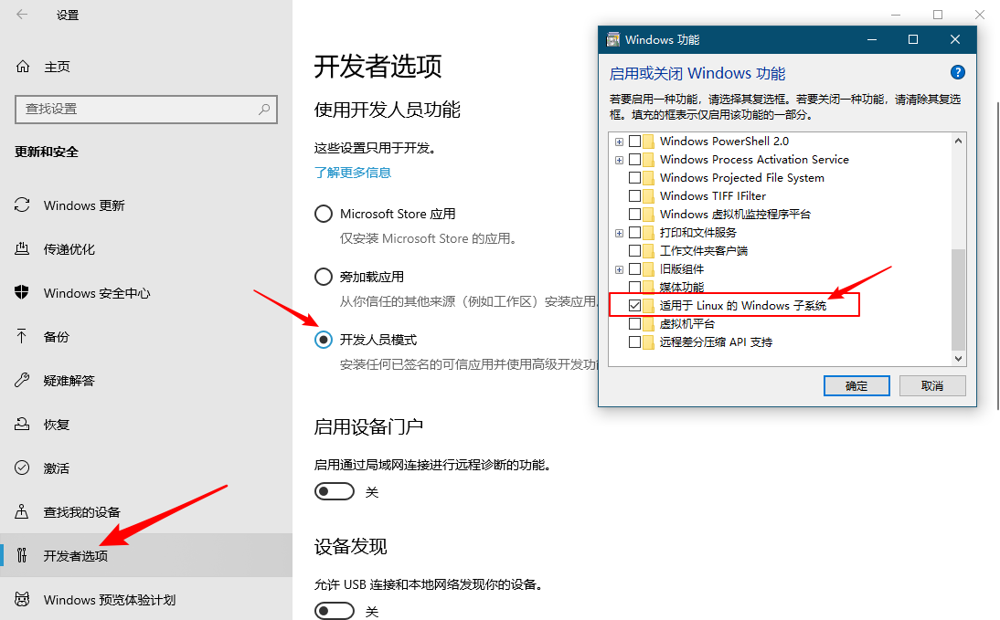

# Linux 子系统

> Windows 10 可以安装 Linux 子系统，官方也叫做 `分发` ，下面我做一个具体讲解！

- 提示：子系统下的进程也是 Windows10 下的单独进程。

## 安装 Linux 子系统

> windows 10 必须开启的功能：

> 接下来就可以去 win10 商店下载指定的分发版本，当然也可以使用 wsl 指令从 tar 中安装封装好的分发版本！

## `wsl.exe` 指令

| wsl 指令                                                       | 描述                            |
| -------------------------------------------------------------- | ------------------------------- |
| `wsl.exe -l --all`                                             | 列出所有分发                    |
| `wsl.exe -l --running`                                         | 仅列出当前正在运行的分发        |
| `wsl.exe -d <分发名>`                                          | 运行指定的分发                  |
| `wsl.exe -s <分发名>`                                          | 将分发设置为默认值              |
| `wsl.exe --unregister <分发名>`                                | 注销指定的分发（相当于卸载）    |
| `wsl.exe -t <分发名>`                                          | 终止指定的分发                  |
| `wsl.exe --export <分发名> <tar路径及文件名>`                  | 将分发导出到 tar 文件           |
| `wsl.exe --import <分发名> <分发的安装路径> <tar路径及文件名>` | 将指定的 tar 文件作为新分发导入 |
