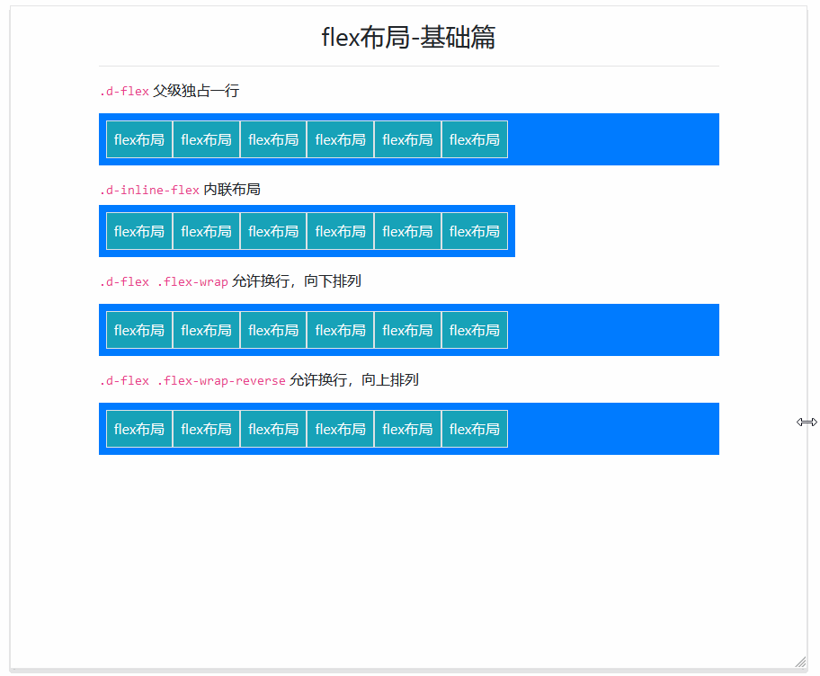
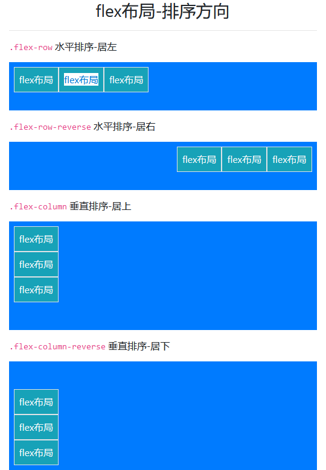
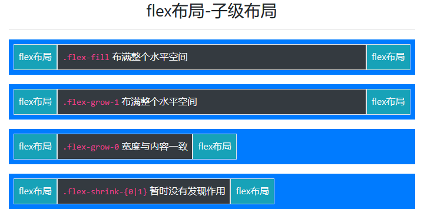
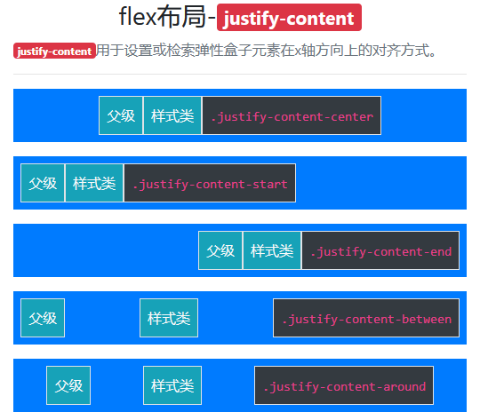
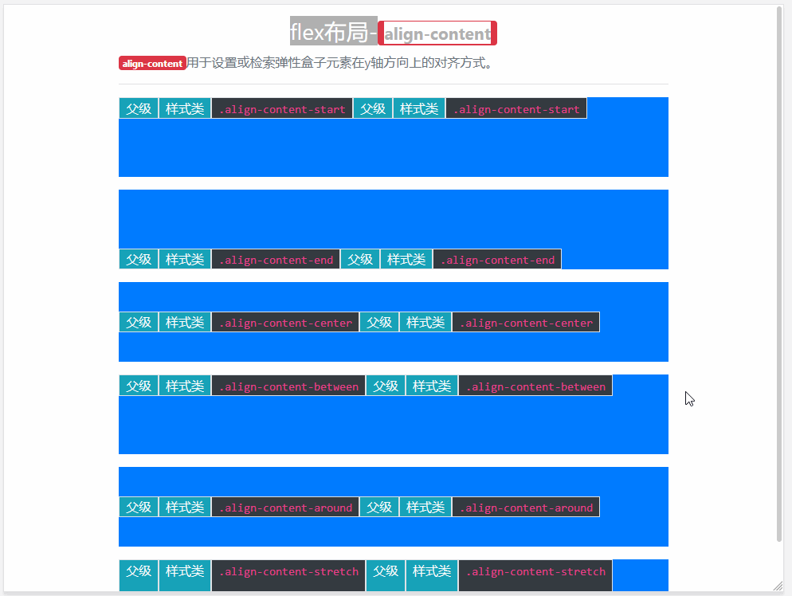

# Flex

> Flex 可快速管理布局、对齐、网格列的大小、导航组件和更多 flexbox 实用样式类集合。对于更复杂的实现，可能需要定制 CSS。

## 样式类汇总

| 样式类                                     | 描述                                                         |
| ------------------------------------------ | ------------------------------------------------------------ |
| `.d<-{sm|md|lg|xl}>-flex`                  | 基类，父级元素样式类，以弹性伸缩盒显示，上面已经讲解         |
| `.d<-{sm|md|lg|xl}>-inline-flex`           | 基类，父级元素样式类，以内联块级弹性伸缩盒显示，上面已经讲解 |
| `.flex<-{sm|md|lg|xl}>-row`                | 父级元素样式类，水平，靠左排序                               |
| `.flex<-{sm|md|lg|xl}>-row-reverse`        | 父级元素样式类，水平，靠右排序                               |
| `.flex<-{sm|md|lg|xl}>-column`             | 父级元素样式类，垂直，靠上排序                               |
| `.flex<-{sm|md|lg|xl}>-column-reverse`     | 父级元素样式类，垂直，靠下排序                               |
| `.flex<-{sm|md|lg|xl}>-fill`               | 子级元素样式类，所有子级元素占用所有可用的水平空间。         |
| `.flex<-{sm|md|lg|xl}>-grow-0`             | 子级元素样式类，回到默认布局                                 |
| `.flex<-{sm|md|lg|xl}>-grow-1`             | 子级元素样式类，布满整个水平空间                             |
| `.flex<-{sm|md|lg|xl}>-shrink-0`           | 子级元素样式类，没有发现作用                                 |
| `.flex<-{sm|md|lg|xl}>-shrink-1`           | 子级元素样式类，没有发现作用                                 |
| `.flex<-{sm|md|lg|xl}>-nowrap`             | 不允许换行，默认                                             |
| `.flex<-{sm|md|lg|xl}>-wrap`               | 允许换行，向下排列                                           |
| `.flex<-{sm|md|lg|xl}>-wrap-reverse`       | 允许换行，向上排列                                           |
| `.justify-content<-{sm|md|lg|xl}>-start`   | 父级元素样式类，水平方向，居左                               |
| `.justify-content<-{sm|md|lg|xl}>-end}`    | 父级元素样式类，水平方向，居右                               |
| `.justify-content<-{sm|md|lg|xl}>-center`  | 父级元素样式类，水平方向，居中                               |
| `.justify-content<-{sm|md|lg|xl}>-between` | 父级元素样式类，水平方向，子级间留白                         |
| `.justify-content<-{sm|md|lg|xl}>-around`  | 父级元素样式类，水平方向，两侧、子级间都有留白               |
| `.align-content<-{sm|md|lg|xl}>-start`     | 父级元素样式类，垂直方向，居上                               |
| `.align-content<-{sm|md|lg|xl}>-end`       | 父级元素样式类，垂直方向，居下                               |
| `.align-content<-{sm|md|lg|xl}>-center`    | 父级元素样式类，垂直方向，居中                               |
| `.align-content<-{sm|md|lg|xl}>-between`   | 父级元素样式类，垂直方向，换行的留白对齐，子级间有留白       |
| `.align-content<-{sm|md|lg|xl}>-around`    | 父级元素样式类，垂直方向，居中，上下、子级间都有留白         |
| `.align-content<-{sm|md|lg|xl}>-stretch`   | 父级元素样式类，垂直方向，始终占满屏幕                       |
| `.align-items<-{sm|md|lg|xl}>-start`       | 父级元素样式类，垂直，居上                                   |
| `.align-items<-{sm|md|lg|xl}>-end`         | 父级元素样式类，垂直，居下                                   |
| `.align-items<-{sm|md|lg|xl}>-center`      | 父级元素样式类，垂直，居中                                   |
| `.align-items<-{sm|md|lg|xl}>-baseline`    | 父级元素样式类，垂直，元素位于容器的基线上                   |
| `.align-items<-{sm|md|lg|xl}>-stretch`     | 父级元素样式类，垂直空间占满                                 |
| `.align-self<-{sm|md|lg|xl}>-start`        | 子级元素样式类，垂直，居上                                   |
| `.align-self<-{sm|md|lg|xl}>-end`          | 子级元素样式类，垂直，居下                                   |
| `.align-self<-{sm|md|lg|xl}>-center`       | 子级元素样式类，垂直，居中                                   |
| `.align-self<-{sm|md|lg|xl}>-baseline`     | 子级元素样式类，垂直，元素位于容器的基线上                   |
| `.align-self<-{sm|md|lg|xl}>-stretch`      | 子级元素样式类，垂直空间占满                                 |
| `.m<-{sm|md|lg|xl}>-auto`                  | 子级元素样式类，当前元素对齐方式：`水平居中+垂直居中`        |
| `.ml<-{sm|md|lg|xl}>-auto`                 | 子级元素样式类，当前元素对齐方式：`水平居右`                 |
| `.mr<-{sm|md|lg|xl}>-auto`                 | 子级元素样式类，当前元素对齐方式：`水平居左`                 |
| `.mt<-{sm|md|lg|xl}>-auto`                 | 子级元素样式类，当前元素对齐方式：`垂直居上`                 |
| `.mb<-{sm|md|lg|xl}>-auto`                 | 子级元素样式类，当前元素对齐方式：`垂直居下`                 |
| `.mx<-{sm|md|lg|xl}>-auto`                 | 子级元素样式类，当前元素对齐方式：`水平居中`                 |
| `.my<-{sm|md|lg|xl}>-auto`                 | 子级元素样式类，当前元素对齐方式：`垂直居中`                 |
| `.order<-{sm|md|lg|xl}>-[0-12]`            | 更改统计元素的排序，其它章节已经讲解                         |

> 注意：前面样式类的所有父级都应该带上 `.d<-{sm|md|lg|xl}>-flex` 样式

## 案例

> Flex 布局设计到的样式较多，所以我们这里会用多个案例来展示

### 基础案例

> 基础案例：`.d-*-flex & .d-*-inline-flex & .flex-*-{nowrap|wrap|wrap-reverse}`



```html
<div class="container">
    <h3 class="text-center mt-3">flex布局-基础篇</h3>
    <hr>
    <h6><code>.d-flex</code> 父级独占一行</h6>
    <div class="d-flex bg-primary p-2 mt-3">
        <span class="border bg-info p-2 text-light">flex布局</span>
        <span class="border bg-info p-2 text-light">flex布局</span>
        <span class="border bg-info p-2 text-light">flex布局</span>
        <span class="border bg-info p-2 text-light">flex布局</span>
        <span class="border bg-info p-2 text-light">flex布局</span>
        <span class="border bg-info p-2 text-light">flex布局</span>
    </div>
    <h6 class="mt-3"><code>.d-inline-flex</code> 内联布局</h6>
    <div class="d-inline-flex bg-primary p-2">
        <div class="border bg-info p-2 text-light">flex布局</div>
        <div class="border bg-info p-2 text-light">flex布局</div>
        <div class="border bg-info p-2 text-light">flex布局</div>
        <div class="border bg-info p-2 text-light">flex布局</div>
        <div class="border bg-info p-2 text-light">flex布局</div>
        <div class="border bg-info p-2 text-light">flex布局</div>
    </div>
    <h6 class="mt-3"><code>.d-flex .flex-wrap</code> 允许换行，向下排列</h6>
    <div class="d-flex flex-wrap bg-primary p-2 mt-3">
        <span class="border bg-info p-2 text-light">flex布局</span>
        <span class="border bg-info p-2 text-light">flex布局</span>
        <span class="border bg-info p-2 text-light">flex布局</span>
        <span class="border bg-info p-2 text-light">flex布局</span>
        <span class="border bg-info p-2 text-light">flex布局</span>
        <span class="border bg-info p-2 text-light">flex布局</span>
    </div>
    <h6 class="mt-3"><code>.d-flex .flex-wrap-reverse</code> 允许换行，向上排列</h6>
    <div class="d-flex flex-wrap-reverse bg-primary p-2 mt-3">
        <span class="border bg-info p-2 text-light">flex布局</span>
        <span class="border bg-info p-2 text-light">flex布局</span>
        <span class="border bg-info p-2 text-light">flex布局</span>
        <span class="border bg-info p-2 text-light">flex布局</span>
        <span class="border bg-info p-2 text-light">flex布局</span>
        <span class="border bg-info p-2 text-light">flex布局</span>
    </div>
</div>
```

### flex 布局-排序方向



```html
<div class="container">
    <h3 class="text-center mt-3">flex布局-排序方向</h3>
    <hr>
    <h6><code>.flex-row</code> 水平排序-居左</h6>
    <div class="d-flex flex-row bg-primary p-2 mt-3" style="height:80px;">
        <span class="border bg-info p-2 text-light d-table">flex布局</span>
        <span class="border bg-info p-2 text-light d-table">flex布局</span>
        <span class="border bg-info p-2 text-light d-table">flex布局</span>
    </div>
    <h6 class="mt-3"><code>.flex-row-reverse</code> 水平排序-居右</h6>
    <div class="d-flex flex-row-reverse bg-primary p-2 mt-3" style="height:80px;">
        <span class="border bg-info p-2 text-light d-table">flex布局</span>
        <span class="border bg-info p-2 text-light d-table">flex布局</span>
        <span class="border bg-info p-2 text-light d-table">flex布局</span>
    </div>
    <h6 class="mt-3"><code>.flex-column</code> 垂直排序-居上</h6>
    <div class="d-flex flex-column bg-primary p-2 mt-3" style="height:180px;">
        <span class="border bg-info p-2 text-light d-table">flex布局</span>
        <span class="border bg-info p-2 text-light d-table">flex布局</span>
        <span class="border bg-info p-2 text-light d-table">flex布局</span>
    </div>
    <h6 class="mt-3"><code>.flex-column-reverse</code> 垂直排序-居下</h6>
    <div class="d-flex flex-column-reverse bg-primary p-2 mt-3" style="height:180px;">
        <span class="border bg-info p-2 text-light d-table">flex布局</span>
        <span class="border bg-info p-2 text-light d-table">flex布局</span>
        <span class="border bg-info p-2 text-light d-table">flex布局</span>
    </div>
</div>
```

### flex 布局-子级布局



```html
<div class="container">
    <h3 class="text-center mt-3">flex布局-子级布局</h3>
    <hr>
    <div class="d-flex bg-primary p-2 mt-3" style="height:60px;">
        <span class="border bg-info p-2 text-light">flex布局</span>
        <span class="border bg-dark p-2 text-light flex-fill"><code>.flex-fill</code> 布满整个水平空间</span>
        <span class="border bg-info p-2 text-light">flex布局</span>
    </div>
    <div class="d-flex bg-primary p-2 mt-3" style="height:60px;">
        <span class="border bg-info p-2 text-light">flex布局</span>
        <span class="border bg-dark p-2 text-light flex-grow-1"><code>.flex-grow-1</code> 布满整个水平空间</span>
        <span class="border bg-info p-2 text-light">flex布局</span>
    </div>
    <div class="d-flex bg-primary p-2 mt-3" style="height:60px;">
        <span class="border bg-info p-2 text-light">flex布局</span>
        <span class="border bg-dark p-2 text-light flex-grow-0"><code>.flex-grow-0</code> 宽度与内容一致</span>
        <span class="border bg-info p-2 text-light">flex布局</span>
    </div>
    <div class="d-flex bg-primary p-2 mt-3" style="height:60px;">
        <span class="border bg-info p-2 text-light">flex布局</span>
        <span class="border bg-dark p-2 text-light flex-md-shrink-1"><code>.flex-shrink-{0|1}</code> 暂时没有发现作用</span>
        <span class="border bg-info p-2 text-light">flex布局</span>
    </div>
</div>
```

### flex布局- `justify-content`



```html
<div class="container">
    <h3 class="text-center mt-3">flex布局-<span class="badge badge-danger">justify-content</span></h3>
    <p class="text-muted"><span class="badge badge-danger">justify-content</span>用于设置或检索弹性盒子元素在x轴方向上的对齐方式。</p>
    <hr>
    <div class="d-flex bg-primary p-2 mt-3 justify-content-center" style="height:60px;">
        <span class="border bg-info p-2 text-light">父级</span>
        <span class="border bg-info p-2 text-light">样式类</span>
        <span class="border bg-dark p-2 text-light"><code>.justify-content-center</code></span>
    </div>
    <div class="d-flex bg-primary p-2 mt-3 justify-content-start" style="height:60px;">
        <span class="border bg-info p-2 text-light">父级</span>
        <span class="border bg-info p-2 text-light">样式类</span>
        <span class="border bg-dark p-2 text-light"><code>.justify-content-start</code></span>
    </div>
    <div class="d-flex bg-primary p-2 mt-3 justify-content-end" style="height:60px;">
        <span class="border bg-info p-2 text-light">父级</span>
        <span class="border bg-info p-2 text-light">样式类</span>
        <span class="border bg-dark p-2 text-light"><code>.justify-content-end</code></span>
    </div>
    <div class="d-flex bg-primary p-2 mt-3 justify-content-between" style="height:60px;">
        <span class="border bg-info p-2 text-light">父级</span>
        <span class="border bg-info p-2 text-light">样式类</span>
        <span class="border bg-dark p-2 text-light"><code>.justify-content-between</code></span>
    </div>
    <div class="d-flex bg-primary p-2 mt-3 justify-content-around" style="height:60px;">
        <span class="border bg-info p-2 text-light">父级</span>
        <span class="border bg-info p-2 text-light">样式类</span>
        <span class="border bg-dark p-2 text-light"><code>.justify-content-around</code></span>
    </div>
</div>
```

### flex布局 - `align-content`



```html
<div class="container">
    <h3 class="text-center mt-3">flex布局-<span class="badge badge-danger">align-content</span></h3>
    <p class="text-muted"><span class="badge badge-danger">align-content</span>用于设置或检索弹性盒子元素在y轴方向上的对齐方式。</p>
    <hr>
    <div class="d-flex bg-primary mt-3 align-content-start flex-wrap" style="height:100px;">
        <span class="border bg-info px-2 text-light">父级</span>
        <span class="border bg-info px-2 text-light">样式类</span>
        <span class="border bg-dark px-2 text-light"><code>.align-content-start</code></span>
        <span class="border bg-info px-2 text-light">父级</span>
        <span class="border bg-info px-2 text-light">样式类</span>
        <span class="border bg-dark px-2 text-light"><code>.align-content-start</code></span>
    </div>
    <div class="d-flex bg-primary mt-3 align-content-end flex-wrap" style="height:100px;">
        <span class="border bg-info px-2 text-light">父级</span>
        <span class="border bg-info px-2 text-light">样式类</span>
        <span class="border bg-dark px-2 text-light"><code>.align-content-end</code></span>
        <span class="border bg-info px-2 text-light">父级</span>
        <span class="border bg-info px-2 text-light">样式类</span>
        <span class="border bg-dark px-2 text-light"><code>.align-content-end</code></span>
    </div>
    <div class="d-flex bg-primary mt-3 align-content-center flex-wrap" style="height:100px;">
        <span class="border bg-info px-2 text-light">父级</span>
        <span class="border bg-info px-2 text-light">样式类</span>
        <span class="border bg-dark px-2 text-light"><code>.align-content-center</code></span>
        <span class="border bg-info px-2 text-light">父级</span>
        <span class="border bg-info px-2 text-light">样式类</span>
        <span class="border bg-dark px-2 text-light"><code>.align-content-center</code></span>
    </div>
    <div class="d-flex bg-primary mt-3 align-content-between flex-wrap" style="height:100px;">
        <span class="border bg-info px-2 text-light">父级</span>
        <span class="border bg-info px-2 text-light">样式类</span>
        <span class="border bg-dark px-2 text-light"><code>.align-content-between</code></span>
        <span class="border bg-info px-2 text-light">父级</span>
        <span class="border bg-info px-2 text-light">样式类</span>
        <span class="border bg-dark px-2 text-light"><code>.align-content-between</code></span>
    </div>
    <div class="d-flex bg-primary mt-3 align-content-around flex-wrap" style="height:100px;">
        <div class="border bg-info px-2 text-light">父级</div>
        <div class="border bg-info px-2 text-light">样式类</div>
        <div class="border bg-dark px-2 text-light"><code>.align-content-around</code></div>
        <div class="border bg-info px-2 text-light">父级</div>
        <div class="border bg-info px-2 text-light">样式类</div>
        <div class="border bg-dark px-2 text-light"><code>.align-content-around</code></div>
    </div>
    <div class="d-flex bg-primary mt-3 align-content-stretch flex-wrap" style="height:100px;">
        <span class="border bg-info px-2 text-light">父级</span>
        <span class="border bg-info px-2 text-light">样式类</span>
        <span class="border bg-dark px-2 text-light"><code>.align-content-stretch</code></span>
        <span class="border bg-info px-2 text-light">父级</span>
        <span class="border bg-info px-2 text-light">样式类</span>
        <span class="border bg-dark px-2 text-light"><code>.align-content-stretch</code></span>
    </div>
</div>
```
