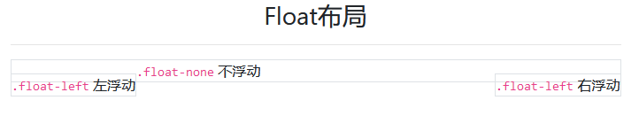
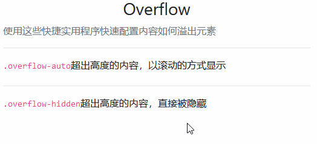
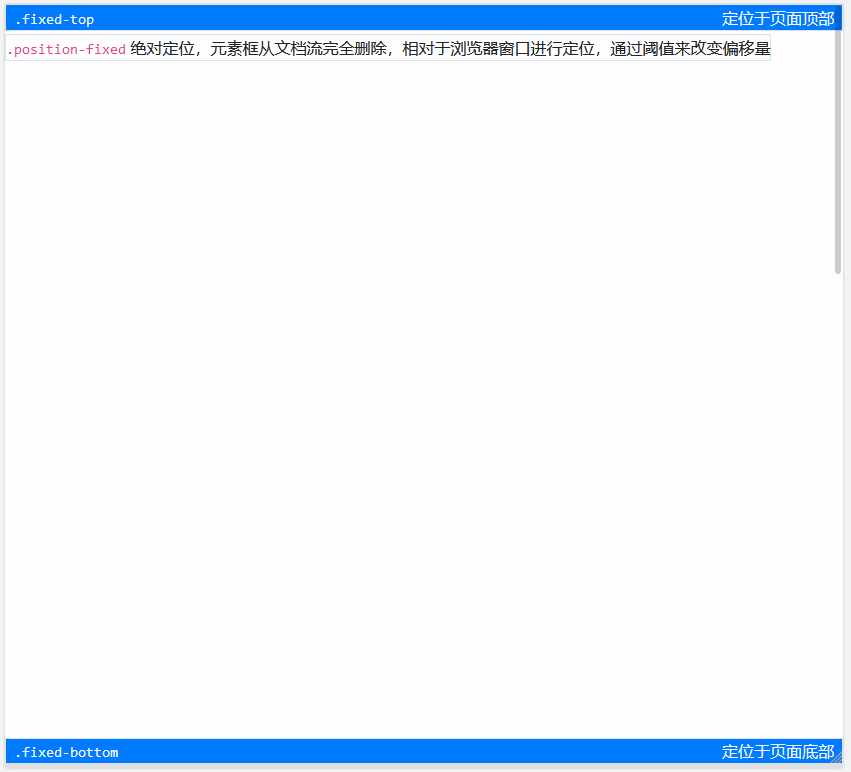
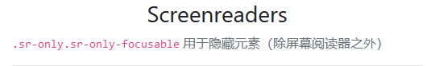
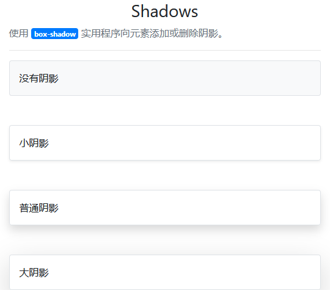
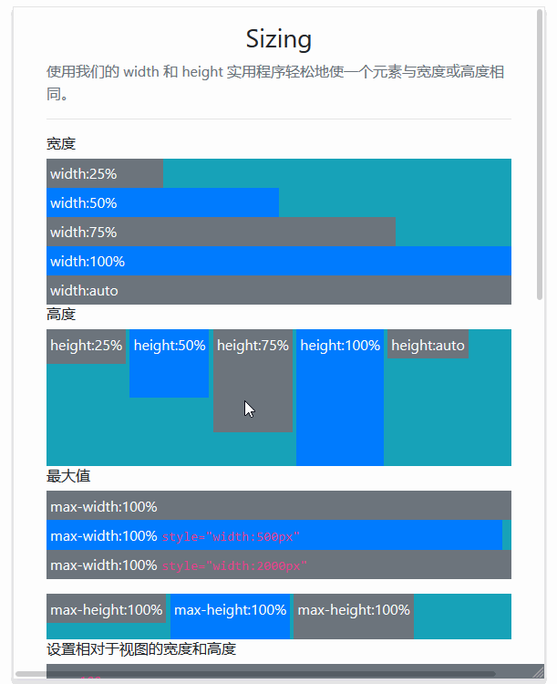

# 其它基础样式

> 这里讲述 bootstrap 自带的大量公共样式类：

| 样式类分类           | 描述                                                 |
| -------------------- | ---------------------------------------------------- |
| `Borders`            | 边框相关样式                                         |
| `Clearfix`           | 清除容器中的浮动内容                                 |
| `Close icon`         | 关闭按钮                                             |
| `Display property`   | 不同宽度设备间，快速切换显示值                       |
| `Embeds`             | `<iframe> & <embed> & <video> & <object>` 标签中使用 |
| `Flex`               | 快速管理布局，对齐，网格列的大小                     |
| `Float`              | 切换任何元素上的浮动                                 |
| `Overflow`           | 处理元素溢出                                         |
| `Position`           | 处理元素定位                                         |
| `Screenreaders`      | 设备间的隐藏                                         |
| `Shadows`            | 处理元素的阴影                                       |
| `Sizing`             | 处理元素宽度和高度                                   |
| `Spacing`            | 响应式处理元素的外观                                 |
| `Text`               | 用于控制元素的对齐、换行等                           |
| `Vertical alignment` | 处理元素的垂直对齐                                   |
| `Visibility`         | 在不修改`display`的情况下，控制元素的可见性。        |

## Borders

> 使用边框实用程序快速样式化元素的边框和边框半径。非常适合图像、按钮或任何其他元素。

| 样式类            | 描述                      |
| ----------------- | ------------------------- |
| `border`          | 带边框                    |
| `border-left`     | 左侧带边框                |
| `border-right`    | 右侧带边框                |
| `border-top`      | 头部带边框                |
| `border-bottom`   | 底部带边框                |
| `border-0`        | 禁用边框                  |
| `border-left-0`   | 左侧禁用边框              |
| `border-right-0`  | 右侧禁用边框              |
| `border-top-0`    | 头部禁用边框              |
| `border-bottom-0` | 底部禁用边框              |
| `rounded`         | 圆角                      |
| `rounded-0`       | 禁用圆角                  |
| `rounded-left`    | 左侧上下角都带圆角        |
| `rounded-right`   | 右侧上下角都带圆角        |
| `rounded-top`     | 头部上下角都带圆角        |
| `rounded-bottom`  | 底部上下角都带圆角        |
| `rounded-circle`  | `border-radius`为 `50%`   |
| `rounded-pill`    | `border-radius`为 `50rem` |
| `border-颜色代号` | 在公共事务篇已经讲解      |

> 案例


```html
<div class="container">
    <svg class="border" width="75" height="50" style="text-anchor:middle">
        <rect fill="#efefef" width="100%" height="100%"></rect>
        <text fill="#ccc" dy=".4em" x="50%" y="50%">75x50</text>
    </svg>
    <svg class="border border-primary" width="75" height="50" style="text-anchor:middle">
        <rect fill="#efefef" width="100%" height="100%"></rect>
        <text fill="#ccc" dy=".4em" x="50%" y="50%">75x50</text>
    </svg>
    <svg class="border-bottom border-primary" width="75" height="50" style="text-anchor:middle">
        <rect fill="#efefef" width="100%" height="100%"></rect>
        <text fill="#ccc" dy=".4em" x="50%" y="50%">75x50</text>
    </svg>
    <svg class="border-bottom border-primary rounded" width="75" height="50" style="text-anchor:middle">
        <rect fill="#efefef" width="100%" height="100%"></rect>
        <text fill="#ccc" dy=".4em" x="50%" y="50%">75x50</text>
    </svg>
    <svg class="border-bottom border-primary rounded-circle" width="75" height="50" style="text-anchor:middle">
        <rect fill="#efefef" width="100%" height="100%"></rect>
        <text fill="#ccc" dy=".4em" x="50%" y="50%">75x50</text>
    </svg>
    <svg class="border-bottom border-primary rounded-pill" width="75" height="50" style="text-anchor:middle">
        <rect fill="#efefef" width="100%" height="100%"></rect>
        <text fill="#ccc" dy=".4em" x="50%" y="50%">750x500</text>
    </svg>
</div>
```

## Clearfix

> 通过向父元素添加.clearfix，可以轻松清除浮动。


```html
<div class="container">
    <h3 class="text-center mt-3">带 <code>.clearfix</code> 的效果</h3>
    <div class="bg-primary clearfix mb-3">
        <button type="button" class="btn btn-secondary float-left">左浮动按钮</button>
        <a type="button" class="btn btn-secondary float-right text-light">右浮动链接</a>
    </div>
    <div class="bg-primary clearfix">
        <button type="button" class="btn btn-secondary float-left">左浮动按钮</button>
        <a type="button" class="btn btn-secondary float-right text-light">右浮动链接</a>
    </div>
    <hr>
    <h3 class="text-center mt-3">不带 <code>.clearfix</code> 的效果</h3>
    <div class="bg-primary  mb-3">
        <button type="button" class="btn btn-secondary float-left">左浮动按钮</button>
        <a type="button" class="btn btn-secondary float-right text-light">右浮动链接</a>
    </div>
    <div class="bg-primary ">
        <button type="button" class="btn btn-secondary float-left">左浮动按钮</button>
        <a type="button" class="btn btn-secondary float-right text-light">右浮动链接</a>
    </div>
</div>
```

## Close icon

> 使用一个通用的关闭图标来关闭 modals 和 alerts 等组件内容。


```html
<div class="container">
    <h3 class="text-center">关闭图标，默认位于区块的右上角</h3>
    <div class="clearfix">
        <button type="button" class="close">
            <span>&times;</span>
        </button>
    </div>
    <h3 class="text-center">通过 <code>.float-left</code> 改成位于区块左上角</h3>
    <div class="clearfix">
        <a class="close float-left">
            <span>&times;</span>
        </a>
    </div>
</div>
```

## Display property

> 快速切换组件在不同屏幕下的响应式显示的样式类集合

| 样式类规律                | 描述                        |
| ------------------------- | --------------------------- |
| `d-{value}`               | 所有屏幕统一                |
| `d-{sm|md|lg|xl}-{value}` | 屏幕大于一定宽度， 才能触发 |

> `{value}` 值列表

| value 值     | 描述                                            |
| ------------ | ----------------------------------------------- |
| none         | 隐藏                                            |
| inline       | 内联                                            |
| inline-block | 内联块                                          |
| block        | 块级                                            |
| table        | 以块级表格 `类似 <table>`，表格前后带有换行符。 |
| table-cell   | 以表格单元格显示 `类似 <td> & <th>`             |
| table-row    | 以表格行显示 `类似 <tr>`                        |
| flex         | 以弹性伸缩盒显示（属于 flex 布局序列）          |
| inline-flex  | 以内联块级弹性伸缩盒显示（属于 flex 布局序列）  |

> `d-*-flex & d-&-inline-flex` 区别在于，父级一个是块级（block），一个是内联块级（inline-block）


```html
<div class="container">
    <div class="d-md-none d-xl-block"> 默认显示，屏幕大于一定宽度，则隐藏 </div>
    <hr>
    <div class="d-table" style="height:100px">
        <div class="d-table-row">
            <div class="d-table-cell p-3 border" style="vertical-align: middle;"> 文本垂直居中<br>文本垂直居中 </div>
            <div class="d-table-cell p-3 border" style="vertical-align: middle;"> 文本垂直居中<br>文本垂直居中 </div>
        </div>
        <div class="d-table-row">
            <div class="d-table-cell p-3 border" style="vertical-align: middle;"> 文本垂直居中<br>文本垂直居中 </div>
            <div class="d-table-cell p-3 border" style="vertical-align: middle;"> 文本垂直居中<br>文本垂直居中 </div>
        </div>
    </div>
    <hr>
    <div class="d-flex" style="height:30px">
        <div class="border" style="width:100px;"> 块级 </div>
        <div class="border" style="width:100px;"> 块级 </div>
    </div>
    <div class="d-flex" style="height:30px">
        <div class="border" style="width:100px;"> 块级 </div>
        <div class="border" style="width:100px;"> 块级 </div>
    </div>
    <hr>
    <div class="d-inline-flex" style="height:30px">
        <div class="border" style="width:100px;"> 块级 </div>
        <div class="border" style="width:100px;"> 块级 </div>
    </div>
    <div class="d-inline-flex" style="height:30px">
        <div class="border" style="width:100px;"> 块级 </div>
        <div class="border" style="width:100px;"> 块级 </div>
    </div>
</div>
```

## Embeds

> `.embed-responsive` 用于子级为 `<iframe>, <embed>, <video>, <object> 或 .embed-responsive-item`

| 样式类                    | 描述                                                   |
| ------------------------- | ------------------------------------------------------ |
| `.embed-responsive`       | 父级，基类                                             |
| `.embed-responsive-21by9` | 父级，宽度与高度比例 21:9                              |
| `.embed-responsive-16by9` | 父级，宽度与高度比例 16:9                              |
| `.embed-responsive-3by4`  | 父级，宽度与高度比例 3:4                               |
| `.embed-responsive-1by1`  | 父级，宽度与高度比例 1:1                               |
| `.embed-responsive-item`  | 子级，用于非`<iframe>, <embed>, <video>, <object>`标签 |

> 案例


```html
<div class="container">
    <div class="embed-responsive embed-responsive-21by9">
        <embed src="https://www.baidu.com"></embed>
    </div>
    <hr>
    <div class="embed-responsive embed-responsive-21by9">
        <embed src='http://player.youku.com/embed/XNDAwNzQzOTE4MA==' allowFullScreen></embed>
    </div>
</div>
```

## Float

> 响应式浮动

| 样式类                         | 描述     |
| ------------------------------ | -------- |
| `.float<-{sm|md|lg|xl}>-left`  | 左浮动   |
| `.float<-{sm|md|lg|xl}>-right` | 右浮动   |
| `.float<-{sm|md|lg|xl}>-none`  | 移除浮动 |

> 案例



```html
<div class="container">
    <h3 class="text-center mt-3">Float布局</h3>
    <hr>
    <div class="border mt-3 float-left"> <code>.float-left</code> 左浮动 </div>
    <div class="border mt-3 float-right"> <code>.float-left</code> 右浮动 </div>
    <div class="border mt-3 float-none"> <code>.float-none</code> 不浮动 </div>
</div>
```

## Overflow

> 可以快速配置内容如何溢出元素

| 样式类             | 描述                                    |
| ------------------ | --------------------------------------- |
| `.overflow-hidden` | 如果内容超出高度,超出部分会被直接隐藏掉 |
| `.overflow-auto`   | 如果内容超出高度,会以滚动条的形式展示   |



```html
<div class="container">
    <h3 class="text-center mt-3">Overflow</h3>
    <p class="text-muted">使用这些快捷实用程序快速配置内容如何溢出元素</p>
    <hr>
    <div style="height:30px" class="overflow-auto">
        <code>.overflow-auto</code>超出高度的内容，以滚动的方式显示<br>超出高度的内容 </div>
    <hr>
    <div style="height:30px" class="overflow-hidden">
        <code>.overflow-hidden</code>超出高度的内容，直接被隐藏<br> 超出高度的内容 </div>
</div>
```

## Position

> 快速配置元素的位置

| 样式类               | 描述                                                                                                   |
| -------------------- | ------------------------------------------------------------------------------------------------------ |
| `.position-static`   | 没有定位（忽略阈值的值）                                                                               |
| `.position-relative` | 相对定位，相对于其正常位置进行定位，通过阈值来改变偏移量                                               |
| `.position-absolute` | 相对定位，元素框从文档流完全删除，相对于 static 定位以外的第 1 个父元素进行定位，通过阈值来改变偏移量  |
| `.position-fixed`    | 绝对定位，元素框从文档流完全删除，相对于浏览器窗口进行定位，通过阈值来改变偏移量                       |
| `.fixed-top`         | 绝对定位，定位页面头部                                                                                 |
| `.fixed-bottom`      | 绝对定位，定位页面底部                                                                                 |
| `.position-sticky`   | 默认是相对定位，滚动条开始滚动，并且当前元素的位置与所设置的阈值对应时，会变成绝对定位（必须定义阈值） |
| `.sticky-top`        | 默认是相对定位，滚动条开始滚动，并且当前元素的位置移动到窗口顶部，元素会固定在窗口顶部                 |

> 阈值表

| 阈值      | 描述                                           |
| --------- | ---------------------------------------------- |
| `top`     | 定义向上偏移量                                 |
| `bottom`  | 定义向下偏移量                                 |
| `left`    | 定义向左偏移量                                 |
| `right`   | 定义向右偏移量                                 |
| `z-index` | 定义 `Z轴` 层级，bootstrap 的基础层级为 `1030` |

> 案例：



```html
<div style="height:800px;">
</div>
<div class="container">
    <h3 class="text-center mt-5">Position</h3>
    <p class="text-muted">快速配置元素的位置</p>
    <hr>
    <div class="sticky-top border text-light bg-dark" style="z-index:1031">
        <code>.sticky-top</code> 默认是相对定位，滚动条开始滚动，并且当前元素的位置移动到窗口顶部，元素会固定在窗口顶部 </div>
    <div class="position-static border p-2"> <code>.position-static</code> 没有定位，元素框正常生成 </div>
    <div class="position-absolute border px-2">
        <code>.position-absolute</code> 相对定位<br>元素框从文档流完全删除，并相对于其包含块定位，通过阈值来改变偏移量 </div>
    <div class="position-relative border p-2 pt-5" style="right:50px;">
        <code>.position-relative</code> <br>相对定位，元素框偏移某个距离。元素仍保持其未定位前的形状，它原本所占的空间仍保留。 </div>
    <div class="position-sticky border p-2 bg-dark text-light pt-4" style="bottom:0; z-index:1031">
        <code>.position-sticky</code> 默认是相对定位，滚动条开始滚动，并且当前元素的位置与所设置的阈值对应时，会变成绝对定位（必须定义阈值） </div>
    <div class="position-fixed border bg-light" style="z-index:1033; top:30px; left:0;">
        <code>.position-fixed</code> 绝对定位，元素框从文档流完全删除，相对于浏览器窗口进行定位，通过阈值来改变偏移量 </div>
    <div class="fixed-top border bg-primary text-light px-2">
        <code class="text-light">.fixed-top</code> <span class="float-right">定位于页面顶部</span> </div>
    <div class="fixed-bottom border text-light bg-primary px-2">
        <code class="text-light">.fixed-bottom</code> <span class="float-right">定位于页面底部</span></div>
</div>
<div style="height:800px;">
</div>
```

## Screenreaders

> `.sr-only.sr-only-focusable` 用于隐藏元素（除屏幕阅读器之外）



```html
<div class="container">
    <h3 class="text-center mt-3">Screenreaders</h3>
    <p class="text-muted"><code>.sr-only.sr-only-focusable</code> 用于隐藏元素（除屏幕阅读器之外）</p>
    <hr>
    <div class="sr-only sr-only-focusable">隐藏的内容</div>
</div>
```

## Shadows

> 使用 `box-shadow` 实用程序向元素添加或删除阴影。

| 样式类         | 描述     |
| -------------- | -------- |
| `.shadow-none` | 没有阴影 |
| `.shadow-sm`   | 小阴影   |
| `.shadow`      | 普通阴影 |
| `.shadow-lg`   | 大阴影   |

> 案例



```html
<div class="container">
    <h3 class="text-center mt-3">Shadows</h3>
    <p class="text-muted">使用 <span class="badge badge-primary">box-shadow </span> 实用程序向元素添加或删除阴影。</p>
    <hr>
    <div class="shadow-none p-3 mb-5 border bg-light rounded">没有阴影</div>
    <div class="shadow-sm p-3 mb-5 border bg-white rounded">小阴影</div>
    <div class="shadow p-3 mb-5 border bg-white rounded">普通阴影</div>
    <div class="shadow-lg p-3 mb-5 border bg-white rounded">大阴影</div>
</div>
```

## Sizing

> 使用我们的 width 和 height 实用程序轻松地使一个元素与宽度或高度相同。

| 样式类        | 描述               |
| ------------- | ------------------ |
| `.w-auto`     | `width:auto`       |
| `.w-25`       | `width:25%`        |
| `.w-50`       | `width:50%`        |
| `.w-75`       | `width:75%`        |
| `.w-100`      | `width:100%`       |
| `.h-auto`     | `height:auto`      |
| `.h-25`       | `height:25%`       |
| `.h-50`       | `height:50%`       |
| `.h-75`       | `height:75%`       |
| `.h-100`      | `height:100%`      |
| `.mw-100`     | `max-width:100%`   |
| `.mh-100`     | `max-height:100%`  |
| `.min-vw-100` | `max-height: 100%` |
| `.min-vh-100` | `min-width: 100vw` |
| `.vw-100`     | `width: 100vw`     |
| `.vh-100`     | `height: 100vh`    |

> 案例



```html
<div class="container">
    <h3 class="text-center mt-3">Sizing</h3>
    <p class="text-muted">使用我们的 width 和 height 实用程序轻松地使一个元素与宽度或高度相同。</p>
    <hr>
    <h6>宽度</h6>
    <div class="bg-info">
        <div class="w-25 bg-secondary text-light p-1">width:25%</div>
        <div class="w-50 bg-primary text-light p-1">width:50%</div>
        <div class="w-75 bg-secondary text-light p-1">width:75%</div>
        <div class="w-100 bg-primary text-light p-1">width:100%</div>
        <div class="w-auto bg-secondary text-light p-1">width:auto</div>
    </div>
    <h6>高度</h6>
    <div style="height:150px" class="bg-info">
        <div class="d-inline-block h-25 bg-secondary text-light p-1">height:25%</div>
        <div class="d-inline-block h-50 bg-primary text-light p-1">height:50%</div>
        <div class="d-inline-block h-75 bg-secondary text-light p-1">height:75%</div>
        <div class="d-inline-block h-100 bg-primary text-light p-1">height:100%</div>
        <div class="d-inline-block h-auto bg-secondary text-light p-1">height:auto</div>
    </div>
    <h6>最大值</h6>
    <div class="bg-info">
        <div class="mw-100 bg-secondary text-light p-1">max-width:100%</div>
        <div class="mw-100 bg-primary text-light p-1" style="width:500px">max-width:100% <code>style="width:500px"</code></div>
        <div class="mw-100 bg-secondary text-light p-1" style="width:2000px">max-width:100% <code>style="width:2000px"</code></div>
    </div>
    <div class="bg-info mt-3" style="height:50px;">
        <div class="d-inline-block bg-secondary text-light p-1 mh-100"> max-height:100% </div>
        <div class="d-inline-block bg-primary text-light p-1 mh-100" style="height:50px"> max-height:100% </div>
        <div class="d-inline-block bg-secondary text-light p-1 mh-100" style="height:100px"> max-height:100% </div>
    </div>
    <h6>设置相对于视图的宽度和高度</h6>
    <div class="bg-info">
        <div class="vw-100 bg-secondary text-light p-1"><code>.vw-100</code> <br>一个屏幕的宽度</div>
        <div class="min-vw-100 bg-primary text-light p-1" style="width:500px"><code>.min-vw-100</code> <br>最小一个屏幕的宽度</div>
    </div>
    <div class="bg-info mt-3" style="height:50px;">
        <div class="d-inline-block bg-secondary text-light p-1 vh-100"> <code>.vh-100</code> <br>一个屏幕的高度 </div>
        <div class="d-inline-block bg-primary text-light p-1 min-vh-100"> <code>.min-vh-100</code> <br>最小一个屏幕的高度</div>
    </div>
</div>
```

## Spacing

> Bootstrap 包括一系列快速响应边界和填充实用程序类，用于修改元素的外观

| 样式类                                              | 描述             |
| --------------------------------------------------- | ---------------- |
| `m<-{sm|md|lg|xl}>-{0|1|2|3|4|5|auto}`              | margin 值        |
| `m{t|b|l|r|x|y}<-{sm|md|lg|xl}>-{0|1|2|3|4|5|auto}` | 特定 margin 值   |
| `m<-{sm|md|lg|xl}>-n{0|1|2|3|4|5}`                  | margin 负值      |
| `m{t|b|l|r|x|y}<-{sm|md|lg|xl}>-n{0|1|2|3|4|5}`     | 特定 margin 负值 |
| `p<-{sm|md|lg|xl}>-{0|1|2|3|4|5|auto}`              | padding 值       |
| `p{t|b|l|r|x|y}<-{sm|md|lg|xl}>-{0|1|2|3|4|5|auto}` | 特定 padding 值  |

> 参数说明

| 第一参数 | 描述         |
| -------- | ------------ |
| `m`      | 指代 margin  |
| `p`      | 指代 padding |

| 第二参数 | 描述       |
| -------- | ---------- |
| `t`      | 头部       |
| `b`      | 底部       |
| `l`      | 左侧       |
| `r`      | 右侧       |
| `x`      | 左右两侧   |
| `y`      | 头部和底部 |

| 第三参数 | 描述             |
| -------- | ---------------- |
| `0`      | 值为 0           |
| `1`      | 值为`1*0.25rem`  |
| `2`      | 值为`2*0.25rem`  |
| `3`      | 值为`3*0.25rem`  |
| `4`      | 值为`4*0.25rem`  |
| `5`      | 值为`5*0.25rem`  |
| `auto`   | 值为 `auto`      |
| `n1`     | 值为`-1*0.25rem` |
| `n2`     | 值为`-2*0.25rem` |
| `n3`     | 值为`-3*0.25rem` |
| `n4`     | 值为`-4*0.25rem` |
| `n5`     | 值为`-5*0.25rem` |

| 屏幕参数 | 描述     |
| -------- | -------- |
| `sm`     | 最小屏幕 |
| `md`     | 小屏幕   |
| `lg`     | 大屏幕   |
| `xl`     | 超大屏幕 |

## Text

> 用于控制文本对齐、换行、权重等公共文本实用程序。

| 样式类                         | 描述                    |
| ------------------------------ | ----------------------- |
| `.text-<{sm|md|lg|xl}->left`   | 文本做对齐              |
| `.text-<{sm|md|lg|xl}->right`  | 文本右对齐              |
| `.text-<{sm|md|lg|xl}->center` | 文本水平居中            |
| `.text-monospace`              | 等宽字体                |
| `.text-justify`                | 文本两端对齐            |
| `.text-wrap`                   | 文本自动换行            |
| `.text-nowrap`                 | 文本不换行              |
| `.text-truncate`               | 文本自动带省略号        |
| `.text-lowercase`              | 文本必定小写            |
| `.text-uppercase`              | 文本必定大写            |
| `.text-capitalize`             | 文本首字母大写,其余不变 |
| `.text-reset`                  | 继承父元素的颜色        |
| `.text-decoration-none`        | 删除 a 的下划线         |
| `.font-weight-bold`            | 文本加粗                |
| `.font-weight-bolder`          | 文本加粗，相对于父元素  |
| `.font-weight-normal`          | 文本正常                |
| `.font-weight-light`           | 文本变细                |
| `.font-weight-lighter`         | 文本变细，相对于父元素  |
| `.font-italic`                 | 文本斜体                |

## Vertical alignment

> 轻松更改内联、内联块、内联表和表单元格元素的垂直对齐。

| 样式类               | 描述                                     |
| -------------------- | ---------------------------------------- |
| `.align-baseline`    | 默认。元素放置在父元素的基线上。         |
| `.align-top`         | 把元素的顶端与行中最高元素的顶端对齐     |
| `.align-middle`      | 把此元素放置在父元素的中部。             |
| `.align-bottom`      | 把元素的顶端与行中最低的元素的顶端对齐。 |
| `.align-text-bottom` | 把元素的底端与父元素字体的底端对齐。     |
| `.align-text-top`    | 把元素的顶端与行中最高元素的顶端对齐     |

## Visibility

> 在不修改显示的情况下，使用可见性实用程序控制元素的可见性。

| 样式类      | 描述           |
| ----------- | -------------- |
| `visible`   | 默认，元素可见 |
| `invisible` | 元素不可见     |
