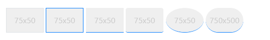
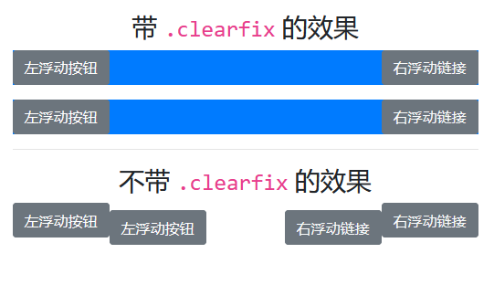
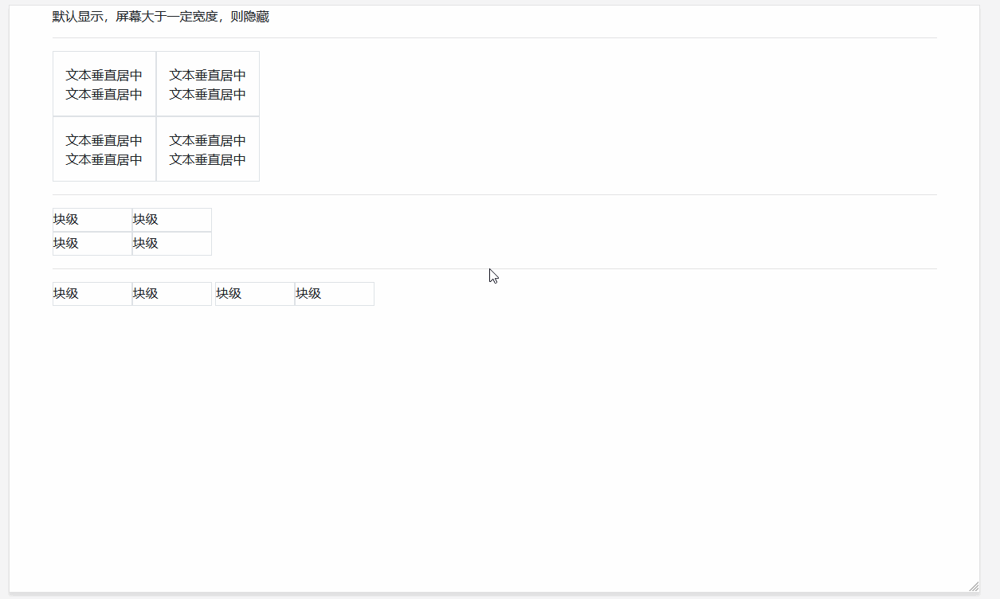
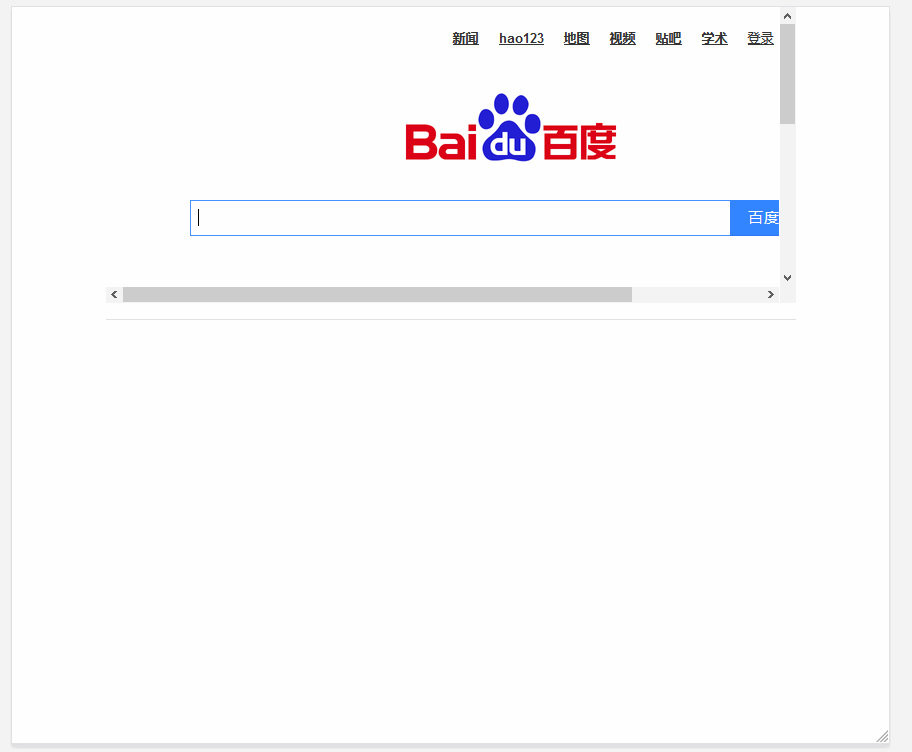

# 其它基础样式

> 这里讲述 bootstrap 自带的大量公共样式类：

| 样式类分类           | 描述                                                 |
| -------------------- | ---------------------------------------------------- |
| `Borders`            | 边框相关样式                                         |
| `Clearfix`           | 清除容器中的浮动内容                                 |
| `Close icon`         | 关闭按钮                                             |
| `Display property`   | 不同宽度设备间，快速切换显示值                       |
| `Embeds`             | `<iframe> & <embed> & <video> & <object>` 标签中使用 |
| `Flex`               | 快速管理布局，对齐，网格列的大小                     |
| `Float`              | 切换任何元素上的浮动                                 |
| `Overflow`           | 处理元素溢出                                         |
| `Position`           | 处理元素定位                                         |
| `Screenreaders`      | 设备间的隐藏                                         |
| `Shadows`            | 处理元素的阴影                                       |
| `Sizing`             | 处理元素宽度和高度                                   |
| `Spacing`            | 响应式处理元素的外观                                 |
| `Text`               | 用于控制元素的对齐、换行等                           |
| `Vertical alignment` | 处理元素的垂直对齐                                   |
| `Visibility`         | 在不修改`display`的情况下，控制元素的可见性。        |

## Borders

> 使用边框实用程序快速样式化元素的边框和边框半径。非常适合图像、按钮或任何其他元素。

| 样式类            | 描述                      |
| ----------------- | ------------------------- |
| `border`          | 带边框                    |
| `border-left`     | 左侧带边框                |
| `border-right`    | 右侧带边框                |
| `border-top`      | 头部带边框                |
| `border-bottom`   | 底部带边框                |
| `border-0`        | 禁用边框                  |
| `border-left-0`   | 左侧禁用边框              |
| `border-right-0`  | 右侧禁用边框              |
| `border-top-0`    | 头部禁用边框              |
| `border-bottom-0` | 底部禁用边框              |
| `rounded`         | 圆角                      |
| `rounded-0`       | 禁用圆角                  |
| `rounded-left`    | 左侧上下角都带圆角        |
| `rounded-right`   | 右侧上下角都带圆角        |
| `rounded-top`     | 头部上下角都带圆角        |
| `rounded-bottom`  | 底部上下角都带圆角        |
| `rounded-circle`  | `border-radius`为 `50%`   |
| `rounded-pill`    | `border-radius`为 `50rem` |
| `border-颜色代号` | 在公共事务篇已经讲解      |

> 案例



```html
<div class="container">
    <svg class="border" width="75" height="50" style="text-anchor:middle">
        <rect fill="#efefef" width="100%" height="100%"></rect>
        <text fill="#ccc" dy=".4em" x="50%" y="50%">75x50</text>
    </svg>
    <svg class="border border-primary" width="75" height="50" style="text-anchor:middle">
        <rect fill="#efefef" width="100%" height="100%"></rect>
        <text fill="#ccc" dy=".4em" x="50%" y="50%">75x50</text>
    </svg>
    <svg class="border-bottom border-primary" width="75" height="50" style="text-anchor:middle">
        <rect fill="#efefef" width="100%" height="100%"></rect>
        <text fill="#ccc" dy=".4em" x="50%" y="50%">75x50</text>
    </svg>
    <svg class="border-bottom border-primary rounded" width="75" height="50" style="text-anchor:middle">
        <rect fill="#efefef" width="100%" height="100%"></rect>
        <text fill="#ccc" dy=".4em" x="50%" y="50%">75x50</text>
    </svg>
    <svg class="border-bottom border-primary rounded-circle" width="75" height="50" style="text-anchor:middle">
        <rect fill="#efefef" width="100%" height="100%"></rect>
        <text fill="#ccc" dy=".4em" x="50%" y="50%">75x50</text>
    </svg>
    <svg class="border-bottom border-primary rounded-pill" width="75" height="50" style="text-anchor:middle">
        <rect fill="#efefef" width="100%" height="100%"></rect>
        <text fill="#ccc" dy=".4em" x="50%" y="50%">750x500</text>
    </svg>
</div>
```

## Clearfix

> 通过向父元素添加.clearfix，可以轻松清除浮动。



```html
<div class="container">
    <h3 class="text-center mt-3">带 <code>.clearfix</code> 的效果</h3>
    <div class="bg-primary clearfix mb-3">
        <button type="button" class="btn btn-secondary float-left">左浮动按钮</button>
        <a type="button" class="btn btn-secondary float-right text-light">右浮动链接</a>
    </div>
    <div class="bg-primary clearfix">
        <button type="button" class="btn btn-secondary float-left">左浮动按钮</button>
        <a type="button" class="btn btn-secondary float-right text-light">右浮动链接</a>
    </div>
    <hr>
    <h3 class="text-center mt-3">不带 <code>.clearfix</code> 的效果</h3>
    <div class="bg-primary  mb-3">
        <button type="button" class="btn btn-secondary float-left">左浮动按钮</button>
        <a type="button" class="btn btn-secondary float-right text-light">右浮动链接</a>
    </div>
    <div class="bg-primary ">
        <button type="button" class="btn btn-secondary float-left">左浮动按钮</button>
        <a type="button" class="btn btn-secondary float-right text-light">右浮动链接</a>
    </div>
</div>
```

## Close icon

> 使用一个通用的关闭图标来关闭 modals 和 alerts 等组件内容。


```html
<div class="container">
    <h3 class="text-center">关闭图标，默认位于区块的右上角</h3>
    <div class="clearfix">
        <button type="button" class="close">
            <span>&times;</span>
        </button>
    </div>
    <h3 class="text-center">通过 <code>.float-left</code> 改成位于区块左上角</h3>
    <div class="clearfix">
        <a class="close float-left">
            <span>&times;</span>
        </a>
    </div>
</div>
```

## Display property

> 快速切换组件在不同屏幕下的响应式显示的样式类集合

| 样式类规律                | 描述                        |
| ------------------------- | --------------------------- |
| `d-{value}`               | 所有屏幕统一                |
| `d-{sm|md|lg|xl}-{value}` | 屏幕大于一定宽度， 才能触发 |

> `{value}` 值列表

| value 值     | 描述                                            |
| ------------ | ----------------------------------------------- |
| none         | 隐藏                                            |
| inline       | 内联                                            |
| inline-block | 内联块                                          |
| block        | 块级                                            |
| table        | 以块级表格 `类似 <table>`，表格前后带有换行符。 |
| table-cell   | 以表格单元格显示 `类似 <td> & <th>`             |
| table-row    | 以表格行显示 `类似 <tr>`                        |
| flex         | 以弹性伸缩盒显示（属于 flex 布局序列）          |
| inline-flex  | 以内联块级弹性伸缩盒显示（属于 flex 布局序列）  |

> `d-*-flex & d-&-inline-flex` 区别在于，父级一个是块级（block），一个是内联块级（inline-block）



```html
<div class="container">
    <div class="d-md-none d-xl-block"> 默认显示，屏幕大于一定宽度，则隐藏 </div>
    <hr>
    <div class="d-table" style="height:100px">
        <div class="d-table-row">
            <div class="d-table-cell p-3 border" style="vertical-align: middle;"> 文本垂直居中<br>文本垂直居中 </div>
            <div class="d-table-cell p-3 border" style="vertical-align: middle;"> 文本垂直居中<br>文本垂直居中 </div>
        </div>
        <div class="d-table-row">
            <div class="d-table-cell p-3 border" style="vertical-align: middle;"> 文本垂直居中<br>文本垂直居中 </div>
            <div class="d-table-cell p-3 border" style="vertical-align: middle;"> 文本垂直居中<br>文本垂直居中 </div>
        </div>
    </div>
    <hr>
    <div class="d-flex" style="height:30px">
        <div class="border" style="width:100px;"> 块级 </div>
        <div class="border" style="width:100px;"> 块级 </div>
    </div>
    <div class="d-flex" style="height:30px">
        <div class="border" style="width:100px;"> 块级 </div>
        <div class="border" style="width:100px;"> 块级 </div>
    </div>
    <hr>
    <div class="d-inline-flex" style="height:30px">
        <div class="border" style="width:100px;"> 块级 </div>
        <div class="border" style="width:100px;"> 块级 </div>
    </div>
    <div class="d-inline-flex" style="height:30px">
        <div class="border" style="width:100px;"> 块级 </div>
        <div class="border" style="width:100px;"> 块级 </div>
    </div>
</div>
```

## Embeds

> `.embed-responsive` 用于子级为 `<iframe>, <embed>, <video>, <object> 或 .embed-responsive-item`

| 样式类                    | 描述                                                   |
| ------------------------- | ------------------------------------------------------ |
| `.embed-responsive`       | 父级，基类                                             |
| `.embed-responsive-21by9` | 父级，宽度与高度比例 21:9                              |
| `.embed-responsive-16by9` | 父级，宽度与高度比例 16:9                              |
| `.embed-responsive-3by4`  | 父级，宽度与高度比例 3:4                               |
| `.embed-responsive-1by1`  | 父级，宽度与高度比例 1:1                               |
| `.embed-responsive-item`  | 子级，用于非`<iframe>, <embed>, <video>, <object>`标签 |

> 案例



```html
<div class="container">
    <div class="embed-responsive embed-responsive-21by9">
        <embed src="https://www.baidu.com"></embed>
    </div>
    <hr>
    <div class="embed-responsive embed-responsive-21by9">
        <embed src='http://player.youku.com/embed/XNDAwNzQzOTE4MA==' allowFullScreen></embed>
    </div>
</div>
```

## Flex

> Flex 可快速管理布局、对齐、网格列的大小、导航组件和更多 flexbox 实用样式类集合。对于更复杂的实现，可能需要定制 CSS。

| 样式类                                     | 描述                                                 |
| ------------------------------------------ | ---------------------------------------------------- |
| `.d<-{sm|md|lg|xl}>-flex`                  | 以弹性伸缩盒显示，上面已经讲解                       |
| `.d<-{sm|md|lg|xl}>-inline-flex`           | 以内联块级弹性伸缩盒显示，上面已经讲解               |
| `.flex<-{sm|md|lg|xl}>-row`                | 父级元素样式类，水平，靠左排序                       |
| `.flex<-{sm|md|lg|xl}>-row-reverse`        | 父级元素样式类，水平，靠右排序                       |
| `.flex<-{sm|md|lg|xl}>-column`             | 父级元素样式类，垂直，靠上排序                       |
| `.flex<-{sm|md|lg|xl}>-column-reverse`     | 父级元素样式类，垂直，靠下排序                       |
| `.flex<-{sm|md|lg|xl}>-fill`               | 子级元素样式类，所有子级元素占用所有可用的水平空间。 |
| `.flex<-{sm|md|lg|xl}>-grow-0`             | 子级元素样式类，区块禁止放大                         |
| `.flex<-{sm|md|lg|xl}>-grow-1`             | 子级元素样式类，区块放大                             |
| `.flex<-{sm|md|lg|xl}>-shrink-0`           | 子级元素样式类，区块禁止缩小                         |
| `.flex<-{sm|md|lg|xl}>-shrink-1`           | 子级元素样式类，区块缩小                             |
| `.flex<-{sm|md|lg|xl}>-nowrap`             | 父级区块不换行，子级换行                             |
| `.flex<-{sm|md|lg|xl}>-wrap`               | 父级区块会换行，子级不会换行                         |
| `.flex<-{sm|md|lg|xl}>-wrap-reverse`       | 父级区块会换行，子级不会换行，靠右排序               |
| `.justify-content<-{sm|md|lg|xl}>-start`   | 父级元素样式类，水平，居左                           |
| `.justify-content<-{sm|md|lg|xl}>-end}`    | 父级元素样式类，水平，居右                           |
| `.justify-content<-{sm|md|lg|xl}>-center`  | 父级元素样式类，水平，居中                           |
| `.justify-content<-{sm|md|lg|xl}>-between` | 父级元素样式类，水平，子级间留白                     |
| `.justify-content<-{sm|md|lg|xl}>-around`  | 父级元素样式类，水平，两侧、子级间都有留白           |
| `.align-items<-{sm|md|lg|xl}>-start`       | 父级元素样式类，垂直，居上                           |
| `.align-items<-{sm|md|lg|xl}>-end`         | 父级元素样式类，垂直，居下                           |
| `.align-items<-{sm|md|lg|xl}>-center`      | 父级元素样式类，垂直，居中                           |
| `.align-items<-{sm|md|lg|xl}>-baseline`    | 父级元素样式类，垂直，元素位于容器的基线上           |
| `.align-items<-{sm|md|lg|xl}>-stretch`     | 父级元素样式类，垂直空间占满                         |
| `.align-self<-{sm|md|lg|xl}>-start`        | 子级元素样式类，垂直，居上                           |
| `.align-self<-{sm|md|lg|xl}>-end`          | 子级元素样式类，垂直，居下                           |
| `.align-self<-{sm|md|lg|xl}>-center`       | 子级元素样式类，垂直，居中                           |
| `.align-self<-{sm|md|lg|xl}>-baseline`     | 子级元素样式类，垂直，元素位于容器的基线上           |
| `.align-self<-{sm|md|lg|xl}>-stretch`      | 子级元素样式类，垂直空间占满                         |
| `.align-content<-{sm|md|lg|xl}>-start`     |
| `.align-content<-{sm|md|lg|xl}>-end`       |
| `.align-content<-{sm|md|lg|xl}>-center`    |
| `.align-content<-{sm|md|lg|xl}>-around`    |
| `.align-content<-{sm|md|lg|xl}>-stretch`   |
| `.m-auto`                                  |
| `.ml-auto`                                 |
| `.mr-auto`                                 |
| `.mt-auto`                                 |
| `.mb-auto`                                 |
| `.mx-auto`                                 |
| `.my-auto`                                 |
| `.order<-{sm|md|lg|xl}>-[0-12]`            | 更改统计元素的排序，其它章节已经讲解                 |
