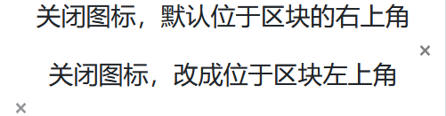

# 其它基础样式

> 这里讲述 bootstrap 自带的大量公共样式类：

| 样式类分类           | 描述                                                 |
| -------------------- | ---------------------------------------------------- |
| `Borders`            | 边框相关样式                                         |
| `Clearfix`           | 清除容器中的浮动内容                                 |
| `Close icon`         | 关闭按钮                                             |
| `Display property`   | 不同宽度设备间，快速切换显示值                       |
| `Embeds`             | `<iframe> & <embed> & <video> & <object>` 标签中使用 |
| `Flex`               | 快速管理布局，对齐，网格列的大小                     |
| `Float`              | 切换任何元素上的浮动                                 |
| `Overflow`           | 处理元素溢出                                         |
| `Position`           | 处理元素定位                                         |
| `Screenreaders`      | 设备间的隐藏                                         |
| `Shadows`            | 处理元素的阴影                                       |
| `Sizing`             | 处理元素宽度和高度                                   |
| `Spacing`            | 响应式处理元素的外观                                 |
| `Text`               | 用于控制元素的对齐、换行等                           |
| `Vertical alignment` | 处理元素的垂直对齐                                   |
| `Visibility`         | 在不修改`display`的情况下，控制元素的可见性。        |

## Borders

> 使用边框实用程序快速样式化元素的边框和边框半径。非常适合图像、按钮或任何其他元素。

| 样式类            | 描述                      |
| ----------------- | ------------------------- |
| `border`          | 带边框                    |
| `border-left`     | 左侧带边框                |
| `border-right`    | 右侧带边框                |
| `border-top`      | 头部带边框                |
| `border-bottom`   | 底部带边框                |
| `border-0`        | 禁用边框                  |
| `border-left-0`   | 左侧禁用边框              |
| `border-right-0`  | 右侧禁用边框              |
| `border-top-0`    | 头部禁用边框              |
| `border-bottom-0` | 底部禁用边框              |
| `rounded`         | 圆角                      |
| `rounded-0`       | 禁用圆角                  |
| `rounded-left`    | 左侧上下角都带圆角        |
| `rounded-right`   | 右侧上下角都带圆角        |
| `rounded-top`     | 头部上下角都带圆角        |
| `rounded-bottom`  | 底部上下角都带圆角        |
| `rounded-circle`  | `border-radius`为 `50%`   |
| `rounded-pill`    | `border-radius`为 `50rem` |
| `border-颜色代号` | 在公共事务篇已经讲解      |

> 案例


```html
<div class="container">
    <svg class="border" width="75" height="50" style="text-anchor:middle">
        <rect fill="#efefef" width="100%" height="100%"></rect>
        <text fill="#ccc" dy=".4em" x="50%" y="50%">75x50</text>
    </svg>
    <svg class="border border-primary" width="75" height="50" style="text-anchor:middle">
        <rect fill="#efefef" width="100%" height="100%"></rect>
        <text fill="#ccc" dy=".4em" x="50%" y="50%">75x50</text>
    </svg>
    <svg class="border-bottom border-primary" width="75" height="50" style="text-anchor:middle">
        <rect fill="#efefef" width="100%" height="100%"></rect>
        <text fill="#ccc" dy=".4em" x="50%" y="50%">75x50</text>
    </svg>
    <svg class="border-bottom border-primary rounded" width="75" height="50" style="text-anchor:middle">
        <rect fill="#efefef" width="100%" height="100%"></rect>
        <text fill="#ccc" dy=".4em" x="50%" y="50%">75x50</text>
    </svg>
    <svg class="border-bottom border-primary rounded-circle" width="75" height="50" style="text-anchor:middle">
        <rect fill="#efefef" width="100%" height="100%"></rect>
        <text fill="#ccc" dy=".4em" x="50%" y="50%">75x50</text>
    </svg>
    <svg class="border-bottom border-primary rounded-pill" width="75" height="50" style="text-anchor:middle">
        <rect fill="#efefef" width="100%" height="100%"></rect>
        <text fill="#ccc" dy=".4em" x="50%" y="50%">750x500</text>
    </svg>
</div>
```

## Clearfix

> 通过向父元素添加.clearfix，可以轻松清除浮动。


```html
<div class="container">
    <h3 class="text-center mt-3">带 <code>.clearfix</code> 的效果</h3>
    <div class="bg-primary clearfix mb-3">
        <button type="button" class="btn btn-secondary float-left">左浮动按钮</button>
        <a type="button" class="btn btn-secondary float-right text-light">右浮动链接</a>
    </div>
    <div class="bg-primary clearfix">
        <button type="button" class="btn btn-secondary float-left">左浮动按钮</button>
        <a type="button" class="btn btn-secondary float-right text-light">右浮动链接</a>
    </div>
    <hr>
    <h3 class="text-center mt-3">不带 <code>.clearfix</code> 的效果</h3>
    <div class="bg-primary  mb-3">
        <button type="button" class="btn btn-secondary float-left">左浮动按钮</button>
        <a type="button" class="btn btn-secondary float-right text-light">右浮动链接</a>
    </div>
    <div class="bg-primary ">
        <button type="button" class="btn btn-secondary float-left">左浮动按钮</button>
        <a type="button" class="btn btn-secondary float-right text-light">右浮动链接</a>
    </div>
</div>
```

## Close icon

> 使用一个通用的关闭图标来关闭modals和alerts等组件内容。



```html
<div class="container">
    <h3 class="text-center">关闭图标，默认位于区块的右上角</h3>
    <div class="clearfix">
        <button type="button" class="close">
            <span>&times;</span>
        </button>
    </div>
    <h3 class="text-center">通过 <code>.float-left</code> 改成位于区块左上角</h3>
    <div class="clearfix">
        <a class="close float-left">
            <span>&times;</span>
        </a>
    </div>
</div>
```
