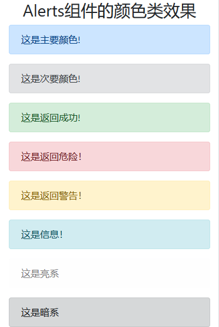
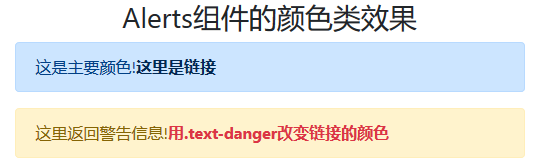
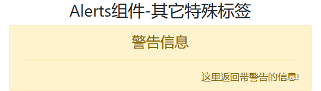
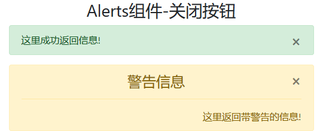

<!--
+===============================================================================
| @Author: madnesslin(地上马)
+===============================================================================
| @Phone: +86 13695746767
+===============================================================================
| @Date: 2018-12-29 20:27:59
+===============================================================================
| @Email: linjialiang@163.com
+===============================================================================
| @Last modified time: 2018-12-29 23:20:28
+===============================================================================
-->

# Alerts 组件

> 这是 bootstrap 的通知组件
>
> - 使用灵活的警告消息可以为用户在操作时提供上下文的反馈消息，使得整个流程更加人性化！

## 标签要求

> Alerts 组件，对标签没有要求，主要是通过样式类和 js 来改变视觉

## 样式类

> Alerts 组件，的样式类主要包含颜色类和结构类，内容如下：

### 颜色类表

| 颜色类             | 描述 |
| ------------------ | ---- |
| `.alert-primary`   | 基本 |
| `.alert-secondary` | 次要 |
| `.alert-success`   | 成功 |
| `.alert-danger`    | 危险 |
| `.alert-warning`   | 警告 |
| `.alert-info`      | 信息 |
| `.alert-light`     | 亮系 |
| `.alert-dark`      | 暗系 |

### 结构类表

| 结构类               | 描述                                           |
| -------------------- | ---------------------------------------------- |
| `.alert`             | 颜色类的基础，与颜色类处于同一标签             |
| `.alert-link`        | 字体变粗，并改变颜色                           |
| `<hr>`               | 每个颜色类下的`<hr>`标签都有对应的效果         |
| `.alert-heading`     | 通知信息的标题，标题标签的颜色值对应颜色类     |
| `.alert-dismissible` | 消息的关闭行为相关类                           |
| `.close`             | `.alert-dismissible`对应标签下的关闭按钮样式类 |

## js 行为

> js 行为又分 `触发方法 & 触发事件`

### 触发方法

| 方法                   | 描述                                                                                                          |
| ---------------------- | ------------------------------------------------------------------------------------------------------------- |
| `$().alert()`          | 在具有 `data-dismiss="alert"` 属性的子代元素上发出警告侦听单击事件。(在使用数据 api 的自动初始化时没有必要。) |
| `$().alert('close')`   | 通过从 DOM 中删除警报来关闭。如果元素上有 `.fade & .show` 类，警告将在移除之前淡出。                          |
| `$().alert('dispose')` | 破坏元素的警告。                                                                                              |

### 触发事件

> `bootstrap` 的警报插件公开了一些事件，用于连接警报功能

| 事件              | 描述                                          |
| ----------------- | --------------------------------------------- |
| `close.bs.alert`  | 当调用 close 实例方法时，该事件立即触发。     |
| `closed.bs.alert` | 该事件在警报关闭时触发(将等待 CSS 转换完成)。 |

## 案例

> 用例子来说明 Alerts 组件

### Alerts 组件的颜色类效果



```html
<div class="container">
    <h3 class="text-center">Alerts组件的颜色类效果</h3>
    <div class="alert alert-primary">
        <p class="mb-0">这是主要颜色!</p>
    </div>
    <div class="alert alert-secondary">
        <p class="mb-0">这是次要颜色!</p>
    </div>
    <div class="alert alert-success">
        <p class="mb-0">这是返回成功!</p>
    </div>
    <div class="alert alert-danger">
        <p class="mb-0">这是返回危险！</p>
    </div>
    <div class="alert alert-warning">
        <p class="mb-0">这是返回警告！</p>
    </div>
    <div class="alert alert-info">
        <p class="mb-0">这是信息！</p>
    </div>
    <div class="alert alert-light">
        <p class="mb-0">这是亮系</p>
    </div>
    <div class="alert alert-dark">
        <p class="mb-0">这是暗系</p>
    </div>
</div>
```

### Alerts 组件-带链接



```html
<div class="container">
    <h3 class="text-center">Alerts组件-带链接</h3>
    <div class="alert alert-primary">
        <p class="mb-0">这是主要颜色!<a href="javascript:void(0);" class="alert-link">这里是链接</a></p>
    </div>
    <div class="alert alert-warning">
        <p class="mb-0">这里返回警告信息!<a href="javascript:void(0);" class="alert-link text-danger">用.text-danger改变链接的颜色</a></p>
    </div>
</div>
```

### Alerts 组件-其它特殊标签



```html
<div class="container">
    <h3 class="text-center">Alerts组件-其它特殊标签</h3>
    <div class="alert alert-warning">
        <h4 class="alert-heading text-center">警告信息</h4>
        <hr>
        <p class="mb-0 text-right">这里返回带警告的信息!</p>
    </div>
</div>
```

### Alerts 组件-关闭按钮

> 关闭按钮样式是 js 行为的载体，所以必须掌握



```html
<div class="container">
    <h3 class="text-center">Alerts组件-其它特殊标签</h3>
    <div class="alert alert-success">
        <button type="button" name="close" class="close"> &times; </button>
        <p class="mb-0">这里成功返回信息!</p>
    </div>
    <div class="alert alert-warning">
        <button type="button" name="close" class="close">&times;</button>
        <h4 class="alert-heading text-center">警告信息</h4>
        <hr>
        <p class="mb-0 text-right">这里返回带警告的信息!</p>
    </div>
</div>
```

### js 方法

### js 事件
