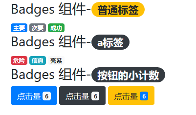

# Badges 组件

> 标志组件，可以用来制作徽章、内联小计数以及内容标签等

## 颜色类表

| 颜色类             | 描述 |
| ------------------ | ---- |
| `.badge-primary`   | 基本 |
| `.badge-secondary` | 次要 |
| `.badge-success`   | 成功 |
| `.badge-danger`    | 危险 |
| `.badge-warning`   | 警告 |
| `.badge-info`      | 信息 |
| `.badge-light`     | 亮系 |
| `.badge-dark`      | 暗系 |

## 结构类表

| 结构类       | 描述                        |
| ------------ | --------------------------- |
| `badge`      | 标志组件的基础样式类        |
| `badge-pill` | 两侧被`border-radius`成半圆 |

## 应用范围

> Badges 组件应用范围比较广泛，常用的如下表：

| 应用标签   | 描述                          |
| ---------- | ----------------------------- |
| 内联标签   | 内容标签， `h1~h6` 下更像徽章 |
| `a`        | 与内联标签效果基本一致        |
| `<button>` | 按钮内部的小计数              |

## 案例



```html
<div class="container">
    <h3>Badges 组件-<span class="badge badge-warning badge-pill">普通标签</span></h3>
    <span class="badge badge-primary">主要</span>
    <span class="badge badge-secondary">次要</span>
    <span class="badge badge-success">成功</span>
    <h3>Badges 组件-<span class="badge badge-dark badge-pill">a标签</span></h3>
    <a href="javascript:void(0);" class="badge badge-danger">危险</a>
    <a href="javascript:void(0);" class="badge badge-info">信息</a>
    <a href="javascript:void(0);" class="badge badge-light">亮系</a>
    <h3>Badges 组件-<span class="badge badge-dark badge-pill">按钮的小计数</span></h3>
    <button type="button" name="button" class="btn btn-primary">点击量 <span class="badge badge-light">6</span></button>
    <button type="button" name="button" class="btn btn-dark">点击量 <span class="badge badge-light">6</span></button>
    <button type="button" name="button" class="btn btn-warning">点击量 <span class="badge badge-primary">6</span></button>
</div>
```
