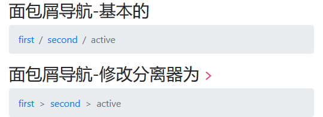

<!--
+===============================================================================
| @Author: madnesslin(地上马)
+===============================================================================
| @Phone: +86 13695746767
+===============================================================================
| @Date: 2018-12-31 10:24:11
+===============================================================================
| @Email: linjialiang@163.com
+===============================================================================
| @Last modified time: 2018-12-31 10:58:25
+===============================================================================
-->

# Breadcrumb 组件

> `Breadcrumb 组件` 就是我们常说的 `面包屑导航`

## 样式类表

| 样式类             | 描述                     |
| ------------------ | ------------------------ |
| `.breadcrumb`      | 父标签，面包屑导航的基础 |
| `.breadcrumb-item` | 子标签                   |
| `active`           | 子标签，当前活动页面     |

## 案例



```html
<div class="container">
    <h3>面包屑导航-基本的</h3>
    <nav class="breadcrumb">
        <a href="javascript:void(0);" class="breadcrumb-item">first</a>
        <a href="javascript:void(0)" class="breadcrumb-item">second</a>
        <span class="breadcrumb-item active">active</span>
    </nav>
    <h3>面包屑导航-修改分离器为 <code>&gt;</code> </h3>
    <style media="screen">
        #separator .breadcrumb-item + .breadcrumb-item::before {
            content: ">";
        }
    </style>
    <nav class="breadcrumb" id="separator">
        <a href="javascript:void(0);" class="breadcrumb-item">first</a>
        <a href="javascript:void(0)" class="breadcrumb-item">second</a>
        <span class="breadcrumb-item active">active</span>
    </nav>
</div>
```
