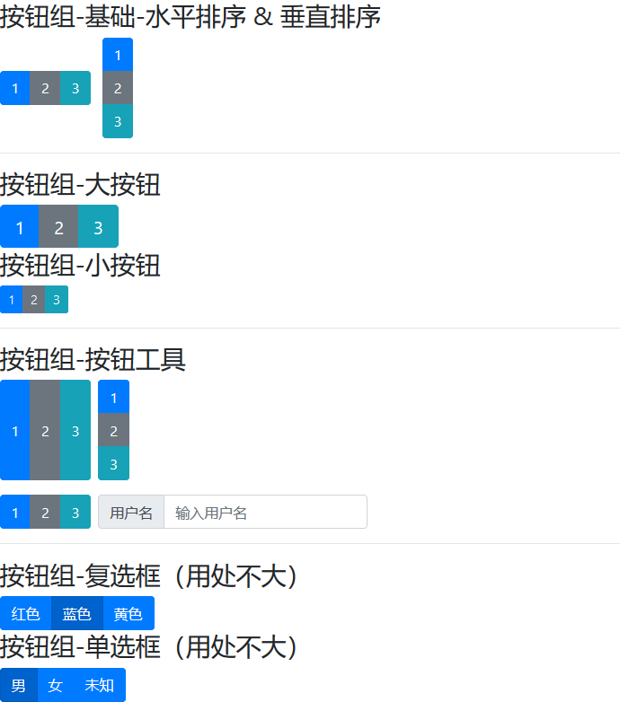

<!--
+===============================================================================
| @Author: madnesslin(地上马)
+===============================================================================
| @Phone: +86 13695746767
+===============================================================================
| @Date: 2018-12-31 11:08:21
+===============================================================================
| @Email: linjialiang@163.com
+===============================================================================
| @Last modified time: 2018-12-31 14:15:51
+===============================================================================
-->

# `buttons组件` & `button group组件`

> 按钮在颜色篇已经有接触过，这里将未覆盖的内容继续讲解

## `buttons组件` 知识点补充

### btn 涉及到的知识点

| 知识点 | 描述                                                   |
| ------ | ------------------------------------------------------ |
| 标签   | btn 样式主要应用于 `<button> & <input> & <a>` 3 类标签 |
| 大小   | 大小分 `文字正常 & 文字大 & 文字小 & 按钮块级`         |
| 禁用   | 按钮和 a 标签的禁用按钮的定义方式有所区别              |

### 案例


```html
<div class="container">
    <h3>btn-标签</h3>
    <button type="button" name="button" class="btn btn-dark">这是<code>&lt;button&gt;</code>标签</button>
    <input type="button" name="" class="btn btn-primary" value="这是&lt;input&gt;标签">
    <a href="javascript:void(0)" class="btn btn-success">这是&lt;a&gt;标签</a>
    <hr>
    <h3>btn-按钮大小</h3>
    <button type="button" name="button" class="btn btn-primary btn-lg">这是大按钮</button>
    <button type="button" name="button" class="btn btn-primary">这是正常大小按钮</button>
    <button type="button" name="button" class="btn btn-primary btn-sm">这是小按钮</button>
    <hr>
    <h3>btn-活动按钮</h3>
    <button type="button" name="button" class="btn btn-primary">正常</button>
    <button type="button" name="button" class="btn btn-primary active">活动按钮颜色深</button>
    <button type="button" name="button" class="btn btn-primary">正常</button>
    <hr>
    <button type="button" name="button" class="btn btn-primary btn-block">这是块级按钮</button>
    <hr>
    <h3>btn-禁用按钮， <code>&lt;button&gt;</code> 和 <code>a</code> 有所不同</h3>
    <button type="button" name="button" class="btn btn-primary" disabled>这是禁用的按钮</button>
    <a href="javascript:void(0)" class="btn btn-warning disabled">这是禁用的链接</a>
</div>
```

> PS：btn 还有一些其它的效果，诸如针对 `checkbox & radio` 等，但这里不进行讲解，在后续要吗会提起，或者使用率低直接过滤！

## button group 组件

> 使用按钮组将一系列按钮组合在一行上，并允许使用 JavaScript 对它们进行处理

### 按钮组涉及到的知识点

| 知识点                | 描述                                           |
| --------------------- | ---------------------------------------------- |
| `.btn-group`          | 父级，按钮组基础,水平排序                      |
| `.btn-group-vertical` | 父级，按钮组基础,垂直排序                      |
| `.btn-group-lg`       | 父级，按钮组下所有按钮放大                     |
| `.btn-group-sm`       | 父级，按钮组下所有按钮缩小                     |
| `.btn-group-toggle`   | 父级，针对复选框、单选框                       |
| `.btn-toolbar`        | 祖级，将按钮组集合组合为更复杂组件的按钮工具栏 |
| 嵌入                  | 父级，可以嵌入`Dropdowns组件（下拉菜单）`      |

### 案例



```html
<div class="container">
    <form class="" action="index.html" method="post">
        <h3>按钮组-基础-水平排序 & 垂直排序</h3>
        <div class="btn-group mr-2">
            <button type="button" class="btn btn-primary">1</button>
            <button type="button" class="btn btn-secondary">2</button>
            <button type="button" class="btn btn-info">3</button>
        </div>
        <div class="btn-group-vertical">
            <button type="button" class="btn btn-primary">1</button>
            <button type="button" class="btn btn-secondary">2</button>
            <button type="button" class="btn btn-info">3</button>
        </div>
        <hr>
        <h3>按钮组-大按钮</h3>
        <div class="btn-group btn-group-lg">
            <button type="button" class="btn btn-primary">1</button>
            <button type="button" class="btn btn-secondary">2</button>
            <button type="button" class="btn btn-info">3</button>
        </div>
        <h3>按钮组-小按钮</h3>
        <div class="btn-group btn-group-sm">
            <button type="button" class="btn btn-primary">1</button>
            <button type="button" class="btn btn-secondary">2</button>
            <button type="button" class="btn btn-info">3</button>
        </div>
        <hr>
        <h3>按钮组-按钮工具</h3>
        <div class="btn-toolbar">
            <div class="btn-group mr-2">
                <button type="button" class="btn btn-primary">1</button>
                <button type="button" class="btn btn-secondary">2</button>
                <button type="button" class="btn btn-info">3</button>
            </div>
            <div class="btn-group-vertical mr-2">
                <button type="button" class="btn btn-primary">1</button>
                <button type="button" class="btn btn-secondary">2</button>
                <button type="button" class="btn btn-info">3</button>
            </div>
        </div>
        <div class="btn-toolbar mt-3">
            <div class="btn-group mr-2">
                <button type="button" class="btn btn-primary">1</button>
                <button type="button" class="btn btn-secondary">2</button>
                <button type="button" class="btn btn-info">3</button>
            </div>
            <div class="input-group">
                <div class="input-group-prepend">
                    <label class="input-group-text" for="username">用户名</label>
                </div>
                <input type="text" class="form-control" placeholder="输入用户名" id="username">
            </div>
        </div>
        <hr>
        <h3>按钮组-复选框（用处不大）</h3>
        <div class="btn-group btn-group-toggle" data-toggle="buttons">
            <label class="btn btn-primary">
                <input type="checkbox" name="color" value="red">红色 </label>
            <label class="btn btn-primary active">
                <input type="checkbox" name="color" checked value="bule">蓝色 </label>
            <label class="btn btn-primary">
                <input type="checkbox" name="color" value="yellow">黄色 </label>
        </div>
        <h3>按钮组-单选框（用处不大）</h3>
        <div class="btn-group btn-group-toggle" data-toggle="buttons">
            <label class="btn btn-primary active" for="man">
                <input type="radio" name="sex" id="man" value="man" disabled>男 </label>
            <label class="btn btn-primary" for="nv">
                <input type="radio" name="sex" value="nv" id="nv">女 </label>
            <label class="btn btn-primary" for="underfind">
                <input type="radio" name="sex" value="underfind" id="underfind">未知 </label>
        </div>
    </form>
</div>
```

> PS：案例中可以看出来，`btn` 系列属于表单的一部分，与 `input` 等表单系列样式对齐
