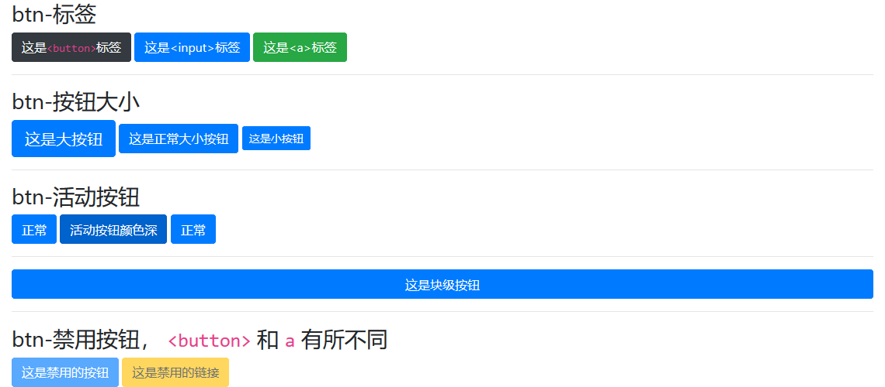

<!--
+===============================================================================
| @Author: madnesslin(地上马)
+===============================================================================
| @Phone: +86 13695746767
+===============================================================================
| @Date: 2018-12-31 11:08:21
+===============================================================================
| @Email: linjialiang@163.com
+===============================================================================
| @Last modified time: 2018-12-31 12:11:46
+===============================================================================
-->

# 按钮 & 按钮组篇

> 按钮在颜色篇已经有接触过，这里将未覆盖的内容继续讲解

## btn 样式类适应的标签

> 除了 `<button>` 外，btn 样式类还支持 `<input> & <a>`

## btn 涉及到的知识点

| 知识点 | 描述                                                   |
| ------ | ------------------------------------------------------ |
| 标签   | btn 样式主要应用于 `<button> & <input> & <a>` 3 类标签 |
| 大小   | 大小分 `文字正常 & 文字大 & 文字小 & 按钮块级`         |
| 禁用   | 按钮和 a 标签的禁用按钮的定义方式有所区别              |

## 案例



```html
<div class="container">
    <h3>btn-标签</h3>
    <button type="button" name="button" class="btn btn-dark">这是<code>&lt;button&gt;</code>标签</button>
    <input type="button" name="" class="btn btn-primary" value="这是&lt;input&gt;标签">
    <a href="javascript:void(0)" class="btn btn-success">这是&lt;a&gt;标签</a>
    <hr>
    <h3>btn-按钮大小</h3>
    <button type="button" name="button" class="btn btn-primary btn-lg">这是大按钮</button>
    <button type="button" name="button" class="btn btn-primary">这是正常大小按钮</button>
    <button type="button" name="button" class="btn btn-primary btn-sm">这是小按钮</button>
    <hr>
    <button type="button" name="button" class="btn btn-primary btn-block">这是块级按钮</button>
    <hr>
    <h3>btn-禁用按钮， <code>&lt;button&gt;</code> 和 <code>a</code> 有所不同</h3>
    <button type="button" name="button" class="btn btn-primary" disabled>这是禁用的按钮</button>
    <a href="javascript:void(0)" class="btn btn-warning disabled">这是禁用的链接</a>
</div>
```
