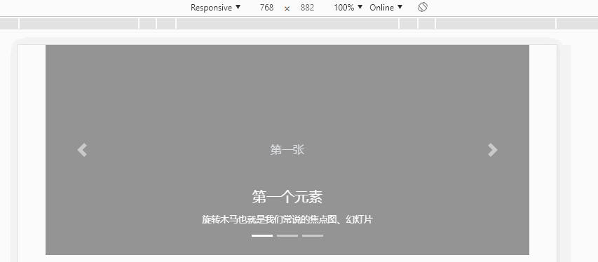

# Carousel 组件

> 旋转木马就是我们常说的 `焦点图 & 幻灯片` 效果
>
> - 用于循环浏览元素的幻灯片组件——图像或文本幻灯片，就像旋转木马一样。
> - 注意：不支持嵌套的旋转木马，而且旋转木马通常不符合可访问性标准。

## 类表

| 类                          | 描述                                                                                     |
| --------------------------- | ---------------------------------------------------------------------------------------- |
| .carousel                   | 1 级，创建一个轮播                                                                       |
| .carousel-indicators        | 2 级，为轮播添加一个指示符，就是轮播图底下的一个个小点，轮播的过程可以显示目前是第几张图 |
| .carousel-inner             | 2 级，添加要切换的图片                                                                   |
| .carousel-item              | 3 级，指定每个图片的内容                                                                 |
| .carousel-control-prev      | 2 级，添加左侧的按钮，点击会返回上一张                                                   |
| .carousel-control-next      | 2 级，添加右侧按钮，点击会切换到下一张                                                   |
| .carousel-control-prev-icon | 3 级，与 .carousel-control-prev 一起使用，设置左侧的按钮                                 |
| .carousel-control-next-icon | 3 级，与 .carousel-control-next 一起使用，设置右侧的按钮                                 |
| .slide                      | 切换图片的过渡和动画效果，如果你不需要这样的效果，可以删除这个类                         |
| .carousel-fade              | 基于`.slide`淡入淡出的图片切换效果，如果你不需要这样的效果，可以删除这个类               |
| `data-ride="carousel"`      | 1 级，实现自动轮播效果                                                                   |
| `.d-block & .w-100`         | 与`.carousel-item`统一 div，防止浏览器默认图像对齐                                       |
| `.active`                   | 用于展示当前图片以及当前指示器                                                           |
| `data-slide-to`             | 用于指示器，让指示器具有点击跳转到指定元素的效果                                         |
| `data-slide="prev"`         | 前一个元素，必须与`href="#当前旋转木马id"`一起使用                                       |
| `data-slide="next"`         | 后一个元素，必须与`href="#当前旋转木马id"`一起使用                                       |
| `data-target`               | 用于指示器，与`.carousel`1 级 div 的 id 对应                                             |
| `.carousel-caption`         | 在元素中显示标题与描述                                                                   |
| `.d-none & .d-md-block`     | 与`.carousel-caption`组合使用，使得在小屏幕设备上禁止显示文字描述                                                            |

> 轮播图片选项可以通过数据属性或 JavaScript 传递。对于数据属性，将选项名附加到`data-`，如`data-interval=""`中。

| 选项属性名      | 类型              | 默认值    | 描述                                                                                                                                           |
| --------------- | ----------------- | --------- | ---------------------------------------------------------------------------------------------------------------------------------------------- |
| `data-interval` | 数值              | 5000      | 在自动循环中，指定项目之间延迟的时间量。如果不存在，旋转木马不会自动循环                                                                       |
| `data-keyboard` | 布尔值            | true      | 旋转木马是否应对键盘事件作出反应。                                                                                                             |
| `data-pause`    | `字符串 & 布尔值` | `"hover"` | 如果设置为`"hover"`，则在`mouseenter`上暂停旋转木马的循环，并在`mouseleave`上恢复旋转木马的循环。如果设置为`false`，悬停在旋转木马上不会暂停。 |
| `data-ride`     | 字符串            | false     | 自动旋转旋转木马后，用户手动循环第一个项目。如果 `"carousel"`，自动加载旋转木马。                                                              |
| `data-wrap`     | 布尔值            | true      | 自动旋转到最后一个元素时，是否停止旋转，设置为 `false` 则停止继续旋转                                                                          |
| `data-touch`    | 布尔值            | true      | 规定在移动设备时是否支持滑屏，设置为 `false` 则不支持                                                                                          |

## 案例展示

> 没有特殊要求，直接使用该案例就非常完美了



```html
<div class="container">
    <!-- .slide 是旋转木马的动画效果基类 -->
    <!-- .carousel-fade 实现淡入淡出（基于.slide） -->
    <!--  data-wrap="false" 代表旋转到最后一个元素后，不会继续 -->
    <div class="carousel slide carousel-fade" id="carousel-001" data-ride="carousel">
        <!-- 指示器 -->
        <ol class="carousel-indicators">
            <!-- .active只能存在一个元素中 -->
            <!-- data-slide-to="元素索引值" 让指示器具有点击跳转到指定元素的效果 -->
            <li data-target="#carousel-001" data-slide-to="0" class="active"></li>
            <li data-target="#carousel-001" data-slide-to="1"></li>
            <li data-target="#carousel-001" data-slide-to="2"></li>
        </ol>
        <!-- 旋转木马元素 -->
        <div class="carousel-inner">
            <!-- .active 必须存在，并且只能出现一个元素中 -->
            <!-- data-interval="1000" 代表切换元素的时间为1秒 -->
            <div class="carousel-item active" data-interval="1000">
                <!-- .d-none & .d-md-block 与 .carousel-caption 组合使用，使得在小屏幕设备上禁止显示文字描述 -->
                <div class="carousel-caption d-none d-md-block">
                    <h5>第一个元素</h5>
                    <small>旋转木马也就是我们常说的焦点图、幻灯片</small>
                </div>
                <svg style="text-anchor:middle" class="img-fluid" role="img" width="100%" height="300">
                    <rect fill="rgba(158,158,158,1)" width="100%" height="100%"></rect>
                    <text fill="#dee2e6" dy=".3em" x="50%" y="50%">第一张</text>
                </svg>
            </div>
            <!-- data-interval="8000" 代表切换元素的时间为8秒 -->
            <div class="carousel-item" data-interval="2000">
                <svg style="text-anchor:middle" class="img-fluid" role="img" width="100%" height="300">
                    <rect fill="rgba(140,150,205,1)" width="100%" height="100%"></rect>
                    <text fill="#dee2e6" dy=".3em" x="50%" y="50%">第二张</text>
                </svg>
                <div class="carousel-caption d-none d-md-block">
                    <h5>第一个元素</h5>
                    <small>旋转木马也就是我们常说的焦点图、幻灯片</small>
                </div>
            </div>
            <!-- data-interval属性不设置，代表切换元素的时间为默认值，5秒 -->
            <div class="carousel-item" data-interval="3000">
                <svg style="text-anchor:middle" class="img-fluid" role="img" width="100%" height="300">
                    <rect fill="rgba(120,91,184,1)" width="100%" height="100%"></rect>
                    <text fill="#dee2e6" dy=".3em" x="50%" y="50%">第三张</text>
                </svg>
                <div class="carousel-caption d-none d-md-block">
                    <h5>第一个元素</h5>
                    <small>旋转木马也就是我们常说的焦点图、幻灯片</small>
                </div>
            </div>
        </div>
        <!-- 上一张 & 下一张 -->
        <a class="carousel-control-prev" href="#carousel-001" data-slide="prev">
            <i class="carousel-control-prev-icon"></i>
        </a>
        <a class="carousel-control-next" href="#carousel-001" data-slide="next">
            <i class="carousel-control-next-icon"></i>
        </a>
    </div>
</div>
<script src="/static/base/js/jquery.min.js"></script>
<script src="/static/base/js/bootstrap.bundle.min.js"></script>
```


> PS：除此之外，旋转木马还支持`js方法` 和 `js时间`。具体查看官方手册
