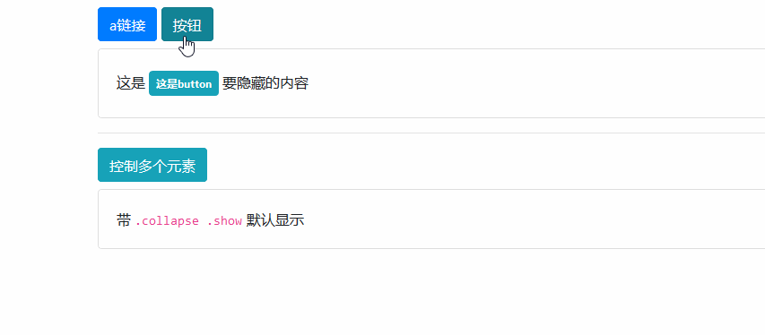
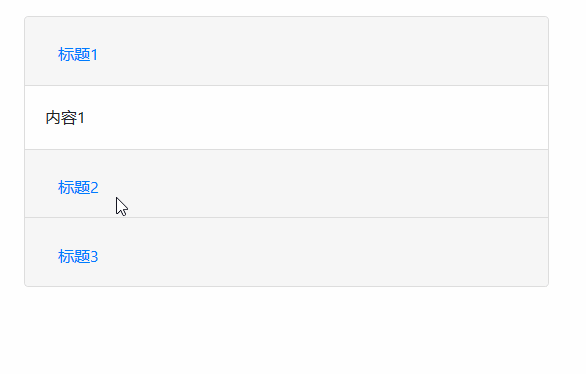

# Collapse 组件

> 折叠组件可以很容易地让页面区域折叠起来。无论您用它来创建折叠导航还是内容面板，它都允许很多内容选项。
>
> - 折叠组件的作用就是通过元素的点击事件，来控制另一个元素的显示与隐藏，并带有一些动态效果

## 支持的标签

> 该组件，点击事件支持的元素有很多，一般我们会选择使用`<a> & <button>`

| 元素       | 链接属性                                |
| ---------- | --------------------------------------- |
| `<a>`      | 用 `href="#id"` 获取要处理的元素        |
| `<button>` | 用 `data-target="#id"` 获取要处理的元素 |

## 元素属性描述

| 属性                     | 描述                                                                             |
| ------------------------ | -------------------------------------------------------------------------------- |
| `data-toggle="collapse"` | 该元素，用于点击事件，必须使用 `href="#id" & data-target="#id"` 获取要处理的元素 |
| `class="collapse"`       | 该元素，默认隐藏，用于出发标签，必须有 id 值                                     |
| `class="collapse show"`  | 该元素，默认显示，用于出发标签，必须有 id 值                                     |

## 简单案例

> 这是一个 `折叠组件` 最简单的应用



```html
<div class="container mt-3">
    <!-- 带 data-toggle="collapse" 属性的标签，用于点击事件 -->
    <!-- 必须使用 `href="#id" & data-target="#id"` 获取要处理的元素,可以是class -->
    <a data-toggle="collapse" href="#collapse-a" class="btn btn-primary">a链接</a>
    <button data-toggle="collapse" data-target="#collapse-button" type="button" name="button" class="btn btn-info">按钮</button>
    <div class="collapse mt-2" id="collapse-a">
        <div class="card card-body">
            <div class="card-text"> 这是<span class="badge badge-primary p-2 m-1">这是a链接</span>要隐藏的内容 </div>
        </div>
    </div>
    <div class="collapse show mt-2" id="collapse-button">
        <div class="card card-body">
            <div class="card-text"> 这是<span class="badge badge-info p-2 m-1">这是button</span>要隐藏的内容 </div>
        </div>
    </div>
    <hr>
    <button data-toggle="collapse" data-target=".collapse-number" type="button" name="button" class="btn btn-info">控制多个元素</button>
    <div class="collapse mt-2 collapse-number">
        <div class="card card-body">
            <div class="card-text">
                <code>.collapse</code> 默认隐藏的 </div>
        </div>
    </div>
    <div class="collapse show mt-2 collapse-number">
        <div class="card card-body">
            <div class="card-text"> 带 <code>.collapse .show</code> 默认显示 </div>
        </div>
    </div>
</div>
<script src="/static/base/js/jquery.min.js"></script>
<script src="/static/base/js/bootstrap.bundle.min.js"></script>
```

## 手风琴效果

> 手风琴必须使用 `.accordion` 包装，并且有一个 id 值或 class 值来触发

| 属性                      | 描述                                |
| ------------------------- | ----------------------------------- |
| `.accordion`              | 手风琴第一层 div，添加改类          |
| `data-parent="#selector"` | 选择器对应手风琴第一层 div 的 id    |
| `data-parent=".selector"` | 选择器对应手风琴第一层 div 的 class |

> PS：注意 `data-parent=""` 的只必须全部一样，否则手风琴将失效！



```html
<div class="container mt-3">
    <div class="accordion col-6 accordion-selector" id="accordion-selector">
        <div class="card">
            <div class="card-header">
                <h2 class="mb-0">
                    <button class="btn btn-link" type="button" data-toggle="collapse" data-target="#collapseOne">标题1</button>
                </h2>
            </div>
            <div id="collapseOne" class="collapse show" data-parent=".accordion-selector">
                <div class="card-body">
                    <div class="card-text"> 内容1 </div>
                </div>
            </div>
        </div>
        <div class="card">
            <div class="card-header">
                <h2 class="mb-0">
                    <button class="btn btn-link" type="button" data-toggle="collapse" data-target="#collapseTwo">标题2</button>
                </h2>
            </div>
            <div id="collapseTwo" class="collapse" data-parent=".accordion-selector">
                <div class="card-body">
                    <div class="card-text"> 内容2 </div>
                </div>
            </div>
        </div>
        <div class="card">
            <div class="card-header">
                <h2 class="mb-0">
                    <button class="btn btn-link" type="button" data-toggle="collapse" data-target="#collapseThree">标题3</button>
                </h2>
            </div>
            <div id="collapseThree" class="collapse" data-parent=".accordion-selector">
                <div class="card-body">
                    <div class="card-text"> 内容3 </div>
                </div>
            </div>
        </div>
    </div>
</div>
<script src="/static/base/js/jquery.min.js"></script>
<script src="/static/base/js/bootstrap.bundle.min.js"></script>
```
