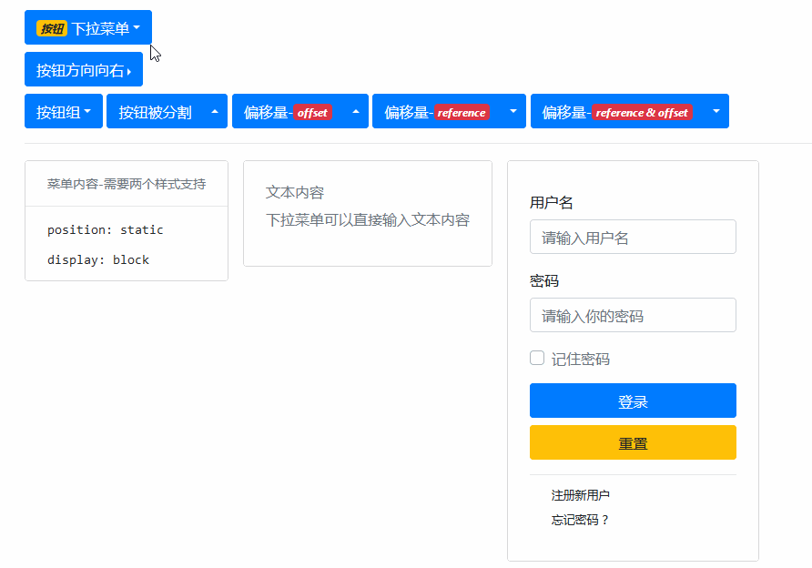
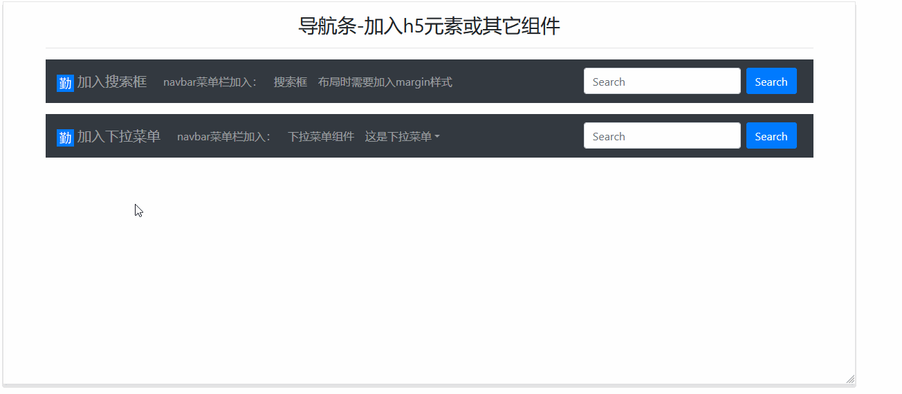

# Dropdowns 组件

> 下拉菜单，主要应用于 `<a> & <button>`

| 元素                      | 描述                                                            |
| ------------------------- | --------------------------------------------------------------- |
| `.dropdown`               | 基础，菜单向下                                                  |
| `.dropup`                 | 基础，菜单向上                                                  |
| `.dropright`              | 基础，菜单向右                                                  |
| `.dropleft`               | 基础，菜单向左                                                  |
| `.dropdown-toggle`        | 点击事件元素的类， 可以是 `<a> & <button>`                      |
| `.dropdown-menu`          | 下拉元素的父元素类                                              |
| `.dropdown-item`          | 下拉元素类， 可以是 `<a> & <button>`                            |
| `.dropdown-header`        | 在任何下拉菜单中添加标题来标记操作的各个部分。                  |
| `.dropdown-item-text`     | 非交互式下拉项                                                  |
| `.active`                 | 下拉元素类，使该项处于活动背景色                                |
| `.disabled & disabled`    | 下拉元素类，使该项处于禁用状态，`<a> & <button>` 的定义方式不同 |
| `dropdown-divider`        | 使用分隔符分隔相关菜单项的组。                                  |
| `data-offse`              | 改变下拉菜单的偏移量，如：`data-offset="10,20"`                 |
| `data-display="static"`   | 点击事件元素类，响应式对齐                                      |
| `.dropdown-menu-right`    | 下拉元素父元素，向按钮右侧对齐                                  |
| `.dropdown-menu-left`     | 下拉元素父元素，向按钮左侧对齐                                  |
| `.dropdown-menu-sm-left`  | 下拉元素父元素，指定宽度屏幕，向按钮左侧对齐                    |
| `.dropdown-menu-md-left`  | 下拉元素父元素，指定宽度屏幕，向按钮左侧对齐                    |
| `.dropdown-menu-lg-right` | 下拉元素父元素，指定宽度屏幕，向按钮右侧对齐                    |
| `.dropdown-menu-xl-right` | 下拉元素父元素，指定宽度屏幕，向按钮右侧对齐                    |

> PS：除此之外，还有 js 方法和事件，以及其他嵌入操作，如表单嵌入等...

## 案例



```html
<div class="container mt-3">
    <div class="dropdown">
        <button class="btn btn-primary dropdown-toggle" type="button" data-toggle="dropdown"><i class="badge badge-warning">按钮</i> 下拉菜单</button>
        <div class="dropdown-menu">
            <button class="dropdown-item" href="#">可以是按钮</button>
            <button class="dropdown-item active" href="#">添加了 .active 类</button>
            <a class="dropdown-item" href="#">也可以是a链接</a>
        </div>
    </div>
    <div class="dropright mt-2 ">
        <button class="btn btn-primary dropdown-toggle" type="button" data-toggle="dropdown">按钮方向向右</button>
        <div class="dropdown-menu">
            <h3 class="dropdown-header" href="#">按钮方向向右</h3>
            <a class="dropdown-item disabled" href="#">禁用该项-a方法</a>
            <button class="dropdown-item" disabled href="#">禁用该项-按钮方法</button>
            <div class="dropdown-divider"></div>
            <h3 class="dropdown-header" href="#">头部2</h3>
            <a class="dropdown-item" href="#">头部1和头部2之间使用了分割线</a>
        </div>
    </div>
    <div class="btn-group dropdown mt-2">
        <button class="btn btn-primary dropdown-toggle" type="button" data-toggle="dropdown">按钮组</button>
        <div class="dropdown-menu">
            <a class="dropdown-item" href="#">按钮组的布局是内联的</a>
        </div>
    </div>
    <div class="btn-group dropup mt-2">
        <button class="btn btn-primary" type="button">按钮被分割</button>
        <button class="btn btn-primary dropdown-toggle dropdown-toggle-split" type="button" data-toggle="dropdown"></button>
        <div class="dropdown-menu">
            <a class="dropdown-item" href="#">需要用到按钮组</a>
        </div>
    </div>
    <div class="btn-group dropup mt-2">
        <button class="btn btn-primary" type="button">偏移量-<i class="badge badge-danger">offset</i></button>
        <button class="btn btn-primary dropdown-toggle dropdown-toggle-split" type="button" data-toggle="dropdown" data-offset="-50,10"></button>
        <div class="dropdown-menu">
            <a class="dropdown-item" href="#">data-offset按像素偏移</a>
        </div>
    </div>
    <div class="btn-group dropdown mt-2">
        <button class="btn btn-primary" type="button">偏移量-<i class="badge badge-danger">reference</i></button>
        <button class="btn btn-primary dropdown-toggle dropdown-toggle-split" type="button" data-toggle="dropdown" data-reference="parent"></button>
        <div class="dropdown-menu">
            <a class="dropdown-item" href="#"><span class="badge badge-danger">data-reference</span> 按系统设置好的效果来偏移</a>
            <a class="dropdown-item" href="#"><span class="badge badge-danger">data-reference="parent"</span> 偏移到按钮组最左端</a>
        </div>
    </div>
    <div class="btn-group dropdown mt-2">
        <button class="btn btn-primary" type="button">偏移量-<i class="badge badge-danger">reference & offset</i></button>
        <button class="btn btn-primary dropdown-toggle dropdown-toggle-split" type="button" data-toggle="dropdown" data-reference="toggle" data-offset="-50, 20"></button>
        <div class="dropdown-menu">
            <a class="dropdown-item" href="#"><span class="badge badge-danger">data-reference="toggle"</span>是默认值</a>
            <a class="dropdown-item" href="#"><span class="badge badge-danger">data-offset</span> 按像素偏移</a>
            <a class="dropdown-item" href="#">两者可以组合使用</a>
        </div>
    </div>
    <hr>
    <div class="dropdown-menu" style="position: static; display: block;">
        <h2 class="dropdown-header">菜单内容-需要两个样式支持</h2>
        <div class="dropdown-divider"></div>
        <a class="dropdown-item" href="#"><code>position: static</code></a>
        <a class="dropdown-item" href="#"><code>display: block</code></a>
    </div>
    <div class="dropdown-menu p-4 ml-3 text-muted" style="position: static; display: block;">
        <h6>文本内容</h6>
        <p>下拉菜单可以直接输入文本内容</p>
    </div>
    <div class="dropdown-menu ml-3" style="position: static; display: block;">
        <form class="p-4" action="index.html" method="post">
            <div class="form-group">
                <label for="username">用户名</label>
                <input type="text" class="form-control" id="username" placeholder="请输入用户名">
            </div>
            <div class="form-group">
                <label for="passwd">密码</label>
                <input type="password" class="form-control" id="passwd" placeholder="请输入你的密码">
            </div>
            <div class="form-group custom-control custom-checkbox">
                <input type="checkbox" class="custom-control-input" id="Remember">
                <label class="custom-control-label text-muted" for="Remember">记住密码</label>
            </div>
            <div class="form-group">
                <button type="submit" class="btn btn-block btn-primary">登录</button>
                <button type="reset" class="btn btn-block btn-warning">重置</button>
            </div>
            <div class="dropdown-divider"></div>
            <a class="dropdown-item small" href="#">注册新用户</a>
            <a class="dropdown-item small" href="#">忘记密码 ？</a>
        </form>
    </div>
</div>
<script src="/static/base/js/jquery.min.js"></script>
<script src="/static/base/js/bootstrap.bundle.min.js"></script>
```

> PS： 想要直接显示下拉菜单信息，`.dropdown-menu` 需要加上 `position: static; display: block;` 这两个样式

### 导航条引入其它组件

> navbar组件也可以引入其它的组件和h5元素，`下拉菜单组件 & 表单组件` 是最经常引入的，效果如下：



```html
<div class="container">
    <h3 class="text-center mt-3">导航条-加入h5元素或其它组件</h3>
    <hr>
    <nav class="navbar navbar-dark bg-dark navbar-expand-lg">
        <span class="navbar-brand navbar-text">  加入搜索框</span>
        <button type="button" name="button" class="navbar-toggler" data-toggle="collapse" data-target="#navbar-001">
            <span class="navbar-toggler-icon"></span>
        </button>
        <div class="navbar-collapse collapse" id="navbar-001">
            <nav class="navbar-nav mr-auto">
                <a href="#" class="nav-item nav-link">navbar菜单栏加入：</a>
                <a href="#" class="nav-item nav-link">搜索框</a>
                <a href="#" class="nav-item nav-link">布局时需要加入margin样式</a>
            </nav>
            <form class="form-inline mr-2">
                <input class="form-control mr-sm-2" type="search" placeholder="Search" aria-label="Search">
                <button class="btn btn-primary mt-2 mt-sm-auto" type="submit">Search</button>
            </form>
        </div>
    </nav>
    <nav class="navbar navbar-dark bg-dark navbar-expand-lg mt-3">
        <span class="navbar-brand navbar-text">  加入下拉菜单</span>
        <button type="button" name="button" class="navbar-toggler" data-toggle="collapse" data-target="#navbar-002">
            <span class="navbar-toggler-icon"></span>
        </button>
        <div class="navbar-collapse collapse" id="navbar-002">
            <ul class="navbar-nav mr-auto">
                <li class="nav-item"><a href="#" class="nav-link">navbar菜单栏加入：</a>
                <li class="nav-item"><a href="#" class="nav-link">下拉菜单组件</a></li>
                <li class="nav-item dropdown">
                    <a class="dropdown-toggle nav-link" type="button" data-toggle="dropdown">这是下拉菜单</a>
                    <div class="dropdown-menu">
                        <h3 class="text-center">带下拉菜单的菜单栏</h3>
                        <hr>
                        <a class="dropdown-item" href="#">建议使用 <code>ul &gt; li &gt; a</code> 组合</a>
                        <a class="dropdown-item" href="#">因为<code>nav &gt; a</code> 组合需要a的href事件不触发</a>
                    </div>
                </li>
            </ul>
            <form class="form-inline mr-2">
                <input class="form-control mr-sm-2" type="search" placeholder="Search" aria-label="Search">
                <button class="btn btn-primary mt-2 mt-sm-auto" type="submit">Search</button>
            </form>
        </div>
    </nav>
</div>
<script src="/static/base/js/jquery.min.js"></script>
<script src="/static/base/js/bootstrap.bundle.min.js"></script>
```
