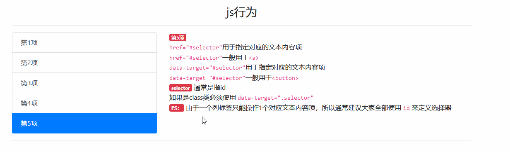

# `List group` 组件

> 列表组是用于显示一系列内容，它灵活而强大。

## 样式类表格

| 样式类                    | 描述                                      |
| ------------------------- | ----------------------------------------- |
| `.list-group`             | `列表组` 组件基类                         |
| `.list-group-item`        | 子类，规定了同级标签的排序                |
| `.active`                 | 子类，活动元素，改变背景                  |
| `.disabled`               | 子类，禁用元素，字体变成灰色              |
| `.list-group-item-action` | 子类，具有悬停效果（会被 `.active` 覆盖） |
| `.list-group-flush`       | 父类，删除外边框、圆角                    |

## 列表子类背景色表格

> 注意：列表子类背景色，会被 `.active` 覆盖

| 背景样式类                   | 描述 |
| ---------------------------- | ---- |
| `.list-group-item-primary`   | 主要 |
| `.list-group-item-secondary` | 次要 |
| `.list-group-item-success`   | 成功 |
| `.list-group-item-danger`    | 警告 |
| `.list-group-item-warning`   | 危险 |
| `.list-group-item-info`      | 信息 |
| `.list-group-item-light`     | 亮系 |
| `.list-group-item-dark`      | 暗系 |

> PS：列表组主要应用于 `文本 & a链接 & 按钮`

## 案例

> 最基本列表


```html
<div class="container mt-3">
    <h3 class="text-center">最基本的列表</h3>
    <ul class="list-group">
        <li class="list-group-item">列表第1列</li>
        <li class="list-group-item">列表第2列</li>
        <li class="list-group-item">列表第3列</li>
        <li class="list-group-item">列表第4列</li>
        <li class="list-group-item">列表第5列</li>
        <li class="list-group-item">列表第6列</li>
    </ul>
</div>
```

> 多功能的列表组


```html
<div class="container mt-3">
    <h3 class="text-center">多功能的列表组</h3>
    <ul class="list-group">
        <li class="list-group-item">这是一段文本</li>
        <a class="list-group-item" href="javascript:void(0)">这是一个 <code>&lt;a&gt;</code> 标签</a>
        <button type="button" class="list-group-item text-left">这是一个 <code>&lt;button&gt;</code> 标签</button>
        <li class="list-group-item active">当前列带 <code>.active</code></li>
        <li class="list-group-item list-group-item-action">当前列带 <code>.list-group-item-action</code></li>
        <li class="list-group-item list-group-item-primary">当前列带 <code>.list-group-item-primary</code></li>
        <li class="list-group-item list-group-item-primary list-group-item-action">当前列带 <code>.list-group-item-primary.list-group-item-action</code></li>
        <button type="button" class="list-group-item list-group-item-warning list-group-item-action">警告：所有子类背景颜色都会被`.active`覆盖</button>
        <a href="javascript:void(0)" class="list-group-item list-group-item-warning list-group-item-action">警告：<code>.list-group-item-action</code>会被`.active`覆盖</a>
    </ul>
</div>
```

## js 行为

| 元素属性                  | 描述                                                 |
| ------------------------- | ---------------------------------------------------- |
| `data-toggle="list"`      | 替代 js 代码                                         |
| `href="#selector"`        | 指定列表项关联的文本内容项                           |
| `data-target="#selector"` | 指定列表项关联的文本内容项，`class 类`必须使用该方法 |

> 不带 js 代码的案例



```html
<div class="container mt-3">
    <h3 class="text-center">js行为-没有js代码</h3>
    <hr>
    <div class="row">
        <div class="col-4">
            <div class="list-group">
                <a class="list-group-item list-group-item-action active" data-toggle="list" href="#list-first">第1项</a>
                <a class="list-group-item list-group-item-action" data-toggle="list" href="#list-second">第2项</a>
                <a class="list-group-item list-group-item-action" data-toggle="list" href="#list-third">第3项</a>
                <a class="list-group-item list-group-item-action" data-toggle="list" href="#list-fourth">第4项</a>
                <a class="list-group-item list-group-item-action" data-toggle="list" href="#list-fifth">第5项</a>
            </div>
        </div>
        <div class="col-8">
            <div class="tab-content">
                <div class="tab-pane fade show active" id="list-first">
                    <span class="badge badge-danger">第1项</span>
                    <code>.acitve</code> 用来表示当前选中项<br> 项表项的子级：<code>.active</code>只能出现在1个子级标签<br> 文本内容项的子级：<code>.active</code>也只能出现在1个子级标签<br> 并且两者的<code>.active</code>出现的子级标签，应该是相互对应的 </div>
                <div class="tab-pane fade" id="list-second">
                    <span class="badge badge-danger">第2项</span>
                    <code>.fade</code>用于文本内容项子级标签下<br>
                    <code>.fade</code>作用：用来实现淡入淡出<br>
                    <code>.fade</code>需要<code>.show</code>配合 </div>
                <div class="tab-pane fade" id="list-third">
                    <span class="badge badge-danger">第3项</span>
                    <code>.show</code>辅助<code>.fade</code><br>
                    <code>.fade</code>会让<code>.active</code>的展示效果失效<br>
                    <code>.fade</code>会导致文本当前项隐藏掉<br>
                    <code>.show</code>作用：让文本当前先正常展示 </div>
                <div class="tab-pane fade" id="list-fourth">
                    <span class="badge badge-danger">第4项</span>
                    <code>data-toggle="list"</code>用于替代js代码<br>
                    <code>data-toggle="list"</code>位置：列表项子级<br> 没有<code>data-toggle="list"</code>也没有js的话，点击列表项子级，无法展示指定的文本内容<br>
                </div>
                <div class="tab-pane fade" id="list-fifth">
                    <span class="badge badge-danger">第5项</span><br>
                    <code>href="#selector"</code>用于指定对应的文本内容项<br>
                    <code>href="#selector"</code>一般用于<code>&lt;a&gt;</code><br>
                    <code>data-target="#selector"</code>用于指定对应的文本内容项<br>
                    <code>data-target="#selector"</code>一般用于<code>&lt;button&gt;</code><br>
                    <span class="badge badge-danger">selector</span> 通常是指id<br> 如果是class类必须使用 <code>data-target=".selector"</code><br>
                    <span class="badge badge-danger">PS：</span> 由于一个列标签只能操作1个对应文本内容项，所以通常建议大家全部使用 <code>id</code> 来定义选择器 </div>
            </div>
        </div>
    </div>
    <hr>
</div>
```

### 带 js 代码的案例

> 效果和 `不带js代码的案例` 基本一致

```html
<div class="container mt-3">
    <h3 class="text-center">js行为-有js代码</h3>
    <hr>
    <div class="row">
        <div class="col-4">
            <div class="list-group">
                <a class="list-group-item list-group-item-action active" href="#list-first">第1项</a>
                <a class="list-group-item list-group-item-action" href="#list-second">第2项</a>
                <button class="list-group-item list-group-item-action" data-target="#list-third">第3项</button>
                <a class="list-group-item list-group-item-action" href="#list-fourth">第4项</a>
                <li class="list-group-item list-group-item-action" data-target="#list-fifth">第5项</li>
            </div>
        </div>
        <div class="col-8">
            <div class="tab-content">
                <div class="tab-pane fade show active" id="list-first">
                    <span class="badge badge-danger">第1项</span>
                    <code>.acitve</code> 用来表示当前选中项<br> 项表项的子级：<code>.active</code>只能出现在1个子级标签<br> 文本内容项的子级：<code>.active</code>也只能出现在1个子级标签<br> 并且两者的<code>.active</code>出现的子级标签，应该是相互对应的 </div>
                <div class="tab-pane fade" id="list-second">
                    <span class="badge badge-danger">第2项</span>
                    <code>.fade</code>用于文本内容项子级标签下<br>
                    <code>.fade</code>作用：用来实现淡入淡出<br>
                    <code>.fade</code>需要<code>.show</code>配合 </div>
                <div class="tab-pane fade" id="list-third">
                    <span class="badge badge-danger">第3项</span>
                    <code>.show</code>辅助<code>.fade</code><br>
                    <code>.fade</code>会让<code>.active</code>的展示效果失效<br>
                    <code>.fade</code>会导致文本当前项隐藏掉<br>
                    <code>.show</code>作用：让文本当前先正常展示 </div>
                <div class="tab-pane fade" id="list-fourth">
                    <span class="badge badge-danger">第4项</span>
                    <code>data-toggle="list"</code>用于替代js代码<br>
                    <code>data-toggle="list"</code>位置：列表项子级<br> 没有<code>data-toggle="list"</code>也没有js的话，点击列表项子级，无法展示指定的文本内容<br>
                </div>
                <div class="tab-pane fade" id="list-fifth">
                    <span class="badge badge-danger">第5项</span><br>
                    <code>href="#selector"</code>用于指定对应的文本内容项<br>
                    <code>href="#selector"</code>一般用于<code>&lt;a&gt;</code><br>
                    <code>data-target="#selector"</code>用于指定对应的文本内容项<br>
                    <code>data-target="#selector"</code>一般用于<code>&lt;button&gt;</code><br>
                    <span class="badge badge-danger">selector</span> 通常是指id<br> 如果是class类必须使用 <code>data-target=".selector"</code><br>
                    <span class="badge badge-danger">PS：</span> 由于一个列标签只能操作1个对应文本内容项，所以通常建议大家全部使用 <code>id</code> 来定义选择器 </div>
            </div>
        </div>
    </div>
    <hr>
</div>
<script src="/static/base/js/jquery.min.js"></script>
<script src="/static/base/js/bootstrap.bundle.min.js"></script>
<script type="text/javascript">
    $('.list-group .list-group-item').on('click', function(e) {
        e.preventDefault()
        $(this).tab('show')
    })
</script>
```

> PS：可以使用 `$('#selector').tab('show')` ，让单个选项展示文本内容

## js 事件

> 列表组组件，自带了 4 个 js 事件（这里不做讲解，后续补充吧）：

| 事件            | 描述                     |
| --------------- | ------------------------ |
| `show.bs.tab`   | 新选项卡激活之前         |
| `shown.bs.tab`  | 新选项卡激活之后         |
| `hide.bs.tab`   | 之前活动的选项卡隐藏之前 |
| `hidden.bs.tab` | 之前活动的选项卡隐藏之后 |

> js 代码

```js
$(".list-group .list-group-item").on("shown.bs.tab", function(e) {
  e.target; // 新激活的选项卡
  // e.relatedTarget; // 之前的活动选项卡
});
```

> 由于一个列标签只能操作 1 个对应文本内容项，所以通常建议大家全部使用 `id` 来定义
