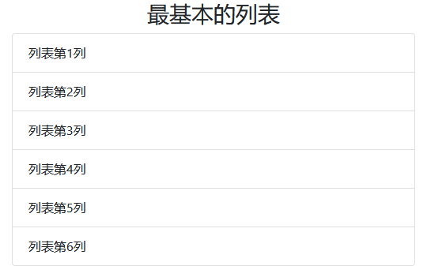

# `List group` 组件

> 列表组是用于显示一系列内容，它灵活而强大。

## 样式类表格

| 样式类                    | 描述                                      |
| ------------------------- | ----------------------------------------- |
| `.list-group`             | `列表组` 组件基类                         |
| `.list-group-item`        | 子类，规定了同级标签的排序                |
| `.active`                 | 子类，活动元素，改变背景                  |
| `.disabled`               | 子类，禁用元素，字体变成灰色              |
| `.list-group-item-action` | 子类，具有悬停效果（会被 `.active` 覆盖） |
| `.list-group-flush`       | 父类，删除外边框、圆角                    |

## 列表子类背景色表格

| 背景样式类                   | 描述 |
| ---------------------------- | ---- |
| `.list-group-item-primary`   | 主要 |
| `.list-group-item-secondary` | 次要 |
| `.list-group-item-success`   | 成功 |
| `.list-group-item-danger`    | 警告 |
| `.list-group-item-warning`   | 危险 |
| `.list-group-item-info`      | 信息 |
| `.list-group-item-light`     | 亮系 |
| `.list-group-item-dark`      | 暗系 |

> PS：列表组主要应用于 `文本 & a链接 & 按钮`

## 案例

> 最基本列表



```html
<div class="container mt-3">
    <h3 class="text-center">最基本的列表</h3>
    <ul class="list-group">
        <li class="list-group-item">列表第1列</li>
        <li class="list-group-item">列表第2列</li>
        <li class="list-group-item">列表第3列</li>
        <li class="list-group-item">列表第4列</li>
        <li class="list-group-item">列表第5列</li>
        <li class="list-group-item">列表第6列</li>
    </ul>
</div>
```
