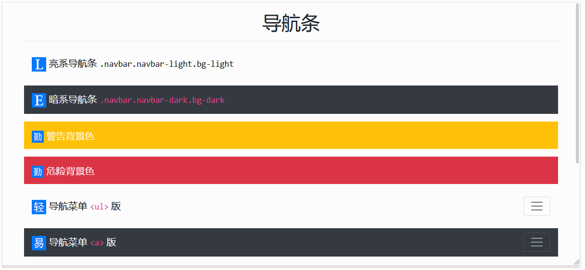

# Navbar 组件

> `Bootstrap` 的 导航条组件是强大的、它能响应性显示界面效果，导航条内部支持 `下拉菜单组件`

## 导航条组件支持内容

> navbar 内置了对一些子组件的支持。根据需要从下列选择:

| 子组件                      | 描述                                           |
| --------------------------- | ---------------------------------------------- |
| `.navbar-brand`             | navbar 项目名称                                |
| `.navbar-nav`               | 用于全高度和轻量级导航(包括对下拉菜单的支持)。 |
| `.navbar-toggler`           | 用于折叠插件和其他导航切换行为。               |
| `.form-inline`              | 对于任何表单控件和操作                         |
| `.navbar-text`              | 用于添加垂直居中的文本字符串。                 |
| `.collapse.navbar-collapse` | 用于按父断点分组和隐藏导航条内容               |

## 样式表

| 样式类                      | 描述                                                  |
| --------------------------- | ----------------------------------------------------- |
| `.navbar`                   | 顶级，navbar 基本类                                   |
| `.navbar-dark`              | 顶级，定义暗系 navbar                                 |
| `.navbar-light`             | 顶级，定义亮系 navbar                                 |
| `.navbar-expand`            | 顶级，navbar 菜单栏水平布局                           |
| `.navbar-expand-sm`         | 顶级，屏幕大于指定值，`navbar菜单栏` 水平布局         |
| `.navbar-expand-md`         | 顶级，屏幕大于指定值，`navbar菜单栏` 水平布局         |
| `.navbar-expand-lg`         | 顶级，屏幕大于指定值，`navbar菜单栏` 水平布局         |
| `.navbar-expand-xl`         | 顶级，屏幕大于指定值，`navbar菜单栏` 水平布局         |
| `.navbar-brand`             | 父级，navbar 项目名称                                 |
| `.navbar-brand.navbar-text` | 父级，处理 navbar 项目名称 的文本样式                 |
| `.navbar-toggler`           | 子级，`菜单展示按钮`的样式类，用于隐藏菜单栏          |
| `.navbar-toggler-icon`      | 下级，`.navbar-toggler`下级，`菜单展示按钮`的效果样式 |
| `.navbar-collapse.collapse` | 父级，`navbar菜单栏` 的样式类，并用于隐藏菜单         |
| `.navbar-nav`               | 子级，`navbar菜单栏` 的基类                           |

## 属性表

| 属性值                    | 描述                                      |
| ------------------------- | ----------------------------------------- |
| `data-toggle="collapse"`  | 切换`navbar菜单栏`的状态（`展示 | 隐藏`） |
| `data-target="#selector"` | 为`菜单展示按钮`和`navbar菜单栏`做映射    |

> PS：一个 `菜单展示按钮` 可以与多个 `navbar菜单栏` 映射

## 案例

> navbar的一些列样式

1. 基础案例：



```html
<div class="container mt-3 mb-3">
    <h1 class="text-center">导航条</h1>
    <hr>
    <nav class="navbar navbar-light bg-light">
        <a href="#" class="navbar-brand"> 亮系导航条 <code>.navbar.navbar-light.bg-light</code></a>
    </nav>
    <nav class="navbar navbar-dark bg-dark mt-3">
        <span class="navbar-brand"> 暗系导航条 <code>.navbar.navbar-dark.bg-dark</code></span>
    </nav>
    <nav class="navbar navbar-dark bg-warning mt-3">
        <a href="#" class="navbar-brand"> 警告背景色 </a>
    </nav>
    <nav class="navbar navbar-dark bg-danger mt-3">
        <a href="#" class="navbar-brand"> 危险背景色 </a>
    </nav>
    <nav class="navbar navbar-light bg-light mt-3">
        <span class="navbar-brand"> 导航菜单 <code>&lt;ul&gt;</code> 版</span>
        <button class="navbar-toggler" type="button" data-toggle="collapse" data-target="#navbar-nav-01">
            <span class="navbar-toggler-icon"></span>
        </button>
        <div class="collapse navbar-collapse" id="navbar-nav-01">
            <ul class="navbar-nav">
                <li class="nav-item">
                    <a class="nav-link" href="#"> <span class="badge badge-primary">菜单展示按钮</span> 的 <code class="badge badge-primary">data-toggle="collapse"</code> 属性，是用于展示菜单栏</a>
                </li>
                <li class="nav-item">
                    <a class="nav-link" href="#"> <span class="badge badge-primary">菜单展示按钮</span> 的 <code class="badge badge-primary">data-target="#selector"</code> 属性，是用于映射到指定的导航菜单（一个按钮可控制多个导航菜单）</a>
                </li>
                <li class="nav-item">
                    <a class="nav-link" href="#"> <span class="badge badge-primary">菜单展示按钮</span> 的 <code class="badge badge-primary">.navbar-toggler</code> 样式类，让菜单栏默认隐藏</a>
                </li>
                <li class="nav-item">
                    <a class="nav-link active" href="#"><code class="badge badge-success">.active</code> 代表活动，作用于最小元素 <code class="badge badge-primary">&lt;a&gt;</code> ，与 【Navs组件】 效果一致</a>
                </li>
                <li class="nav-item">
                    <a class="nav-link disabled" href="#"><code class="badge badge-danger">.disabled</code> 代表禁用，作用于最小元素 <code class="badge badge-primary">&lt;a&gt;</code> ，与 【Navs组件】 效果一致</a>
                </li>
                <li class="nav-item">
                    <a class="nav-link" href="#"> <span class="badge badge-primary">菜单展示按钮</span> 可以是 <code class="badge badge-warning">&lt;a&gt;</code> 和 <code class="badge badge-warning">&lt;button&gt;</code> ，与 【Navs组件】 效果一致</a>
                </li>
            </ul>
        </div>
    </nav>
    <nav class="navbar navbar-dark bg-dark mt-3">
        <span class="navbar-brand"> 导航菜单 <code>&lt;a&gt;</code> 版</span>
        <button class="navbar-toggler" type="button" data-toggle="collapse" data-target="#navbar-nav-02">
            <span class="navbar-toggler-icon"></span>
        </button>
        <div class="collapse navbar-collapse" id="navbar-nav-02">
            <nav class="navbar-nav">
                <a class="nav-item nav-link" href="#">菜单栏的 <code class="badge badge-primary">#selector</code> 选择器是被展示按钮映射的</a>
                <a class="nav-item nav-link" href="#">菜单栏的 <code class="badge badge-primary">.collapse.navbar-collapse</code> 样式类，让菜单栏默认处于隐藏状态</a>
                <a class="nav-item nav-link" href="#">菜单栏的子级样式类 <code class="badge badge-primary">.navbar-nav</code> ，用来替代 【Navs组件】 的基础样式类</a>
            </nav>
        </div>
    </nav>
    <nav class="navbar navbar-light bg-light mt-3 navbar-expand">
        <span class="navbar-brand"> 水平布局</span>
        <button class="navbar-toggler" type="button" data-toggle="collapse" data-target="#navbar-nav-03">
            <span class="navbar-toggler-icon"></span>
        </button>
        <div class="collapse navbar-collapse" id="navbar-nav-03">
            <nav class="navbar-nav">
                <a class="nav-item nav-link" href="#">navbar组件菜单栏</a>
                <a class="nav-item nav-link" href="#">默认是垂直布局</a>
                <a class="nav-item nav-link" href="#">通过顶级样式类</a>
                <a class="nav-item nav-link" href="#"><code class="badge badge-danger">.navbar-expand</code></a>
                <a class="nav-item nav-link" href="#">可实现水平布局</a>
            </nav>
        </div>
    </nav>
    <nav class="navbar navbar-light bg-light mt-3 navbar-expand-xl">
        <a href="#" class="navbar-brand">
             响应式布局 </a>
        <a class="navbar-toggler" type="button" data-toggle="collapse" data-target="#navbar-nav-05">
            <span class="navbar-toggler-icon"></span>
        </a>
        <div class="collapse navbar-collapse" id="navbar-nav-05">
            <nav class="navbar-nav">
                <a class="nav-item nav-link" href="#">默认垂直布局（默认隐藏菜单栏）</a>
                <a class="nav-item nav-link" href="#">当屏幕宽度大于指定值</a>
                <a class="nav-item nav-link" href="#">实现水平布局</a>
                <a class="nav-item nav-link" href="#"><code class="badge badge-danger">.navbar-expand-{sm|md|lg|xl}</code></a>
                <a class="nav-item nav-link" href="#">可实现响应式布局</a>
            </nav>
        </div>
    </nav>
    <nav class="navbar navbar-light bg-light mt-3 navbar-expand">
        <a href="#" class="navbar-brand navbar-text">
             文本样式（亮系） </a>
        <a class="navbar-toggler" type="button">
            <span class="navbar-toggler-icon"></span>
        </a>
        <div class="collapse navbar-collapse">
            <nav class="navbar-nav">
                <a class="nav-item nav-link" href="#">文本上使用了</a>
                <a class="nav-item nav-link" href="#"><code class="badge badge-danger">.navbar-text</code></a>
                <a class="nav-item nav-link" href="#">文本可垂直居中</a>
                <a class="nav-item nav-link" href="#">文本颜色变化</a>
            </nav>
        </div>
    </nav>
    <nav class="navbar navbar-dark bg-dark mt-3 navbar-expand">
        <a href="#" class="navbar-brand navbar-text">
             文本样式（按系） </a>
        <a class="navbar-toggler" type="button">
            <span class="navbar-toggler-icon"></span>
        </a>
        <div class="collapse navbar-collapse">
            <nav class="navbar-nav">
                <a class="nav-item nav-link" href="#">文本上使用了</a>
                <a class="nav-item nav-link" href="#"><code class="badge badge-danger">.navbar-text</code></a>
                <a class="nav-item nav-link" href="#">文本可垂直居中</a>
                <a class="nav-item nav-link" href="#">文本颜色变化</a>
            </nav>
        </div>
    </nav>
</div>
<script src="/static/base/js/jquery.min.js"></script>
<script src="/static/base/js/bootstrap.bundle.min.js"></script>
```
