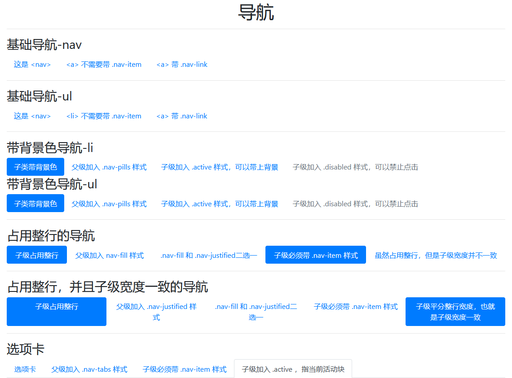
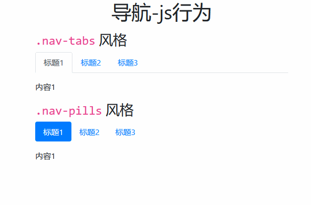

# Navs 组件

> 导航组件，就是我们常用的导航栏

## 样式类表

| 样式类           | 描述                                                                  |
| ---------------- | --------------------------------------------------------------------- |
| `.nav`           | 父级，基类                                                            |
| `.nav-fill`      | 父级，让子类充满整行（但子类宽度不统一）                              |
| `.nav-justified` | 父级，让子类充满整行（并且子类宽度一致）                              |
| `.nav-pills`     | 父级，让子类带背景框                                                  |
| `.nav-tabs`      | 父级，让子类带选项卡效果                                              |
| `.nav-item`      | 子级，导航基类的下级，为`.nav-tabs & .nav-justified & .nav-fill` 而生 |
| `.nav-link`      | `<a>` 标签级，水平、垂直对齐，`<a>` 链接的样式(`.nav-item`同级或子级) |
| `.active`        | `<a>` 标签级，指示当前活动块（背景色、选项卡等需要这个）              |
| `.disabled`      | `<a>` 标签级，指示当前块禁止访问                                      |

> 导航一般应用于 `<nav>` 和 `<ul> & <li>`

## 案例一、基础导航效果



```html
<div class="container mt-3">
    <h1 class="text-center">导航</h1>
    <hr>
    <h3>基础导航-nav</h3>
    <nav class="nav">
        <a href="javascript:void(0)" class="nav-link">这是 &lt;nav&gt;</a>
        <a href="javascript:void(0)" class="nav-link">&lt;a&gt; 不需要带 .nav-item</a>
        <a href="javascript:void(0)" class="nav-link">&lt;a&gt; 带 .nav-link</a>
    </nav>
    <hr>
    <h3>基础导航-ul</h3>
    <ul class="nav">
        <li><a href="javascript:void(0)" class="nav-link">这是 &lt;nav&gt;</a></li>
        <li><a href="javascript:void(0)" class="nav-link">&lt;li&gt; 不需要带 .nav-item</a></li>
        <li><a href="javascript:void(0)" class="nav-link">&lt;a&gt; 带 .nav-link</a></li>
    </ul>
    <hr>
    <h3>带背景色导航-li</h3>
    <nav class="nav nav-pills">
        <a href="javascript:void(0)" class="nav-link active">子类带背景色</a>
        <a href="javascript:void(0)" class="nav-link">父级加入 .nav-pills 样式</a>
        <a href="javascript:void(0)" class="nav-link">子级加入 .active 样式，可以带上背景</a>
        <a href="javascript:void(0)" class="nav-link disabled">子级加入 .disabled 样式，可以禁止点击</a>
    </nav>
    <h3>带背景色导航-ul</h3>
    <ul class="nav nav-pills">
        <li><a href="javascript:void(0)" class="nav-link active">子类带背景色</a></li>
        <li><a href="javascript:void(0)" class="nav-link">父级加入 .nav-pills 样式</a></li>
        <li><a href="javascript:void(0)" class="nav-link">子级加入 .active 样式，可以带上背景</a></li>
        <li><a href="javascript:void(0)" class="nav-link disabled">子级加入 .disabled 样式，可以禁止点击</a></li>
    </ul>
    <hr>
    <h3>占用整行的导航</h3>
    <nav class="nav nav-pills nav-fill mt-2">
        <a href="javascript:void(0)" class="nav-item nav-link active">子级占用整行</a>
        <a href="javascript:void(0)" class="nav-item nav-link">父级加入 nav-fill 样式</a>
        <a href="javascript:void(0)" class="nav-item nav-link">.nav-fill 和 .nav-justified二选一</a>
        <a href="javascript:void(0)" class="nav-item nav-link active">子级必须带 .nav-item 样式</a>
        <a href="javascript:void(0)" class="nav-item nav-link">虽然占用整行，但是子级宽度并不一致</a>
    </nav>
    <hr>
    <h3>占用整行，并且子级宽度一致的导航</h3>
    <nav class="nav nav-pills nav-justified mt-2">
        <a href="javascript:void(0)" class="nav-item nav-link active">子级占用整行</a>
        <a href="javascript:void(0)" class="nav-item nav-link">父级加入 .nav-justified 样式</a>
        <a href="javascript:void(0)" class="nav-item nav-link">.nav-fill 和 .nav-justified二选一</a>
        <a href="javascript:void(0)" class="nav-item nav-link">子级必须带 .nav-item 样式</a>
        <a href="javascript:void(0)" class="nav-item nav-link active">子级平分整行宽度，也就是子级宽度一致</a>
    </nav>
    <hr>
    <h3>选项卡</h3>
    <nav class="nav nav-tabs mt-2">
        <a href="javascript:void(0)" class="nav-item nav-link">选项卡</a>
        <a href="javascript:void(0)" class="nav-item nav-link">父级加入 .nav-tabs 样式</a>
        <a href="javascript:void(0)" class="nav-item nav-link">子级必须带 .nav-item 样式</a>
        <a href="javascript:void(0)" class="nav-item nav-link active">子级加入 .active ，指当前活动块</a>
    </nav>
</div>
<script src="/static/base/js/jquery.min.js"></script>
<script src="/static/base/js/bootstrap.bundle.min.js"></script>
```

## js 行为

> 导航的 js 行为，其实都是在实现选项卡特效，选项卡支持 `.nav-tabs & .nav-pills` 两种风格

### 选项卡导航区

> 选项卡导航区的基本信息，上面已经讲解透彻，这里讲解下 js 行为相关

| 数据属性               | 描述                                                         |
| ---------------------- | ------------------------------------------------------------ |
| `data-toggle="string"` | 必须，当前选项是否要开启选项卡，支持 2 个字符串 `tab & pill` |
| `href="#selector"`     | 必须，映射到指定`选择器`的内容                               |

### 选项卡内容区

> 如果导航区是标题，内容区就相当于对标题的描述

| 选择器           | 描述                                                          |
| ---------------- | ------------------------------------------------------------- |
| `.tab-content`   | 父级，基类，                                                  |
| `.tab-pane`      | 子级，基类                                                    |
| `.active`        | 子级，会展示的内容，对应导航区选中项的描述，                  |
| `.fade`          | 子级，支持淡入淡出                                            |
| `.show`          | 子级，`.fade` 默认会隐藏`.active`,需要使用`.show`配置才能显示 |
| `id="#selector"` | 子级，带有选择器就会被导航区的一一映射                        |

> js行为案例



```html
<div class="container mt-3">
    <h1 class="text-center">导航-js行为</h1>
    <h3 class="mt-3"><code>.nav-tabs</code> 风格</h3>
    <nav class="nav nav-tabs mb-3">
        <a class="nav-item nav-link active" data-toggle="tab" href="#nav-1">标题1</a>
        <a class="nav-item nav-link" data-toggle="tab" href="#nav-2">标题2</a>
        <a class="nav-item nav-link" data-toggle="tab" href="#nav-3">标题3</a>
    </nav>
    <div class="tab-content">
        <div class="tab-pane fade show active" id="nav-1">内容1</div>
        <div class="tab-pane fade" id="nav-2">内容2</div>
        <div class="tab-pane fade" id="nav-3">内容3</div>
    </div>
    <h3 class="mt-3"><code>.nav-pills</code> 风格</h3>
    <nav class="nav nav-pills mb-3">
        <a class="nav-item nav-link active" data-toggle="tab" href="#nav-2-1">标题1</a>
        <a class="nav-item nav-link" data-toggle="tab" href="#nav-2-2">标题2</a>
        <a class="nav-item nav-link" data-toggle="tab" href="#nav-2-3">标题3</a>
    </nav>
    <div class="tab-content">
        <div class="tab-pane fade show active" id="nav-2-1">内容1</div>
        <div class="tab-pane fade" id="nav-2-2">内容2</div>
        <div class="tab-pane fade" id="nav-2-3">内容3</div>
    </div>
</div>
<script src="/static/base/js/jquery.min.js"></script>
<script src="/static/base/js/bootstrap.bundle.min.js"></script>
```
