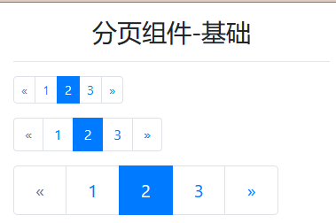

# Pagination - 分页组件

> 分页组件用于显示分页以指示跨多个页面

## 分页组件样式表

> 分页组件样式表比较简单

| 样式类                      | 作用域 | 描述           |
| --------------------------- | ------ | -------------- |
| `.pagination`               | `ul`   | 分页组件基础类 |
| `.pagination.pagination-lg` | `ul`   | 放大分页组件   |
| `.pagination.pagination-sm` | `ul`   | 缩小分页组件   |
| `.page-item`                | `li`   | 分页组件基础类 |
| `.page-item.active`         | `li`   | 高亮子类       |
| `.page-item.disabled`       | `li`   | 禁用子类       |
| `.page-link`                | `a`    | 分页组件基础类 |

> 改变分页组件方位的公共样式类

| 公共样式类                | 作用域 | 描述         |
| ------------------------- | ------ | ------------ |
| `.justify-content-center` | `ul`   | 分页组件居中 |
| `.justify-content-end`    | `ul`   | 分页组件居右 |

> PS：分页组件只能用 `ul > li > a` (`nav > a` 是不能用于分页的)

## 案例：

> 基本案例：



```html
<div class="container">
    <h3 class="text-center mt-3">分页组件-基础</h3>
    <hr>
    <ul class="table-responsive pagination pagination-sm">
        <li class="page-item disabled"><a class="page-link" href="#">&laquo;</a></li>
        <li class="page-item"><a class="page-link" href="#">1</a></li>
        <li class="page-item active"><a class="page-link" href="#">2</a></li>
        <li class="page-item"><a class="page-link" href="#">3</a></li>
        <li class="page-item"><a class="page-link" href="#">&raquo;</a></li>
    </ul>
    <ul class="pagination">
        <li class="page-item disabled"><a class="page-link" href="#">&laquo;</a></li>
        <li class="page-item"><a class="page-link" href="#">1</a></li>
        <li class="page-item active"><a class="page-link" href="#">2</a></li>
        <li class="page-item"><a class="page-link" href="#">3</a></li>
        <li class="page-item"><a class="page-link" href="#">&raquo;</a></li>
    </ul>
    <ul class="pagination pagination-lg">
        <li class="page-item disabled"><a class="page-link" href="#">&laquo;</a></li>
        <li class="page-item"><a class="page-link" href="#">1</a></li>
        <li class="page-item active"><a class="page-link" href="#">2</a></li>
        <li class="page-item"><a class="page-link" href="#">3</a></li>
        <li class="page-item"><a class="page-link" href="#">&raquo;</a></li>
    </ul>
</div>
```

> 改变方位案例：


```html
<div class="container">
    <h3 class="text-center mt-3">分页组件-改变方位</h3>
    <hr>
    <ul class="pagination justify-content-end">
        <li class="page-item disabled"><a class="page-link" href="#">&laquo;</a></li>
        <li class="page-item"><a class="page-link" href="#">1</a></li>
        <li class="page-item active"><a class="page-link" href="#">2</a></li>
        <li class="page-item"><a class="page-link" href="#">3</a></li>
        <li class="page-item"><a class="page-link" href="#">&raquo;</a></li>
    </ul>
    <ul class="pagination justify-content-center">
        <li class="page-item disabled"><a class="page-link" href="#">&laquo;</a></li>
        <li class="page-item"><a class="page-link" href="#">1</a></li>
        <li class="page-item active"><a class="page-link" href="#">2</a></li>
        <li class="page-item"><a class="page-link" href="#">3</a></li>
        <li class="page-item"><a class="page-link" href="#">&raquo;</a></li>
    </ul>
</div>
```

>
