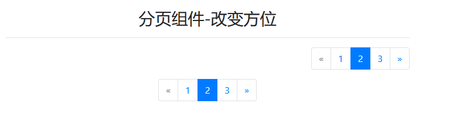
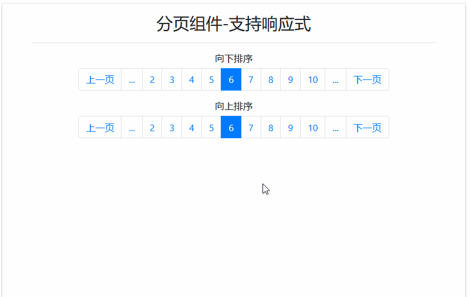
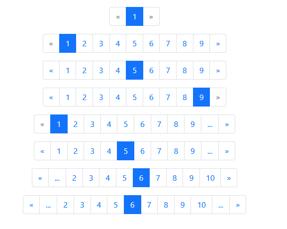
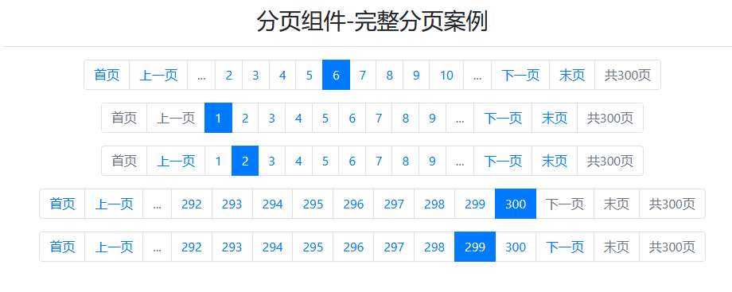

# Pagination - 分页组件

> 分页组件用于显示分页以指示跨多个页面

## 分页组件样式表

> 分页组件样式表比较简单

| 样式类                      | 作用域 | 描述           |
| --------------------------- | ------ | -------------- |
| `.pagination`               | `ul`   | 分页组件基础类 |
| `.pagination.pagination-lg` | `ul`   | 放大分页组件   |
| `.pagination.pagination-sm` | `ul`   | 缩小分页组件   |
| `.page-item`                | `li`   | 分页组件基础类 |
| `.page-item.active`         | `li`   | 高亮子类       |
| `.page-item.disabled`       | `li`   | 禁用子类       |
| `.page-link`                | `a`    | 分页组件基础类 |

> 改变分页组件方位的公共样式类

| 公共样式类                | 作用域 | 描述         |
| ------------------------- | ------ | ------------ |
| `.justify-content-center` | `ul`   | 分页组件居中 |
| `.justify-content-end`    | `ul`   | 分页组件居右 |

> 分页区域支持响应式

| 响应式样式类         | 作用域 | 描述     |
| -------------------- | ------ | -------- |
| `.flex-wrap`         | `ul`   | 向下排序 |
| `.flex-wrap-reverse` | `ul`   | 向上排序 |

> PS：分页组件只能用 `ul > li > a` (`nav > a` 是不能用于分页的)

## 案例：

> 基本案例：


```html
<div class="container">
    <h3 class="text-center mt-3">分页组件-基础</h3>
    <hr>
    <ul class="table-responsive pagination pagination-sm">
        <li class="page-item disabled"><a class="page-link" href="#">&laquo;</a></li>
        <li class="page-item"><a class="page-link" href="#">1</a></li>
        <li class="page-item active"><a class="page-link" href="#">2</a></li>
        <li class="page-item"><a class="page-link" href="#">3</a></li>
        <li class="page-item"><a class="page-link" href="#">&raquo;</a></li>
    </ul>
    <ul class="pagination">
        <li class="page-item disabled"><a class="page-link" href="#">&laquo;</a></li>
        <li class="page-item"><a class="page-link" href="#">1</a></li>
        <li class="page-item active"><a class="page-link" href="#">2</a></li>
        <li class="page-item"><a class="page-link" href="#">3</a></li>
        <li class="page-item"><a class="page-link" href="#">&raquo;</a></li>
    </ul>
    <ul class="pagination pagination-lg">
        <li class="page-item disabled"><a class="page-link" href="#">&laquo;</a></li>
        <li class="page-item"><a class="page-link" href="#">1</a></li>
        <li class="page-item active"><a class="page-link" href="#">2</a></li>
        <li class="page-item"><a class="page-link" href="#">3</a></li>
        <li class="page-item"><a class="page-link" href="#">&raquo;</a></li>
    </ul>
</div>
```

> 改变方位案例：



```html
<div class="container">
    <h3 class="text-center mt-3">分页组件-改变方位</h3>
    <hr>
    <ul class="pagination justify-content-end">
        <li class="page-item disabled"><a class="page-link" href="#">&laquo;</a></li>
        <li class="page-item"><a class="page-link" href="#">1</a></li>
        <li class="page-item active"><a class="page-link" href="#">2</a></li>
        <li class="page-item"><a class="page-link" href="#">3</a></li>
        <li class="page-item"><a class="page-link" href="#">&raquo;</a></li>
    </ul>
    <ul class="pagination justify-content-center">
        <li class="page-item disabled"><a class="page-link" href="#">&laquo;</a></li>
        <li class="page-item"><a class="page-link" href="#">1</a></li>
        <li class="page-item active"><a class="page-link" href="#">2</a></li>
        <li class="page-item"><a class="page-link" href="#">3</a></li>
        <li class="page-item"><a class="page-link" href="#">&raquo;</a></li>
    </ul>
</div>
```

> 分页组件支持响应式案例：



```html
<div class="container">
    <h3 class="text-center mt-3">分页组件-支持响应式</h3>
    <hr>
    <h6 class="text-center mt-3">向下排序</h6>
    <ul class="pagination justify-content-center flex-wrap">
        <li class="page-item"><a class="page-link" href="#">上一页</a></li>
        <li class="page-item"><span class="page-link" href="#">...</span></li>
        <li class="page-item"><a class="page-link" href="#">2</a></li>
        <li class="page-item"><a class="page-link" href="#">3</a></li>
        <li class="page-item"><a class="page-link" href="#">4</a></li>
        <li class="page-item"><a class="page-link" href="#">5</a></li>
        <li class="page-item active"><a class="page-link" href="#">6</a></li>
        <li class="page-item"><a class="page-link" href="#">7</a></li>
        <li class="page-item"><a class="page-link" href="#">8</a></li>
        <li class="page-item"><a class="page-link" href="#">9</a></li>
        <li class="page-item"><a class="page-link" href="#">10</a></li>
        <li class="page-item"><span class="page-link" href="#">...</span></li>
        <li class="page-item"><a class="page-link" href="#">下一页</a></li>
    </ul>
    <h6 class="text-center mt-3">向上排序</h6>
    <ul class="pagination justify-content-center flex-wrap-reverse">
        <li class="page-item"><a class="page-link" href="#">上一页</a></li>
        <li class="page-item"><span class="page-link" href="#">...</span></li>
        <li class="page-item"><a class="page-link" href="#">2</a></li>
        <li class="page-item"><a class="page-link" href="#">3</a></li>
        <li class="page-item"><a class="page-link" href="#">4</a></li>
        <li class="page-item"><a class="page-link" href="#">5</a></li>
        <li class="page-item active"><a class="page-link" href="#">6</a></li>
        <li class="page-item"><a class="page-link" href="#">7</a></li>
        <li class="page-item"><a class="page-link" href="#">8</a></li>
        <li class="page-item"><a class="page-link" href="#">9</a></li>
        <li class="page-item"><a class="page-link" href="#">10</a></li>
        <li class="page-item"><span class="page-link" href="#">...</span></li>
        <li class="page-item"><a class="page-link" href="#">下一页</a></li>
    </ul>
</div>
```

> 分页可能出现的几种样式



> 分页组件完整案例：


```html
<div class="container">
    <h3 class="text-center mt-3">分页组件-完整分页案例</h3>
    <hr>
    <ul class="pagination justify-content-center flex-wrap">
        <li class="page-item"><a class="page-link" href="#">首页</a></li>
        <li class="page-item"><a class="page-link" href="#">上一页</a></li>
        <li class="page-item"><span class="page-link" href="#">...</span></li>
        <li class="page-item"><a class="page-link" href="#">2</a></li>
        <li class="page-item"><a class="page-link" href="#">3</a></li>
        <li class="page-item"><a class="page-link" href="#">4</a></li>
        <li class="page-item"><a class="page-link" href="#">5</a></li>
        <li class="page-item active"><a class="page-link" href="#">6</a></li>
        <li class="page-item"><a class="page-link" href="#">7</a></li>
        <li class="page-item"><a class="page-link" href="#">8</a></li>
        <li class="page-item"><a class="page-link" href="#">9</a></li>
        <li class="page-item"><a class="page-link" href="#">10</a></li>
        <li class="page-item"><span class="page-link" href="#">...</span></li>
        <li class="page-item"><a class="page-link" href="#">下一页</a></li>
        <li class="page-item"><a class="page-link" href="#">末页</a></li>
        <li class="page-item disabled"><span class="page-link" href="#">共300页</span></li>
    </ul>
    <table class="table table-bordered">
        <thead class="thead-dark">
            <tr>
                <th>按键</th>
                <th>描述</th>
            </tr>
        </thead>
        <tbody class="thead-light">
            <tr>
                <th scope="row">首页</th>
                <td>跳转到第一页</td>
            </tr>
            <tr>
                <th>末页</th>
                <td>跳转到最后一页</td>
            </tr>
            <tr>
                <th scope="row">上一页</th>
                <td>后退9页，不足9个则跳转到首页</td>
            </tr>
            <tr>
                <th>下一页</th>
                <td>前进9页，不足9个则跳转到最后一页</td>
            </tr>
            <tr>
                <th scope="row">数字</th>
                <td>跳转到指定页</td>
            </tr>
        </tbody>
    </table>
</div>
```


