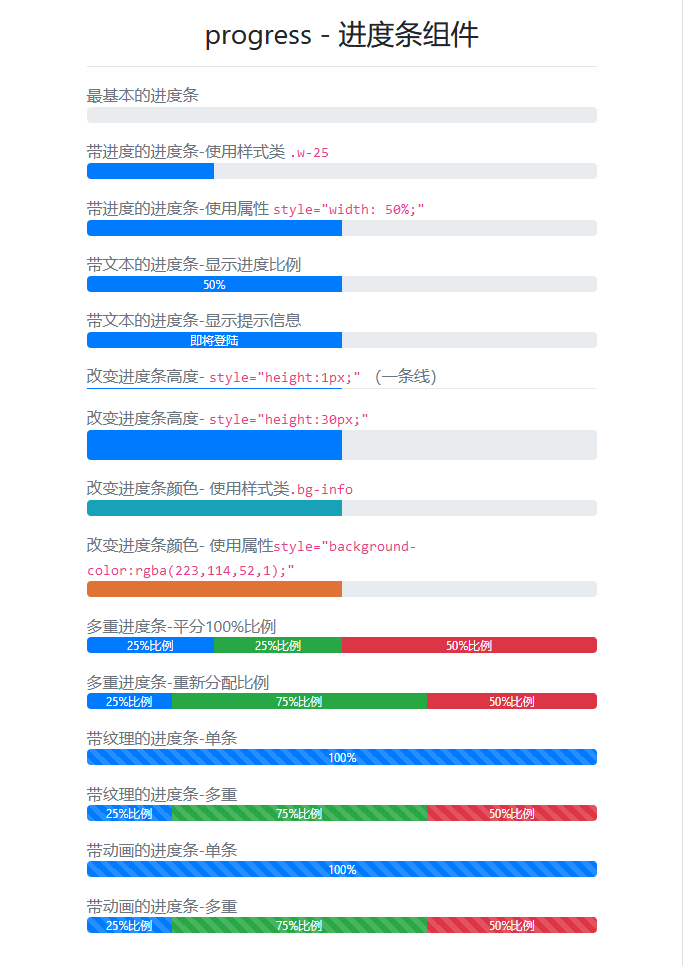

# Progress - 进度条组件

> 进度条组件,支持 `堆叠的进度条 & 动画背景 & 文本标签` 3 种效果

## 进度条组件如何工作?

> 进度条组件不适用 H5 的进度条标签 `<progress>` ，使用 2 个 div 和 css 来构建

| 样式类                   | 描述                                                           |
| ------------------------ | -------------------------------------------------------------- |
| `.progress`              | 父级，进度条样式基类                                           |
| `height` 样式属性        | 父级，指示进度条的高度                                         |
| `.progress-bar`          | 子级，进度条样式基类                                           |
| `width` 样式属性         | 子级，指示进度百分比                                           |
| `子级标签文本内容`       | 子级，用于指示进度条的提示                                     |
| `bg-*`                   | 子级，使用背景组件来改变进度条颜色                             |
| `多重进度条`             | 子级，父级通过`多个子级标签` 和 `背景组件`来失效多重进度条效果 |
| `.progress-bar-striped`  | 子级，让进度条带上纹路效果                                     |
| `.progress-bar-animated` | 子级，让进度条产生向右移动的动态效果（`需要纹理效果`）         |

## 进度条组件-基础代码

```html
<div class="progress">
  <div class="progress-bar"></div>
</div>
```

## 案例



```html
<div class="container">
    <h3 class="text-center mt-3">progress - 进度条组件</h3>
    <hr>
    <p class="text-muted mb-0 mt-3">最基本的进度条</p>
    <div class="progress">
        <div class="progress-bar"></div>
    </div>
    <p class="text-muted mb-0 mt-3">带进度的进度条-使用样式类 <code>.w-25</code></p>
    <div class="progress">
        <div class="progress-bar w-25"></div>
    </div>
    <p class="text-muted mb-0 mt-3">带进度的进度条-使用属性 <code>style="width: 50%;"</code></p>
    <div class="progress">
        <div class="progress-bar" style="width:50%"></div>
    </div>
    <p class="text-muted mb-0 mt-3">带文本的进度条-显示进度比例</p>
    <div class="progress">
        <div class="progress-bar w-50">50%</div>
    </div>
    <p class="text-muted mb-0 mt-3">带文本的进度条-显示提示信息</p>
    <div class="progress">
        <div class="progress-bar w-50">即将登陆</div>
    </div>
    <p class="text-muted mb-0 mt-3">改变进度条高度- <code>style="height:1px;"</code> （一条线）</p>
    <div class="progress" style="height:1px;">
        <div class="progress-bar w-50"></div>
    </div>
    <p class="text-muted mb-0 mt-3">改变进度条高度- <code>style="height:30px;"</code></p>
    <div class="progress" style="height:30px;">
        <div class="progress-bar w-50"></div>
    </div>
    <p class="text-muted mb-0 mt-3">改变进度条颜色- 使用样式类<code>.bg-info</code></p>
    <div class="progress">
        <div class="progress-bar bg-info w-50"></div>
    </div>
    <p class="text-muted mb-0 mt-3">改变进度条颜色- 使用属性<code>style="background-color:rgba(223,114,52,1);"</code></p>
    <div class="progress">
        <div class="progress-bar w-50" style="background-color:rgba(223,114,52,1);"></div>
    </div>
    <p class="text-muted mb-0 mt-3">多重进度条-平分100%比例</p>
    <div class="progress">
        <div class="progress-bar w-25">25%比例</div>
        <div class="progress-bar w-25 bg-success">25%比例</div>
        <div class="progress-bar w-50 bg-danger">50%比例</div>
    </div>
    <p class="text-muted mb-0 mt-3">多重进度条-重新分配比例</p>
    <div class="progress">
        <div class="progress-bar w-25">25%比例</div>
        <div class="progress-bar w-75 bg-success">75%比例</div>
        <div class="progress-bar w-50 bg-danger">50%比例</div>
    </div>
    <p class="text-muted mb-0 mt-3">带纹理的进度条-单条</p>
    <div class="progress">
        <div class="progress-bar progress-bar-striped w-100">100%</div>
    </div>
    <p class="text-muted mb-0 mt-3">带纹理的进度条-多重</p>
    <div class="progress">
        <div class="progress-bar progress-bar-striped w-25">25%比例</div>
        <div class="progress-bar progress-bar-striped w-75 bg-success">75%比例</div>
        <div class="progress-bar progress-bar-striped w-50 bg-danger">50%比例</div>
    </div>
    <p class="text-muted mb-0 mt-3">带动画的进度条-单条</p>
    <div class="progress">
        <div class="progress-bar progress-bar-animated progress-bar-striped w-100">100%</div>
    </div>
    <p class="text-muted mb-0 mt-3">带动画的进度条-多重</p>
    <div class="progress">
        <div class="progress-bar progress-bar-animated progress-bar-striped w-25">25%比例</div>
        <div class="progress-bar progress-bar-animated progress-bar-striped w-75 bg-success">75%比例</div>
        <div class="progress-bar progress-bar-animated progress-bar-striped w-50 bg-danger">50%比例</div>
    </div>
</div>
```
