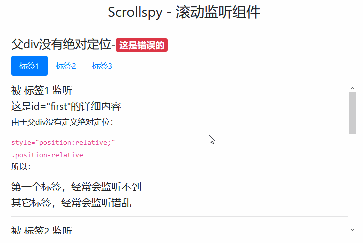
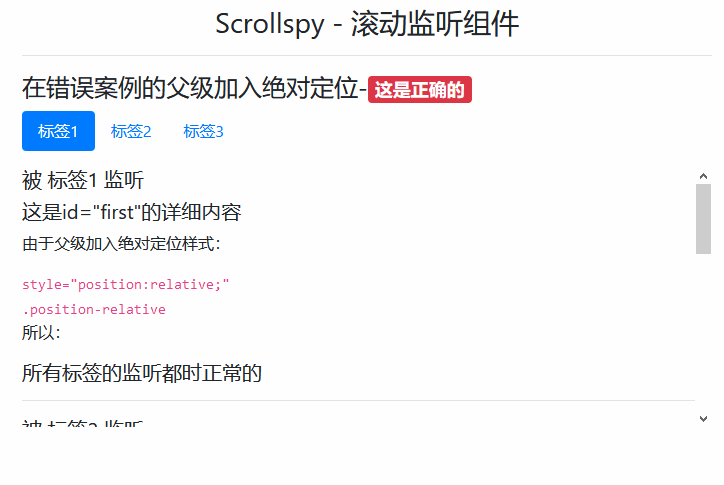
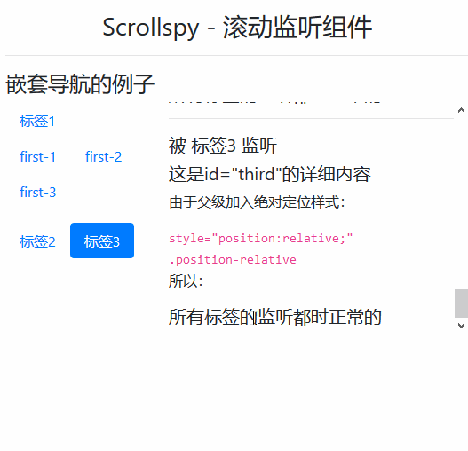
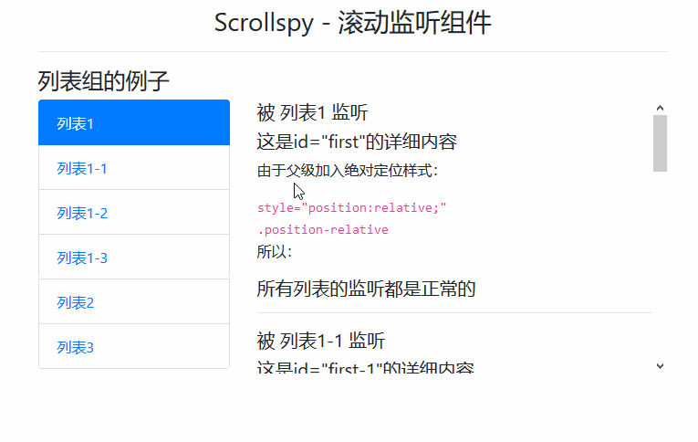

# Scrollspy - 滚动监听组件

> 滚动监听组件，根据滚动位置自动更新引导导航或列表组组件，以指示视图中当前处于活动状态的链接。

## Scrollspy 几个必要条件

| 序号 | 条件描述                                                         |
| ---- | ---------------------------------------------------------------- |
| 1    | 监听对象必须是 `导航组件` 或 `列表组`                            |
| 2    | `被监听内容` 的父 div 需要添加绝对定位样式 `position: relative;` |
| 3    | `被监听内容` 的父元素，需设置 `height` 和 `overflow-y:scroll;`   |
| 4    | `<a>` 标签必须具有正确指向`id`的锚标记                           |
| 5    | 必须引入 bootstrap 的 js                                         |

- `position: relative;` 绝对定位的用处？
  > `绝对定位` 表示这一块级时独立的，在滚动条 `滚动到顶部` 后，不再继续向前滚动！

## `被监听内容`的元素属性表

| 元素属性                    | 描述                        |
| --------------------------- | --------------------------- |
| `data-spy="scroll"`         | 父级，，支持滚动            |
| `data-target="#监听导航id"` | 父级，映射指`监听导航`      |
| `data-offset="数值"`        | 父级，改变 div 默认定位位置 |

## 错误的案例

> 父 div 没有绝对定位的滚动条组件，经常会出现监听错乱或无法监听到（`这是错误的`）



```html
<div class="container">
    <h3 class="text-center mt-3">Scrollspy - 滚动监听组件</h3>
    <hr>
    <h4>父div没有绝对定位-<span class="badge badge-danger">这是错误的</span></h4>
    <nav id="scrollspy-001" class="nav nav-pills mb-3">
        <a class="nav-item nav-link active" href="#first">标签1</a>
        <a class="nav-item nav-link" href="#second">标签2</a>
        <a class="nav-item nav-link" href="#third">标签3</a>
    </nav>
    <dl data-spy="scroll" data-target="#scrollspy-001" data-offset="0" style="height:300px; overflow-y:scroll;">
        <dt id="first">
            <h5>被 标签1 监听</h5>
        </dt>
        <dd>
            <h5>这是id="first"的详细内容</h5>
            <p>由于父div没有定义绝对定位：</p>
            <code>style="position:relative;"</code>
            <br>
            <code>.position-relative</code>
            <p>所以：</p>
            <h5>第一个标签，经常会监听不到</h5>
            <h5>其它标签，经常会监听错乱</h5>
        </dd>
        <hr>
        <dt id="second">
            <h5>被 标签2 监听</h5>
        </dt>
        <dd>
            <h5>这是id="second"的详细内容</h5>
            <p>由于父div没有定义绝对定位：</p>
            <code>style="position:relative;"</code>
            <br>
            <code>.position-relative</code>
            <p>所以：</p>
            <h5>第一个标签，经常会监听不到</h5>
            <h5>其它标签，经常会监听错乱</h5>
        </dd>
        <hr>
        <dt id="third">
            <h5>被 标签3 监听</h5>
        </dt>
        <dd>
            <h5>这是id="third"的详细内容</h5>
            <p>由于父div没有定义绝对定位：</p>
            <code>style="position:relative;"</code>
            <br>
            <code>.position-relative</code>
            <p>所以：</p>
            <h5>第一个标签，经常会监听不到</h5>
            <h5>其它标签，经常会监听错乱</h5>
        </dd>
    </dl>
</div>
<script src="/static/base/js/jquery.min.js"></script>
<script src="/static/base/js/bootstrap.bundle.min.js"></script>
```

## 成功案例

> `错误案例` 父级加入绝对定位后就成功了



```html
<div class="container">
    <h3 class="text-center mt-3">Scrollspy - 滚动监听组件</h3>
    <hr>
    <h4>在错误案例的父级加入绝对定位-<span class="badge badge-danger">这是正确的</span></h4>
    <nav id="scrollspy-001" class="nav nav-pills mb-3">
        <a class="nav-item nav-link active" href="#first">标签1</a>
        <a class="nav-item nav-link" href="#second">标签2</a>
        <a class="nav-item nav-link" href="#third">标签3</a>
    </nav>
    <dl data-spy="scroll" data-target="#scrollspy-001" data-offset="0" class="position-relative" style="height:260px; overflow-y:scroll;">
        <dt id="first">
            <h5>被 标签1 监听</h5>
        </dt>
        <dd>
            <h5>这是id="first"的详细内容</h5>
            <p>由于父级加入绝对定位样式：</p>
            <code>style="position:relative;"</code>
            <br>
            <code>.position-relative</code>
            <p>所以：</p>
            <h5>所有标签的监听都时正常的</h5>
        </dd>
        <hr>
        <dt id="second">
            <h5>被 标签2 监听</h5>
        </dt>
        <dd>
            <h5>这是id="second"的详细内容</h5>
            <p>由于父级加入绝对定位样式：</p>
            <code>style="position:relative;"</code>
            <br>
            <code>.position-relative</code>
            <p>所以：</p>
            <h5>所有标签的监听都时正常的</h5>
        </dd>
        <hr>
        <dt id="third">
            <h5>被 标签3 监听</h5>
        </dt>
        <dd>
            <h5>这是id="third"的详细内容</h5>
            <p>由于父级加入绝对定位样式：</p>
            <code>style="position:relative;"</code>
            <br>
            <code>.position-relative</code>
            <p>所以：</p>
            <h5>所有标签的监听都时正常的</h5>
        </dd>
    </dl>
</div>
<script src="/static/base/js/jquery.min.js"></script>
<script src="/static/base/js/bootstrap.bundle.min.js"></script>
```

> 嵌入式导航



```html
<div class="container">
    <h3 class="text-center mt-3">Scrollspy - 滚动监听组件</h3>
    <hr>
    <h4>嵌套导航的例子</h4>
    <div class="row">
        <div class="col-4">
            <nav id="scrollspy-001" class="nav nav-pills mb-3">
                <a class="nav-item nav-link active" href="#first">标签1</a>
                <nav class="nav nav-pills mb-3">
                    <a class="nav-item nav-link active" href="#first-1">first-1</a>
                    <a class="nav-item nav-link" href="#first-2">first-2</a>
                    <a class="nav-item nav-link" href="#first-3">first-3</a>
                </nav>
                <a class="nav-item nav-link" href="#second">标签2</a>
                <a class="nav-item nav-link" href="#third">标签3</a>
            </nav>
        </div>
        <div class="col-8">
            <dl data-spy="scroll" data-target="#scrollspy-001" data-offset="0" class="position-relative" style="height:260px; overflow-y:scroll;">
                <dt id="first">
                    <h5>被 标签1 监听</h5>
                </dt>
                <dd>
                    <h5>这是id="first"的详细内容</h5>
                    <p>由于父级加入绝对定位样式：</p>
                    <code>style="position:relative;"</code>
                    <br>
                    <code>.position-relative</code>
                    <p>所以：</p>
                    <h5>所有标签的监听都时正常的</h5>
                </dd>
                <hr>
                <dt id="first-1">
                    <h5>被 标签1-1 监听</h5>
                </dt>
                <dd>
                    <h5>这是id="first"的详细内容</h5>
                    <p>由于父级加入绝对定位样式：</p>
                    <code>style="position:relative;"</code>
                    <br>
                    <code>.position-relative</code>
                    <p>所以：</p>
                    <h5>所有标签的监听都时正常的</h5>
                </dd>
                <hr>
                <dt id="first-2">
                    <h5>被 标签1-2 监听</h5>
                </dt>
                <dd>
                    <h5>这是id="second"的详细内容</h5>
                    <p>由于父级加入绝对定位样式：</p>
                    <code>style="position:relative;"</code>
                    <br>
                    <code>.position-relative</code>
                    <p>所以：</p>
                    <h5>所有标签的监听都时正常的</h5>
                </dd>
                <hr>
                <dt id="first-3">
                    <h5>被 标签1-3 监听</h5>
                </dt>
                <dd>
                    <h5>这是id="third"的详细内容</h5>
                    <p>由于父级加入绝对定位样式：</p>
                    <code>style="position:relative;"</code>
                    <br>
                    <code>.position-relative</code>
                    <p>所以：</p>
                    <h5>所有标签的监听都时正常的</h5>
                </dd>
                <hr>
                <dt id="second">
                    <h5>被 标签2 监听</h5>
                </dt>
                <dd>
                    <h5>这是id="second"的详细内容</h5>
                    <p>由于父级加入绝对定位样式：</p>
                    <code>style="position:relative;"</code>
                    <br>
                    <code>.position-relative</code>
                    <p>所以：</p>
                    <h5>所有标签的监听都时正常的</h5>
                </dd>
                <hr>
                <dt id="third">
                    <h5>被 标签3 监听</h5>
                </dt>
                <dd>
                    <h5>这是id="third"的详细内容</h5>
                    <p>由于父级加入绝对定位样式：</p>
                    <code>style="position:relative;"</code>
                    <br>
                    <code>.position-relative</code>
                    <p>所以：</p>
                    <h5>所有标签的监听都时正常的</h5>
                </dd>
            </dl>
        </div>
    </div>
</div>
<script src="/static/base/js/jquery.min.js"></script>
<script src="/static/base/js/bootstrap.bundle.min.js"></script>
```

> 列表组的例子



```html
<div class="container">
    <h3 class="text-center mt-3">Scrollspy - 滚动监听组件</h3>
    <hr>
    <h4>列表组的例子</h4>
    <div class="row">
        <div class="col-4">
            <div id="scrollspy-001" class="list-group">
                <a class="list-group-item" href="#first">列表1</a>
                <div class="list-group">
                    <a class="list-group-item" href="#first-1">列表1-1</a>
                    <a class="list-group-item" href="#first-2">列表1-2</a>
                    <a class="list-group-item border-bottom-0" href="#first-3">列表1-3</a>
                </div>
                <a class="list-group-item" href="#second">列表2</a>
                <a class="list-group-item" href="#third">列表3</a>
            </div>
        </div>
        <div class="col-8">
            <dl data-spy="scroll" data-target="#scrollspy-001" data-offset="0" class="position-relative" style="height:300px; overflow-y:scroll;">
                <dt id="first">
                    <h5>被 列表1 监听</h5>
                </dt>
                <dd>
                    <h5>这是id="first"的详细内容</h5>
                    <p>由于父级加入绝对定位样式：</p>
                    <code>style="position:relative;"</code>
                    <br>
                    <code>.position-relative</code>
                    <p>所以：</p>
                    <h5>所有列表的监听都是正常的</h5>
                </dd>
                <hr>
                <dt id="first-1">
                    <h5>被 列表1-1 监听</h5>
                </dt>
                <dd>
                    <h5>这是id="first-1"的详细内容</h5>
                    <p>被嵌入的列表组件监听</p>
                    <h5>所以上级列表组件监听不会消失</h5>
                </dd>
                <hr>
                <dt id="first-2">
                    <h5>被 列表1-2 监听</h5>
                </dt>
                <dd>
                    <h5>这是id="first-2"的详细内容</h5>
                    <p>被嵌入的列表组件监听</p>
                    <h5>所以上级列表组件监听不会消失</h5>
                </dd>
                <hr>
                <dt id="first-3">
                    <h5>被 列表1-3 监听</h5>
                </dt>
                <dd>
                    <h5>这是id="first-3"的详细内容</h5>
                    <p>被嵌入的列表组件监听</p>
                    <h5>所以上级列表组件监听不会消失</h5>
                </dd>
                <hr>
                <dt id="second">
                    <h5>被 列表2 监听</h5>
                </dt>
                <dd>
                    <h5>这是id="second"的详细内容</h5>
                    <p>监听导航，通过点击可跳转至锚标签，这就有可能：导致监听错乱</p>
                    <p>可以通过js的 <code>preventDefault()</code> 方法来阻止URL跳转</p>
                </dd>
                <hr>
                <dt id="third">
                    <h5>被 列表3 监听</h5>
                </dt>
                <dd>
                    <h5>这是id="third"的详细内容</h5>
                    <p>监听导航，通过点击可跳转至锚标签，这就有可能：导致监听错乱</p>
                    <p>可以通过js的 <code>preventDefault()</code> 方法来阻止URL跳转</p>
                </dd>
            </dl>
        </div>
    </div>
</div>
<script src="/static/base/js/jquery.min.js"></script>
<script src="/static/base/js/bootstrap.bundle.min.js"></script>
<script type="text/javascript">
    $('#scrollspy-001 a').on('click', function(e) {
        e.preventDefault();
    });
</script>
```
