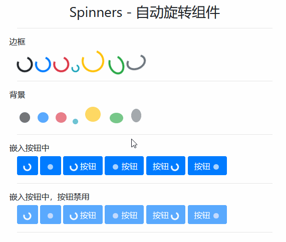

# Spinners - 自动旋转组件

> 自动旋转组件完全使用了 html 和 css，不需要 JavaScript 支持

## 样式类

| 样式类              | 描述                            |
| ------------------- | ------------------------------- |
| `spinner-border`    | 基类,色彩与 `text-primary` 配合 |
| `spinner-border-sm` | 更小的                          |
| `spinner-grow`      | 基类，色彩与 `text-*` 配合      |
| `spinner-grow-sm`   | 更小的                          |

## 案例



```html
<div class="container">
    <h3 class="text-center mt-3">Spinners - 自动旋转组件</h3>
    <hr>
    <h6 class="row"> 边框 </h6>
    <span class="spinner-border"></span>
    <a class="spinner-border text-primary"></a>
    <div class="spinner-border text-danger"></div>
    <i class="spinner-border text-info spinner-border-sm"></i>
    <span class="spinner-border text-warning" style="width:45px; height:45px;"></span>
    <span class="spinner-border text-success" style="width:40px; height:30px"></span>
    <span class="spinner-border text-secondary" style="width:30px; height:40px"></span>
    <hr>
    <h6 class="row"> 背景 </h6>
    <span class="spinner-grow"></span>
    <a class="spinner-grow text-primary"></a>
    <div class="spinner-grow text-danger"></div>
    <i class="spinner-grow text-info spinner-grow-sm"></i>
    <span class="spinner-grow text-warning" style="width:45px; height:45px;"></span>
    <span class="spinner-grow text-success" style="width:40px; height:30px"></span>
    <span class="spinner-grow text-secondary" style="width:30px; height:40px"></span>
    <hr>
    <h6 class="row"> 嵌入按钮中 </h6>
    <button type="button" name="button" class="btn btn-primary">
        <span class="spinner-border spinner-border-sm"></span>
    </button>
    <button type="button" name="button" class="btn btn-primary">
        <span class="spinner-grow spinner-grow-sm"></span>
    </button>
    <button type="button" name="button" class="btn btn-primary">
        <span class="spinner-border spinner-border-sm"></span> 按钮 </button>
    <button type="button" name="button" class="btn btn-primary">
        <span class="spinner-grow spinner-grow-sm"></span> 按钮 </button>
    <button type="button" name="button" class="btn btn-primary"> 按钮 <span class="spinner-border spinner-border-sm"></span>
    </button>
    <button type="button" name="button" class="btn btn-primary"> 按钮 <span class="spinner-grow spinner-grow-sm"></span>
    </button>
    <hr>
    <h6 class="row"> 嵌入按钮中，按钮禁用 </h6>
    <button type="button" name="button" class="btn btn-primary" disabled>
        <span class="spinner-border spinner-border-sm"></span>
    </button>
    <button type="button" name="button" class="btn btn-primary" disabled>
        <span class="spinner-grow spinner-grow-sm"></span>
    </button>
    <button type="button" name="button" class="btn btn-primary" disabled>
        <span class="spinner-border spinner-border-sm"></span> 按钮 </button>
    <button type="button" name="button" class="btn btn-primary" disabled>
        <span class="spinner-grow spinner-grow-sm"></span> 按钮 </button>
    <button type="button" name="button" class="btn btn-primary" disabled> 按钮 <span class="spinner-border spinner-border-sm"></span>
    </button>
    <button type="button" name="button" class="btn btn-primary" disabled> 按钮 <span class="spinner-grow spinner-grow-sm"></span>
    </button>
    <hr>
</div>
```

> 除了案例这些例子常用外，自动旋转组件还常跟 `浮动、对齐` 等一起使用！
