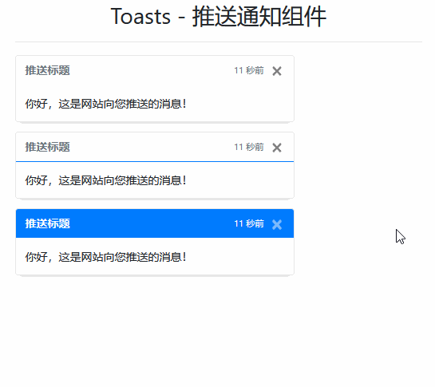

# Toasts - 推送通知组件

> 推送通知组件，用于向浏览者推送通知，这是一个轻量级的、易于定制的警告消息。

## 样式类

| 样式类         | 描述                 |
| -------------- | -------------------- |
| `toast`        | 1 级，基类           |
| `toast-header` | 2 级，基类，组件标题 |
| `toast-body`   | 2 级，基类，组件内容 |

## 案例



```html
<div class="container">
    <h3 class="text-center mt-3">Toasts - 推送通知组件</h3>
    <hr>
    <div class="toast fade show">
        <div class="toast-header">
            <strong class="mr-auto">推送标题</strong>
            <small class="text-muted">11 秒前</small>
            <button type="button" class="ml-2 mb-1 close" data-dismiss="toast">
                <span>&times;</span>
            </button>
        </div>
        <div class="toast-body"> 你好，这是网站向您推送的消息！ </div>
    </div>
    <div class="toast fade show">
        <div class="toast-header border-bottom border-primary">
            <strong class="mr-auto">推送标题</strong>
            <small class="text-muted">11 秒前</small>
            <button type="button" class="ml-2 mb-1 close" data-dismiss="toast">
                <span>&times;</span>
            </button>
        </div>
        <div class="toast-body"> 你好，这是网站向您推送的消息！ </div>
    </div>
    <div class="toast fade show">
        <div class="toast-header bg-primary">
            <strong class="mr-auto text-light">推送标题</strong>
            <small class="text-light">11 秒前</small>
            <button type="button" class="ml-2 mb-1 close text-light" data-dismiss="toast">
                <span>&times;</span>
            </button>
        </div>
        <div class="toast-body"> 你好，这是网站向您推送的消息！ </div>
    </div>
</div>
<script src="/static/base/js/jquery.min.js"></script>
<script src="/static/base/js/bootstrap.bundle.min.js"></script>
<script type="text/javascript">
    $('.toast').toast();
</script>
```

> 到此，bootstrap v4.2.1 的所有组件讲解完毕，事实上很多组件的事件我们都没有详细讲解过，但是这个不难，需要用过的时候查看手册即可。
>
> - 大多数组件都可以通过一些基础样式类，来改变色彩、布局等效果！
