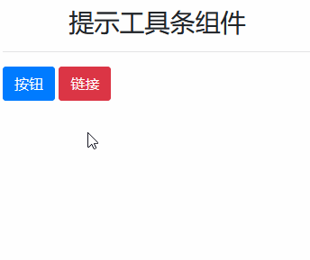

# Tooltips - 提示工具条组件

> 提示工具条组件,与弹出层组件原理基本相同，只是`templetes`模板效果不同

## 必须的 js 代码

```js
$('[data-toggle="tooltip"]').tooltip({
  // 这里是组件公用代码
});
```

## 提示工具条组件属性说明

> 提示工具条组件属性支持两种写法：

| 属性写法 | 作用域                                     |
| -------- | ------------------------------------------ |
| `data-*` | 直接写入元素中(`title`属性不需要加`data-`) |
| `*`      | 在 js 中定义，一般都是定义公共信息         |

```html
<!-- 直接写入元素 -->
<button type="button" class="btn btn-primary" title="这是标题" data-content="这是内容">一个提示工具条</button>
<button type="button" class="btn btn-primary" title="这是标题">一个提示工具条</button>
```

```js
$().tooltip({
  // 这里输入提示工具条公用代码
  delay: { show: 500, hide: 300 }
});
```

> 为了更好的表示哪些元素需要实现提示工具条功能,我们可以在元素上加入 `data-toggle="tooltip"` 属性,然后这样调用:

```js
$('[data-toggle="tooltip"]').tooltip({
  // 这里输入提示工具条公用代码
  delay: { show: 500, hide: 300 }
});
```

> 也可以为个别元素，添加提示工具条 js

```js
$(".tooltip-001").tooltip({
  // 这里输入提示工具条公用代码
  delay: { show: 500, hide: 300 }
});
```

> 常用属性表：

| 属性        | 属性值选项                        | 默认值          | 描述                                                       |
| ----------- | --------------------------------- | --------------- | ---------------------------------------------------------- |
| `animation` | 布尔值                            | true            | 淡入淡出提示工具条                                         |
| `container` | `string|元素|false`               | false           | 将弹出窗口附加到特定元素（当父元素样式干扰弹出时，使用它） |
| `delay`     | `数值|对象`                       | 0               | 延迟提示工具条的显示和隐藏时间                             |
| `placement` | `auto|top|bottom|left|right|函数` | `'top'`         | 定义提示工具条方向                                         |
| `title`     | 字符串                            | `''`            | 提示工具条标题                                             |
| `trigger`   | `click|hover|focus|manual`        | `'hover focus'` | 提示工具条的触发事件                                       |
| `template`  | 预先定义好的 div 块               | 预先定义的      | 提示工具条组件的模板                                       |

> 注意：提示工具条组件与弹出层有一个明显的区别：没有 `content & data-content` 属性

### `container` 解决样式冲突

> 当父元素样式干扰了提示工具条组件弹出时，可以添加到特定元素（一般选择最近元素中正常的）

```js
$(function() {
  $('[data-toggle="tooltip"]').tooltip({
    container: "body"
  });
});
```

```html
<button type="button" class="btn btn-primary" title="这是标题" data-content="这是内容" data-container="body">一个提示工具条</button>
```

### 事件延迟触发

> `delay` 属性用于设置 `显示事件` 和 `隐藏事件` 的延迟时间

| `delay` 取值 | 例子                                       | 描述                                        |
| ------------ | ------------------------------------------ | ------------------------------------------- |
| 数值         | `delay: "300"`                             | 隐藏事件和显示事件都是延迟 300 毫秒         |
| 数值         | `data-delay="300"`                         | 隐藏事件和显示事件都是延迟 300 毫秒         |
| 对象         | `delay: {"show": 500, "hide": 300}`        | 显示事件延迟 500 毫秒,隐藏事件延迟 300 毫秒 |
| 对象         | `data-delay='{"show": 1000, "hide": 300}'` | 显示事件延迟 500 毫秒,隐藏事件延迟 300 毫秒 |

### 提示工具条样式模板

> 提示工具条的样式是预先定义好的（可以通过 `template & data-template` 属性自定义）

```html
<div class="tooltip" role="tooltip">
    <div class="arrow"></div>
    <div class="tooltip-inner"></div>
</div>
```

> 模板元素概要：

| 模板元素         | 作用域 | 描述                          |
| ---------------- | ------ | ----------------------------- |
| `.tooltip`       | 父级   | 组件基类                      |
| `.arrow`         | 子级   | 组件箭头样式                  |
| `.tooltip-inner` | 子级   | 组件的信息，对应 `title` 属性 |

## 案例

> 提示工具条组件的触发事件被我们改为：点击事件



```html
<div class="container">
    <h3 class="text-center mt-5">提示工具条组件</h3>
    <hr>
    <button type="button" class="btn btn-primary" data-toggle="tooltip" title="这是一个按钮">按钮</button>
    <a href="http://www.baidu.com" class="btn btn-danger" data-toggle="tooltip" title="这是一个链接">链接</a>
</div>
<script src="/static/base/js/jquery.min.js"></script>
<script src="/static/base/js/bootstrap.bundle.min.js"></script>
<script type="text/javascript">
    // 如果是 <a> 标签，并且提示工具条的触发事件设置成 click，我们就应该防止链接打开 URL
    // 使用 preventDefault() 可以阻止元素发生默认行为
    $('a[data-toggle="tooltip"]').on('click', function(e) {
        e.preventDefault();
    });
    $('[data-toggle="tooltip"]').tooltip({
        // 这里输入提示工具条公用代码
        container: 'body',
        trigger: 'click',
        delay: {
            "show": 500,
            "hide": 300
        },
    });
</script>
```
