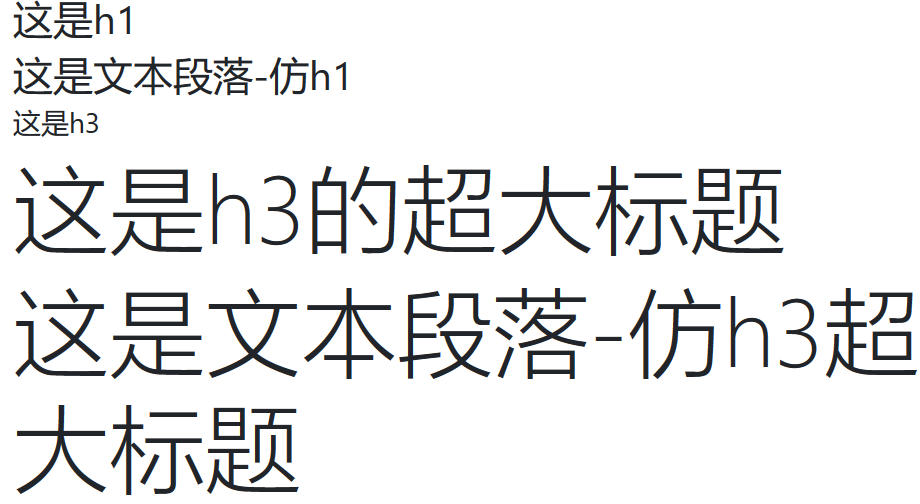
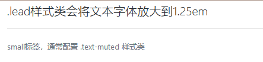
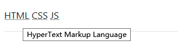
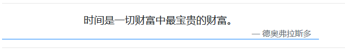
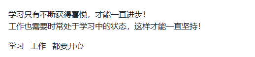
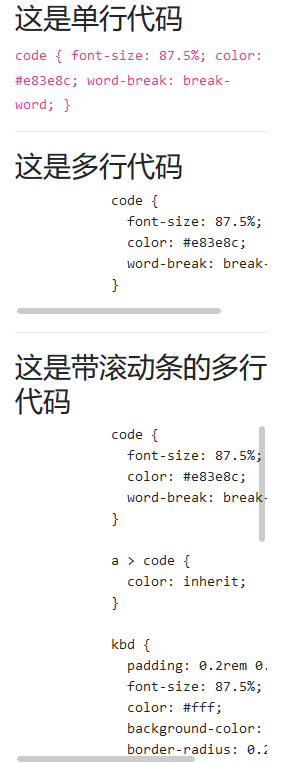

# bootstrap 公共事务篇

> 该篇章，讲解的内容主要是 bootstrap 对标签自身的修改，内容简单，跟着 bootstrap 用即可
>
> - PS：这里的很多知识点可能需要 `html5` 基础才能更好的理解，因为会涉及到 `web标签的标准语义`

## 排版优化

> 页面排版优化主要对 `全局 & 标题 & 文本 & 列表`

### 标题

> bootstrap 对 `<h1> ~ <h6>` 标签做了优化，让标题更加直观

1. 标题标签效果的文本

   > `.h1 ~ .h6` 样式类做了跟 `<h1> ~ <h6>` 标签一样的效果，这样文本也能输出对应标题标签的界面效果

2. 显眼的标题
   > 如果你很固执，就是要超大的标题，可以使用 `.display-1 ~ display-4`

### 一个简单的案例：



```html
<div class="container">
    <h1>这是h1</h1>
    <p class="h1">这是文本段落-仿h1</p>
    <h3>这是h3</h3>
    <h3 class="display-1">这是h3的超大标题</h3>
    <p class="display-1">这是文本段落-仿h3超大标题</p>
</div>
```

## 文本优化

1. `.lead` 样式类

   > 我们可以通过添加 `.lead` 来突出一个段落（字体放大到 1.25em）

   ```html
   <p class="lead">.lead样式类会将文本字体放大到1.25em</p>
   ```

2. `<small>` 标签

   > 以小号字显示，通常配置 `.text-muted`（字体缩小至 80%）

   ```html
   <small class="text-muted">small标签，通常配置 .text-muted 样式类</small>
   ```

   

3. `<abbr>` 标签

   > `<abbr>` 标签用来表示一个缩写词或者首字母缩略词

   

   ```html
   <abbr title="HyperText Markup Language">HTML</abbr>
   <abbr title="Cascading Style Sheets">CSS</abbr>
   <abbr title="JavaScript">JS</abbr>
   ```

4. `<blockquote>` 标签

   > 从别处引用的信息，我们使用这个标签
   >
   > - `.blockquote` ： 应用于 `<blockquote>` 标签（字体变大）
   > - `.blockquote-footer` ：应用于 `<blockquote> 下的 <footer>` （字体变小、颜色改变、前面加上 `--`）

   

   ```html
   <div class="container">
       <blockquote
           class="blockquote col-8 border-bottom border-primary"
           cite="https://www.baidu.com/">
           <p class="mb-0 text-center">时间是一切财富中最宝贵的财富。</p>
           <footer class="blockquote-footer text-right">德奥弗拉斯多</footer>
       </blockquote>
   </div>
   ```

### 文本的内联标签优化

> 这个很简单，而且使用率很低（通常会用 css 样式来解决这类问题）

| 内联标签   | 描述                                                    |
| ---------- | ------------------------------------------------------- |
| `<mark>`   | 突出显示部分文本（以添加背景色的方式）                  |
| `<del>`    | ~~将文本标记为已 删除~~                                 |
| `<s>`      | ~~将文本视为不准确为本（界面效果以`<del>`一致）~~       |
| `<ins>`    | 该标签下的文本，视为对文本的补充（界面效果以`<u>`一致） |
| `<u>`      | 文本加下划线显示                                        |
| `<strong>` | **文本加粗**                                            |
| `<b>`      | **文本加粗**                                            |
| `<em>`     | _文本斜体，bootstrap 没有处理过_                        |
| `<i>`      | _文本斜体，bootstrap 没有处理过_                        |
| `<span>`   | 没有特殊变化，bootstrap 没有处理过                      |

## 列表

| 列表样式            | 描述                                        |
| ------------------- | ------------------------------------------- |
| `.list-unstyled`    | `<ul>` 标签样式类，`li` 样式和`div`基本一致 |
| `.list-inline`      | `<ul>` 标签样式类，`li` 是内联的            |
| `.list-inline-item` | `<li>` 标签样式类，与 `.list-inline` 结合   |



```html
<div class="container">
    <ul class="list-unstyled">
        <li>学习只有不断获得喜悦，才能一直进步！</li>
        <li>工作也需要时常处于学习中的状态，这样才能一直坚持！</li>
    </ul>
    <ul class="list-inline">
        <li class="list-inline-item">学习</li>
        <li class="list-inline-item">工作</li>
        <li class="list-inline-item">都要开心</li>
    </ul>
</div>
```

## 描述列表

> `<dl> & <dt> & <dd>` 是描述列表的 3 个组成部分


```html
<div class="container">
    <dl class="row">
        <dt class="col-3 text-right">学习</dt>
        <dd class="col-9">只有不断获得喜悦，才能一直进步！</dd>
        <dt class="col-3 text-center">工作</dt>
        <dd class="col-3 text-truncate">也需要时常处于学习中的状态，这样才能一直坚持！</dd>
    </dl>
</div>
```

## 代码相关标签

> 这类标签，用于在输出页面中显示代码、代码块等

| 代码标签          | 描述                                                       |
| ----------------- | ---------------------------------------------------------- |
| `<code>`          | 代码的内联标签                                             |
| `<pre>`           | 代码块标签（源代码的空格和换行所见即所得）                 |
| `.pre-scrollable` | 代码块样式类，限制最大高度为 340px（超出以滚动条形式浏览） |
| `<var>`           | 处理变量方程式等                                           |
| `<kbd>`           | 处理键盘按键组合等                                         |
| `<samp>`          | 被设备认为是，案例输出                                     |



```html
<div class="container">
    <h3>这是单行代码</h3>
    <code>code { font-size: 87.5%; color: #e83e8c; word-break: break-word; }</code>
    <hr>
    <h3>这是多行代码</h3>
    <pre>
        code {
          font-size: 87.5%;
          color: #e83e8c;
          word-break: break-word;
        }
    </pre>
    <hr>
    <h3>这是带滚动条的多行代码</h3>
    <pre class="pre-scrollable">
        code {
          font-size: 87.5%;
          color: #e83e8c;
          word-break: break-word;
        }

        a > code {
          color: inherit;
        }

        kbd {
          padding: 0.2rem 0.4rem;
          font-size: 87.5%;
          color: #fff;
          background-color: #212529;
          border-radius: 0.2rem;
        }

        kbd kbd {
          padding: 0;
          font-size: 100%;
          font-weight: 700;
        }

        pre {
          display: block;
          font-size: 87.5%;
          color: #212529;
        }

        pre code {
          font-size: inherit;
          color: inherit;
          word-break: normal;
        }

        .pre-scrollable {
          max-height: 340px;
          overflow-y: scroll;
        }
    </pre>
</div>
```

## 图片

> 这里涉及到图片的样式类和图片组合

| 元素或样式类      | 描述                               |
| ----------------- | ---------------------------------- |
| ``           | 图片标签                           |
| `.img-fluid`      | `` 的正常样式                 |
| `.img-thumbnail`  | `` 充当缩略图的样式           |
| `<figure>`        | 规定独立的流内容（图像、代码等等） |
| `<figcaption>`    | 为`<figure>`定义标题               |
| `.figure`         | 处理`<figure>`样式                 |
| `.figure-caption` | 处理 `<figcaption>` 样式           |
| `.figure-img`     | 处理`<figure>`下的 `` 样式    |

> html5 中除了 `<figure>` 这种处理图像的标签外，还有两个专门处理流媒体的标签：

| 流标签     | 描述                                                 |
| ---------- | ---------------------------------------------------- |
| `<figure>` | 标签规定独立的流内容（图像、图表、照片、代码等等）。 |
| `<video>`  | 标签定义视频，比如电影片段或其他视频流。             |
| `<audio>`  | 标签定义声音，比如音乐或其他音频流。                 |

### `canvas` 简单的 svg 画图

> 这个知识点用于处理预定义图片效果不错

| 标签或样式类 | 描述                                 |
| ------------ | ------------------------------------ |
| `<svg>`      | SVG 使用 XML 格式定义图像            |
| `<rect>`     | 标签可用来创建矩形，以及矩形的变种。 |
| `<circle>`   | 标签可用来创建一个圆。               |
| `<ellipse>`  | 标签可用来创建椭圆                   |
| `<line>`     | 标签用来创建线条                     |
| `<polygon>`  | 标签用来创建含有不少于三个边的图形   |
| `<polyline>` | 标签用来创建仅包含直线的形状         |
| `<path>`     | 标签用来定义路径                     |

```html
<div class="container">
    <div class="col">
        <figure class="figure">
            <svg style="text-anchor:middle" class="img-thumbnail rounded" width="80" height="80" role="img">
                <rect fill="#868e96" width="100%" height="100%"></rect>
                <text fill="#dee2e6" class="" dy=".3em" x="50%" y="50%">80x80</text>
            </svg>
            <figcaption class="figure-caption text-center">缩略图</figcaption>
        </figure>
    </div>
    <div class="col">
        <figure class="figure">
            <svg style="text-anchor:middle" class="img-fluid rounded" role="img" width="400" height="300">
                <rect fill="#868e96" width="100%" height="100%"></rect>
                <text fill="#dee2e6" dy=".3em" x="50%" y="50%">400x300</text>
            </svg>
            <figcaption class="figure-caption text-right">大图</figcaption>
        </figure>
    </div>
</div>
```
