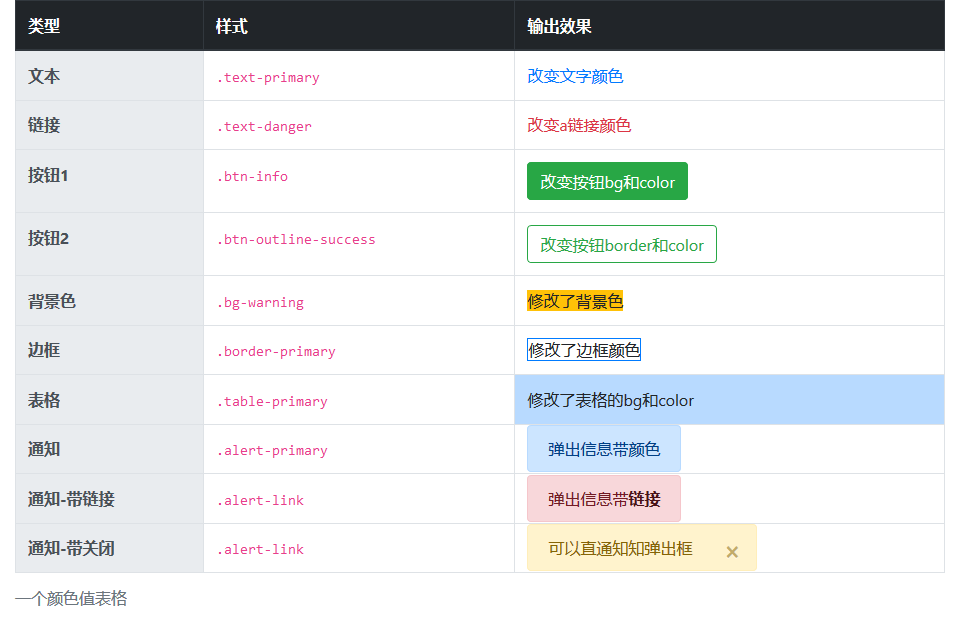

# bootstrap 颜色篇

> bootstrap 颜色应用非常广泛，页面中可以通过色彩传达意义，还包括对带有悬停状态的链接样式化的支持。

## 颜色系列表

> `bootstrap` 为标签的不同属性各定义了一系列的颜色值

| 颜色代号    | 描述                       | color 类         | border 类          | bg 类            | botton 类                                | table 类          | Alerts 类               |
| ----------- | -------------------------- | ---------------- | ------------------ | ---------------- | ---------------------------------------- | ----------------- | ----------------------- |
| white       | 白色                       | `text-white`     | `border-white`     | `bg-white`       | `没有样式`                               | `没有样式`        | `没有样式`              |
| primary     | 基本                       | `text-primary`   | `border-primary`   | `bg-primary`     | `btn-primary` `.btn-outline-primary`     | `table-primary`   | `alert alert-primary`   |
| secondary   | 次要                       | `text-secondary` | `border-secondary` | `bg-secondary`   | `btn-secondary` `.btn-outline-secondary` | `table-secondary` | `alert alert-secondary` |
| success     | 成功                       | `text-success`   | `border-success`   | `bg-success`     | `btn-success` `.btn-outline-success`     | `table-success`   | `alert alert-success`   |
| info        | 信息                       | `text-info`      | `border-info`      | `bg-info`        | `btn-info` `.btn-outline-info`           | `table-info`      | `alert alert-info`      |
| warning     | 警告                       | `text-warning`   | `border-warning`   | `bg-warning`     | `btn-warning` `.btn-outline-warning`     | `table-warning`   | `alert alert-warning`   |
| danger      | 危险                       | `text-danger`    | `border-danger`    | `bg-danger`      | `btn-danger` `.btn-outline-danger`       | `table-danger`    | `alert alert-danger`    |
| light       | 亮系                       | `text-light`     | `border-light`     | `bg-light`       | `btn-light` `.btn-outline-light`         | `table-light`     | `alert alert-light`     |
| dark        | 暗系                       | `text-dark`      | `border-dark`      | `bg-dark`        | `btn-dark` `.btn-outline-dark`           | `table-dark`      | `alert alert-dark`      |
| body        | 主要，`仅用于 color`       | `text-body`      | `没有样式`         | `没有样式`       | `没有样式`                               | `没有样式`        | `没有样式`              |
| muted       | 温和 ，`仅用于 color`      | `text-muted`     | `没有样式`         | `没有样式`       | `没有样式`                               | `没有样式`        | `没有样式`              |
| black-50    | 黑色半透明，`仅用于 color` | `text-black-50`  | `没有样式`         | `没有样式`       | `没有样式`                               | `没有样式`        | `没有样式`              |
| white-50    | 白色半透明，`仅用于 color` | `text-white-50`  | `没有样式`         | `没有样式`       | `没有样式`                               | `没有样式`        | `没有样式`              |
| active      | 活动，`仅用于 table`       | `没有样式`       | `没有样式`         | `没有样式`       | `没有样式`                               | `table-active`    | `没有样式`              |
| link        | 连接，`仅用于按钮 & 通知`  | `没有样式`       | `没有样式`         | `没有样式`       | `btn-link`                               | `没有样式`        | `alert-link`            |
| transparent | 透明，`仅用于背景`         | `没有样式`       | `没有样式`         | `bg-transparent` | `没有样式`                               | `没有样式`        | `没有样式`              |

> PS: 表格有 2 个样式专门用于表格标题的样式:

| 样式          | 描述 | 标签                |
| ------------- | ---- | ------------------- |
| `thead-dark`  | 暗系 | `<thead> & <tbody>` |
| `thead-light` | 亮系 | `<thead> & <tbody>` |

> 一个颜色值案例：



```html
<div class="container">
    <table class="table table-bordered">
        <caption>一个颜色值表格</caption>
        <thead class="thead-dark">
            <th>类型</th>
            <th>样式</th>
            <th>输出效果</th>
        </thead>
        <tbody class="thead-light">
            <tr>
                <th>文本</th>
                <td><code>.text-primary</code></td>
                <td><span class="text-primary">改变文字颜色</span></td>
            </tr>
            <tr>
                <th>链接</th>
                <td><code>.text-danger</code></td>
                <td><a class="text-danger" href="javascript:void(0);">改变a链接颜色</a></td>
            </tr>
            <tr>
                <th>按钮1</th>
                <td><code>.btn-info</code></td>
                <td><button type="button" class="btn btn-success">改变按钮bg和color</button></td>
            </tr>
            <tr>
                <th>按钮2</th>
                <td><code>.btn-outline-success</code></td>
                <td><button type="button" class="btn btn-outline-success">改变按钮border和color</button></td>
            </tr>
            <tr>
                <th>背景色</th>
                <td><code>.bg-warning</code></td>
                <td><span class="bg-warning">修改了背景色</span></td>
            </tr>
            <tr>
                <th>边框</th>
                <td><code>.border-primary</code></td>
                <td><span class="border border-primary">修改了边框颜色</span></td>
            </tr>
            <tr>
                <th>表格</th>
                <td><code>.table-primary</code></td>
                <td class="table-primary">修改了表格的bg和color</td>
            </tr>
            <tr>
                <th>通知</th>
                <td><code>.alert-primary</code></td>
                <td><span class="alert alert-primary">弹出信息带颜色</span></td>
            </tr>
            <tr>
                <th>通知-带链接</th>
                <td><code>.alert-link</code></td>
                <td><span class="alert alert-danger">弹出信息带<a href="javascript:viod(0);" class="alert-link">链接</a></span></td>
            </tr>
            <tr>
                <th>通知-带关闭</th>
                <td><code>.alert-link</code></td>
                <td>
                    <span class="alert alert-warning alert-dismissible">
                        可以直通知知弹出框
                        <button type="button" class="close" data-dismiss="alert">
                            <span>&times;</span>
                        </button>
                    </span>
                </td>
            </tr>
        </tbody>
    </table>
</div>
```
