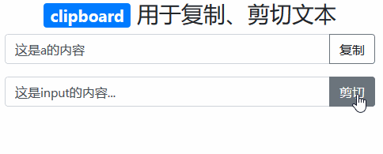
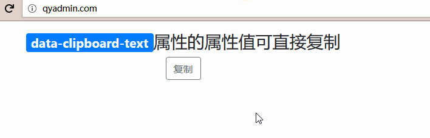
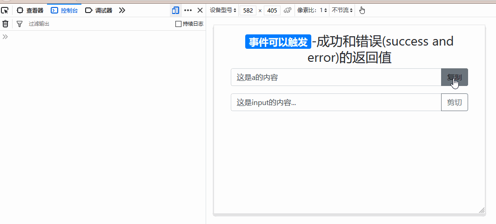

# 《clipboard.js》

> 一种将网页文本复制、剪切到剪贴板的现代方法

## 使用 `html5数据属性` 来实现

> 概念表

| 概念     | 描述                                                                  |
| -------- | --------------------------------------------------------------------- |
| 事件元素 | 触发事件的元素，默认为点击事件，h5 中任何可以触发点击事件的元素都可以 |
| 复制元素 | 该元素文本内容会被复制或剪切，可存放文本内容或拥有 value 值的元素     |

> 使用数据属性，必须创建一个`ClipboardJS`对象，如：

```html
<script src="/static/base/js/clipboard.min.js"></script>
<script type="text/javascript">
    // 默认触发事件为点击事件
    // selector针对触发事件的元素
    // selector取值允许为：样式类、id值、h5元素标签、数据属性以及它们的相互组合
    new ClipboardJS('selector');
</script>
```

> `ClipboardJS` 对象内容取值表（针对触发事件的元素）

| 取值         | 案例                                               |
| ------------ | -------------------------------------------------- |
| `样式类`     | `new ClipboardJS('.btn');`                         |
| `id值`       | `new ClipboardJS('#btn001');`                      |
| `h5元素标签` | `new ClipboardJS('a');`                            |
| `数据属性`   | `new ClipboardJS('[type="button"]');`              |
| `标签+属性`  | `new ClipboardJS('button[type="button"]');`        |
| `多个取值`   | `new ClipboardJS('button[type="button"], a.btn');` |

> html5 数据属性表（针对触发事件的元素）

| 数据属性                             | 描述                               |
| ------------------------------------ | ---------------------------------- |
| `data-clipboard-target="#selector"`  | 指定要复制的文本，所在元素的选择器 |
| `data-clipboard-action="copy|cut"`   | 默认为复制（copy），cut 为剪切     |
| `data-clipboard-text="要复制的内容"` | 要复制的内容                       |



```html
<div class="container">
    <h3 class="text-center mt-3"><span class="badge badge-primary">clipboard</span> 用于复制、剪切文本</h3>
    <div class="form-group input-group">
        <a id="a-001" href="#" class="form-control">这是a的内容</a>
        <div class="input-group-append">
            <a class="btn btn-outline-secondary" data-clipboard-target="#a-001">复制</a>
        </div>
    </div>
    <div class="form-group input-group">
        <input id="input-001" type="text" value="这是input的内容..." class="form-control">
        <div class="input-group-append">
            <button type="button" class="btn btn-outline-secondary" data-clipboard-target="#input-001" data-clipboard-action="cut">剪切</button>
        </div>
    </div>
</div>
<script src="/static/base/js/clipboard.min.js"></script>
<script type="text/javascript">
    new ClipboardJS('.btn');
</script>
```



```html
<div class="container">
    <h3 class="text-center mt-3"><span class="badge badge-primary">data-clipboard-text</span>属性的属性值可直接复制</h3>
    <button type="button" class="btn btn-outline-secondary d-block m-auto" data-clipboard-text="点击按钮可以直接复制data-clipboard-text属性的属性值">复制</button>
</div>
<script src="/static/base/js/clipboard.min.js"></script>
<script type="text/javascript">
    new ClipboardJS('.btn');
</script>
```

> 触发成功和错误(success and error)的返回值



```html
<div class="container">
    <h3 class="text-center mt-3"><span class="badge badge-primary">事件可以触发</span>-成功和错误(success and error)的返回值</h3>
    <div class="form-group input-group">
        <a id="a-001" href="#" class="form-control">这是a的内容</a>
        <div class="input-group-append">
            <a class="btn btn-outline-secondary" data-clipboard-target="#a-001">复制</a>
        </div>
    </div>
    <div class="form-group input-group">
        <input id="input-001" type="text" value="这是input的内容..." class="form-control">
        <div class="input-group-append">
            <button type="button" class="btn btn-outline-secondary" data-clipboard-target="#input-001" data-clipboard-action="cut">剪切</button>
        </div>
    </div>
</div>
<script src="/static/base/js/clipboard.min.js"></script>
<script type="text/javascript">
    var clipboard = new ClipboardJS('.btn');
    clipboard.on('success', function(e) {
        console.info('Action:', e.action);
        console.info('Text:', e.text);
        console.info('Trigger:', e.trigger);
        e.clearSelection();
    });
    clipboard.on('error', function(e) {
        console.error('Action:', e.action);
        console.error('Trigger:', e.trigger);
    });
</script>
```
