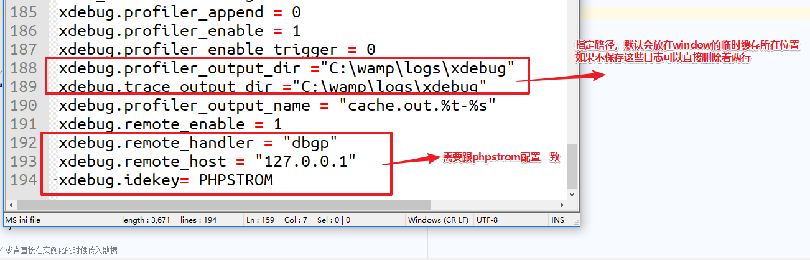
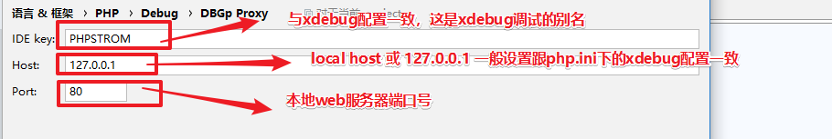
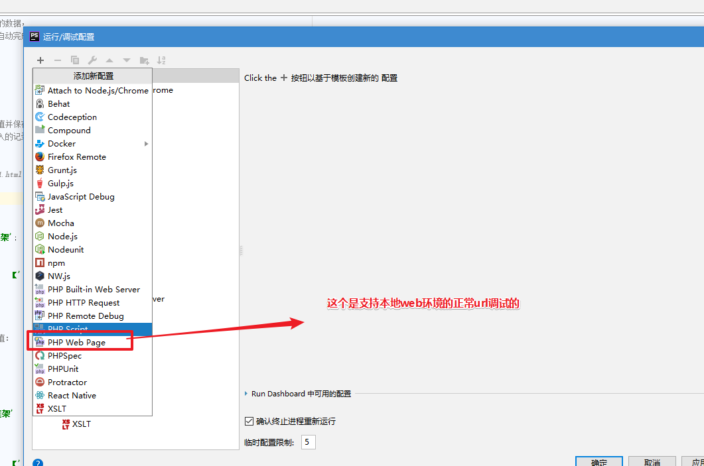
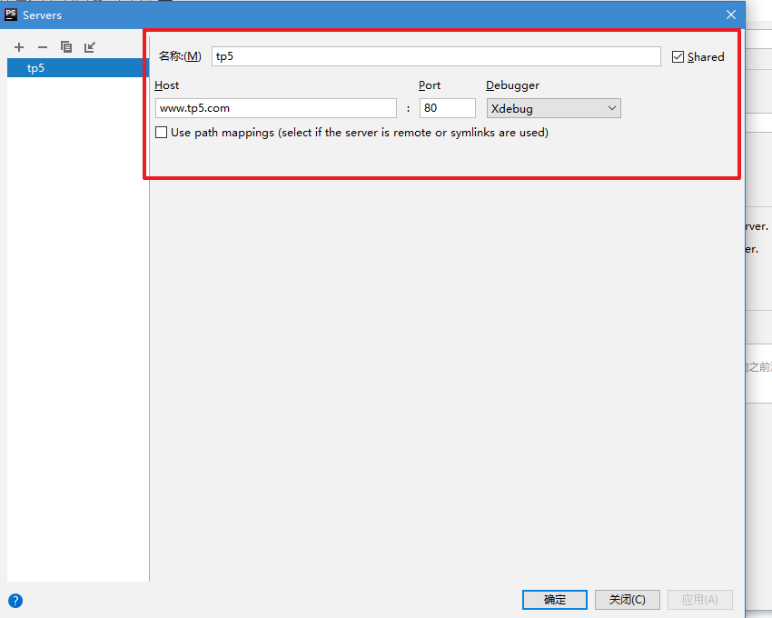
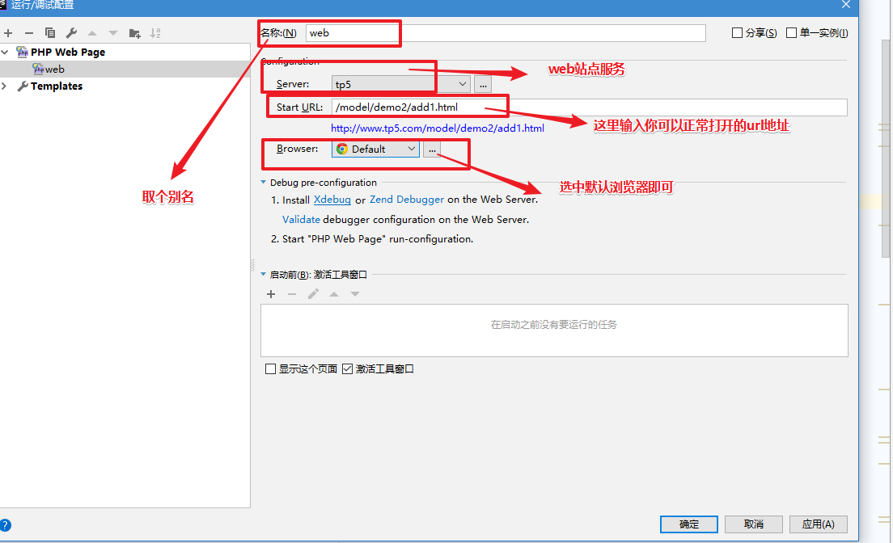
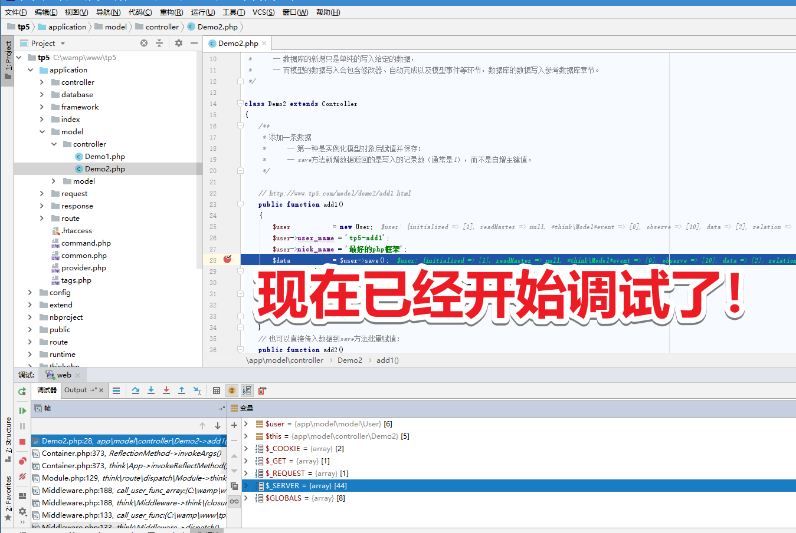
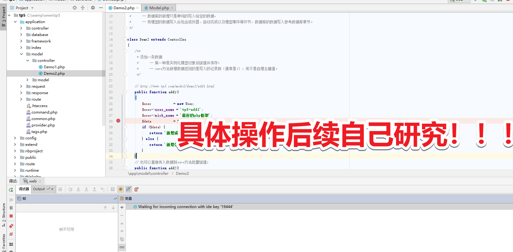

# `phpstrom` 配置指南

## 单点调试

> 为 phpstrom 配置xdebug断点调试功能（直接贴录制的gif图片）


> 首先 php.ini 需要配置好 xdebug 的信息（代码以我们自己配置的 `WAMP` 为例子）

```shell
[xdebug]
zend_extension=xdebug
xdebug.profiler_append = 0
xdebug.profiler_enable = 1
xdebug.profiler_enable_trigger = 0
xdebug.profiler_output_dir ="C:\wamp\logs\xdebug"
xdebug.trace_output_dir ="C:\wamp\logs\xdebug"
xdebug.profiler_output_name = "cache.out.%t-%s"
xdebug.remote_enable = 1
xdebug.remote_autostart = 1
xdebug.remote_handler = "dbgp"
xdebug.remote_host = "127.0.0.1"
xdebug.idekey= PHPSTROM
```

> 下面是一些比较重要的截图



--------------------------------------------------------------------------------



--------------------------------------------------------------------------------



--------------------------------------------------------------------------------



--------------------------------------------------------------------------------



--------------------------------------------------------------------------------



--------------------------------------------------------------------------------




|dad|daf|
|--|--|
|daf|fafa|
|1|12r43tg|
