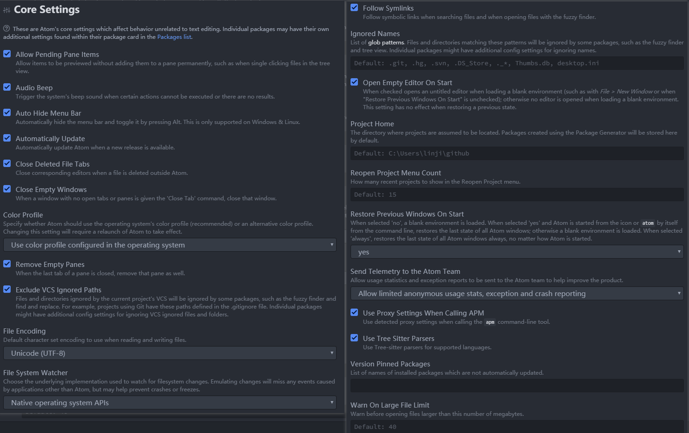
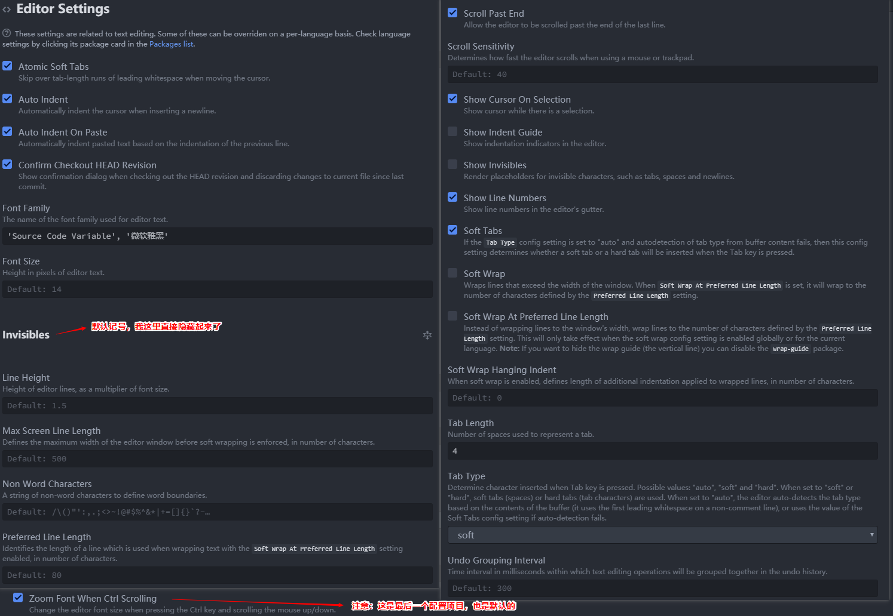
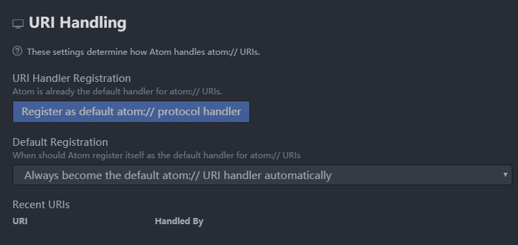
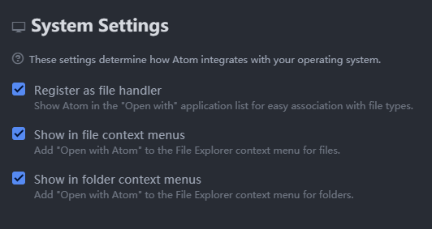
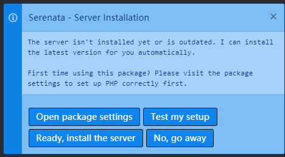
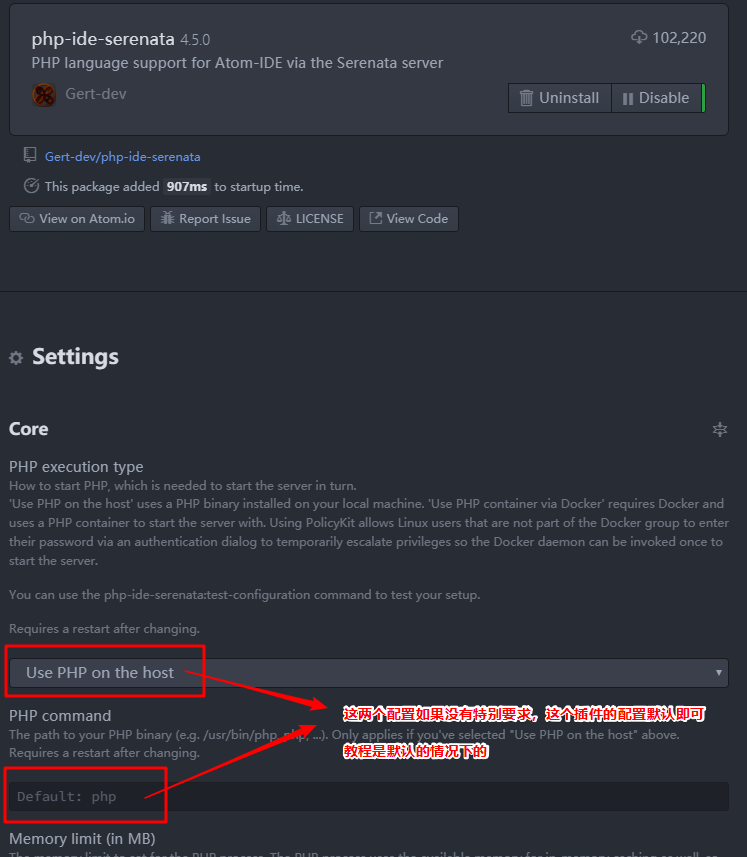
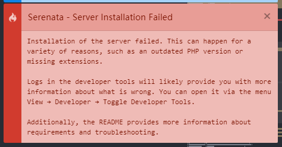
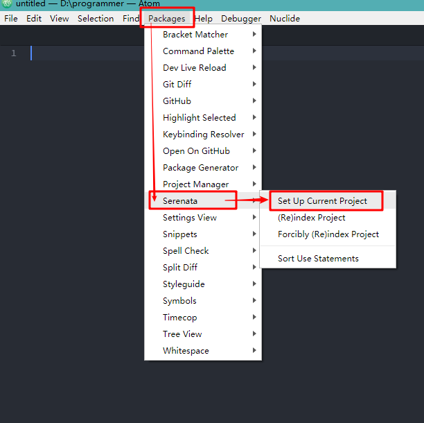
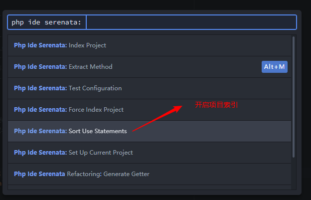

# <center>《PHP开发者眼中的ATOM》</center>

> `Atom` 是一款现代化的编辑器，写这篇文章只是我个人喜欢用而已，它还有很多问题需要解决：
> 1. 用户群体如今已经被 `vscode` 完全超越，
> 2. 普通人群会选择 `vscode` 因为它功能很足，并且流畅，但个人认为： `vscode` 细节方面做的并不出色
> 3. `atom` 虽然有很多弊端，但是当你熟悉了这款编辑器以后，就会发现它很强大，并且能为我们节省很多时间，最重要的是：它很优雅！

## atom 推荐字体

> `'Source Code Variable', '微软雅黑'`

## atom 基本配置

> atom 核心和内置插件需要进行一些简单配置，这样会更加优秀：

序号|打开settings方式
---|---
快捷键开启方式|`ctrl-,`
`ctrl-shift-p` 开启方式：|`settings view: open`

文件|作用描述
---|---
`.atom\\config.cson`|用户及插件配置信息都会在这里记录
`.atom\\keymap.cson`|所有自定义快捷键都会在这里记录
`.atom\\styles.less`|所有自定义样式都会在这里记录

1. 核心配置
> `ctrl-shift-p` 开启方式：`settings view: core`

    

2. 编辑器配置
> `ctrl-shift-p` 开启方式：`settings view: editor`

    

3. URI handling 配置
    

4. 系统配置
> `ctrl-shift-p` 开启方式：`settings view: system`

    

5. 内置插件配置
> 1. `line-ending-selector` 插件将默认换行符修改成 `LF`
> 2. `autosave` 插件开启自动保存
> 3, `markdown-preview` 插件禁用掉

    

6. 内置主题UI `One Dark` `One Light`


## atom扩展主题

| atom扩展主题            | 主题说明  |
| --------------------- | --------- |
| `monokai`             | 代码样式1 |
| `nord-atom-syntax`    | 代码样式2 |
| `atom-material-syntax` | 代码样式3 |

## atom扩展插件

| 实用插件                     | 插件说明                                   |
| -------------------------------- | ------------------------------------------ |
| `atom-beautify`                  | 格式化源代码                               |
| `docblockr`                      | 用于注释                                   |
| `Sublime-Style-Column-Selection` | 复制任意区域 |
| `sync-settings`                  | atom配置同步插件                           |
| `highlight-selected`             | 选择高亮                                   |
| `split-diff`| 文件对比插件|
| `regex-railroad-diagram`         | 正则表达式图形界面                         |
| `project-manager` | 项目管理|
| `intentions`|用于显示意图的基础包|
| `platformio-ide-terminal` | atom下出色的终端|

| git相关插件            | 插件说明                                   |
| ---------------------- | ------------------------------------------ |
| `git-plus`             | 增强git功能                                |
| `git-time-machine`     | 近期提交的时间列表，并支持与当前内容做对比 |
| `merge-conflicts`      | 优秀的git合并视图                          |
| `tree-view-git-status` | git相关                                    |

| minimap相关插件              | 插件说明               |
| ---------------------------- | ---------------------- |
| `minimap`                    | 代码小窗口             |
| `minimap-bookmarks`          | 代码小窗口-书签高亮    |
| `minimap-cursorline`         | 代码小窗口-当前行高亮  |
| `minimap-find-and-replace`   | 代码小窗口-搜索高亮    |
| `minimap-git-diff`           | 代码小窗口-git对比高亮 |
| `minimap-highlight-selected` | 代码小窗口-选择高亮    |
| `minimap-selection`          | 代码小窗口-选择块高亮  |
| `minimap-split-diff`         | 代码小窗口-对比高亮    |

| ide相关插件      | 插件说明        |
| ---------------- | --------------- |
| `atom-ide-ui`    | atom的ide基础包 |
| `php-ide-serenata`| 优秀的php的ide插件包        |
| `ide-typescript` | js和tyjs的ide插件包 |

| 符号对齐相关插件     | 插件说明       |
| -------------------- | -------------- |
| `aligner`            | 符号对齐基础包 |
| `aligner-css`        | css对齐        |
| `aligner-javascript` | js对齐         |
| `aligner-php`        | php对齐        |

| 语法相关插件      | 插件说明               |
| ----------------- | ---------------------- |
| `language-apache` | apache配置文件语法高亮 |
| `language-ini`    | ini扩展文件语法高亮    |
| `language-nginx`  | nginx配置文件语法高亮  |

| 界面优化插件 | 插件说明 |
| ------------ | -------- |
| `atom-clock` | 时钟     |
| `file-icons` | 文件图标 |

| html相关插件        | 插件说明                 |
| ------------------- | ------------------------ |
| `atom-html-preview` | atom内嵌浏览器           |
| `autoprefixer`      | css3后缀自动完成         |
| `open-in-browser`   | html页面从默认浏览器打开 |
| `color-picker`      | 颜色选择                 |
| `double-tag`        | html结束标签同步修改     |
| `autoclose-html`    | html结束标签自动闭合|

| vim相关插件        | 插件说明                  |
| ------------------ | ------------------------- |
| `vim-mode-plus`    | vim插件基础包             |
| `relative-numbers` | vim普通模式下显示先对行号 |
| `ex-mode`          | atom下的ex单行编辑器      |

## 终端下对 `atom` 插件管理

| 说明     | 指令                                             |
| -------- | ------------------------------------------------ |
| 安装插件 | `apm install package1 [package2 package3 ...]`   |
| 卸载插件 | `apm uninstall package1 [package2 package3 ...]` |
| 移除插件 | `apm remove package1 [package2 package3 ...]`    |
| 禁用插件 | `apm disable package1 [package2 package3 ...]`   |
| 启用插件 | `apm enable package1 [package2 package3 ...]`    |

## 扩展插件配置说明

> 一些插件需要我们进一步说明

### `sync-settings` 配置说明

> 这是atom配置同步插件配置也很简单，填入正确的token跟gistid即可

| 命令                         | 说明                                                                       |
| ---------------------------- | -------------------------------------------------------------------------- |
| `sync-settings:backup`       | 这条命令是备份当前的配置                                                   |
| `sync-settings:restore`      | 这条命令是回复配置,是直接覆盖的;                                           |
| `sync-settings:view-backup`  | 这条是当你执行备份后到线上查询你的备份的,也就是到你的 `gist code` 里的内容 |
| `sync-settings:check-backup` | 这条是查询最后一次是否正常                                                 |

### `atom-beautify` 配置说明

> `atom-beautify` 有些语言的格式化需要依赖与其它工具，遇到问题可以查看插件说明

### `php-ide-serenata` 配置说明
> `php-ide-serenata` 插件比官方推荐的 `php-ide` 更加优秀，当然配置也相对复杂一些

排序|依赖插件（3）
---|---
1|`atom-ide-ui`
2|`intentions`
3|`project-manager`

对php的要求|说明
---|---
php版本| 7.1及以上
`php.ini`(必须开启)| `mbstring` `openssl` `pdo_sqlite` 扩展
`php.ini`(下载服务时开启)| `curl` `xml` 扩展

> 刚刚下载好插件会有一个提示，如果server没有创建成功也会有这个提示：



> 点击 `open package settings` 按钮进入配置界面（如果没有特别要求就不需要配置）



> 接着点击 `Ready, install the server` 下载服务（下载成功和失败都会有提示）


> 下载服务报错信息



> 开启索引方法一：可以通过菜单栏项目进行相关索引



> 开启索引方法二：`ctrl-shift-p` 下执行 `php ide serenata: set up current project` 命令



> 最后注意用 `project-manager` 保存项目！

```Shell
ctrl-shift-p
project manager: save project
```

### `platformio-ide-terminal` 配置说明
> windows下 `platformio-ide-terminal` 可以将终端设置成 git 下的 sh.exe

1. 在 Settings 中找到 Platformio-ide-terminal 插件，进入设置选项
2. 找到 Shell Override 设置选项，将其设置为 C:\Program Files\Git\Bin\sh.exe （实际根据Git的安装位置可能有所不同，以上为Git安装的默认路径）
3. 找到 Shell Arguments ，将其设置为 --login

## 快捷键说明
> 下面快捷键是比较实用，但容易被我们忽略的：

| 全局快捷键 | 功能                                 |
| ---------- | ------------------------------------ |
| `C-k C-b`  | 显示或隐藏目录树                     |
| `C-斜杠`   | 显示或隐藏目录树                     |
| `M-斜杠`   | 显示目录树，光标在页面和目录树将切换 |
| `C-S-斜杠` | 显示目录树，并定位到当前页面所在位置 |

| 目录树的快捷键 | 功能                                               |
| -------------- | -------------------------------------------------- |
| `a`            | 新建文件                                           |
| `S-a`          | 新建目录                                           |
| `d`            | 拷贝文件或目录到指定位置                           |
| `i`            | 显示或隐藏版本控制控制忽略的文件（如：.gitignore） |
| `h j k l`      | 目录树支持vim按键方式                              |

| 大小写快捷键 | 功能           |
| ------------ | -------------- |
| `C-k C-u`    | 使当前字符大写 |
| `C-k C-l`    | 使当前字符小写 |

| 文本编辑快捷键 | 功能                                       |
| -------------- | ------------------------------------------ |
| `C-j`          | 将下一行与当前行合并                       |
| `C-up`         | 当前行向上                                 |
| `C-down`       | 当前行向下移动                             |
| `C-S-d`        | 复制当前行到下一行                         |
| `C-d`          | 选取当前单词或文档中和当前单词相同的下一处 |
| `C-S-u`        | 调出切换编码选项                           |
| `C-f`          | 在文件中查找                               |
| `C-l`          | 选取当前行                                 |
| `C-S-k`        | 删除当前行                                 |
| `C-x`          | 剪切当前行，或剪切选中内容                 |
| `C-S-f`        | 在整个项目中查找                           |
| `C-S-l`        | 选择文本类型（高亮和补全）                 |
| `ctrl-shift-M` | Markdown预览                               |
| `C-Backspace`  | 删除光标所在单词左边字符                   |
| `C-Delete`     | 删除光标所在单词右边字符                   |
| `C-left`       | 移动光标到所在单词的最左端                 |
| `C-right`      | 移动光标到所在单词的最右端                 |
| `C-鼠标左键`   | 增加光标，容易被插件快捷键覆盖             |
| `C-S-鼠标左键` | 增加光标                                   |

| git快捷键 | 功能           |
| --------- | -------------- |
| `C-S-9`   | git操作界面    |
| `C-S-8`   | github操作界面 |

| 书签快捷键 | 功能                               |
| ---------- | ---------------------------------- |
| `C-M-f2`   | 添加或移除书签（当前行）           |
| `C-S-f2`   | 移除所有书签（当前页面）           |
| `f2`       | 下一个书签（当前页面）             |
| `S-f2`     | 上一个书签（当前页面）             |
| `C-f2`     | 调出书签列表（所有打开文件的书签） |

| 插件快捷键   | 功能                                               |
| ------------ | -------------------------------------------------- |
| `C-M-k`      | 选取颜色（自己设置的）                                         |
| `C-M-b`      | 格式化                                             |
| `M-t`        | 展示版本库提交的时间列表，支持跟指定的版本库做对比 |
| `C-M-t`      | 文件对比，支持与最近提交的版本库做对比             |
| `M-鼠标左键` | 选取多行的中间部分内容                             |

> `Ctrl-Shift-p` 下面有大量的指令，这些指令将会大大提升我们的工作效力！

## `.apmrc` 配置

> `.apmrc` 文件用来让 `atom` 支持终端代理
> - `.apmrc` 文件路径： `.atom\\.apmrc`

```shell
strict-ssl = false
http-proxy = http://127.0.0.1:1080
https-proxy = http://127.0.0.1:1080
```
