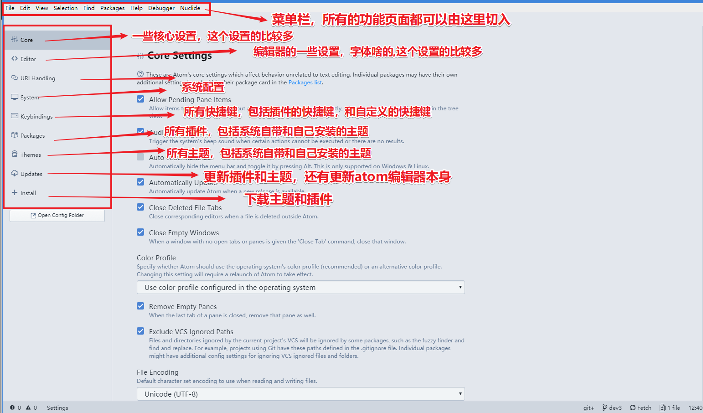
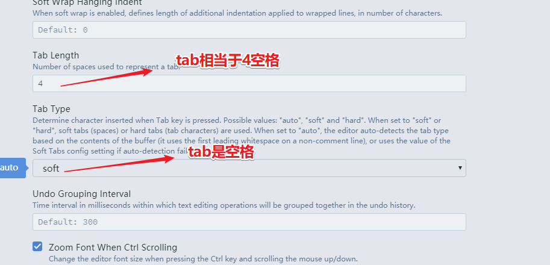
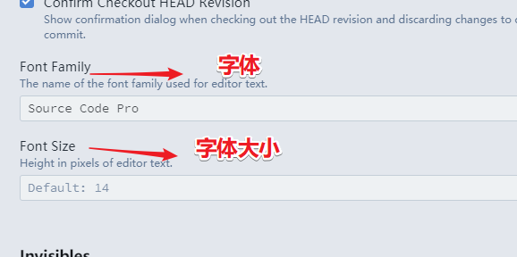
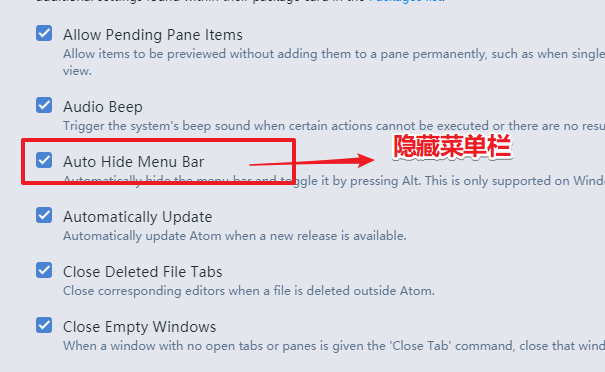
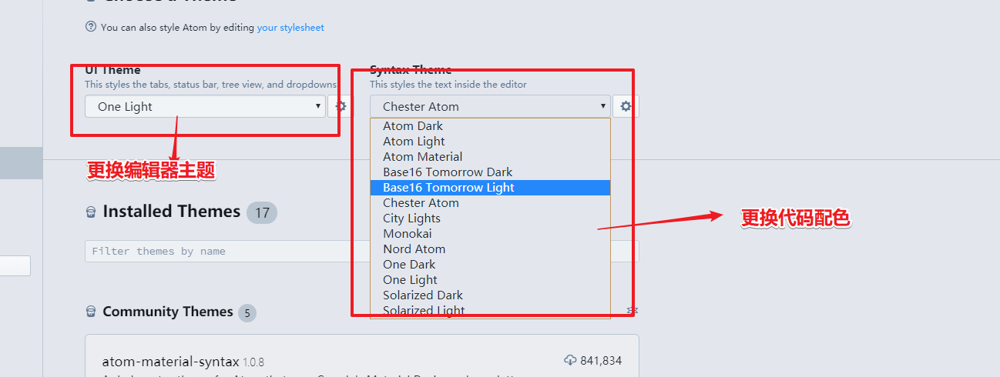
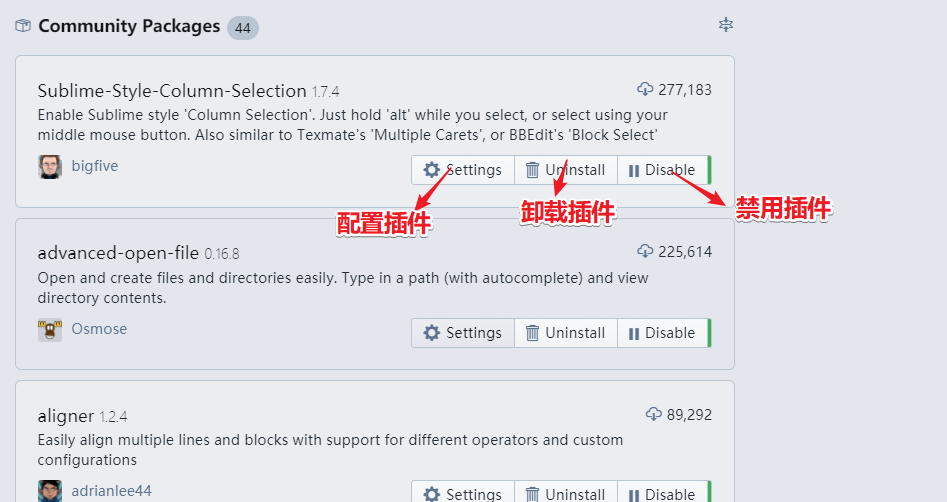

# <center>Atom 使用手册</center>

> atom 是一个界面非常优雅，功能也及其丰富的编辑器，当然不可否认的是它也是非常多的缺点，不过着并不影响码农们对它的喜爱！

## atom的基本设置

> 下面是录制的基本设置以及一些截图

-   动画-atom基本设置

    

-   设置界面

    

-   设置界面-1

    

-   设置界面-2

    

-   设置界面-3

    

-   设置界面-4

    

-   设置界面-5

    

## atom 插件|主题汇总

> 这里罗列了我经常会用到的插件，同学们按需自己下载

| 主题                     | 主题说明  |
| ---------------------- | ----- |
| `monokai`              | 代码样式1 |
| `nord-atom-syntax`     | 代码样式2 |
| `atom-material-syntax` | 代码样式3 |
| `chester-atom-syntax`  | 代码样式4 |

| git相关插件                | 插件说明                  |
| ---------------------- | --------------------- |
| `git-plus`             | 增强git功能               |
| `git-time-machine`     | 近期提交的时间列表，并支持与当前内容做对比 |
| `merge-conflicts`      | 优秀的git合并视图            |
| `tree-view-git-status` | git相关                 |
| `split-diff`           | 可以根任何文件做对比，不需要git支持   |

| 其它实用插件                           | 插件说明                  |
| -------------------------------- | --------------------- |
| `highlight-selected`             | 选择高亮                  |
| `atom-beautify`                  | 格式化源代码                |
| `docblockr`                      | 注释神器                  |
| `Sublime-Style-Column-Selection` | 复制任意区域，比如：复制联系数行的中间区域 |
| `autocomplete-paths`             | 文件自动补全插件              |
| `project-viewer`                 | 项目管理插件                |
| `sync-settings`                  | atom配置同步插件            |
| `markdown-scroll-sync`           | markdown文件预览时同步       |
| `regex-railroad-diagram`         | 正则表达式图形界面             |

| minimap相关插件                  | 插件说明          |
| ---------------------------- | ------------- |
| `minimap`                    | 代码小窗口         |
| `minimap-bookmarks`          | 代码小窗口-书签高亮    |
| `minimap-cursorline`         | 代码小窗口-当前行高亮   |
| `minimap-find-and-replace`   | 代码小窗口-搜索高亮    |
| `minimap-git-diff`           | 代码小窗口-git对比高亮 |
| `minimap-highlight-selected` | 代码小窗口-选择高亮    |
| `minimap-selection`          | 代码小窗口-选择块高亮   |
| `minimap-split-diff`         | 代码小窗口-对比高亮    |

| ide相关插件          | 插件说明           |
| ---------------- | -------------- |
| `atom-ide-ui`    | atom的ide基础包    |
| `ide-php`        | php的ide        |
| `ide-typescript` | JavaScript的ide |

| 符号对齐相关插件             | 插件说明    |
| -------------------- | ------- |
| `aligner`            | 符号对齐基础包 |
| `aligner-css`        | css对齐   |
| `aligner-javascript` | js对齐    |
| `aligner-php`        | php对齐   |

| 语法相关插件            | 插件说明           |
| ----------------- | -------------- |
| `language-apache` | apache配置文件语法高亮 |
| `language-ini`    | ini扩展文件语法高亮    |
| `language-nginx`  | nginx配置文件语法高亮  |

| 界面优化插件       | 插件说明 |
| ------------ | ---- |
| `atom-clock` | 时钟   |
| `file-icons` | 文件图标 |

| html相关插件            | 插件说明           |
| ------------------- | -------------- |
| `atom-html-preview` | atom内嵌浏览器      |
| `autoprefixer`      | css3后缀自动完成     |
| `open-in-browser`   | html页面从默认浏览器打开 |
| `color-picker`      | 颜色选择           |

| vim相关插件            | 插件说明           |
| ------------------ | -------------- |
| `vim-mode-plus`    | vim插件基础包       |
| `relative-numbers` | vim普通模式下显示先对行号 |
| `ex-mode`          | atom下的ex单行编辑器  |

> 插件管理

| 说明   | 指令                                               |
| ---- | ------------------------------------------------ |
| 安装插件 | `apm install package1 [package2 package3 ...]`   |
| 卸载插件 | `apm uninstall package1 [package2 package3 ...]` |
| 移除插件 | `apm remove package1 [package2 package3 ...]`    |
| 禁用插件 | `apm disable package1 [package2 package3 ...]`   |
| 启用插件 | `apm enable package1 [package2 package3 ...]`    |

## 配置插件

> 有些插件需要我们进一步配置，才能更有效提升工作效率

### 1、 `sync-settings` 插件配置

> 这是atom配置同步插件配置也很简单，填入正确的token跟gistid即可

| 命令                           | 说明                                           |
| ---------------------------- | -------------------------------------------- |
| `sync-settings:backup`       | 这条命令是备份当前的配置                                 |
| `sync-settings:restore`      | 这条命令是回复配置,是直接覆盖的;                            |
| `sync-settings:view-backup`  | 这条是当你执行备份后到线上查询你的备份的,也就是到你的 `gist code` 里的内容 |
| `sync-settings:check-backup` | 这条是查询最后一次是否正常                                |

### 2、 `atom-beautify` 插件配置

> `atom-beautify` 有些语言的格式化需要依赖与其它工具，遇到问题可以查看插件说明

### 3、 `markdown-scroll-sync` 插件配置

> 比较遗憾，这个插件的作者似乎并不愿意更新了，需要解决问题如下

```coffee
# 路径 C:\Users\username\.atom\packages\markdown-scroll-sync\lib\utils.coffee
# 12行修改前
lineEles = @editorView.shadowRoot.querySelectorAll '.lines .line[data-screen-row]'
# 12行修改后
lineEles = @editorView.querySelectorAll '.lines .line[data-screen-row]'
```

## atom 实用快捷键

> 网上关于atom快捷键的文章都是各种问题，各种抄袭，所以我这里整理了一些常用的快捷键（vim相关快捷键不做解释）

| 全局快捷键    | 功能                 |
| -------- | ------------------ |
| `C-斜杠`   | 显示或隐藏目录树           |
| `M-斜杠`   | 显示目录树，光标在页面和目录树将切换 |
| `C-S-斜杠` | 显示目录树，并定位到当前页面所在位置 |

| 目录树的快捷键   | 功能                             |
| --------- | ------------------------------ |
| `a`       | 新建文件                           |
| `S-a`     | 新建目录                           |
| `d`       | 拷贝文件或目录到指定位置                   |
| `i`       | 显示或隐藏版本控制控制忽略的文件（如：.gitignore） |
| `h j k l` | 目录树支持vim按键方式                   |

| 大小写快捷键    | 功能      |
| --------- | ------- |
| `C-k C-u` | 使当前字符大写 |
| `C-k C-l` | 使当前字符小写 |

| 文本编辑快捷键        | 功能                    |
| -------------- | --------------------- |
| `C-j`          | 将下一行与当前行合并            |
| `C-up`         | 当前行向上                 |
| `C-down`       | 当前行向下移动               |
| `C-S-d`        | 复制当前行到下一行             |
| `C-d`          | 选取当前单词或文档中和当前单词相同的下一处 |
| `C-S-u`        | 调出切换编码选项              |
| `C-f`          | 在文件中查找                |
| `C-l`          | 选取当前行                 |
| `C-S-k`        | 删除当前行                 |
| `C-x`          | 剪切当前行，或剪切选中内容         |
| `C-S-f`        | 在整个项目中查找              |
| `C-S-l`        | 选择文本类型（高亮和补全）         |
| `ctrl-shift-M` | Markdown预览            |
| `C-Backspace`  | 删除光标所在单词左边字符          |
| `C-Delete`     | 删除光标所在单词右边字符          |
| `C-left`       | 移动光标到所在单词的最左端         |
| `C-right`      | 移动光标到所在单词的最右端         |
| `C-鼠标左键`       | 增加光标，容易被插件快捷键覆盖       |
| `C-S-鼠标左键`     | 增加光标                  |

| git快捷键  | 功能         |
| ------- | ---------- |
| `C-S-9` | git操作界面    |
| `C-S-8` | github操作界面 |

| 书签快捷键    | 功能                |
| -------- | ----------------- |
| `C-M-f2` | 添加或移除书签（当前行）      |
| `C-S-f2` | 移除所有书签（当前页面）      |
| `f2`     | 下一个书签（当前页面）       |
| `S-f2`   | 上一个书签（当前页面）       |
| `C-f2`   | 调出书签列表（所有打开文件的书签） |

| 插件快捷键    | 功能                        |
| -------- | ------------------------- |
| `C-M-k`  | 选取颜色                      |
| `C-M-b`  | 格式化                       |
| `M-t`    | 展示版本库提交的时间列表，支持跟指定的版本库做对比 |
| `C-M-t`  | 文件对比，支持与最近提交的版本库做对比       |
| `M-鼠标左键` | 选取多行的中间部分内容               |

> `C-S-p` 下面有大量的指令，这些指令将会大大提升我们的工作效力，并且能让我们真正意义上拜托鼠标，希望同学们自行多多研究！

## 自定义界面样式

> 自定义界面样式，可以在 `.atom/style.less` 文件上完成

```css
// my-add
atom-workspace > atom-workspace-axis > atom-panel-container > atom-dock.left .tab-bar {display:none;}
atom-workspace > atom-workspace-axis > atom-panel-container > atom-dock.left .header.list-item.project-root-header{z-index: 2;}
.tree-view:focus .selected:before {background-color:rgba(90,138,233,.3);}
.list-group li:not(.list-nested-item),.list-tree li:not(.list-nested-item),.list-group li.list-nested-item > .list-item,.list-tree li.list-nested-item > .list-item {line-height:2.5rem;}
.list-group .selected::before,.list-tree .selected::before {height:2.5rem;}


.list-inline.tab-bar.inset-panel {height:3.5rem;}
.list-inline.tab-bar.inset-panel > li {line-height:3.5rem;}
.list-inline.tab-bar.inset-panel > li.active {border-bottom:2px solid rgba(90,138,233,.3);}
.tab-bar .tab .close-icon {top:0;bottom:0;margin:auto 0;}
.tab-bar .tab .close-icon:hover,.tab-bar .tab .close-icon:active {cursor:pointer;}
.left .tree-view .project-root-header {border-bottom:2px solid rgba(90,138,233,.3);font-size:1.2em;height:3.5rem;}
.tree-view .project-root.project-root:before {height:3.5rem;}
.tree-view .tree-view-root{padding:0;}

.line.cursor-line {background-color:rgba(90,138,233,.1);}
.minimap .cursor-line {background-color:rgb(90,138,233);}
```
