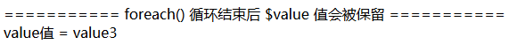

<!--
@Author: madnesslin
@Date:   2018-12-09 16:22:45
@Email:  linjialiang@163.com
@Filename: foreach引用value值的后果.md
@Last modified by:   madnesslin
@Last modified time: 2018-12-09 16:23:31
-->

# 《关于foreach下使用引用变量的问题》

> 今天有群友提问了一个关于foreach下使用了引用变量的问题

## 问题描述

> 源码：群友的源代码

```php
public function demo()
{
    $a = [1, 2, 3];

    foreach ($a as $key => &$value) {}
    dump($a);

    foreach ($a as $key => $value) {}
    dump($a);

}
```

> 疑问：第二次foreach()输出的值为什么是 【1、2、2】 而不是 【1、2、3】？

```html
C:\wamp\www\tp5\thinkphp\library\think\Debug.php:226:
array (size=3)
  0 => int 1
  1 => int 2
  2 => int 3

C:\wamp\www\tp5\thinkphp\library\think\Debug.php:226:
array (size=3)
  0 => int 1
  1 => int 2
  2 => int 2
```

## 分析

> 首先我们要理解两个概念：
> 1\. 引用是什么?
> 2\. foreach() 是如何执行的？

### 引用是什么？

> 在 PHP 中引用意味着用不同的名字访问同一个变量内容。

| 定义         | 描述                               |
| ---------- | -------------------------------- |
| `$a = &$b` | `$a 或 $b` 其中一个发生改变，另一个也会跟着做相同的变化 |

> 最接近的比喻对应关系：

| 对应关系1     | 对应关系2 | 对应关系3 | 对应关系4 |
| --------- | ----- | ----- | ----- |
| 引用变量      | 变量名   | 引用变量名 | 变量内容  |
| linux的文件名 | 原目录   | 硬链接目录 | 文件本身  |

> 【文件内容】发生了变化，我们【进入原目录】或【进入硬链接目录】打开该文件，文件内容都会发生相同的改变

### foreach() 是如何执行的？

> foreach 语法结构提供了遍历数组的简单方式。foreach 仅能够应用于数组和对象，如果尝试应用于其他数据类型的变量，或者未初始化的变量将发出错误信息。最简单的一个foreach():

```PHP
foreach ($variable as $key => $value) {
    echo $value;
}
```

> `foreach特性`, foreach的value值是不会自动注销的，所以在foreach()循环执行结束后，会保留最后一个value的赋值：

```php
public function demo1()
{
    $arr = ['value1', 'value2', 'value3'];
    foreach ($arr as $key => $value) {}
    echo '=========== foreach() 循环结束后 $value 值会被保留 ===========';
    echo 'value值 = ' . $value;
}
```




> 除非使用 `unset($value)` 手动注销value变量，否则 `$value = $arr[最后一个指针定位值]` 会一直存在；

## 案例说明

> 这里我举几个例子来说明 `引用` 和 `foreach()`

1. 最简单的引用变量
    > 这个例子可以很简单的读懂，引用的作用

    ```php
    public function demo()
    {
        $a = 1;
        $b = &$a;

        echo '========= 输出$b的值 =========';
        var_dump($b);

        echo '========= 给 $b 赋值后， $a 的值也跟着改变 =========';
        $b = '$b 改变了值';
        var_dump($a);

        echo '========= 给 $a 赋值后， $b 的值也跟着改变 =========';
        $a = '$a 改变了值';
        var_dump($b);
    }
    ```

    > 简单说：引用值的作用就是让两个变量的值一直相同

2. 带引用值的foreach()
    > `php手册原话`： 数组最后一个元素的 $value 引用在 foreach 循环之后仍会保留。建议使用 unset() 来将其销毁。

    ```php
    public function demo()
    {
        $arr = ['懂吗？', '不懂！', '想懂吗？'];

        // 第一次foreach循环输出结果：
        // 由于value是引用的，所以 【$arr[当前指针] 与 $value相互赋值】，即： $arr[当前指针] = &$value
        // 从以上官方手册原话中，我们可以理解数组只有最后一个元素的 $value 引用会被保留
        // 因此 $arr[2] = &$value 被保留了，除非使用 unset($value) 来销毁
        foreach ($arr as $key => &$value) {
            dump($arr);
        }

        // 假如使用 unset(); 来销毁 $value 变量，将不会有任何疑惑
        // unset($value);

        // 第二次输出没有带引用所以仅仅是 【$arr[当前指针的值]赋给$value】的关系，即：$value = $arr[当前指针]
        // 又由于 $arr[2] = &$value 没有销毁掉，所以每次$value发生改变，$arr[2]也会跟着变化
        foreach ($arr as $key => $value) {
            dump($arr);
        }
    }
    ```

    > 有了上层认识，下面我们再来看一个问题

    ```php
    public function demo()
    {
        $arr1 = ['懂吗？', '不懂！', '想懂吗？'];

        foreach ($arr1 as $key => &$value) {
            dump($arr1);
        }

        $arr2 = ['2懂吗？', '2不懂！', '2想懂吗？'];
        foreach ($arr2 as $key => $value) {
            echo '==== 数组每次循环$arr1[2]都会变化成$arr2[当前指针对应的值] ====';
            echo '<br>即：$arr1[2] = ' . $arr2[$key];
            dump($arr1);
        }
    }
    ```
